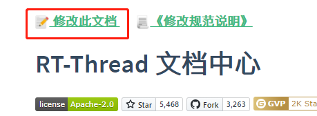
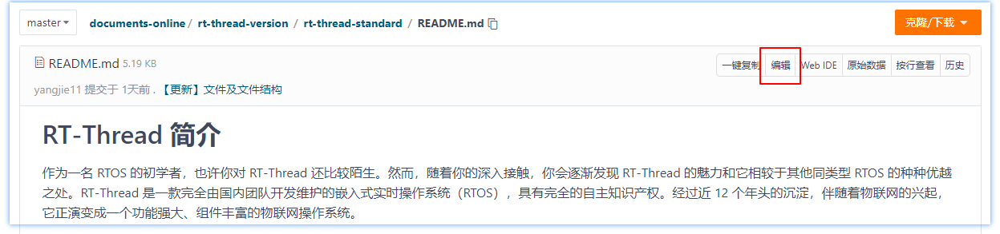
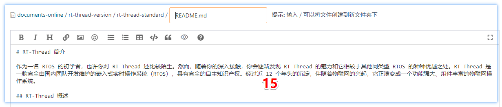
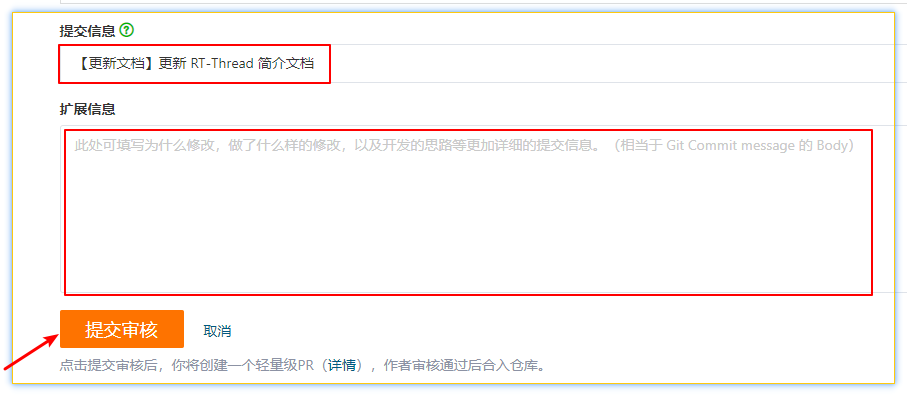

# 个人知识库中心说明


## 简介

本文档中心使用 docsify 搭建。主要参考[RT-Thread 文档中心](https://gitee.com/rtthread/docs-online)搭建个人的知识库
>特别感谢 : [RT-Thread 文档中心](https://gitee.com/rtthread/docs-online)

## 目录说明

知识库在线文档中心的主要目录说明：

development-tools：RT-Thread Studio IDE 和开发辅助工具 Env 的文档。

rt-thread-version：RT-Thread 各种版本，标准版本、nano版本、smart版本。

```tree
TODO
```

## 在线文档开发介绍

### 修改文档

当发现某文档一处错误时，在该文档页面最上方，点击 “修改此文档”



跳转至该文档的 gitee 页面，点击 “编辑”

> [!NOTE]
> 注：修改文档需要符合以下规则：
>
>（1）修改文档段落或添加文章后，文档中包含的中英文之间需要添加空格，可以使用 vscode-pangu 插件进行格式化。
>
>（2）为文章添加图片时，不要使用 URL 方式进行链接（URL 可能会失效），需要将图片上传至该仓库，采用相对路径进行链接，保证图片有效性。[正确示范](https://gitee.com/rtthread/docs-online/pulls/47/files) vs [错误示范](https://gitee.com/rtthread/docs-online/pulls/44/files)。
>
>（3）在编辑文档中的代码段时，需要符合 [RT-Thread 代码规范](https://github.com/RT-Thread/rt-thread/blob/master/documentation/coding_style_cn.md)。
>



进入可编辑状态，如将 12 改为 15



拉到最下面填写 提交信息，扩展信息可以根据情况填写，无误后，点击提交审核



> [!NOTE]
> 注：提交信息规范如下
>
> 对某文档某段描述进行更新或完善，或删除某段描述：【更新文档】更新/增加/删除了 xxx
>
> 修改文档中的错误：【修改错误】修改 xxx 为 xxx

然后等待审核即可，若审核不通过，还需要再次修改。

### 增加 / 删除文档

增加文档、删除文档则需要通过正常的 PR 流程进行提交（`fork -> clone -> 分支上开发 -> commit -> PR`）。

当需要增加文档时，最重要的是判断增加的是什么类型的文档，放在什么位置，以及文档名称等，然后进行提交，增加 / 删除 文档注意更新左侧栏。

- 如果不确定新增文档应该存放的位置，请新建 issue 咨询，或在论坛提问咨询，或在任意官方微信群咨询，确认后可以提交新文档。
- 如果非常确定新文档的存放位置，可以直接新增并提交。

> [!NOTE]
> 注：提交信息规范如下
>
> 增加一篇文档：【增加文档】xxxx 文档
>
> 删除一篇文档：【删除文档】删除 xxx 文档，由于 xxx 原因删除

## 注意事项

- 文档命名使用英文，有必要的时候使用中杠。
- 每篇文档使用一个 figures 文件夹。
- 文档内容注意中英文之间增加一个空格。
- 网站文档已开启缓存，测试没有效果时，请使用 CTRL+F5 强制刷新页面，或让浏览器进入无痕模式。
- 标点符号需要使用中文标点符号；若出现连续、段落性英文，可以在句子间或该段落使用英文标点符号。

## 许可协议

<a rel="license" href="http://creativecommons.org/licenses/by-nc/4.0/"></a><br />本作品采用<a rel="license" href="http://creativecommons.org/licenses/by-nc/4.0/">知识共享署名-非商业性使用 4.0 国际许可协议</a>进行许可。
