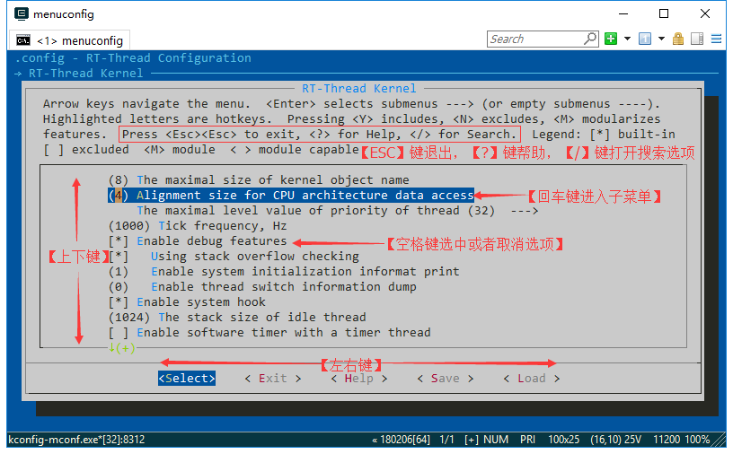

# Env 用户手册

Env 是 RT-Thread 推出的开发辅助工具，针对基于 RT-Thread 操作系统的项目工程，提供编译构建环境、图形化系统配置及软件包管理功能。

其内置的 menuconfig 提供了简单易用的配置剪裁工具，可对内核、组件和软件包进行自由裁剪，使系统以搭积木的方式进行构建。

## 主要特性

- menuconfig 图形化配置界面，交互性好，操作逻辑强；
- 丰富的文字帮助说明，配置无需查阅文档；
- 使用灵活，自动处理依赖，功能开关彻底；
- 自动生成 rtconfig.h，无需手动修改；
- 使用 scons 工具生成工程，提供编译环境，操作简单；
- 提供多种软件包，模块化软件包耦合关联少，可维护性好；
- 软件包可在线下载，软件包持续集成，包可靠性高；

## 准备工作

Env 工具包含了 RT-Thread 源代码开发编译环境和软件包管理系统。

- 从 RT-Thread 官网下载 [Env 工具](https://www.rt-thread.org/page/download.html)。
- 在电脑上装好 git，软件包管理功能需要 git 的支持。git 的下载地址为`https://git-scm.com/downloads`，根据向导正确安装 git，并将 git 添加到系统环境变量。
- 注意在工作环境中，所有的路径都不可以有中文字符或者空格。

## Env 的使用方法

### 打开 Env 控制台

RT-Thread 软件包环境主要以命令行控制台为主，同时以字符型界面来进行辅助，使得尽量减少修改配置文件的方式即可搭建好 RT-Thread 开发环境的方式。
打开 Env 控制台有两种方式：

#### 方法一：点击 Env 目录下可执行文件

进入 Env 目录，可以运行本目录下的 `env.exe`，如果打开失败可以尝试使用 `env.bat`。

#### 方法二：在文件夹中通过右键菜单打开 Env 控制台

Env 目录下有一张 `Add_Env_To_Right-click_Menu.png`(添加 Env 至右键菜单.png) 的图片，如下：


根据图片上的步骤操作，就可以在任意文件夹下通过右键菜单来启动 Env 控制台。效果如下：


> [!NOTE]
> 注：因为需要设置 Env 进程的环境变量，第一次启动可能会出现杀毒软件误报的情况，如果遇到了 **杀毒软件误报** ，允许 Env 相关程序运行，然后将相关程序添加至白名单即可。

### 编译 BSP

scons 是 RT-Thread 使用的编译构建工具，可以使用 scons 相关命令来编译 RT-Thread 。

#### 第一步：切换到 BSP 根目录

- 打开控制台后，可以在命令行模式下使用 cd 命令切换到你想要配置的 BSP 根目录中。

例如工程目录为: `rt-thread\bsp\stm32f429-apollo` ：


#### 第二步：bsp 的编译

- Env 中携带了 `Python & scons` 环境，只需在 `rt-thread\bsp\stm32f429-apollo` 目录中运行 `scons` 命令即可使用默认的 ARM_GCC 工具链编译 bsp。


编译成功：


如果使用 mdk/iar 来进行项目开发，可以直接使用 BSP 中的工程文件或者使用以下命令中的其中一种，重新生成工程，再进行编译下载。

```
scons --target=iar
scons --target=mdk4
scons --target=mdk5
```

更多 scons 教程，请参考 [《Scons 构建工具》](../scons/scons.md)

### BSP 配置：menuconfig

menuconfig 是一种图形化配置工具，RT-Thread 使用其对整个系统进行配置、裁剪。

#### 快捷键介绍

进入 BSP 根目录，输入 `menuconfig` 命令后即可打开其界面。 menuconfig 常用快捷键如图所示：



#### 修改配置

menuconfig 有多种类型的配置项，修改方法也有所不同，常见类型如下：

- 开/关 型：使用空格键来选中或者关闭
- 数值、字符串型：按下回车键后会出现对话框，在对话框中对配置项进行修改

#### 保存配置

选择好配置项之后按 ESC 键退出，选择保存修改即可自动生成 rtconfig.h 文件。此时再次使用 scons 命令就会根据新的 rtconfig.h 文件重新编译工程了。

### 软件包管理：package

RT-Thread 提供一个软件包管理平台，这里存放了官方提供或开发者提供的软件包。该平台为开发者提供了众多可重用软件包的选择，这也是 RT-Thread 生态的重要组成部分。

[点击这里](https://github.com/RT-Thread-packages) 可以查看到 RT-Thread 官方的提供的软件包，绝大多数软件包都有详细的说明文档及使用示例。

> 提示：截止到 2018-03-13 ，当前软件包数量达到 **40+**

**package** 工具作为 Env 的组成部分，为开发者提供了软件包的下载、更新、删除等管理功能。

Env 命令行输入 `pkgs` 可以看到命令简介：

```
> pkgs
usage: env.py package [-h] [--update] [--list] [--wizard] [--upgrade]
                      [--printenv]

optional arguments:
  -h, --help  show this help message and exit
  --update    update packages, install or remove the packages as you set in
              menuconfig
  --list      list target packages
  --wizard    create a package with wizard
  --upgrade   update local packages list from git repo
  --printenv  print environmental variables to check
```

#### 下载、更新、删除软件包

在下载、更新软件包前，需要先在 `menuconfig` 中 **开启** 你想要操作的软件包

这些软件包位于 `RT-Thread online packages` 菜单下，进入该菜单后，则可以看如下软件包分类：


找到你需要的软件包然后选中开启，保存并退出 menuconfig 。此时软件包已被标记选中，但是还没有下载到本地，所以还无法使用。

- **下载** ：如果软件包在本地已被选中，但是未下载，此时输入：`pkgs --update` ，该软件包自动下载；
- **更新** ：如果选中的软件包在服务器端有更新，并且版本号选择的是 **latest** 。此时输入： `pkgs --update` ，该软件包将会在本地进行更新；
- **删除** ：某个软件包如果无需使用，需要先在 menuconfig 中取消其的选中状态，然后再执行： `pkgs --update` 。此时本地已下载但未被选中的软件包将会被删除。

#### 升级本地软件包信息

随着 package 系统的不断壮大，会有越来越多的软件包加入进来，所以本地看到 menuconfig 中的软件包列表可能会与服务器 **不同步** 。使用 `pkgs --upgrade` 命令即可解决该问题，这个命令不仅会对本地的包信息进行更新同步，还会对 Env 的功能脚本进行升级，建议定期使用。

### Env 工具配置

- 新版本的 Env 工具中加入了自动更新软件包和自动生成 mdk/iar 工程的选项，默认是不开启的。可以使用 `menuconfig -s/--setting`  命令来进行配置。

* 使用 `menuconfig -s` 命令进入 Env 配置界面

  

  按下回车进入配置菜单，里面共有 3 个配置选项

  

3 个选项分别为：

* **软件包自动更新功能**：在退出 menuconfig 功能后，会自动使用`pkgs --update`命令来下载并安装软件包，同时删除旧的软件包。本功能在下载在线软件包时使用。

* **自动创建 MDK 或 IAR 工程功能**：当修改 menuconfig 配置后 ，必须输入 `scons --target=xxx` 来重新生成工程。开启此功能，就会在退出 menuconfig 时，自动重新生成工程，无需再手动输入 scons 命令来重新生成工程。

* **使用镜像服务器下载软件包**：由于大部分软件包目前均存放在 GitHub 上，所以在国内的特殊环境下，下载体验非常差。开启此功能，可以通过 **国内镜像服务器** 下载软件包，大幅提高软件包的下载速度和稳定性，减少更新软件包和 submodule 时的等待时间，提升下载体验。

## 在项目中使用 Env

### 使用 Env 的要求

- menuconfig 是 RT-Thread 3.0 以上版本的特性，推荐将 RT-Thread 更新到 3.0 以上版本。
- 目前 RT-Thread 还没有对所有的 BSP 做 menuconfig 的支持，也就是说有些 BSP 暂时还不能使用 menuconfig 来进行配置，但常用的 BSP 都已经支持。

### menuconfig 中选项的修改方法

如果想在 menuconfig 的配置项中添加宏定义，则可以修改 BSP 下的 Kconfig 文件，修改方法可以在网络中搜索`Kconfig语法`关键字获得详细的说明文档，也可以参考 RT-Thread 中的 Kconfig 文件或者已经支持过 menuconfig 的 BSP 中的 Kconfig 文件。

### 新的项目添加 menuconfig 功能

这里的新项目指的是，**还未生成 .config 和 rtconfig.h** 的全新开发的项目。因为这两个文件，只有在 menuconfig 第一次保存时才会创建。具体流程如下：

 1. 将已经支持 menuconfig 功能的 BSP 里面的 kconfig 文件拷贝到新的项目根目录中。
 2. 注意修改 Kconfig 中的 RTT_ROOT 值为 RT-Thread 所在目录，否则可能提示找不到 RTT_ROOT 。
 3. 使用 menuconfig 命令开始配置即可。

### 旧项目添加 menuconfig 功能

这里的旧项目指的是已经经过一段时间的开发，而且项目中存在已经修改过的 rtconfig.h文件 ，但是没有使用过 menuconfig 来配置的项目。具体流程如下：

 1. 首先备份旧项目内的 rtconfig.h 文件。
 2. 使用 `scons --genconfig` 命令根据已有的 rtconfig.h 生成 .config 文件，这里生成的 .config 文件保存了旧项目中 rtconfig.h 文件对项目的配置参数。
 3. 将已经支持 menuconfig 功能的 BSP 里面的 kconfig 文件拷贝到要修改项目的根目录中。
 4. 注意修改 Kconfig 中的 RTT_ROOT 值为 RT-Thread 所在目录，否则可能提示找不到 RTT_ROOT 。
 5. 使用 menuconfig 命令来配置我们要修改的旧项目。menuconfig 会读取第二步生成的 .config 文件，并根据旧项目的配置参数生成新的 .config 文件和 rtconfig.h 文件 。
 6. 对比检查新旧两份 rtconfig.h 文件，如果有不一致的地方，可以使用 menuconfig 命令对配置项进行调整。

### 用户软件包管理功能

实际开发项目时，开发者可能想要将已下载的软件包加入 git 管理，或者想自己管理该软件包。不希望 Env 工具再拉取该软件包的最新版本，此时可以使用用户软件包管理功能。

如果用户手动将 `EasyFlash-v4.1.0` 文件夹的后缀，也就是软件包的版本号删除，修改为 `EasyFlash`，此时再次使用 `pkgs --update` 命令将不会再拉取 `EasyFlash-v4.0.0` 软件包。Env 工具此时认为 EasyFlash 软件包由用户管理，此时使用 `pkgs --force-update` 命令才可以重新拉取附带 version 的新版本软件包。


## 使用 pip 扩展更多功能

在 Env 环境下暂时不能直接使用 Python 提供的 pip 工具来安装更多模块。如果需要在 Env 环境下使用 pip 功能，可以按照如下方法重新安装 pip 工具：

1. 从地址 https://bootstrap.pypa.io/get-pip.py 下载 get-pip.py 文件，存放在磁盘中。

2. 在 **Env 环境下**执行 `python get-pip.py` 命令来重新安装 pip 工具。

3. pip 工具重新安装成功后，可以使用 `pip install module-name` 命令来安装所需模块。

## Env 工具使用注意事项

- 第一次使用 Env 推荐去官网下载最新版本的 Env 工具，新版本的 Env 会有更好的兼容性，也支持自动更新的命令。
- 可以使用 Env 内置命令 pkgs --upgrade 来更新软件包列表和 Env 的功能代码，这样可以最大程度避免遇到已经修复的问题。
- Env 所在路径不要有中文或者空格存在。
- BSP 工程所在的路径不要有中文或者空格存在。

## 常见问题

### Q: Env 工具出现乱码怎么办？

**A:** 首先检查是否有中文路径。
检查 chcp 命令是否加入了系统环境变量，尝试使用 chcp 437 命令将字符格式改为英文。如果提示没有 chcp 命令，则考虑是没有加入到环境变量中。
chcp 命令所在的目录可能在 system32 目录，添加到环境变量即可。
[Env 工具乱码问题传送门](https://www.rt-thread.org/qa/forum.php?mod=viewthread&tid=5763&page=1#pid32213) 。

### Q: 提示找不到 git 命令？

  'git' is not recognized as an internal or external command, operable program or batch file.

**A:** 没安装 git，需要安装 git 并加入环境变量。

### Q: 提示找不到 CMD 命令？

**A:** 计算机右键–>> 属性—>> 高级系统设置—->> 环境变量，`C:\Windows\System32`; 加入系统环境变量即可

### Q: 运行 python 的时候提示 no module named site 怎么办？

**A:** 计算机右键–>> 属性—>> 高级系统设置—->> 环境变量，在管理员的用户变量中，新建变量名为 PYTHONHOME，变量值为：`F:\git_repositories\env\tools\Python27` （是 Env 里面 Python 的安装路径），注意后面不要加 “；”，否则会无效。 如果添加 PYTHONHOME 没好，再用同样的方法添加 PYTHONPATH。就可以解决这个问题了。

有一篇博文详细的描述了这个问题：[传送门在这里](http://blog.csdn.net/nullzeng/article/details/45293333)，如果想了解原理可以看一看。

### Q: 在 Env 下能生成哪些类型的工程？

 **A:**

  1. 目前在 Env 下可以使用 scons 工具生成 mdk/iar 的工程，还没有支持 eclipse 工程的自动生成。
  2. 一般在使用 Env 的开发，使用 gcc 的工具链，那么只需要一个 source insight 或者 vs code 之类的编辑器来看代码，使用 scons 编译即可。

### Q: 自己制作的 BSP 如何能支持 menuconfig？

**A:** 可以查阅本章 **在项目中使用 Env** 章节。

### Q: pkgs --upgrade 命令和 pkgs --update 命令有什么区别？

 **A:**

  1. pkgs --upgrade 命令是用来升级 Env 功能脚本本身和软件包列表的。没有最新的包列表就不能选择最近更新的软件包。
  2. pkgs --update 命令是用来更新软件包本身的，比如说你在 menuconfig 中选中了 json 和 mqtt 的软件包，但是退出 menuconfig 时并没有下载这些软件包。你需要使用 pkgs --update 命令，这时候 Env 就会下载你选中的软件包并且加入到你的工程中去。
  3. 新版本的 Env 支持 menuconfig -s/--setting 命令，如果你不想每次更换软件包后使用 pkgs --update 命令，在使用 menuconfig -s/--setting 命令后配置 Env 选择每次使用 menuconfig 后自动更新软件包即可。

### Q: VC98 文件夹问题

详细描述：出现错误 MissingConfiguration: registry dir `D:\Program Files (x86)\Microsoft Visual Studio\VC98` not found on the filesystem


**A:** 在划线的目录新建一个 VC98 的空文件夹，就可以使用 scons 了。

### Q: 使用 menuconfig 命令提示“can't find file Kconfig”。

**A:** 当前工作的 BSP 目录下缺少 Kconfig 文件，参考本文《新的项目添加 menuconfig 功能》 和 《旧项目添加 menuconfig 功能》。

### Q: IOError: [Errno 2] No such file or directory: 'nul'

**A:** 这是由于 windows 系统没有开启 `Null Service` 服务的缘故，常见于在 win10 的早期版本中（如版本号 1703），该问题有两种解决方法，第一种是开启 windows 更新将 windows 更新到最新版本，因为在后续的补丁中 windows 默认开启了该服务，第二种是参考该 [link](http://revertservice.com/10/null/) 手动开启 `Null Service` 服务。

## 常用资料链接

* [论坛持续更新的 Env 常见问题问答帖](https://www.rt-thread.org/qa/thread-5699-1-1.html)
