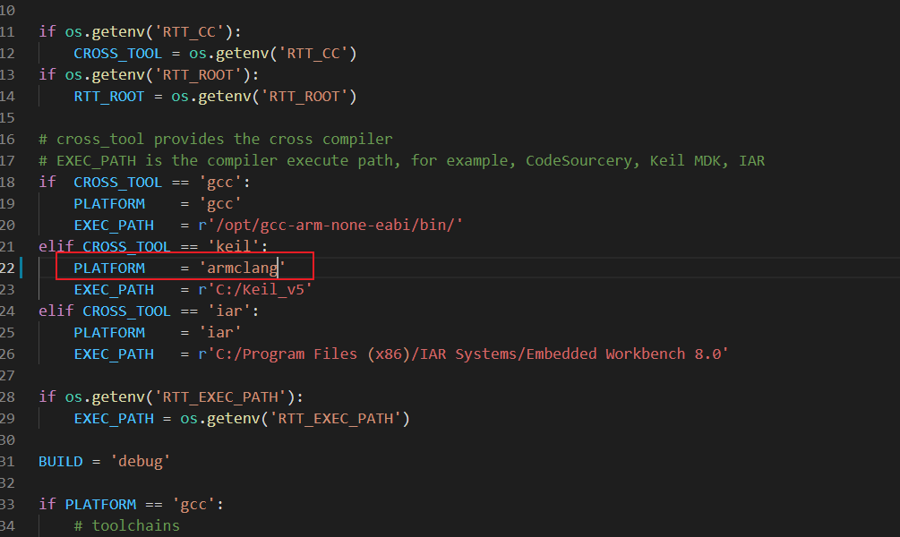
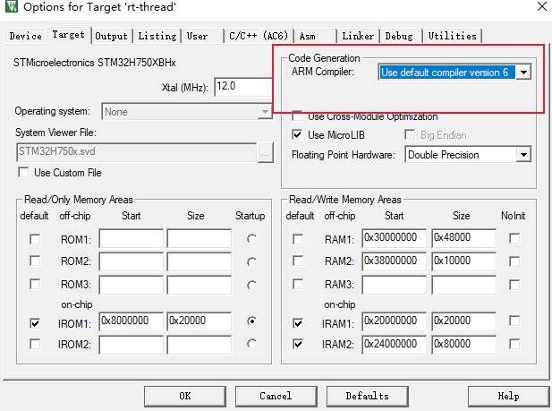
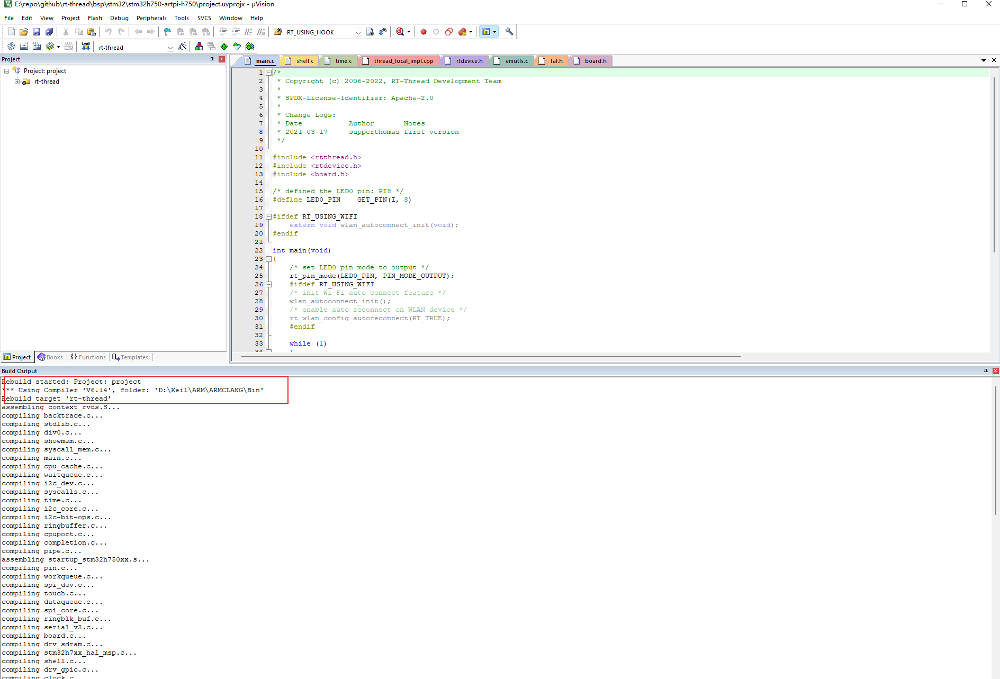

## 如何使用 ArmClang 编译工程

在 RT-Thread 4.1.0 正式发布版中，添加了对 Arm Compiler 6 的支持，用户可以修改 rtconfig.py 指定生成 mdk5 工程时使用的编译器

- ArmClang 相较于 Armcc， 支持的架构更多，Armcc 支持到 Armv7 架构，armclang 可以支持 Armv6, Armv7, Armv8 以及今后 Arm 的新处理器
- 在相同的工程下，ArmClang 的编译速度优于 Armcc

## 如何使用

- 在 rt-thread/bsp 目录下打开任意的工程，这里使用 stm32h750-artpi-h750 为例

- 打开 rtconfig.py 文件，修改 PLATFORM 为 armclang

  

- 打开 keil 模板工程，修改编译器为 ArmClang，Ctrl+S 保存设置

  

- 在 env 环境下，使用命令 `scons --target=mdk5` 生成 keil 工程。

  

## 参考资料

- [Arm Compiler armclang Reference Guide Version 6.9](https://developer.arm.com/documentation/100067/0609/)