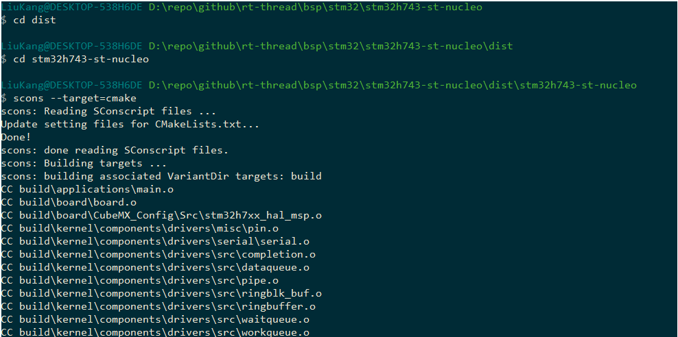
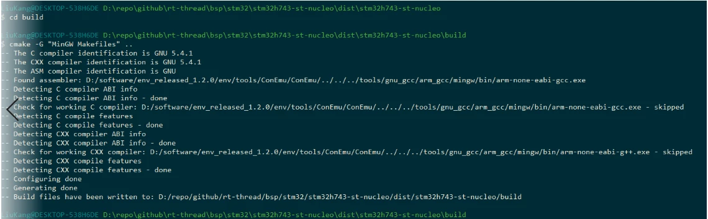
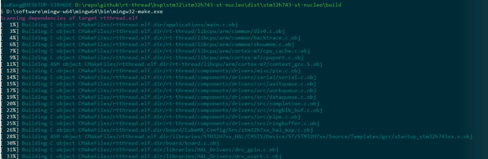
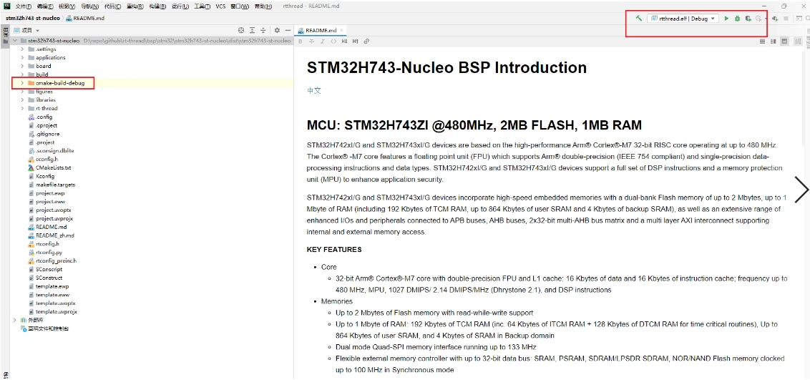
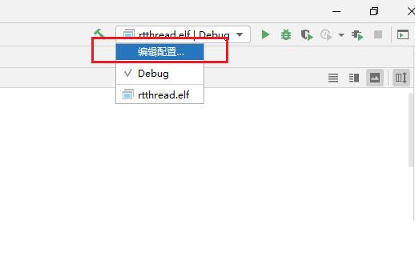
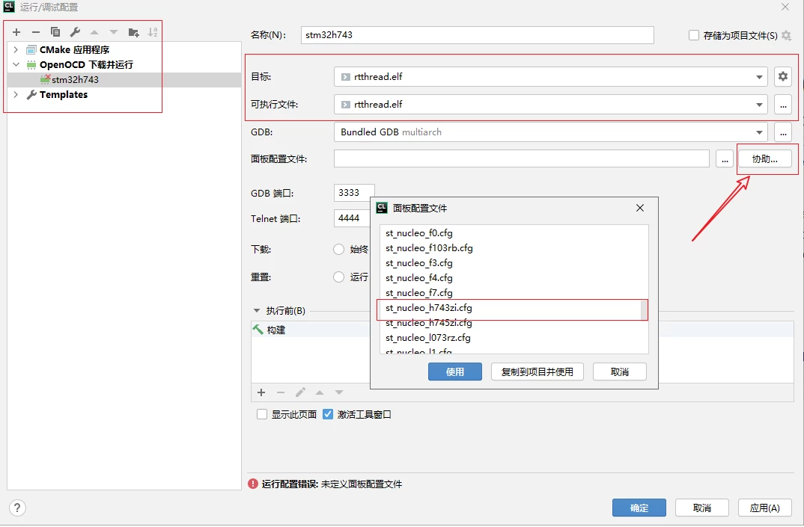
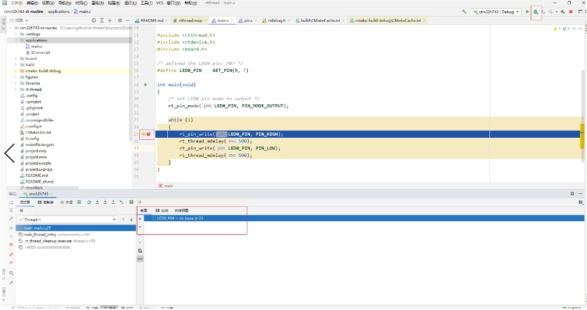
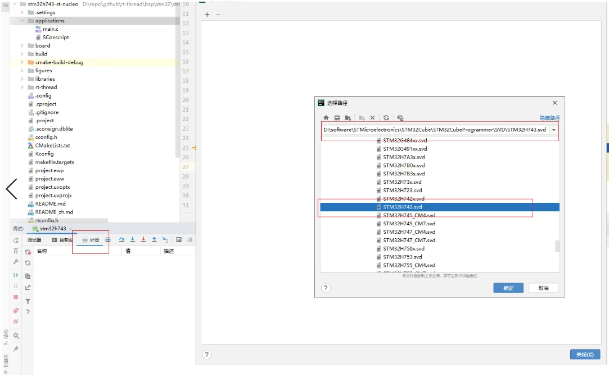
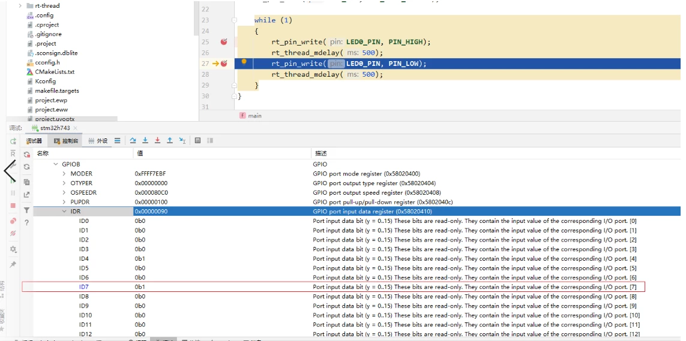

## 如何使用 Cmake 编译工程

在 RT-Thread 4.1.0 正式发布版中，添加了对 CMake 的支持。开发者可以使用 SCons 工具来生成 CMakeLists.txt 文件。

## 为何要支持 CMake

- 社区反馈；社区不少开发者表示希望 rt-thread 能够支持使用 CMake 构建工程
- 国际化；在全球开源社区，大部分项目使用 CMake 管理
- 多元化；rt-thread 不仅支持 SCons，还支持了 CMake，开发者可以有更多的选择

## 使用 ENV 构建 CMake 工程

- 在 rt-thread/bsp 目录下打开任意的工程，这里使用 stm32h743-st-nucleo bsp 为例。

- 安装 CMake 和 Make 工具

- 在该 bsp 目录下，打开 env 工具，使用命令 `scons --target=cmake` 生成 CMakeLists.txt  文件

  

- 使用命令 `cd build && cmake .. && make` 编译工程

  

  

## 使用 Clion 构建工程

- Clion 支持使用 CMake 构建工程

- 打开 Clion，打开工程 stm32h743-st-nucleo

- 点击右上角的锤子，进行编译

  

- 编译界面显示：

  

- 现在，还无法进行调试。需要我们编辑调试配置。鼠标左键点击 rtthread.elf|Debug，选择编辑配置：

  

- 点击左上角的 + 号，新建 Openocd 配置。点击协助选择面板配置文件：st_nucleo_h743zi.cfg，点击确定保存配置:

  

- 连接开发板，点击右上角虫子的图标，就可以正常就行调试：

  

- 配置外设。点击外设，选择 stm32h743.svd 文件，点击确定保存配置：

  

- 设置断点，查看寄存器的值：

  

## 参考资料

- [CMake - 维基百科，自由的百科全书 (wikipedia.org)](https://zh.wikipedia.org/wiki/CMake)
- [CLion：JetBrains 出品的 C 和 C++ 跨平台 IDE](https://www.jetbrains.com/zh-cn/clion/)

