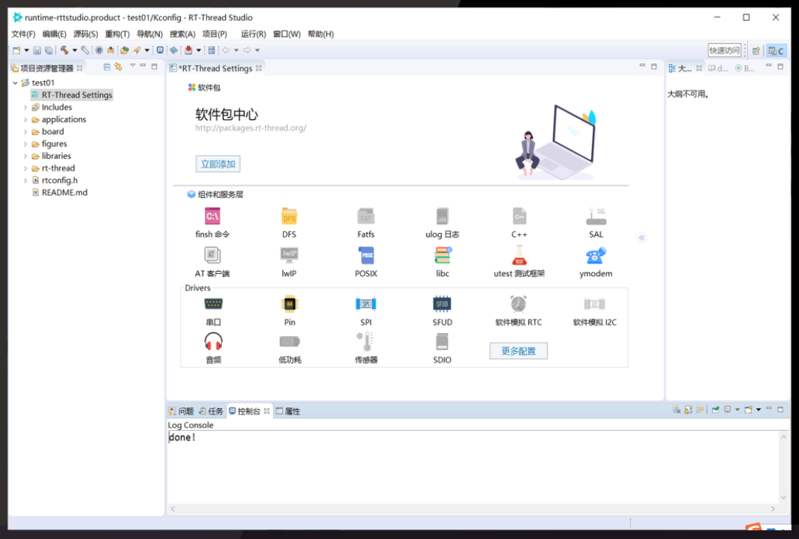

# 概览

RT-Thread Studio 作为一个开发工具软件，需要有一个从了解到熟悉，从熟悉再到能熟练应用的过程，特别是对于以前没有用过基于 eclipse 的开发工具软件的用户，建议先熟悉软件基本使用方法和主要功能入口，然后再尝试进行项目开发，如果遇到问题可以先参考查阅相关文档和视频教程以及 FAQs，若找不到解决办法，可以在<a href="https://jq.qq.com/?_wv=1027&k=9puKBDMF" target="_blank"> Studio QQ 群</a>（657896722）或<a href="https://club.rt-thread.org/ask/tag/59.html" target="_blank"> Studio 论坛</a>发帖，Studio 支持人员会协助解决问题。

