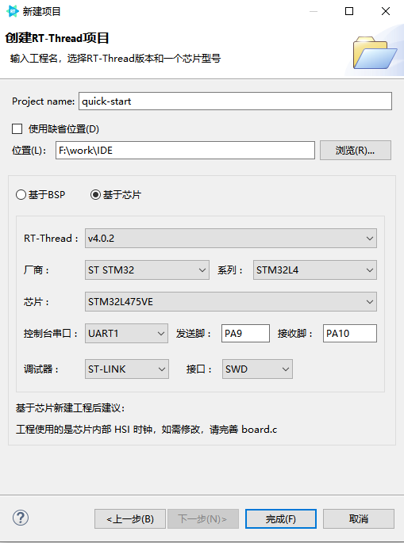
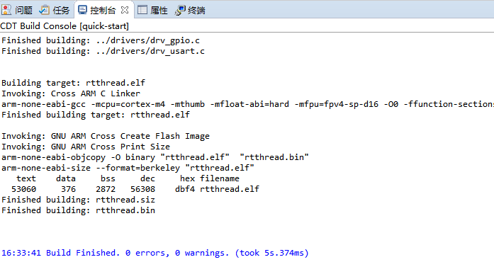
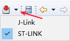
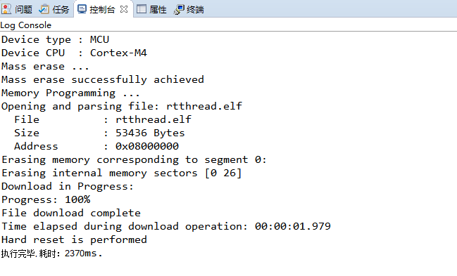
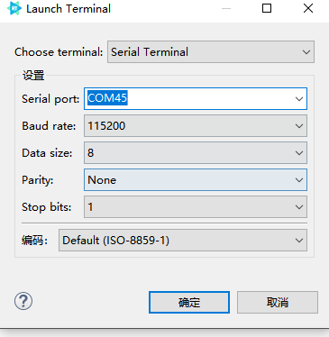
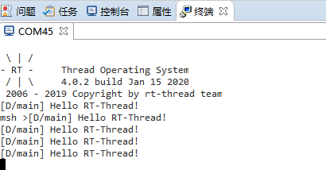

# RT-Thread Studio 快速上手

## 简介

此文档主要介绍如何基于 RT-Thread Studio 新建 RT-Thread 完整版工程，帮助开发者快速上手 RT-Thread Studio。

本文主要内容如下

- 新建 RT-Thread 工程

- 修改 `main.c` 中的引脚信息

- 编译、下载与验证

## 创建 RT-Thread 完整版工程

使用 RT-Thread Studio 新建基于 v4.0.2 的工程，界面如下图所示



配置过程可总结为以下步骤：

- 定义自己的工程名及工程生成文件的存放路径。

- 选择`基于芯片`创建工程，选择的 RT-Thread 版本为 v4.0.2

- 选择厂商及芯片型号。

- 配置串口信息

- 配置调试器信息

工程配置完成后点击下方的`完成`按钮即可创建 RT-Thread 完整版工程。创建 nano 版工程是步骤和上述步骤一致，只需选择 RT-Thread 版本为 nano 即可，这里需要注意的是 nano 版无设备的概念。

## 修改 `main.c`

基于 RT-Thread 完整版创建工程时，会自动启用 PIN 设备，在 `main.c` 函数里面会自动生成如下代码

```c
/* PLEASE DEFINE the LED0 pin for your board, such as: PA5 */
#define LED0_PIN    GET_PIN(A, 5)

int main(void)
{
    int count = 1;
    /* set LED0 pin mode to output */
    rt_pin_mode(LED0_PIN, PIN_MODE_OUTPUT);

    while (count++)
    {
        /* set LED0 pin level to high or low */
        rt_pin_write(LED0_PIN, count % 2);
        LOG_D("Hello RT-Thread!");
        rt_thread_mdelay(1000);
    }

    return RT_EOK;
}
```

使用 PIN 设备时，只需要使用 `GET_PIN` 获取相应的引脚编号，并使用 `rt_pin_write` 等函数来操作引脚编号即可。

例如，`stm32l475-atk-pandora` 开发板的 LED 所接的引脚为 PE7，所以修改为

```c
#define LED0_PIN    GET_PIN(E, 7)
```

## 编译

鼠标左键单击选中当前工程，在菜单栏单击 `为项目"quick-start"构建"Debug"`按钮即可编译工程，`quick-start` 为自己的工程名。或者使用`右键->构建项目`也可以编译工程。

工程编译结果如下图



## 下载

工程编译无错误后即可下载程序到自己的板卡。

下载程序可以通过菜单栏的`下载程序`按钮来下载。也可以通过`右键->下载程序`来进行下载，下载程序默认使用的是新建工程时选择的下载方式，如果需要更改，点击菜单栏`下载程序`按钮旁边的倒三角即可根据自己的调试器来选择下载方式。目前 Studio 支持 ST-Link 和 J-Link 这两种下载方式。选择仿真器的示例如下



选择好仿真器后直接点击下载按钮即可下载

程序下载结果如下图所示



## 验证

程序下载成功后按下开发板的复位键，并使用 Studio 菜单栏的 `Open a Terminal` 选项来打开一个串口终端，如下图所示



终端中打印的信息如下



从终端打印的信息中可以看到，RT-Thread 已经成功运行起来了，同时观察板载的 LED 也可以看到 LED 每隔 1 s 状态就翻转一次。

## 注意事项

- LED 的引脚需要根据自己的板卡进行修改

- nano 版本无设备概念，所以无法使用 PIN 设备
