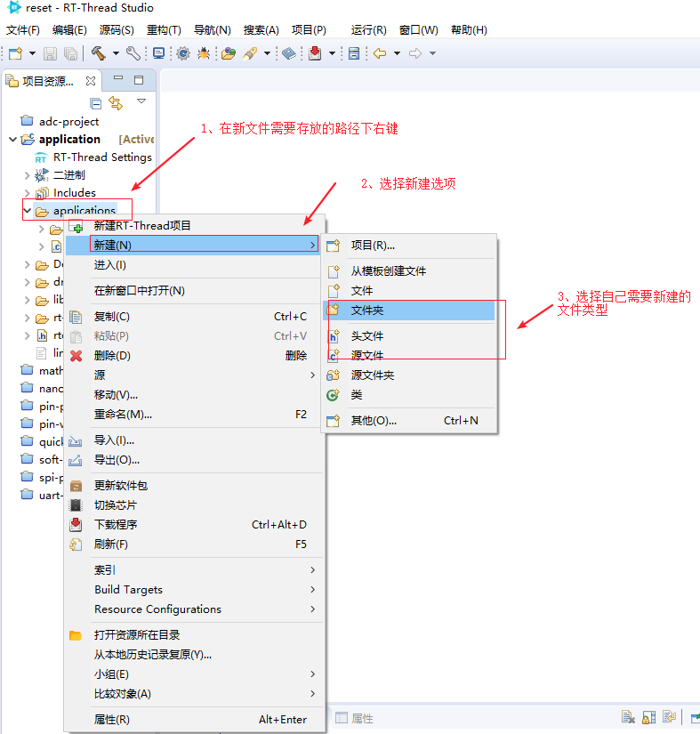
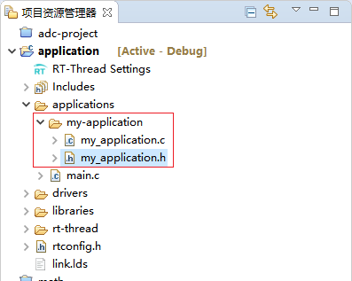
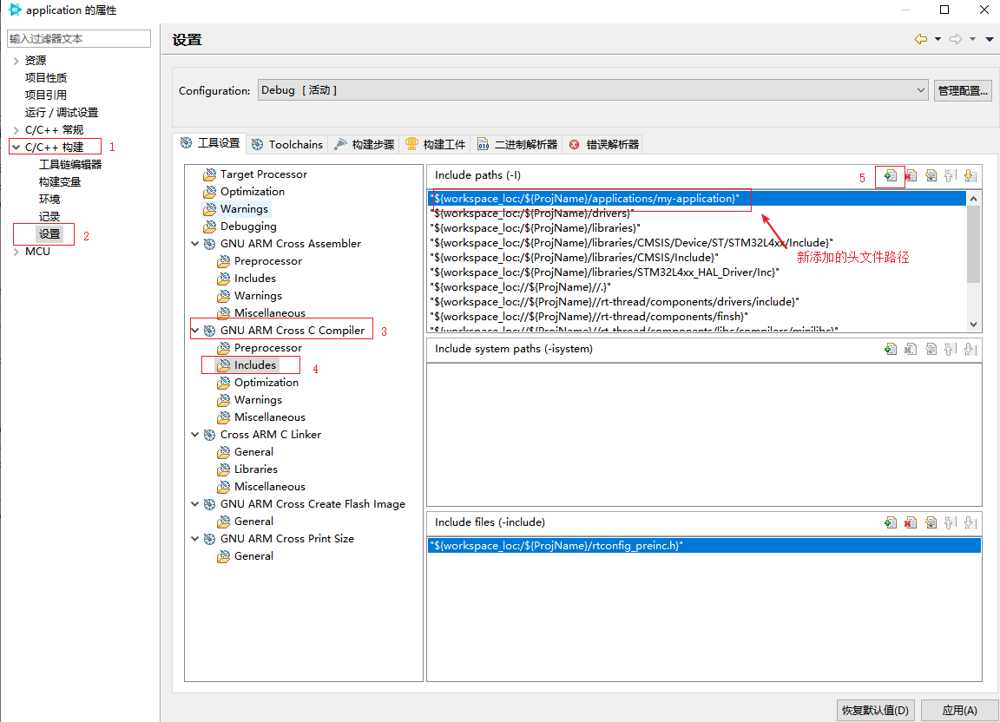
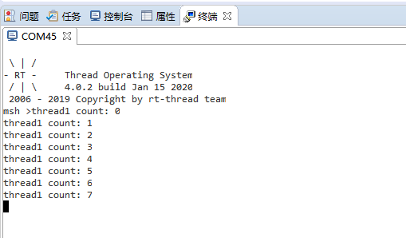

# RT-Thread Studio 应用开发示例 - 线程

## 简介

本文档将主要介绍如何基于 RT-Thread Studio 创建并启动第一个线程。

## 启动第一个线程

创建线程时，可以在 `main.c` 文件中加入自己创建线程的代码，也可以另外新建源文件和头文件来存放创建线程的代码，本文将以新建文件的方式创建线程。

启动第一个线程的步骤主要如下

- 新建源文件及头文件

- 将头文件路径添加到工程

- 创建线程

- `main` 函数中调用


### 新建文件

创建文件夹、源文件及头文件时，可以基于 Studio 进行创建，也可以在本地创建好之后拷贝到工程路径中。这里以 Studio 新建文件为例。

使用 Studio 新建文件时，参考以下步骤

- 在新文件需要存放的目录下右键

- 选择 `新建` 选项

- 选择自己需要新建的文件类型，如：文件夹、源文件和头文件等。

如下图所示




本例中，在 application 目录下新建 `my-application` 文件夹，在该文件夹下，分别存放 `my_application.c` 源文件和 `my_applications.h` 头文件。

创建文件结果如如下图所示



这里需要注意的是，基于 Studio 构建工程时，Studio 会默认将工程路径下的所有源文件都参与编译，所以新建的源文件无需做任何配置即可参与工程的编译，而头文件则需要手动添加到工程中。

### 添加头文件路径

应用程序中如果需要包含新添加的头文件，那么就需要将新添加的头文件路径添加到工程中。添加头文件路径的过程如下

- 选择菜单栏的  选项(打开构建配置)

- C/C++ 构建

- 设置

- 如果是 C 的头文件选择 `GNU ARM Cross Compiler`，如果是汇编的头文件则选择 `GNU ARM Cross Assembler`

- 选择头文件包含 `Includes`

- 添加自己的头文件路径

示例工程添加头文件的结果如下图所示




### 创建线程

在 `my_application.c` 文件中创建示例线程，如下代码所示
```c
#include <rtthread.h>

#define THREAD_PRIORITY         25
#define THREAD_STACK_SIZE       512
#define THREAD_TIMESLICE        5

/*　使用静态线程时，线程的栈需要设置字节对齐　*/
ALIGN(RT_ALIGN_SIZE)
static rt_uint8_t thread_stack[THREAD_STACK_SIZE];
static struct rt_thread tid1;

/* 线程 1 的入口函数 */
static void thread1_entry(void *parameter)
{
    rt_uint32_t count = 0;

    while (1)
    {
        rt_kprintf("thread1 count: %d\n", count ++);
        rt_thread_mdelay(500);
    }
}

/* 线程示例 */
int thread_sample(void)
{
    /* 静态创建线程 */

    /* 初始化线程 1，名称是 thread1，入口是 thread1_entry*/
    rt_thread_init(&tid1,
                   "thread1",
                   thread1_entry,
                   RT_NULL,
                   thread_stack,
                   THREAD_STACK_SIZE,
                   THREAD_PRIORITY,
                   THREAD_TIMESLICE);
        /* 启动线程 */
        rt_thread_startup(&tid1);

    return 0;
}
```

在 `my_application.h` 头文件中加入函数声明
```c
int thread_sample(void);
```

### 编译下载&验证

在 `main.c` 文件中包含 `my_application.h` 头文件，同时在 main 函数中调用 `thread_sample` 函数，如下所示
```c
#include <rtthread.h>
#include "my_application.h"

int main(void)
{
    thread_sample();

    return RT_EOK;
}
```

编译并下载程序，打开串口终端，输出信息如下



从终端输出的信息可以看出，创建的第一个线程已经成功运行了。

更多关于线程操作和示例请参考 [线程管理](https://www.rt-thread.org/document/site/programming-manual/thread/thread/)
