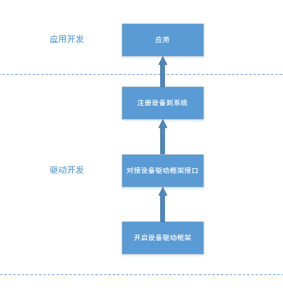
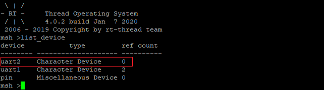
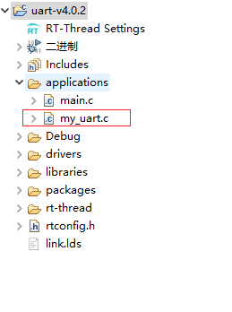
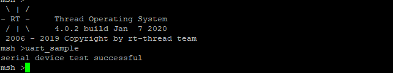

# RT-Thread Studio 应用开发示例 - 串口设备

## 简介

在 RT-Thread 中设备的开发总体上可以分为两类：设备的驱动开发和设备的应用开发。

- 设备驱动开发的主要工作是操作硬件，对接设备驱动框架，并注册设备到系统中。

- 设备应用开发的主要工作是直接调用操作系统提供的接口，例如：`rt_device_find`、`rt_device_open` 等函数，完成上层的业务逻辑。

所以在 RT-Thread 中，对于一个具体的设备，其自底向上的开发流程可总结为如下步骤

- 打开设备驱动框架支持

- 对接设备驱动框架提供的接口函数

- 注册设备到系统中

- 使用操作系统提供 API 操作设备

流程图如下所示



## 新增设备

本文将以串口为例，主要讲解串口设备的应用开发。串口设备驱动的开发和新增串口设备请参考 [串口设备驱动开发](https://www.rt-thread.org/document/site/#/development-tools/rtthread-studio/drivers/uart/v4.0.2/rtthread-studio-uart-v4.0.2)

## 查找设备

使用设备前需要确保系统中已经成功注册了该设备，查找设备是否已经注册，可以在命令行中使用 `list_device` 命令来查找设备，例如本例中需要使用串口 2 ，命令行查询结果如下



从结果可以看出设备已经成功注册到系统中了。

应用程序也可以根据设备名称来查找设备。查找设备函数如下所示：

```c
rt_device_t rt_device_find(const char* name);
```

|**参数**|**描述**                         |
|----------|------------------------------------|
| name     | 设备名称                           |
|**返回**| ——                                 |
| 设备句柄 | 查找到对应设备将返回相应的设备句柄 |
| RT_NULL  | 没有找到相应的设备对象             |

## 使用设备

当需要使用的设备成功注册到系统中时，该设备就可以直接通过系统提供的接口来进行访问了。

例如通用设备可以使用 `rt_device_read`、`rt_device_write` 等函数来进行数据的传输， I2C 设备可以使用 `rt_i2c_transfer` 等函数进行数据传输。更多设备相关的 API 请查看 [设备与驱动程序](https://www.rt-thread.org/document/site/programming-manual/device/device/) 中对应的设备。

本例中需要使用的是串口 2，在 `application` 目录下新建 `my_uart.c` 源文件，如下图所示



并在 `my_uart.c` 文件中添加如下串口设备的示例程序
```c
#include <rtthread.h>

#define SAMPLE_UART_NAME       "uart2"       /* 需要操作的设备 */
static rt_device_t serial;                   /* 设备句柄 */
static char str[] = "hello RT-Thread!\r\n";  /* 需要发送的数据 */

static int uart_sample(void)
{
    rt_err_t ret = RT_EOK;
    rt_size_t send_len = 0;

    /* 查找系统中的串口设备 */
    serial = rt_device_find(SAMPLE_UART_NAME);
    if (!serial)
    {
        rt_kprintf("find %s failed!\n", SAMPLE_UART_NAME);
        return -RT_ERROR;
    }

    /* 以中断接收及轮询发送模式打开串口设备 */
    ret = rt_device_open(serial, RT_DEVICE_FLAG_INT_RX);
    if (ret != RT_EOK)
    {
        rt_kprintf("open device failed\r\n");
        return -RT_ERROR;
    }
    /* 发送字符串 */
    send_len = rt_device_write(serial, 0, str, (sizeof(str) - 1));
    if (send_len != sizeof(str) - 1)
    {
        rt_kprintf("send data failed\r\n");
        return -RT_ERROR;
    }
    /* 关闭设备 */
    ret = rt_device_close(serial);
    if (ret != RT_EOK)
    {
        rt_kprintf("close device failed\r\n");
        return -RT_ERROR;
    }

    rt_kprintf("serial device test successful\r\n");

    return RT_EOK;
}
/* 导出到 msh 命令列表中 */
MSH_CMD_EXPORT(uart_sample, uart device sample);
```

编译并下载程序。在控制台中输入 `uart_sample` 命令，结果如下图



使用串口工具将开发板上的串口 2 连接到电脑，可以看到开发板串口 2 收到的数据如下


从上面的实验中可以看到我们成功使用系统提供的接口向串口 2 输出了数据，更多关于串口设备的使用请参看 [串口设备](https://www.rt-thread.org/document/site/#/rt-thread-version/rt-thread-standard/programming-manual/device/uart/uart_v1/uart)

## 注意事项

- 设备能够使用的前提是已经注册成功

- nano 版没有设备的概念
