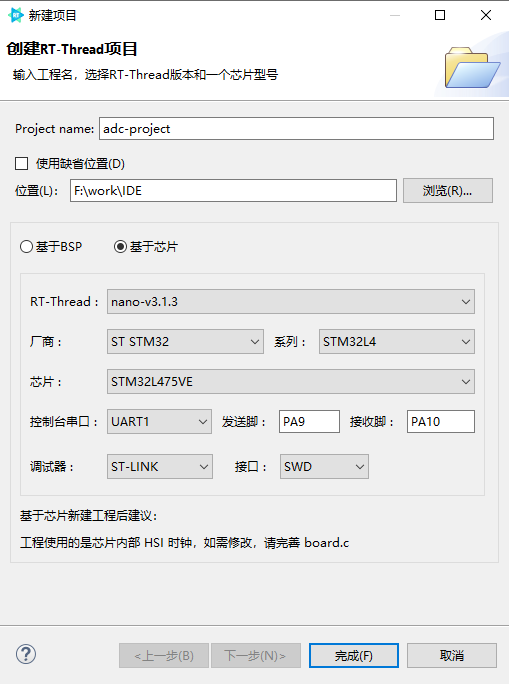
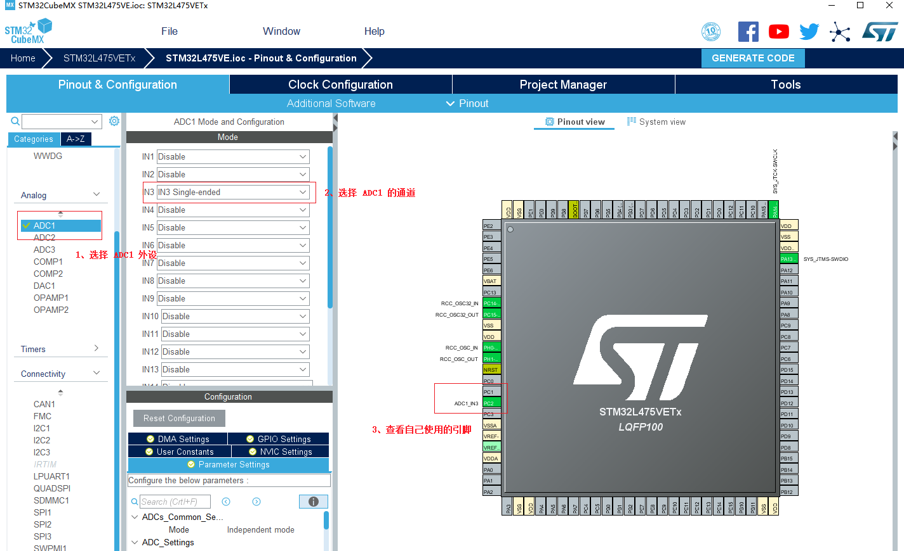
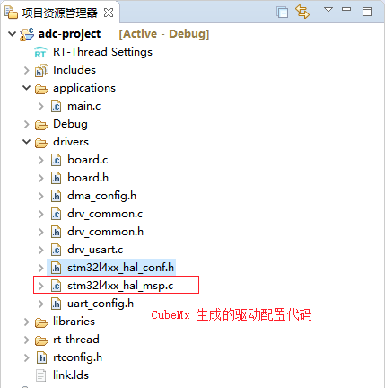
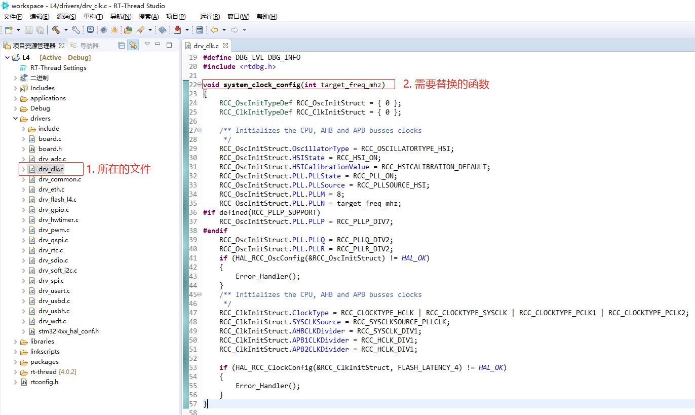
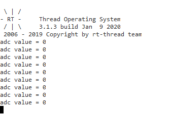
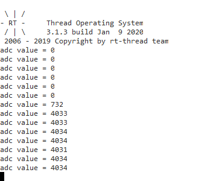

# RT-Thread Studio 结合 STM32CubeMx 开发其他驱动文档

使用 `RT-Thread Studio` 新建 RT-Thread 的项目时直接就将 RT-Thread 实时操作系统移植到对应的芯片上了，省去了系统移植的步骤。

使用 `STM32CubeMx` 配置工具可以方便快速的配置芯片外设的时钟和引脚，使驱动的开发变得简单。

所以本文将结合这两个 IDE 的优点，介绍基于 `RT-Thread Studio` 和 `STM32CubeMx` 的驱动开发。

需要注意的是这里开发的驱动是不基于 RT-Thread 设备驱动框架的，即直接使用 `STM32CubeMx` 生成的 HAL 库文件来开发外设驱动。

## 简介

使用 `RT-Thread Studio` 和 `STM32CubeMx` 开发驱动可分为以下几个步骤

- 使用 `RT-Thread Studio` 新建 RT-Thread 工程

- 使用 `STM32CubeMx` 配置外设和系统时钟

- 复制 `stm32xxxx_hal_msp.c` 函数

- 修改 `stm32xxxx_hal_config.h` 文件，打开相应外设支持。

- 替换 `board.c ` 文件中时钟配置函数

- 使用外设

## 新建 RT-Thread 项目

使用 `RT-Thread Studio` 新建基于 `nano-v3.1.3` 的工程，界面如下图所示



配置过程可总结为以下步骤：

- 定义自己的工程名及工程生成文件的存放路径

- 选择 `基于芯片` 创建工程，选择的 RT-Thread 版本为 `nano-v3.1.3`。

- 选择厂商及芯片型号

- 配置串口信息

- 配置调试器信息

工程配置完成后点击下方的 `完成` 按钮即可创建 RT-Thread 的工程。

基于 Studio 创建 RT-Thread 工程后，就可以基于创建的工程开发自己的驱动。下面将以 `stm32l475-atk-pandora` 开发板为例，讲解如何开发 ADC 驱动。

## 配置外设

新建基于目标板卡的 `CubeMx` 工程，并配置自己需要使用的外设。

例如，示例开发板的 PC2 连接的是 ADC1 的通道 3，使用 `CubeMx` 生成 ADC 的驱动代码的配置结果如下所示：




## 复制 `stm32xxxx_hal_msp.c` 函数

将 `CubeMx` 生成的代码 `stm32l4xx_hal_msp.c` 函数复制到 RT-Thread Studio 生成的工程中，并参与工程编译。复制完成后的结果如下图所示



由于我们并没有使用 CubeMx 生成的工程，所以这里需要将 `stm32l4xx_hal_msp.c` 文件中 `#include "main.h"` 替换为 `#include "board.h"`。

## 打开 HAL 库配置文件对应外设的支持宏

这里我们使用了 ADC 外设，所以需要在 `stm32l4xx_hal_config.h` 文件中将 ADC 模块使能，取消 ADC 模块的注释即可，示例代码如下

```c
#define HAL_ADC_MODULE_ENABLED
```

## 修改系统时钟(可选)

使用 RT-Thread Studio 创建 RT-Thread 工程时默认使用的是系统内部时钟 HSI，这里需要根据自己的板卡配置将 `STM32CubeMx` 生成的时钟配置函数拷贝到 RT-hread 的工程中。步骤如下

- 使用 CubeMx 配置自己板卡的系统时钟，并生成代码

- 复制 CubeMx 工程中 `main.c` 文件的 `void SystemClock_Config(void)` 系统时钟初始化函数

- 替换 `RT-Thread Studio` 生成的工程中的 `drv_clk.c` 文件中的系统时钟配置函数`void system_clock_config(int target_freq_mhz)` ，如下图所示。

  

- 如果使用外部时钟，则需要更新工程中的`stm32xxxx_hal_conf.h` 中的对应的外部时钟频率的值，以 HSE 为例，需要修改下面的时钟频率为实际使用的值：

  ```c

  #define HSE_VALUE ((uint32_t)8000000U) /*!< Value of the External oscillator in Hz */

  ```


## 使用外设

上述文件配置完成之后，ADC 外设就可以使用的，在 `main.c` 中添加外设的使用代码

ADC 外设的使用示例代码如下

```c
#include <rtthread.h>
#include "board.h"

ADC_HandleTypeDef hadc1;

/* ADC1 init function */
void MX_ADC1_Init(void)
{
  ADC_MultiModeTypeDef multimode = {0};
  ADC_ChannelConfTypeDef sConfig = {0};

  /** Common config
  */
  hadc1.Instance = ADC1;
  hadc1.Init.ClockPrescaler = ADC_CLOCK_ASYNC_DIV1;
  hadc1.Init.Resolution = ADC_RESOLUTION_12B;
  hadc1.Init.DataAlign = ADC_DATAALIGN_RIGHT;
  hadc1.Init.ScanConvMode = ADC_SCAN_DISABLE;
  hadc1.Init.EOCSelection = ADC_EOC_SINGLE_CONV;
  hadc1.Init.LowPowerAutoWait = DISABLE;
  hadc1.Init.ContinuousConvMode = DISABLE;
  hadc1.Init.NbrOfConversion = 1;
  hadc1.Init.DiscontinuousConvMode = DISABLE;
  hadc1.Init.ExternalTrigConv = ADC_SOFTWARE_START;
  hadc1.Init.ExternalTrigConvEdge = ADC_EXTERNALTRIGCONVEDGE_NONE;
  hadc1.Init.DMAContinuousRequests = DISABLE;
  hadc1.Init.Overrun = ADC_OVR_DATA_PRESERVED;
  hadc1.Init.OversamplingMode = DISABLE;
  if (HAL_ADC_Init(&hadc1) != HAL_OK)
  {
    Error_Handler();
  }
  /** Configure the ADC multi-mode
  */
  multimode.Mode = ADC_MODE_INDEPENDENT;
  if (HAL_ADCEx_MultiModeConfigChannel(&hadc1, &multimode) != HAL_OK)
  {
    Error_Handler();
  }
  /** Configure Regular Channel
  */
  sConfig.Channel = ADC_CHANNEL_3;
  sConfig.Rank = ADC_REGULAR_RANK_1;
  sConfig.SamplingTime = ADC_SAMPLETIME_2CYCLES_5;
  sConfig.SingleDiff = ADC_SINGLE_ENDED;
  sConfig.OffsetNumber = ADC_OFFSET_NONE;
  sConfig.Offset = 0;
  if (HAL_ADC_ConfigChannel(&hadc1, &sConfig) != HAL_OK)
  {
    Error_Handler();
  }

}

rt_uint32_t get_adc_value(void)
{
    HAL_ADC_Start(&hadc1);
    HAL_ADC_PollForConversion(&hadc1, 10);

    return (rt_uint32_t)HAL_ADC_GetValue(&hadc1);
}

int main(void)
{
    int count = 1;
    rt_uint32_t read_value = 0;

    MX_ADC1_Init();
    while (count++)
    {
        read_value = get_adc_value();
        rt_thread_mdelay(1000);
        rt_kprintf("adc value = %d\r\n", read_value);
    }

    return RT_EOK;
}
```

编译下载工程，将开发板的 PC2 引脚连接到开发板上的地，终端打印信息如下



将开发板的 PC2 引脚连接到开发板的 3.3V 引脚，终端打印信息如下



从上面两个实验打印结果可以看出我们成功使用了 ADC 外设。

## 注意事项

- `board.c` 文件中的系统时钟配置函数需要根据自己的板卡进行修改

- `stm32xxxx_hal_msp.c` 函数中主要完成的是外设引脚和时钟的初始化，所以在使用 `CubeMx` 生成外设的配置代码时不能选择为每个外设都生成 `.c/.h` 文件

- 使用 `CubeMx` 外设时只需要配置实际使用的外设，如果 `stm32xxxx_hal_msp.c` 文件和 `drv_uart.c` 文件或者 `drv_spi.c` 文件外设的初始化函数重定义，需要删除 `stm32xxxx_hal_msp.c` 文件中外设的初始化函数。
