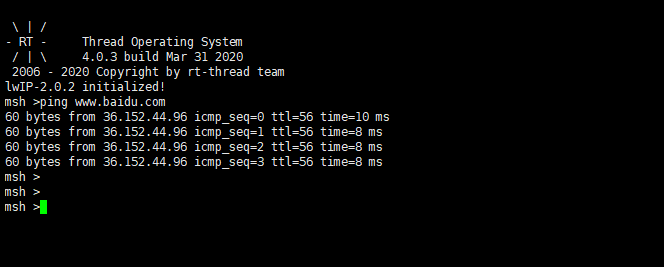

# 基于 RT-Thread Studio 的 ETH 驱动开发文档

## 简介

`RT-Thread` 为了方便用户开发网络应用，引入了网络设备框架，同时 `RT-Thread` 还提供了数量丰富的网络组件包，方便用户快速开发自己的网络应用。

本文将基于正点原子 `stm32f407-atk-explorer` 开发板主要介绍如何使用 `RT-Thread Studio` 来添加以太网驱动和 `lwIP` 协议栈。

`ETH` 设备驱动的开发可总结为如下：

- 新建 `RT-Thread` 完整版项目
- `board.h`中定义 `BSP_USING_ETH` 和 `PHY` 相关的宏
- `board.c`中初始化 `ETH` 相关的引脚和时钟
- `stm32xxxx_hal_config.h`中打开 `HAL` 库函数对 `ETH` 的支持
- `board.c` 中实现自己的 `PHY` 复位函数
- 配置 `lwIP` 协议栈

更多 `ETH` 的配置及添加步骤也可以参考相应工程文件 `board.h` 中对 `ETH` 部分的描述。

## 新建 RT-Thread 项目

使用 `RT-Thread Studio` 新建基于 `v4.0.2` 的工程，界面如下图所示：


配置过程可总结为以下步骤：

- 定义自己的工程名及工程生成文件的存放路径

- 选择 `基于芯片` 创建工程，选择的 `RT-Thread` 版本为 `v4.0.2`

- 选择厂商及芯片型号

- 配置串口信息

- 配置调试器信息

工程配置完成后点击下方的 `Finish` 按钮即可创建 `RT-Thread` 完整版工程。

## 定义 ETH 相关的宏

定位到工程文件 `board.h` 中 `ETH` 配置说明部分，按照注释部分的说明分别定义 `BSP_USING_ETH` 和 `PHY` 相关的宏，本例中使用板载以太网 `PHY` 芯片为 `LAN8720A`， 所以 `ETH` 相关的宏定义如下 ：

```c
#define BSP_USING_ETH
#ifdef BSP_USING_ETH
#define PHY_USING_LAN8720A
#endif
```

## 初始化引脚和时钟

定义了 `BSP_USING_ETH` 宏之后，`drv_eth.c` 文件就会参与编译，该文件只是配置了 `ETH` 的工作方式和传输函数等，具体 `ETH` 外设的时钟和引脚的初始化需要借助 `STM32CubeMx` 生成的代码。

将 `STM32CubeMx` 工具生成的 `ETH` 引脚和时钟初始化代码(一般在 `stm32_xxxx_hal_msp.c` 文件中)复制到自己工程的 `board.c` 文件的末尾，使之参与编译，如下所示：

```c
void HAL_ETH_MspInit(ETH_HandleTypeDef* heth)
{
  GPIO_InitTypeDef GPIO_InitStruct = {0};
  if(heth->Instance==ETH)
  {
  /* USER CODE BEGIN ETH_MspInit 0 */

  /* USER CODE END ETH_MspInit 0 */
    /* Peripheral clock enable */
    __HAL_RCC_ETH_CLK_ENABLE();

    __HAL_RCC_GPIOC_CLK_ENABLE();
    __HAL_RCC_GPIOA_CLK_ENABLE();
    __HAL_RCC_GPIOG_CLK_ENABLE();
    /**ETH GPIO Configuration
    PC1     ------> ETH_MDC
    PA1     ------> ETH_REF_CLK
    PA2     ------> ETH_MDIO
    PA7     ------> ETH_CRS_DV
    PC4     ------> ETH_RXD0
    PC5     ------> ETH_RXD1
    PG11     ------> ETH_TX_EN
    PG13     ------> ETH_TXD0
    PG14     ------> ETH_TXD1
    */
    GPIO_InitStruct.Pin = GPIO_PIN_1|GPIO_PIN_4|GPIO_PIN_5;
    GPIO_InitStruct.Mode = GPIO_MODE_AF_PP;
    GPIO_InitStruct.Pull = GPIO_NOPULL;
    GPIO_InitStruct.Speed = GPIO_SPEED_FREQ_VERY_HIGH;
    GPIO_InitStruct.Alternate = GPIO_AF11_ETH;
    HAL_GPIO_Init(GPIOC, &GPIO_InitStruct);

    GPIO_InitStruct.Pin = GPIO_PIN_1|GPIO_PIN_2|GPIO_PIN_7;
    GPIO_InitStruct.Mode = GPIO_MODE_AF_PP;
    GPIO_InitStruct.Pull = GPIO_NOPULL;
    GPIO_InitStruct.Speed = GPIO_SPEED_FREQ_VERY_HIGH;
    GPIO_InitStruct.Alternate = GPIO_AF11_ETH;
    HAL_GPIO_Init(GPIOA, &GPIO_InitStruct);

    GPIO_InitStruct.Pin = GPIO_PIN_11|GPIO_PIN_13|GPIO_PIN_14;
    GPIO_InitStruct.Mode = GPIO_MODE_AF_PP;
    GPIO_InitStruct.Pull = GPIO_NOPULL;
    GPIO_InitStruct.Speed = GPIO_SPEED_FREQ_VERY_HIGH;
    GPIO_InitStruct.Alternate = GPIO_AF11_ETH;
    HAL_GPIO_Init(GPIOG, &GPIO_InitStruct);

  /* USER CODE BEGIN ETH_MspInit 1 */

  /* USER CODE END ETH_MspInit 1 */
  }

}
```

## 打开 HAL 库对 ETH 的支持

在 `stm32_xxxx_hal_config.h` 文件中打开对 `ETH` 的支持,也就是取消掉 `HAL_ETH_MODULE_ENABLED` 这个宏定义的注释，如下所示：

```c
#define HAL_ETH_MODULE_ENABLED
```

## 实现 PHY 复位函数

在 `drv_eth.c` 文件中会调用 `phy_reset` 函数，该函数需要根据自己的实际情况进行实现，本例中 `PHY` 的复位引脚接在了 `PD3` 引脚，所以复位函数的实现如下所示 ：

```c
#include <rtdevice.h>
#define RESET_IO GET_PIN(D, 3)

void phy_reset(void)
{
    rt_pin_mode(RESET_IO, PIN_MODE_OUTPUT);
    rt_pin_write(RESET_IO, PIN_HIGH);
    rt_thread_mdelay(50);
    rt_pin_write(RESET_IO, PIN_LOW);
    rt_thread_mdelay(50);
    rt_pin_write(RESET_IO, PIN_HIGH);
}
```

> [!NOTE]
> 注：不同的 `PHY` 芯片复位方式不同，需要根据具体自己板卡的实际情况进行实现。

## 配置 lwIP 协议栈

在前面的配置中我们已经配置好了 `ETH` 相关的硬件部分驱动,接下来就需要配置 `lwIP` 协议栈相关的内容。

打开 `RT-Thread Settings` 文件，在图形化配置界面中左键单击 `lwIP` 图标即可打开 `lwIP` 协议栈的支持(组件开启，相应的图标会高亮)，如下图所示：


在该选项上右键，可查看 `lwIP` 的详细配置，具体配置路径如下所示：
```c
RT-Thread Settings
---- 组件
--------网络
------------轻量级 TCP/IP 堆栈
```

配置结果如下图所示：


本例中 `lwIP` 协议栈的配置直接选择默认配置，没有做任何修改。实际使用中可以根据自己的板卡情况进行修改。

## 使用网络

将 `ETH` 和 `lwIP` 配置好之后编译下载程序，打开串口终端工具，在命令行中输入如下网络测试命令

```c
ping www.baidu.com
```

终端输出结果如下所示：



从上图可以看出开发板已经成功连接到了网络。

## 注意事项

- 本例中只配置了 `lwIP` 协议栈以及 `ETH` 相关的驱动，更多关于 `RT-Thread` 网络部分的使用及介绍可以参考 [netdev 网卡](https://www.rt-thread.org/document/site/programming-manual/netdev/netdev/)，[SAL套接字抽象层](https://www.rt-thread.org/document/site/programming-manual/sal/sal/)。
