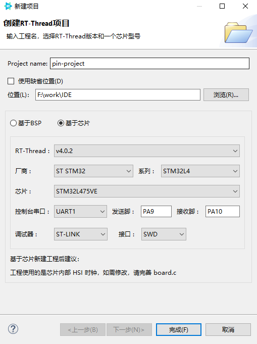
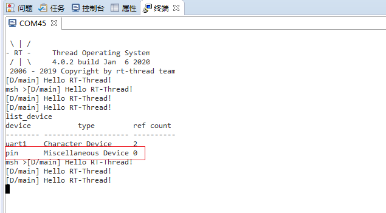

# 基于 RT-Thread Studio 的 PIN 设备应用文档

## 简介

一般情况下 MCU 引出供用户使用的引脚有很多个，RT-Thread 提供的 PIN 设备驱动将这些 GPIO 引脚抽象为了一个 PIN 设备，应用程序通过 PIN 设备管理接口就可以访问控制引脚。PIN 设备驱动有以下特点：

- 在 PIN 驱动文件中为每个引脚重新编号，这不同于芯片手册中的编号。使用时可以通过 PIN 驱动中的引脚号操作 PIN 设备。
- 可设置引脚输入/输出模式、可读取/设置引脚电平状态、可设置引脚中断回调函数等。

使用 RT-Thread Studio 创建基于 RT-Thread 完整版的工程时，默认开启了 RT-Thread 的 PIN 设备，所以用户无须重新配置或修改源码，即可直接使用 PIN 设备。


## 创建 RT-Thread 完整版工程

使用 RT-Thread Studio 新建基于 v4.0.2 的工程，界面如下图所示



配置过程可总结为以下步骤：

- 定义自己的工程名及工程生成文件的存放路径

- 选择`基于芯片` 创建工程，选择的 RT-Thread 版本为 v4.0.2

- 选择厂商及芯片型号

- 配置串口信息

- 配置调试器信息

工程配置完成后点击下方的`完成`按钮即可创建 RT-Thread 的工程。

## 使用 PIN 设备

基于 RT-Thread 完整版创建的工程中，main.c 函数里面会自动生成如下定义

```c
#define LED0_PIN    GET_PIN(A, 5)

int main(void)
{
    int count = 1;
    /* set LED0 pin mode to output */
    rt_pin_mode(LED0_PIN, PIN_MODE_OUTPUT);

    while (count++)
    {
        /* set LED0 pin level to high or low */
        rt_pin_write(LED0_PIN, count % 2);
        LOG_D("Hello RT-Thread!");
        rt_thread_mdelay(1000);
    }

    return RT_EOK;
}
```

使用 PIN 驱动需要使用 `GET_PIN` 获取相应的引脚编号，获取到引脚编号后，可使用 `rt_pin_write` 等函数来操作引脚。
例如，`stm32l475-atk-pandora` 开发板的 LED 所接的引脚为 PE7,所以修改为

```c
#define LED0_PIN    GET_PIN(E, 7)
```

编译并下载代码，可以看到开发板上面的 LED 每间隔 1000 ms 闪烁一次。在终端中输入 `list_device` 命令可以看到 pin 设备已经成功注册到系统中了，如下图所示



PIN 设备的更多使用说明请参考 [PIN 设备](https://www.rt-thread.org/document/site/programming-manual/device/pin/pin/)
