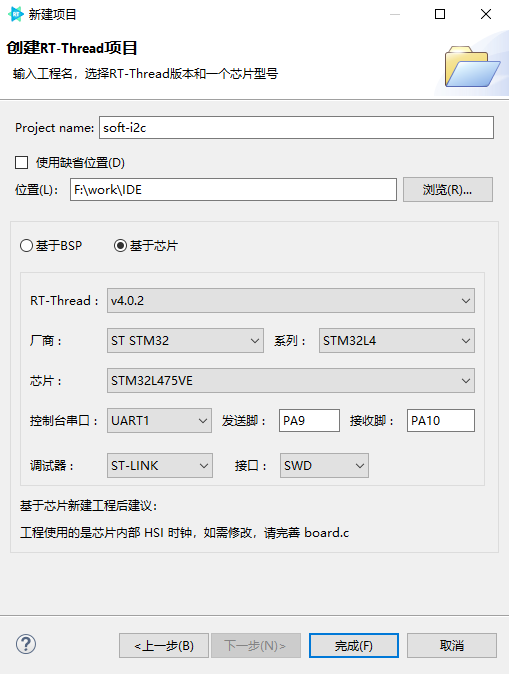
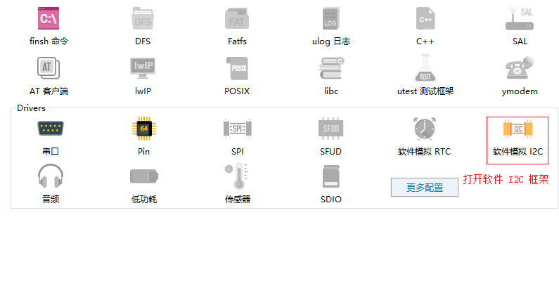
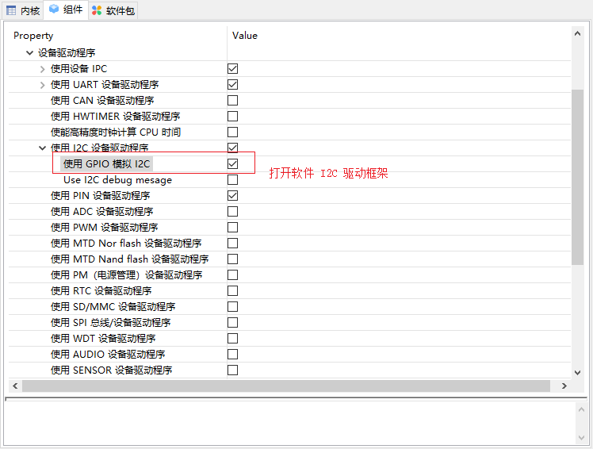
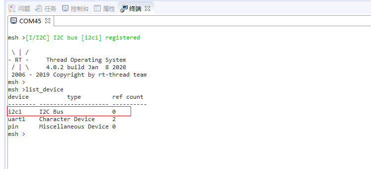

# 基于 RT-Thread Studio 的软件 I2C 驱动开发文档

## 简介

I2C 总线是 PHILIPS 公司开发的一种半双工、双向二线制同步串行总线。I2C 总线传输数据时只需两根信号线，一根是双向数据线 SDA，另一根是双向时钟线 SCL。

I2C 总线可以通过芯片上板载的 I2C 外设实现，也可以通过 GPIO 引脚模拟 I2C 总线协议来实现。

硬件 I2C 对应芯片上的 I2C 外设，由相应的 I2C 控制器和驱动电路组成，其所使用的引脚也是专用的。软件 I2C 使用的是普通的 GPIO 引脚，用软件控制 GPIO 管脚状态来模拟 I2C 通信波形。所以软件 I2C 不受管脚限制，接口也比较灵活。

RT-Thread 的 I2C 设备驱动框架即支持硬件 I2C 也支持软件模拟 I2C。本文将基于 `stm32l475-atk-pandora` 开发板就软件 I2C 的驱动开发展开讲解。

软件 I2C 的配置步骤总结如下：

- 新建 RT-Thread 完整版项目

- 打开软件 I2C 设备驱动框架

- 定义软件 I2C 总线相关端口和引脚的宏

- 使用 I2C 总线

更多软件 I2C 的配置及添加步骤也可以参考相应工程文件 `board.h` 中对软件模拟 I2C 部分的描述。


## 新建 RT-Thread 项目

使用 RT-Thread Studio 新建基于 v4.0.2 的工程，界面如下图所示



配置过程可总结为以下步骤：

- 定义自己的工程名及工程生成文件的存放路径

- 选择 `基于芯片` 创建工程，选择的 RT-Thread 版本为 v4.0.2

- 选择厂商及芯片型号

- 配置串口信息

- 配置调试器信息

工程配置完成后点击下方的 `完成` 按钮即可创建 RT-Thread 的工程。

## 打开 I2C 设备驱动框架

在 `RT-Thread Setting` 文件中借助图形化配置工具打开软件 I2C 的驱动框架，如下图所示



左键单击即可开启 `软件模拟 I2C`(组件开启，相应的图标会高亮)，在该选项上右键，可以查看软件模拟 I2C 的 `详细配置`，具体配置如下所示

```c
RT-Thread Setting
----组件
--------设备驱动程序
------------使用 I2C 设备驱动程序
----------------使用 GPIO 模拟 I2C
```

配置结果如下图所示



## 定义软件 I2C 相关的宏

在 board.h 文件中定义软件 I2C 相关的宏

```c
#define BSP_USING_I2C1                         /* 使用 I2C1 总线 */
#define BSP_I2C1_SCL_PIN    GET_PIN(C, 1)      /* SCL -> PC1 */
#define BSP_I2C1_SDA_PIN    GET_PIN(D, 6)      /* SDA -> PD6 */
```

上述 I2C 总线相关的宏表示 I2C1 总线的 SCL 时钟线连接在 PC1 引脚，SDA 数据线连接在 PD6 引脚。如果需要使用多个 I2C 总线，相关的宏定义参考 board.h 文件中 I2C1 的宏进行定义即可

## I2C 总线的使用

编译并下载程序在终端中输入 `list_device` 测试命令可以看到 i2c1 已经成功注册到系统中了，如下图所示



更多 I2C 总线的应用请参考 [I2C 总线设备应用示例](https://www.rt-thread.org/document/site/programming-manual/device/i2c/i2c/#i2c_4)


## 注意事项

- STM32 软件 I2C 的驱动依赖于 PIN 设备驱动。
