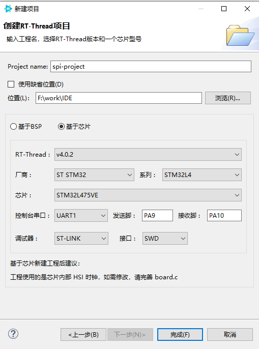
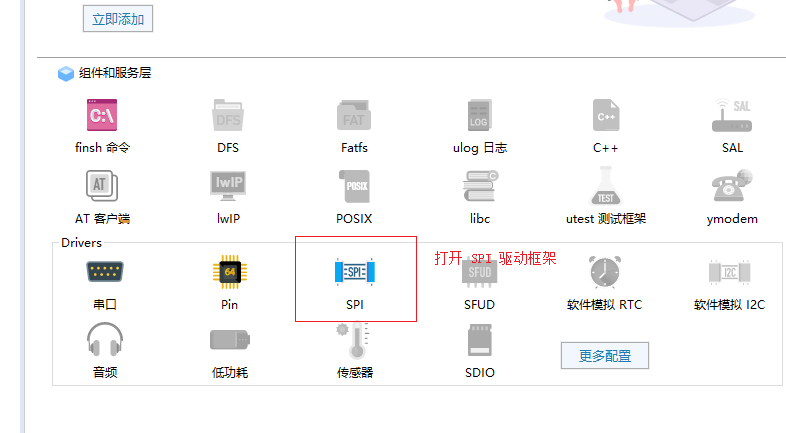
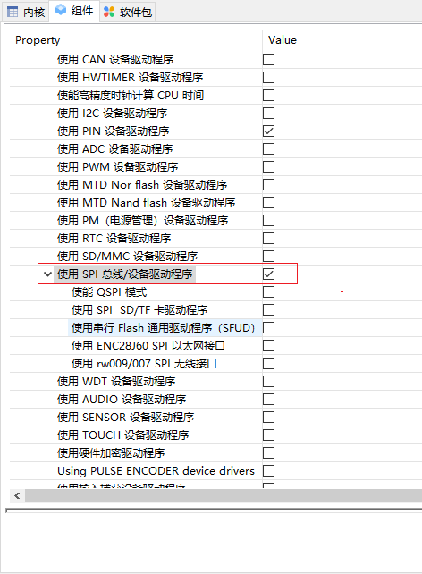
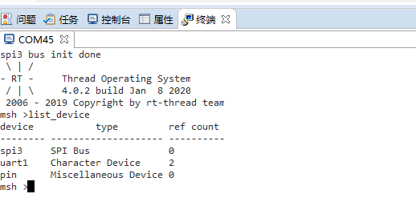

# 基于 RT-Thread Studio 的 SPI 驱动开发文档

## 简介

SPI 是一种高速、全双工、同步串行通信总线，常用于 MCU 与数字芯片之间的短距离通讯。RT-Thread 的 SFUD 组件，RW007 WIFI 模块均使用到了 SPI 驱动。下面将基于 `stm32l475-atk-pandora` 开发板，讲解基于 RT-Thread Studio 开发 SPI 驱动。

SPI 设备驱动的开发可总结为如下：

- 新建 RT-Thread 完整版项目

- 打开 SPI 设备驱动框架

- 定义 SPI 总线相关的宏

- 打开 HAL 库函数对 SPI 总线的支持

- 复制 SPI 引脚初始化函数到工程

更多 SPI 总线的配置及添加步骤也可以参考相应工程文件 `board.h` 中对 SPI 总线部分的描述。

## 新建 RT-Thread 项目

使用 RT-Thread Studio 新建基于 v4.0.2 的工程，界面如下图所示



配置过程可总结为以下步骤：

- 定义自己的工程名及工程生成文件的存放路径

- 选择 `基于芯片` 创建工程，选择的 RT-Thread 版本为 v4.0.2

- 选择厂商及芯片型号

- 配置串口信息

- 配置调试器信息

工程配置完成后点击下方的 `完成` 按钮即可创建 RT-Thread 的工程。

## 打开 SPI 设备驱动框架

在 `RT-Thread Setting` 文件中借助图形化配置工具打开软件 SPI 的驱动框架，如下图所示



左键单击即可开启 `SPI` 驱动框架(组件开启，相应的图标会高亮)，在该选项上右键，可查看 SPI 的 `详细配置`，具体配置路径如下所示

```c
RT-Thread Setting
----组件
--------设备驱动程序
------------使用 SPI 总线/设备驱动程序
```

配置结果如下图所示



## 定义 SPI 总线相关的宏

在 board.h 文件中定义 SPI 总线相关的宏，本例中使用 SPI3 总线，只需定义如下宏即可

```c
#define BSP_USING_SPI3
```

## 打开 HAL 库对 SPI 的支持

在 stm32xxxx_hal_config.h 文件中打开对 SPI 的支持,也就是取消掉 HAL_SPI_MODULE_ENABLED 这个宏定义的注释，如下所示：
```c
#define HAL_SPI_MODULE_ENABLED
```

## 初始化引脚和时钟

定义了 `BSP_USING_SPI3` 宏之后，`drv_spi.c` 文件就会参与编译，该文件只是配置了 SPI 的工作方式和传输函数，具体 SPI 外设的时钟和引脚的初始化需要借助 `STM32CubeMx` 生成的代码。

例如 `stm32l475-atk-pandora` 开发板的 `SPI3` 外设连接了一个 `LCD` 屏幕，所以需要将 CubeMx 生成的 `SPI3` 的初始化代码(一般在 `stm32_xxxx_hal_msp.c` 文件中)复制到自己工程的 `board.c` 文件的末尾，使之参与编译，如下所示

```c
void HAL_SPI_MspInit(SPI_HandleTypeDef* hspi)
{
    GPIO_InitTypeDef GPIO_InitStruct = {0};
    if(hspi->Instance == SPI3)
    {
        /* USER CODE BEGIN SPI3_MspInit 0 */

        /* USER CODE END SPI3_MspInit 0 */
        /* Peripheral clock enable */
        __HAL_RCC_SPI3_CLK_ENABLE();

        __HAL_RCC_GPIOC_CLK_ENABLE();
        __HAL_RCC_GPIOB_CLK_ENABLE();
        /**SPI3 GPIO Configuration
        PC11     ------> SPI3_MISO
        PB3 (JTDO-TRACESWO)     ------> SPI3_SCK
        PB5     ------> SPI3_MOSI
        */
        GPIO_InitStruct.Pin = GPIO_PIN_11;
        GPIO_InitStruct.Mode = GPIO_MODE_AF_PP;
        GPIO_InitStruct.Pull = GPIO_NOPULL;
        GPIO_InitStruct.Speed = GPIO_SPEED_FREQ_VERY_HIGH;
        GPIO_InitStruct.Alternate = GPIO_AF6_SPI3;
        HAL_GPIO_Init(GPIOC, &GPIO_InitStruct);

        GPIO_InitStruct.Pin = GPIO_PIN_3 | GPIO_PIN_5;
        GPIO_InitStruct.Mode = GPIO_MODE_AF_PP;
        GPIO_InitStruct.Pull = GPIO_NOPULL;
        GPIO_InitStruct.Speed = GPIO_SPEED_FREQ_VERY_HIGH;
        GPIO_InitStruct.Alternate = GPIO_AF6_SPI3;
        HAL_GPIO_Init(GPIOB, &GPIO_InitStruct);

        /* USER CODE BEGIN SPI3_MspInit 1 */

        /* USER CODE END SPI3_MspInit 1 */
    }
}
```

如果需要注册更多的 SPI 总线设备，只需参考 `board.h` 文件中 SPI 相关的宏定义并拷贝引脚初始化函数即可。

## SPI 总线的使用

编译并下载程序输入 `list_device` 测试命令可以看到 SPI 总线设备已经成功注册到系统中了，如下图所示



> 提示：这里只是注册了一个 SPI 总线设备，SPI 从设备的挂载请参考 [挂载 SPI 从设备](https://www.rt-thread.org/document/site/programming-manual/device/spi/spi/#spi_2)

更多关于 SPI 总线的使用请参考 [SPI 总线设备](https://www.rt-thread.org/document/site/programming-manual/device/spi/spi/)。
