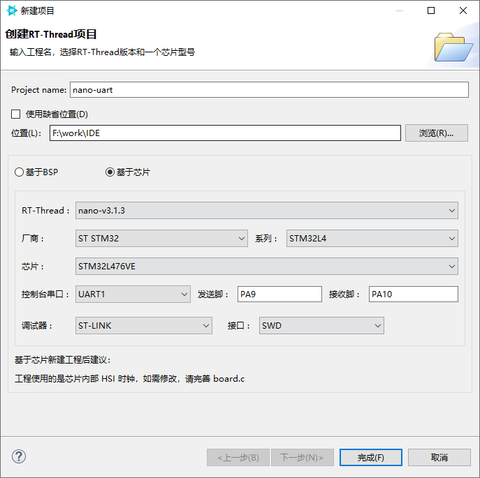
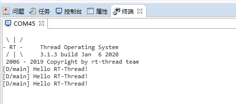
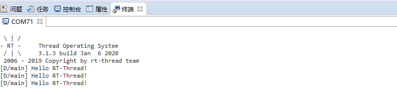

# 基于 RT-Thread Studio 的串口驱动开发文档

## 简介

使用 RT-Thread Studio 新建基于 RT-Thread 的项目时，串口驱动已经自动添加到工程中，不需要用户手动添加和串口驱动相关的源码，用户可以很方便的使用串口进行输入输出。同时，基于 Studio 的图形化配置界面，更改串口的配置也更加简洁，用户不需要更改和驱动相关的源代码，只需要更改或新增相关的宏即可，下面将基于 `stm32l475-atk-pandora` 开发板就 RT-Thread 的 nano 版和完整版分别展开讲解。完整版串口驱动开发文档参见 [完整版串口驱动开发](../v4.0.2/rtthread-studio-uart-v4.0.2.md)。

## RT-Thread nano 版串口的驱动开发

nano 版串口驱动的使用主要用于控制台的输入与输出。

### 配置默认串口

使用 RT-Thread Studio 新建基于 nano 的工程，界面如下图所示



配置过程可总结为以下步骤：

- 定义自己的工程名及工程生成文件的存放路径

- 选择 `基于芯片` 创建工程，并选择 RT-Thread 的版本为 nano 版

- 选择厂商及芯片型号

- 配置串口信息

- 配置调试器信息

工程配置完成后点击下方的`完成`按钮即可创建 RT-Thread 的工程。在 RT-Thread 工程的 main.c 文件中会自动生成如下代码:

```c
int main(void)
{
    int count = 1;

    while (count++)
    {
        LOG_D("Hello RT-Thread!");
        rt_thread_mdelay(1000);
    }

    return RT_EOK;
}
```

编译并下载工程后，打开串口 Studio 自带的串口工具即可看到串口输出的打印信息，如下所示



从串口输出的信息中可以看到我们已经成功使用串口输出了打印信息。


### 修改默认串口

上节中基于 Studio 的图形化界面成功配置了串口的输出，但是一些实际的应用的可能需要使用其他串口输出信息，这种情况则可以通过修改一些宏定义实现。

#### 修改 `board.h` 宏

演示所用的开发板 `stm32l475-atk-pandora` 默认使用 UART1 进行输出，若要改为 UART2(`TX->PA2`、`RX->PA3`)进行输出，，则将 `board.h` 中串口 1 的 5 个宏

```c
#define BSP_USING_UART1
#define BSP_UART1_TX_PIN       "PA9"
#define BSP_UART1_RX_PIN       "PA10"
```

修改为串口 2 的以下宏
```c
#define BSP_USING_UART2
#define BSP_UART2_TX_PIN       "PA2"
#define BSP_UART2_RX_PIN       "PA3"
```

宏定义的修改主要分为三个方面

- 修改串口对应的宏定义，如 `BSP_USING_UART1`、`BSP_USING_UART2`等。

- 修改串口 `TX/RX` 所使用的端口，如 `"PA2"`、`"PA3"`等。


#### 使用更改后的串口输出

board.h 中的宏修改完成之后，编译、下载。使用 USB 转串口线连接好 PA2、和 PA3 的引脚，并打开 Studio 中自带的串口工具，串口输出的 log 如下所示



从输出的信息可以看出控制台切换到串口 2 后成功进行了输出。

## 常见问题

### Q：如何给 Nano 添加 Finsh？

A： 参考 [基于 Nano 添加 Finsh 章节](https://www.rt-thread.org/document/site/tutorial/nano/nano-port-studio/an0047-nano-port-studio/#nano-finsh)。
