# 基于 RT-Thread Studio 的串口驱动开发文档

## RT-Thread 完整版串口的驱动开发

与 nano 版串口不同的是，完整版的串口基于设备驱动框架，使用完整版的串口可以使用 RT-Thread 丰富的组件及软件包。如 AT 组件，modbus 软件包等

### 配置默认串口

使用 RT-Thread Studio 新建基于 v4.0.2 的工程，界面如下图所示

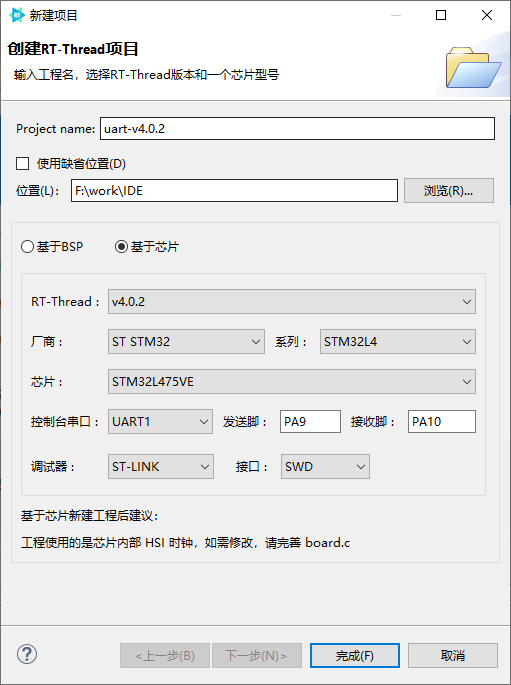

配置过程可总结为以下步骤：

- 定义自己的工程名及工程生成文件的存放路径

- 选择`基于芯片` 创建工程，选择的 RT-Thread 版本为 v4.0.2

- 选择厂商及芯片型号

- 配置串口信息

- 配置调试器信息

工程配置完成后点击下方的`完成`按钮即可创建 RT-Thread 的工程。在 RT-Thread 工程的 main.c 文件中会自动生成如下代码:

```c
/* PLEASE DEFINE the LED0 pin for your board, such as: PA5 */
#define LED0_PIN    GET_PIN(A, 5)

int main(void)
{
    int count = 1;
    /* set LED0 pin mode to output */
    rt_pin_mode(LED0_PIN, PIN_MODE_OUTPUT);

    while (count++)
    {
        /* set LED0 pin level to high or low */
        rt_pin_write(LED0_PIN, count % 2);
        LOG_D("Hello RT-Thread!");
        rt_thread_mdelay(1000);
    }

    return RT_EOK;
}
```

代码中会每间隔 1000 ms 在控制台中打印 `Hello RT-Thread!` 。编译并下载工程后，打开串口 Studio 自带的串口工具即可看到串口输出的打印信息，如下所示

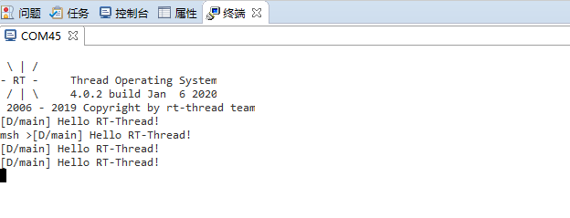

从串口输出的信息中可以看到我们已经成功使用串口输出了打印信息。

在控制台中输入 `list_device` 可以看到 `uart1` 设备已经成功注册到系统中，如下图所示

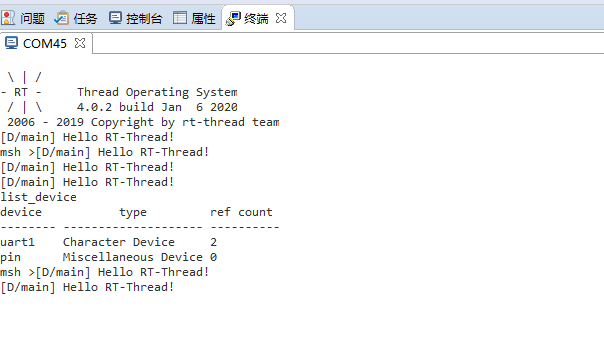

### 修改默认串口

上节中基于 Studio 的图形化界面成功配置了串口的输出，但是一些实际的应用的可能需要使用其他串口输出信息，这种情况则可以通过修改一些宏定义及 RT-Thread Setting 文件来实现。

#### 修改 `board.h` 宏

演示所用的开发板 `stm32l475-atk-pandora` 默认使用 UART1 进行输出，若要修改为串口 2 (`TX->PA2`、`RX->PA3`)进行输出，则在 board.h 中定义宏 `BSP_USING_UART2`，并将串口 2 对应的引脚信息修改为实际所使用的引脚，如下所示

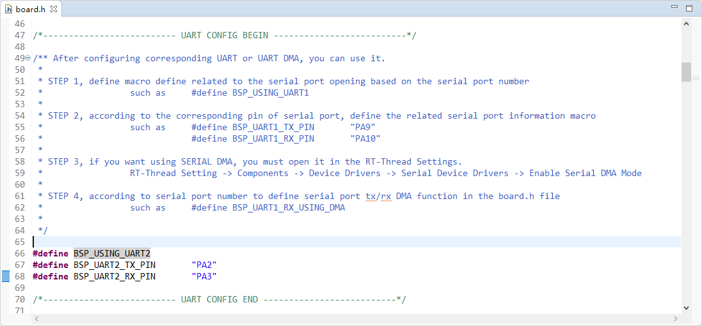

宏定义的修改主要分为三个方面

- 修改串口对应的宏定义，如 `BSP_USING_UART1`、`BSP_USING_UART2`等。

- 修改串口 `TX/RX` 所使用的端口，如 `"PA2"`、`"PA3"`等。


#### 修改 `RT-Thread Setting` 文件

在 RT-Thread Setting 文件中修改输出控制台的串口设备名称，修改路径如下：
```c
RT-Thread Setting
----内核
--------RT-Thread 内核
------------内核设备对象
----------------为 rt_kprintf 使用控制台
--------------------控制设备台的名称
```

配置如下图所示

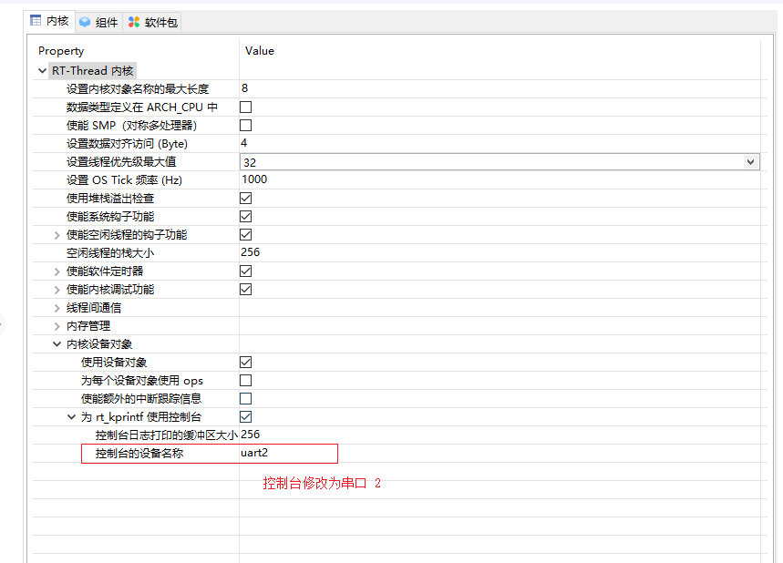

保存工程配置并编译、下载，串口输出如下图所示

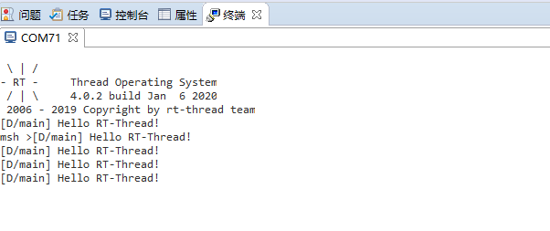

输入 `list_device` 命令可查看已注册的设备，如下图所示

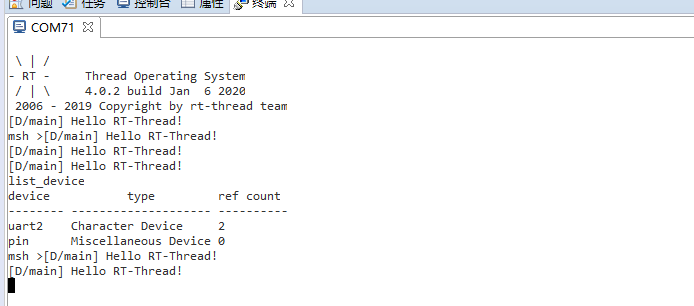

从终端打印的信息可以看到控制台的串口设备已经成功的从串口 1 更换到了串口 2。

### 新增串口

新增串口只需要在 `board.h` 文件中定义相关串口的宏定义 `BSP_USING_UARTx` 及修改引脚信息即可

新增串口的步骤总结如下

- 新增对应串口的宏定义，如 BSP_USING_UART1、BSP_USING_UART2等。

- 修改串口 `TX/RX` 所使用的端口，如 `"PA9"`、`"PA10"`等。


基于修改控制台章节新增串口 1 的示例如下

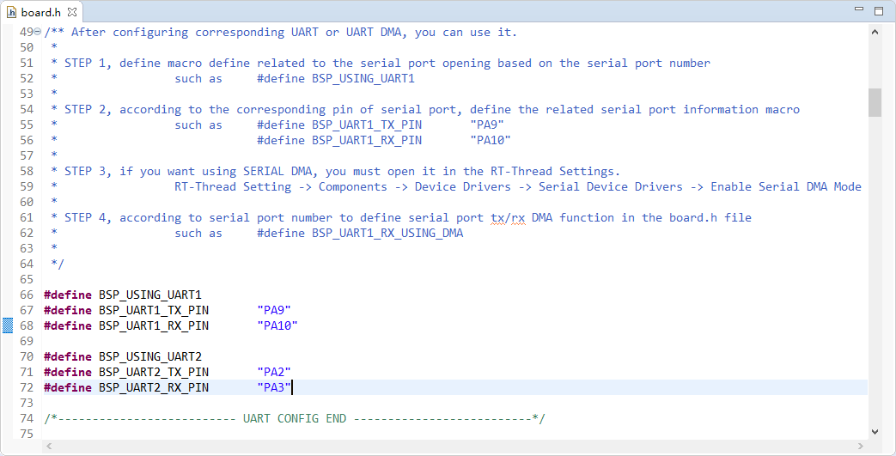

编译并下载程序，在控制台输入 `list_device` 命令可以看到已经注册了两个串口设备，串口 1 和串口 2。如下图所示

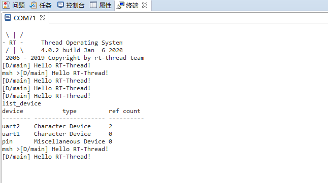

从控制台输出的信息可以看到两个串口设备均已注册到系统中了。


### 串口 DMA 的使用

#### RT-Thread Setting 配置 DMA

如果要使用串口 DMA 的功能，需要使用 RT-Thread Setting 打开 DMA 的支持。配置路径为

```c
RT-Thread Setting
----组件
--------设备驱动程序
------------使用 UART 设备驱动程序
----------------使能串口 DMA 模式。
```

配置过程如下图所示

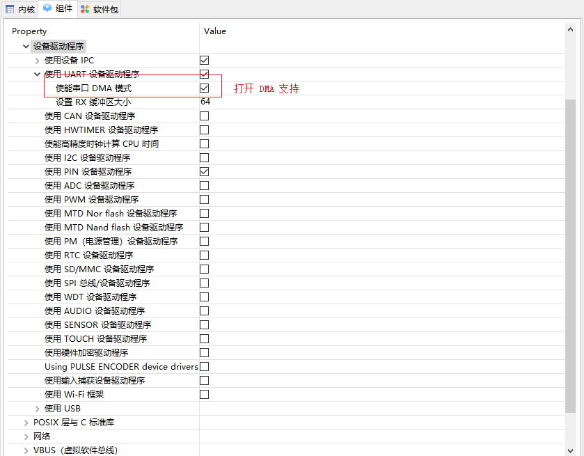

#### 配置 `board.h` 中的宏

如果需要使用串口 DMA 只需要在 `board.h` 文件中定义如下宏即可

```c
#define BSP_UARTx_RX_USING_DMA
#define BSP_UARTx_TX_USING_DMA
```

- `UARTx` 表示的是哪个串口需要使用 DMA，使用的是 DMA 的发送还是接收功能。此例中使用的是串口 2 的 DMA 接收功能，所以定义了宏 `BSP_UART2_RX_USING_DMA`，串口 2 使用 DMA 的配置如下所示

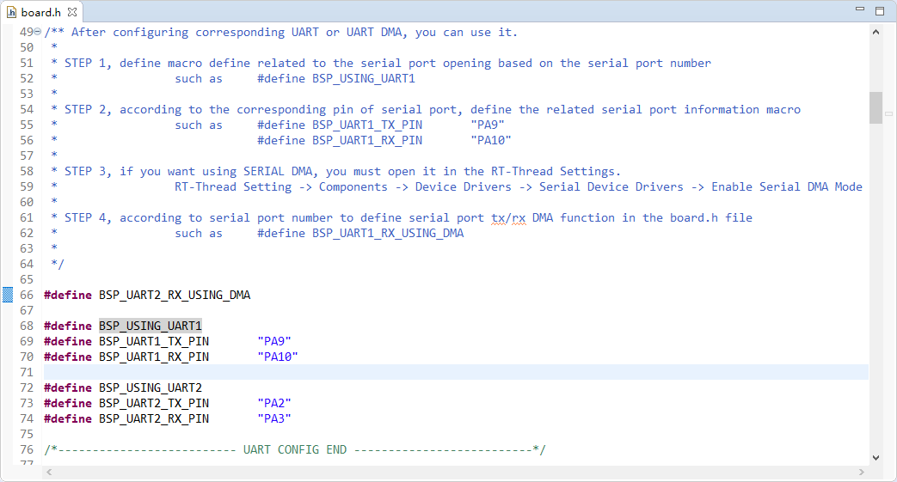

将 [DMA 接收及轮询发送](https://www.rt-thread.org/document/site/programming-manual/device/uart/uart/#dma) 章节中的DMA 的测试代码添加到工程中

编译并下载程序，在控制台中输入 `uart_dma_sample` 命令，并使用 USB 转串口线连接串口 2，在串口 2 中可以看到如下打印信息

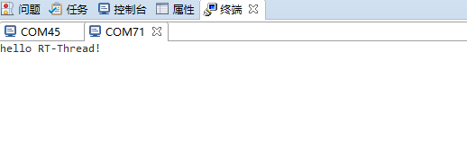

测试程序已经成功使用 DMA 进行了接收。

更多关于串口的使用请查看 [UART设备](https://www.rt-thread.org/document/site/programming-manual/device/uart/uart/)
