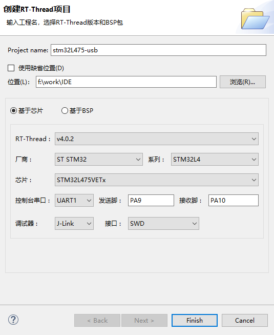
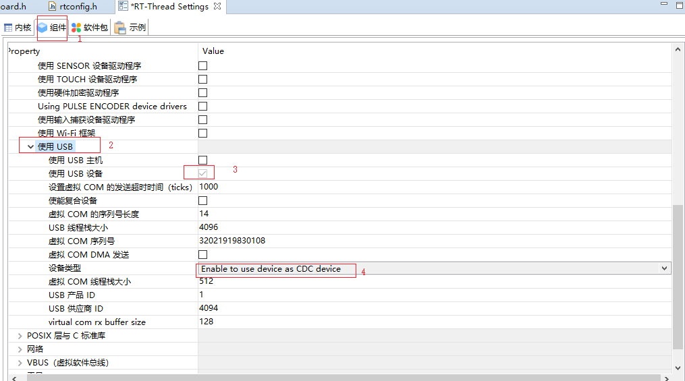
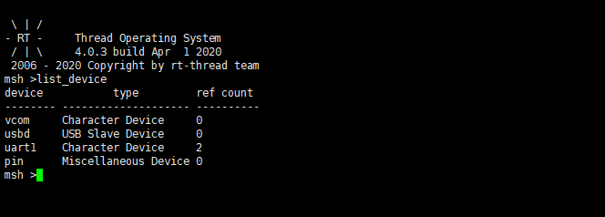
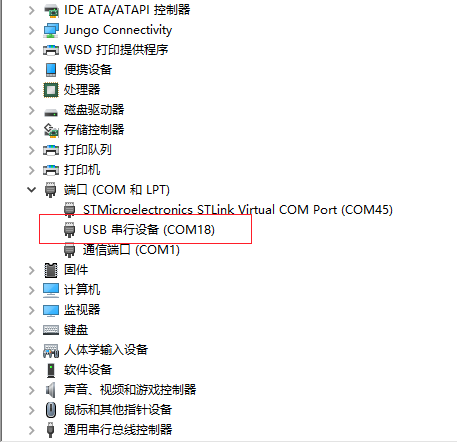

# 基于 RT-Thread Studio 的 USB Device 驱动开发文档


## 简介

`USB` 即 `Universal Serial Bus` 是一种支持热插拔的通用串行总线，在 `USB` 体系中又分为 `USB Host` 和 `USB Device`。本文将基于 `stm32l475-atk-pandora` 开发板，讲解基于 `RT-Thread Studio` 开发 `USB Device` 驱动。

`USB Device` 设备驱动的开发可总结为如下几个步骤：

- 新建 `RT-Thread` 完整版项目

- 打开 `USB Device` 设备驱动框架，并配置相关的子类

- `board.h`中定义 `USB Device` 相关的宏

- `board.c` 中初始化 `USB Device` 的引脚及外设时钟

- `stm32xxxx_hal_config.h` 中打开 `HAL` 库函数对 `USB Device` 的支持


更多关于`USB Device` 的配置及添加步骤也可以参考相应工程文件 `board.h` 中对 `USB Device` 部分的描述。

## 新建 RT-Thread 项目

使用 `RT-Thread Studio` 新建基于 `v4.0.2` 的工程，界面如下图所示：



配置过程可总结为以下步骤：

- 定义自己的工程名及工程生成文件的存放路径

- 选择 `基于芯片` 创建工程，选择的 `RT-Thread` 版本为 `v4.0.2`

- 选择厂商及芯片型号

- 配置串口信息

- 配置调试器信息

工程配置完成后点击下方的 `Finish` 按钮即可创建 `RT-Thread` 的工程。

## 打开 USB Device 设备驱动框架

在 `RT-Thread Settings` 文件中配置 `USB Device` ，配置路径如下：

```c
组件
---- 设备驱动程序
--------使用 USB
------------使用 USB 设备
----------------选择设备类型
```

本例中将 `USB Device` 配置为一个 `CDC` 的子类—虚拟串口，配置图如下所示：



虚拟串口的属性等信息这里选择默认并未做任何修改，实际使用过程中按照需要修改即可。

## 定义 USB Device 宏

定位到工程文件 `board.h` 中关于 `USB Device` 的配置说明部分，按照注释部分的说明定义 `BSP_USING_USBDEVICE` 的宏，如下所示：

```c
#define BSP_USING_USBDEVICE
```

## 初始化引脚和时钟

定义了 `BSP_USING_USBDEVICE` 宏之后，`drv_usbd.c` 文件就会参与编译，该文件只是配置了 `USB Device` 的工作方式和传输函数等，具体 `USB Device` 引脚和时钟的初始化需要借助 `STM32CubeMx` 生成的代码。

将 `STM32CubeMx` 工具生成的 `USB Device` 引脚和时钟初始化代码(一般在 `stm32_xxxx_hal_msp.c` 文件中)复制到自己工程的 `board.c` 文件的末尾，使之参与编译，如下所示：

```c
void HAL_PCD_MspInit(PCD_HandleTypeDef* hpcd)
{
  GPIO_InitTypeDef GPIO_InitStruct = {0};
  if(hpcd->Instance==USB_OTG_FS)
  {
  /* USER CODE BEGIN USB_OTG_FS_MspInit 0 */

  /* USER CODE END USB_OTG_FS_MspInit 0 */

    __HAL_RCC_GPIOA_CLK_ENABLE();
    /**USB_OTG_FS GPIO Configuration
    PA11     ------> USB_OTG_FS_DM
    PA12     ------> USB_OTG_FS_DP
    */
    GPIO_InitStruct.Pin = GPIO_PIN_11|GPIO_PIN_12;
    GPIO_InitStruct.Mode = GPIO_MODE_AF_PP;
    GPIO_InitStruct.Pull = GPIO_NOPULL;
    GPIO_InitStruct.Speed = GPIO_SPEED_FREQ_VERY_HIGH;
    GPIO_InitStruct.Alternate = GPIO_AF10_OTG_FS;
    HAL_GPIO_Init(GPIOA, &GPIO_InitStruct);

    /* Peripheral clock enable */
    __HAL_RCC_USB_OTG_FS_CLK_ENABLE();

    /* Enable VDDUSB */
    if(__HAL_RCC_PWR_IS_CLK_DISABLED())
    {
      __HAL_RCC_PWR_CLK_ENABLE();
      HAL_PWREx_EnableVddUSB();
      __HAL_RCC_PWR_CLK_DISABLE();
    }
    else
    {
      HAL_PWREx_EnableVddUSB();
    }
    /* USB_OTG_FS interrupt Init */
    HAL_NVIC_SetPriority(OTG_FS_IRQn, 0, 0);
    HAL_NVIC_EnableIRQ(OTG_FS_IRQn);
  /* USER CODE BEGIN USB_OTG_FS_MspInit 1 */

  /* USER CODE END USB_OTG_FS_MspInit 1 */
  }
}
```

## 配置 USB 外设时钟

使用 `RT-Thread Studio` 自动生成工程的时候，在 `board.c` 文件中的系统时钟初始化函数 `SystemClock_Config` 中，有些外设的时钟是默认没有开启的。当需要使用这些外设的时候，同样需要借助 `STM32CubeMX` 工具生成的代码来初始化外设时钟。

本例中需要使用到 `USB` 这个外设，使用  `STM32CubeMX` 工具配置好系统时钟以后将工程 `board.c` 文件中的 `SystemClock_Config` 函数替换为自己使用 `STM32CubeMX` 工具生成的函数，如下所示：

```c
void SystemClock_Config(void)
{
  RCC_OscInitTypeDef RCC_OscInitStruct = {0};
  RCC_ClkInitTypeDef RCC_ClkInitStruct = {0};
  RCC_PeriphCLKInitTypeDef PeriphClkInit = {0};

  /** Configure LSE Drive Capability
  */
  HAL_PWR_EnableBkUpAccess();
  __HAL_RCC_LSEDRIVE_CONFIG(RCC_LSEDRIVE_LOW);
  /** Initializes the CPU, AHB and APB busses clocks
  */
  RCC_OscInitStruct.OscillatorType = RCC_OSCILLATORTYPE_LSI|RCC_OSCILLATORTYPE_HSE
                              |RCC_OSCILLATORTYPE_LSE;
  RCC_OscInitStruct.HSEState = RCC_HSE_ON;
  RCC_OscInitStruct.LSEState = RCC_LSE_ON;
  RCC_OscInitStruct.LSIState = RCC_LSI_ON;
  RCC_OscInitStruct.PLL.PLLState = RCC_PLL_ON;
  RCC_OscInitStruct.PLL.PLLSource = RCC_PLLSOURCE_HSE;
  RCC_OscInitStruct.PLL.PLLM = 1;
  RCC_OscInitStruct.PLL.PLLN = 20;
  RCC_OscInitStruct.PLL.PLLP = RCC_PLLP_DIV7;
  RCC_OscInitStruct.PLL.PLLQ = RCC_PLLQ_DIV2;
  RCC_OscInitStruct.PLL.PLLR = RCC_PLLR_DIV2;
  if (HAL_RCC_OscConfig(&RCC_OscInitStruct) != HAL_OK)
  {
    Error_Handler();
  }
  /** Initializes the CPU, AHB and APB busses clocks
  */
  RCC_ClkInitStruct.ClockType = RCC_CLOCKTYPE_HCLK|RCC_CLOCKTYPE_SYSCLK
                              |RCC_CLOCKTYPE_PCLK1|RCC_CLOCKTYPE_PCLK2;
  RCC_ClkInitStruct.SYSCLKSource = RCC_SYSCLKSOURCE_PLLCLK;
  RCC_ClkInitStruct.AHBCLKDivider = RCC_SYSCLK_DIV1;
  RCC_ClkInitStruct.APB1CLKDivider = RCC_HCLK_DIV1;
  RCC_ClkInitStruct.APB2CLKDivider = RCC_HCLK_DIV1;

  if (HAL_RCC_ClockConfig(&RCC_ClkInitStruct, FLASH_LATENCY_4) != HAL_OK)
  {
    Error_Handler();
  }
  PeriphClkInit.PeriphClockSelection = RCC_PERIPHCLK_RTC|RCC_PERIPHCLK_USART1
                              |RCC_PERIPHCLK_USART2|RCC_PERIPHCLK_USB
                              |RCC_PERIPHCLK_ADC;
  PeriphClkInit.Usart1ClockSelection = RCC_USART1CLKSOURCE_PCLK2;
  PeriphClkInit.Usart2ClockSelection = RCC_USART2CLKSOURCE_PCLK1;
  PeriphClkInit.AdcClockSelection = RCC_ADCCLKSOURCE_PLLSAI1;
  PeriphClkInit.RTCClockSelection = RCC_RTCCLKSOURCE_LSE;
  PeriphClkInit.UsbClockSelection = RCC_USBCLKSOURCE_PLLSAI1;
  PeriphClkInit.PLLSAI1.PLLSAI1Source = RCC_PLLSOURCE_HSE;
  PeriphClkInit.PLLSAI1.PLLSAI1M = 1;
  PeriphClkInit.PLLSAI1.PLLSAI1N = 12;
  PeriphClkInit.PLLSAI1.PLLSAI1P = RCC_PLLP_DIV7;
  PeriphClkInit.PLLSAI1.PLLSAI1Q = RCC_PLLQ_DIV2;
  PeriphClkInit.PLLSAI1.PLLSAI1R = RCC_PLLR_DIV2;
  PeriphClkInit.PLLSAI1.PLLSAI1ClockOut = RCC_PLLSAI1_48M2CLK|RCC_PLLSAI1_ADC1CLK;
  if (HAL_RCCEx_PeriphCLKConfig(&PeriphClkInit) != HAL_OK)
  {
    Error_Handler();
  }
  /** Configure the main internal regulator output voltage
  */
  if (HAL_PWREx_ControlVoltageScaling(PWR_REGULATOR_VOLTAGE_SCALE1) != HAL_OK)
  {
    Error_Handler();
  }
}
```

## 打开 HAL 库对 USB Device 的支持

在 `stm32_xxxx_hal_config.h` 文件中打开对 `USB Device` 的支持，也就是取消掉 `HAL_PCD_MODULE_ENABLED` 这个宏定义的注释，如下所示：
```c
#define HAL_PCD_MODULE_ENABLED
```

## 使用

上述步骤配置完成以后，编译下载程序，在终端中输入 `list_device` 命令，结果如下：



从终端中输出的结果可以看到 `USB Device` 设备和虚拟串口设备已经成功注册到系统中了。

在 `Windows` 上打开设备管理器，并将开发板上的 `USB Device` 接口通过数据线连接到电脑，在电脑的设备管理器中可以看到下图：



从上图可以看到电脑已经成功的枚举了上面配置的虚拟串口设备。


