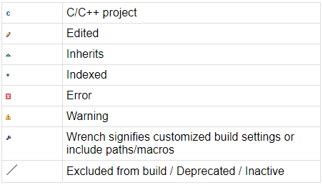
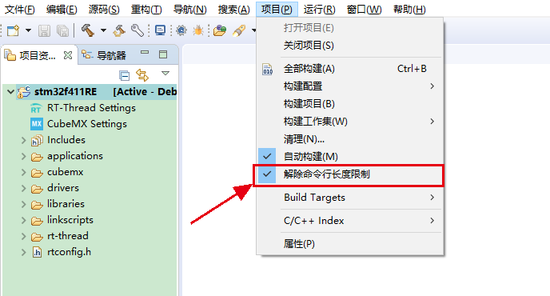
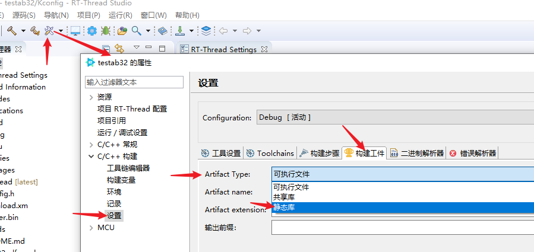
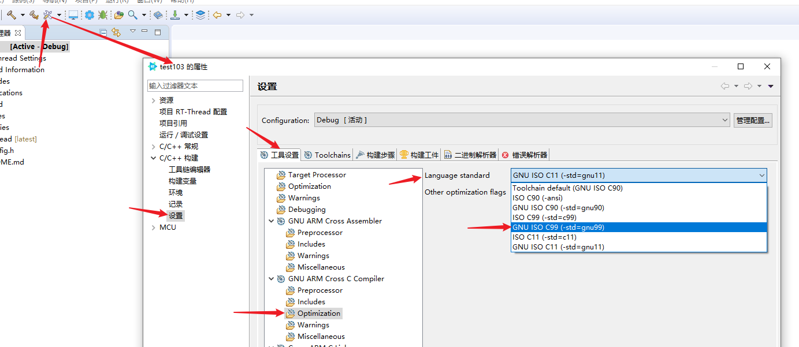

# 常见问题

## Git管理Studio工程哪些文件能忽略哪些不能

.gitignore用来描述不被git添加到版本管理中的文件，RT-Thread studio的工程中大概有如下几类文件可以不被包括到版本管理中  

1. 工程编译过程中产生的文件，如.elf、.bin、.hex、.map、.o，Debug 目录下以及 build 目录下的文件等  
2. 与当前工程不相关的工程配置文件，如.vscode目录下的文件，.uvguix*等  

RT-Thread studio 工程哪些重要的文件不能忽略呢？  

1. 工程根目录下的 .settings 文件夹下文件是比较重要的，该文件夹下除.rtmenus文件可以忽略外，其它文件都建议纳入git管理，避免copy，传递工程时漏掉文件造成导入后各种异常  

## 如何添加文件到工程

可以直接通过复制粘贴往RT-Thread Studio工程里添加文件，甚至可以直接可以往工程里复制粘贴整个文件夹，也可以通过右键新建向导选择新建文件夹，新建C源码文件或H头文件，如果添加文件后构建提示文件找不到，请到工程构建配置里将添加的文件添加Include包含头文件路径

## 如何创建虚拟文件夹，链接文件夹或链接文件

虚拟文件夹，即磁盘上实际不存在的文件夹，在 '项目资源管理器' 里创建一个虚拟文件夹，窗口会显示一个虚拟文件夹图标，代表一个虚拟文件夹，这个虚拟文件夹不对应任何磁盘实际的文件夹，虚拟文件夹下面只能创建链接文件夹或者链接文件，链接文件夹或者链接文件是通过链接的形式将磁盘上非工程目录下的文件夹或者文件引入工程的一个方法，创建虚拟文件夹，链接文件件或者链接文件的方法如下：  

  

## 如何理解项目资源管理器里的一些图标含义  
如果你的工程是用git进行版本控制管理，工程里会有各种图标装饰，他们的含义如下  
  

其它图标的含义如下：  
  

其它一些装饰性小图标的含义如下：  
  

## 如何让源码显示行号

在源码编辑窗口的左边栏上右键，选择`显示行号`，即可显示行号，如下图所示：

## 串口出现丢失字符怎么办

排除程序的原因外，串口线的质量，波特率是否设置过高都是需要考虑的因素，可以尝试换个串口线，或者将波特率调低点试试。

## 删除工程的时候删不掉怎么办

由于工程里可能有 git 文件被 git 程序占用造成工程有时删除部分后失败，提示占用问题，可以试试删除工程先前先关闭工程，等待一会后再删除，或者删除失败后，通过重启菜单重启一下 RT-Thread Studio 就可以正常删除了，重新启动菜单入口（菜单栏文件菜单内）和关闭项目（项目上右键菜单内）入口如下图所示：

## 用户是否可以修改 rt-thread 及 packages 目录下的文件及配置

不可以。rt-thread 及 packages 目录下的文件统一使用 RT-Thread Setting 文件来管理和配置，当需要这两个目录下的相关文件参与编译时，应该在 RT-Thread Setting 文件中来打开相关功能。

例如用户想让当前 rt-thread 目录下的 dfs 参与编译，如下图所示

用户不能直接修改文件属性让 dfs 文件参与编译，而是通过 RT-Thread Setting 文件打开 DFS 的配置，保存配置后 dfs 的配置后，Studio 会自动将 dfs 文件添加到构建文件中，如下图所示

  

## Studio 工程如何使用 Scons 编译  

构建器设置  

- 工程右键 -> 属性 -> C/C++ 构建

- 取消勾选 `默认构建命令`

- 构建命令修改为 `scons.bat`

- 构建目录修改为 `${workspace_loc:/${ProjName}`,  此变量表示 ` 当前工程的根目录`

环境设置  

- 工程右键 -> 属性 -> 环境
- `PATH` 环境变量追加 `${studio_install_path}/platform/env_released/env/tools/Python27/Scripts`, 表示 scons.bat 的目录路径
- `RTT_EXEC_PATH` 修改为 `${toolchain_install_path}/${工具链相对 studio 的路径}/bin`，

  

修改编译参数

- 利用scons编译，如果需要修改编译参数，需要修改rtconfig.py文件，因为scons编译的参数在这个py文件内，打开 '导航器' 窗口，可以找到 rtconfig.py 文件  
  

利用scons管理工程文件  

- 如果修改了scons脚本文件，需要点击工程右键菜单 '同步scons配置至项目' 让scons脚本生效  
  

## Studio 编译结果中 text，data，bss，dec 和 hex 的各个含义是什么

Studio 的编译结果如下图所示

- text：代码段，用来存放代码及一些只读常量，一般是只读的区域

- data：数据段，用来存放全局初始化变量，以及全局或局部静态变量

- bss：BSS 段，用来存放所有未初始化的数据，用 0 来初始化

- dec：是 decimal 即十进制的缩写，是 text，data 和 bss 的算术和
本例中:51344 + 372 + 2808 = 54524

- hex：是 hexadecimal 即十六进制的缩写，本例中：十进制数 54524 对应的十六进制就是 d4fc

- filename：编译生成的目标文件名，本例中即为：rtthread.elf

编译生成的目标文件占用内存的计算方法

程序占用的 FLASH 大小 = text 段的大小 + data 段的大小

程序占用的 RAM 大小 = data 段的大小 + bss 段的大小

## ST-LINK烧写端口被占用怎么办

 当弹出错误对话框提示“TCP Port 61234 not available”时, 打开调试配置修改 ST-LINK端口号即可, 如下图所示：

## 打开RT-thread settings窗口，为什么看不到图标界面

### 1.选择非Nano版本源码

新建工程选择RT-Thread非Nano版本源码即可, Nano是纯净版，没有组件概念

### 2.切换到项目资源管理器视图

如果选择了非Nano版本源码，还看不到RT-thread settings，看看视图是否是`项目资源管理器`视图。如果不是，可以选择`窗口`，点击`显示视图`，选择`项目资源管理器`即可，如下图所示：

## RT-Thread Studio 升级失败

总共分两种情况：

- 如果更新失败提示信息里有 “org.eclipse.equinox.internal.p2.engine.phases.CheckTrust”
RT-Thread Studio 升级前请先关闭科学上网工具，或尝试删除安装目录下的“artifacts.xml”文件重启再试

- 如果更新失败提示信息里有 “No Repository found”或发生下图所示错误，请手动探测更新。在更新页面内，取消勾选 “Group items by category”和“Contact all update sites during install to find required software” 并勾选"Eclipse Platform Launcher Executables",然后尝试安装studio更新，若安装过程中出错，关闭后重试一次即可 。

  

  

  

##  如何打开关闭的项目
右键菜单，`打开项目`即可，如下图所示：

## 创建工程失败 装载 python DLL 出错 怎么办

- 问题描述： Error loading Python DLL `xxx/MEI85262/python36.dll`. LoadLibrary:找不到指定程序

- 解决方法：请手动安装 Visual C++ Redistributable,  [点我下载](https://realthread.cowtransfer.com/s/96d5e5928fc54e)

## 项目资源管理器如何 显示/隐藏 被排除构建的资源

RT-Thread Studio 从 V 1.1.4 版本开始支持`显示/隐藏`被排除构建的资源，如下图所示，这些被排除构建的资源显示为灰色，并且资源图标上有斜杠标志，被排除构建的资源将不会在启动编译时参与编译，Studio 默认隐藏了这些资源。

- 如果想`显示/隐藏`这些资源，请先点击项目资源管理器右上角的倒三角，会展示如下菜单，点击过滤器和定制：

- 在过滤器和定制中，有很多可以选择过滤的资源，`勾选/取消勾选` RTT Excluded Resource ，即可`隐藏/显示`被排除构建的资源。

## 如何解决 studio 编译或者清理时命令行超出 windows 长度限制的问题

### windows 命令行长度限制导致的问题

Windows 下命令行的字符串长度限制为 8191 个字符，在 windows 系统上进行编译或者清理的时候，可能出现以下问题：

- 编译工程链接的时候，若出现如下图所示【 CreateProcess : No such file or directory 】的错误，可能是因为工程文件过多或者目录名过长等原因导致链接时命令行过长，部分 .o 被截断产生的问题。

  

- 在清理 ( Clean ) 工程的时候，当工程过大时，可能会和链接时一样出现 process_begin : CreateProcess 的问题，由于命令 rm 后的参数过长，导致 windows 不能处理此命令。

  

### 在 RT-Thread Studio 中如何解除命令行长度的限制

RT-Thread Studio 为用户提供了一键解决命令行长度限制的方法，此方法仅对编译和清理有效:

- 打开项目菜单，可看见 解除命令行长度限制的 子菜单，点击选中，打勾的情况即为选中了。再次编译或者清理工程，就不会再出现以上问题:

- 如果不想解除命令行限制，只要将上图菜单取消选中即可。

  注：clean2 下的命令前的空格是 Tab ，不能使用空格键

- 重新清理工程

## 添加软件包后在 packages 目录找不到的解决办法

如果在 RT-Thread Settings 添加软件包后，在 packages 目录下找不到软件包或者软件包被排除编译，请尝试以下方法：

- 以 network_samples-v0.3.0 软件包为例：

  - 双击打开 RT-Thread Settings

    

  - 右键不能显示的软件包，打开详细配置

    

  - 为该软件包配置至少配置一个子选项，不然和没勾选的参与编译情况是一样的

    

  - 保存该配置即可

  

##  如何解决第一次启动Studio时登录页面不显示的问题

进入Studio安装目录，打开`studio.ini` 文件，将Dorg.rtthread.studio.browser.systemdefault=false 值修改为Dorg.rtthread.studio.browser.systemdefault=true （该方法仅支持V2.0及以后的版本）

## 如何只编译当前选中的文件

在实际开发中，大家可能有这样一个需求：只编译部分文件，而不是编译整个工程。如果您有这个需求，请按照以下方式来操作：

- 取消自动构建

  选择菜单【项目】，下拉后，大家会看到自动构建的菜单，如果当前是勾选上的，请取消勾选

  

- 选中需要编译的文件

  如果您需要编译以下文件，请按住 Ctrl 依次选中它们，请注意：只能选中可编译的文件，例如：.c、.cpp、.S 等，不可编译的文件例如：目录、.h、.md 请不要选中，这些不可编译的文件一起选中会导致下一个步骤无法进行

  

- 选中以上文件之后，右键点击【构建选择的文件】即可

  
  
## 如何对 studio 中工程源文件的构建进行管理

大家在使用studio的过程中有时会遇到两个问题：

	1. RT-Thread Settings 保存修改的配置后，“项目资源管理器” 中用户自己添加代码文件消失该怎么处理
	2. 如何在带有 Sconscript 文件的文件夹下加入自己的源码文件

这两个问题的本质是需要解决 Sconscript 对工程源文件的管理问题

第一个问题是由于，用户自己添加的代码文件所在目录下有 Sconscript 文件，因为 RT-Thread Settings 保存配置时，会根据目录下 Sconscript 文件里的定义，将用户自己添加的这些源文件排除编译导致的( Studio 的“项目资源管理器”窗口默认过滤不显示排除编译的源文件)，需要在 Sconscript 中恢复对工程源文件的管理，第二个问题是需要在 Sconscript 中添加对工程中新加入的源文件的管理，二者的解决办法相同，请尝试以下办法：

- 打开并编辑对应目录下的 SConscript 文件，在 src = Split('''  ''') 中添加需要加入编译的源文件的名字，例如加入 application.c 

    

- 之后右键点击工程，更新软件包

    
   
   关于 Sconscript 的更多详细编写方法可以查看文档中心的 [Sconscript 编写指导](https://www.rt-thread.org/document/site/#/development-tools/scons/scons?id=sconscript-%e7%a4%ba%e4%be%8b)

## 如何解决pkgs update运行无效或studio下载软件包无响应

> **问题解决适用场景**

   1. env下运行pkgs --update 无任何输出和响应，直接跳过了

	 

   2. 在RT-Thread studio下配置完点击保存时，软件包下载失效，直接输出个done就结束了，无其它日志输出
	
	

> **问题分析：**

可能原因有以下几种：

1. Studio安装目录下（platform/env_released/env/tools/Python27/DLLs）自带的_ssl.pyd和系统存在不兼容问题
2. Studio安装目录下python27（（platform/env_released/env/tools/Python27/）下带的requests模块有问题

> **解决方法：**

* 针对原因1解决方法：

采用把官方py2.7安装目录下的_ssl.pyd替换studio内同名文件即可
 该文件提供下载如下，请自行下载替换：

[_ssl.pyd](./figures/_ssl.pyd) 

ps：论坛参考帖子 -- https://club.rt-thread.org/ask/question/424358.html

* 针对原因2解决方法：

采用把官方py2.7安装目录下的python27.dll替换studio内同名文件即可

ps：论坛参考帖子 -- https://club.rt-thread.org/ask/question/429846.html  

##  如何让工程编译生成静态库  

  

## 如何设置依赖C99标准  

  

## 如何解决终端窗口输出重复中文  

如图终端会出现输出重复中文字符  
  
如图设置系统cmd终端使用旧版控制台  

