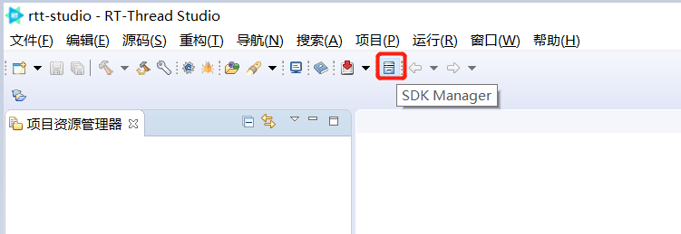

## 安装 RT-Thread Studio

### 下载 RT-Thread Studio 安装包

访问官网 [RT-Thread Studio 下载地址](https://www.rt-thread.org/page/studio.html)，在官网下载最新的 RT-Thread Studio 软件安装包。

### 安装 RT-Thread Studio

双击安装包的 `.exe` 文件进行安装，安装界面如下图所示：

安装前需要接受许可协议，如下图所示：

指定安装路径时不要带有空格和中文字符，如下图所示：

指定开始菜单文件夹名，如下图所示：

开始安装

一直点击 ` 下一步 ` 直到最后点击 ` 安装 ` 按钮可开始进行安装，待安装完成后可直接点击 ` 确定 ` 即可启动 RT-Thread Studio，如下图所示：

或者取消 ` 运行 RT-Thread Studio` 勾选，点击完成后，从桌面快捷方式启动 RT-Thread Studio。桌面快捷方式如下图所示：

第一次启动 RT-Thread Studio 需要进行账户登录，登录一次后会自动记住账号，后续不需要再登录，登录支持第三方账号登陆，登录界面如下：

## 更新 SDK

### 打开 SDK 管理器

安装好后 RT-Thread Studio 后，我们需要在线下载 SDK，点击 `SDK Manager` 按钮，如下图所示：

点击 `SDK Manager` 后，会出现下图等待提示，此时 RT-Thread Studio 正在联网获取 SDK 信息，稍等一会后，便可以进行 SDK 的下载

### SDK 资源库介绍

SDK 资源库一共有 6 个分类，我们需要根据需要更新 SDK 资源，SDK 更新的文件一般保存在比如 `D:\RT-ThreadStudio\repo\Extract` 中

#### RT-Thread_Source_Code

RT-Thread 的源码包，主要包括 RT-Thread 完整版本，Nano 版本，以及 LTS 版本，不同版本差异可以 参考文档，[版本简介](https://www.rt-thread.org/document/site/#/other/novice-guide/README)

#### Chip_Support_Packages

芯片支持包，目前已经支持的芯片包如下如所示：

#### Board_Support_Packages

板级支持包，展开某一个厂商的分类，可以看到更加细致的支持情况

#### ToolChain_Support_Packages

交叉编译工具链的支持，目前支持 ARM 和 RISC-V 以及 ARM-LIUNX

#### Debugger_Support_Packages

调试器的支持，可以看出目前 RT-Thread Studio 对调试器的支持也比较丰富

#### ThirdParty_Support_Packages

第三方工具的支持

## 新建项目

### 基于开发板创建

在 ` 项目资源管理器 ` 窗口内点击右键，选择 ` 新建 ` 子菜单 ` 项目 `，如下图所示：

在弹出的新建项目向导对话框中选择 `RT-Thread 项目 ` 类型，然后点击 ` 下一步 ` 如下图所示：

填写工程名，选择基于开发板创建工程，选择开发板型号，选择 BSP 版本号，选择 RT-Thread 源码版本，选择调试器和调试接口，然后点击 ` 完成 ` 按钮，如下图所示：

点击 ` 完成 ` 后，等待工程创建过程如下图所示：

工程创建成功后 ` 项目资源管理器 ` 窗口会出现刚创建的工程 `test`，如下图所示：

### 基于芯片创建

创建项目的过程和基于开发板创建工程是一样的，创建工程时，这里我们选择基于芯片，根据自己芯片的实际型号进行选项配置，这里我们以 `STM32F413CHU6` 芯片为例，创建工程，点击完成

同样，需要等待构建完成

工程创建成功

## 配置项目

双击 `RT-Thread Settings` 文件，打开 RT-Thread 项目配置界面，配置界面默认显示软件包以及组件和服务层的架构配置图界面，如下图所示：

点击架构图配置界面的侧边栏按钮，即可打开配置树配置界面或者返回架构图配置界面，如下图所示：

配置完成后，保存配置退出配置界面后，RT-Thread Studio 会自动将配置应用到项目中，比如会自动下载相关资源文件到项目中并设置好项目配置，确保项目配置后能够构建成功，如下图所示：

项目配置成功如下图所示

## 构建项目

选择需要构建的工程，然后点击工具栏上的 ` 构建 ` 按钮对项目进行构建。如下图所示：

构建的过程日志在控制台进行打印，如下图所示：

## 下载程序

当项目构建成功后，点击工具栏 ` 下载程序 ` 按钮旁的三角下拉框选择相应的烧写器，以 `ST-Link` 烧写器为例，如下图所示：

选择完烧写器后可直接点击 ` 下载程序 ` 按钮进行程序下载，下载日志会在控制台窗口打印，如下图所示：

## 启动调试

选中工程, 然后点击工具栏 ` 调试 ` 按钮，如下图所示：

当成功启动调试后，RT-Thread Studio 会自动跳转到调试透视图，在调试透视图可以进行各种调试功能操作。当停止调试后会自动跳转会 C 透视图，如下图所示：

## 视频教程

访问官网 [RT-Thread Studio 视频教程](https://www.rt-thread.org/page/video.html)，在官网观看视频教程。
