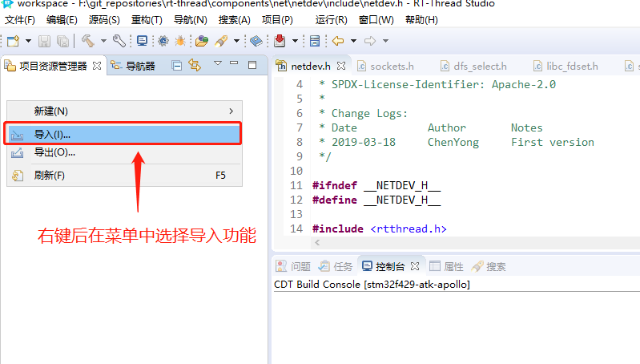
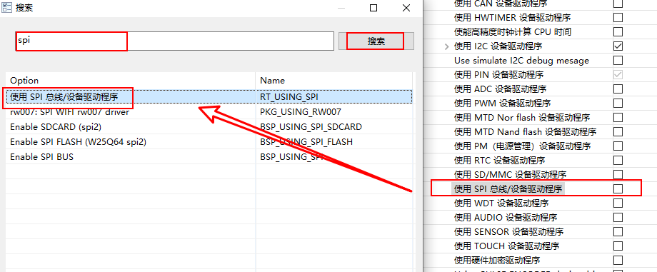
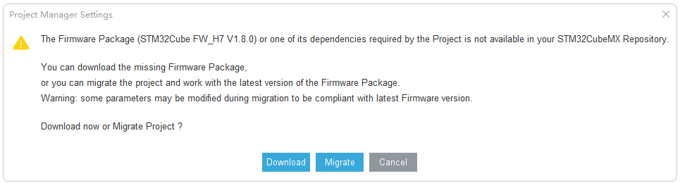
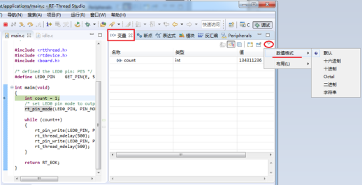
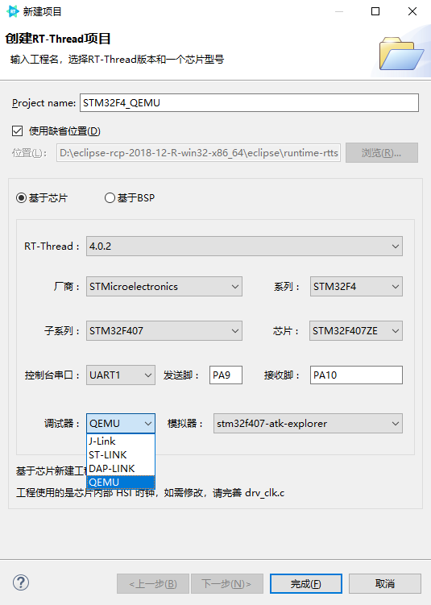
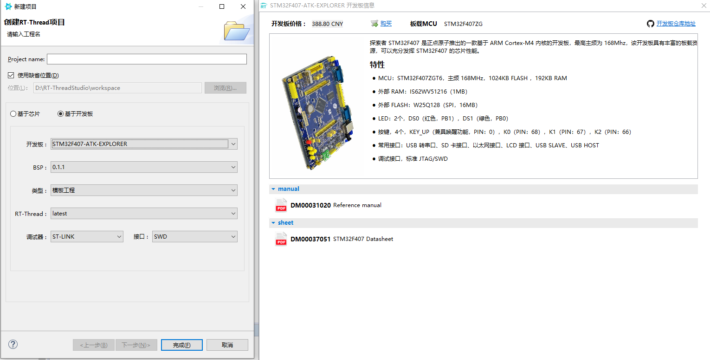
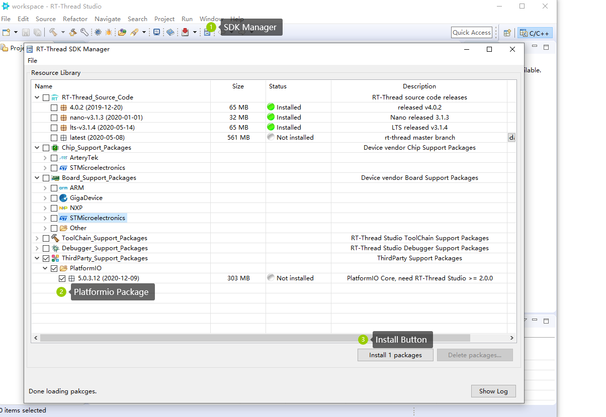
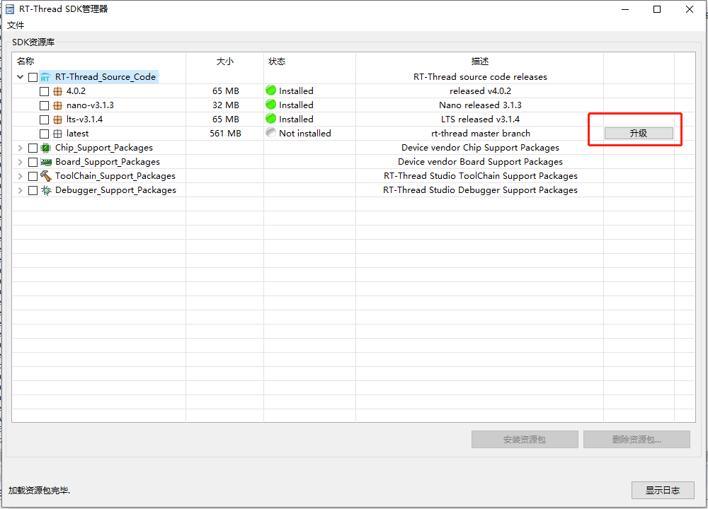
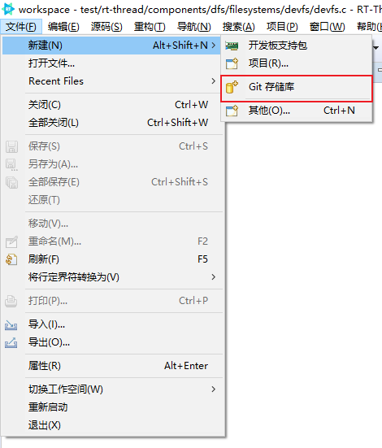

# RT-Thread Studio 用户手册

## 界面介绍

### 界面简介

RT-Thread Studio 基于 eclipse 平台开发，界面设计和风格继承自 eclipse，RT-Thread Studio 启动后主界面结构如下图所示：


### 透视图简介

透视图定义了当前界面呈现的菜单栏，工具栏，以及功能窗口集合及其布局。不同透视图提供了完成特定类型任务的功能集合。例如 C 透视图组合了项目开发，源文件编辑，项目构建等常用的开发功能窗口，菜单和功能按钮，调试透视图包含了调试项目程序常用的调试功能窗口，菜单和功能按钮。

RT-Thread Studio 已实现启动调试时自动切换到调试透视图，停止调试时自动恢复到 C 透视图，用户平时也可以根据需要从 ` 透视图切换栏 ` 手动进行透视图切换，切换到其它透视图进行相关工作。

### 功能窗口特性

#### 可移动

RT-Thread Studio 在初次打开的时候功能窗口位置呈现的是默认布局，但所有功能窗口位置都不是固定的，可以在窗口标题处按住鼠标左键，随意拖动窗口的位置，如下图所示左键按住 ` 属性 ` 窗口，拖动到 ` 项目资源管理器 ` 窗口下方，会出现一个灰色方框指示 ` 属性 ` 窗口将要被放置的位置，此时松开鼠标按键即可将 ` 属性 ` 窗口放置在该位置：


#### 可恢复

当窗口拖乱了，或者整体布局不满意想恢复回默认布局的样子时，可以通过 ` 复位透视图 ` 菜单功能恢复默认窗口布局，如下图所示：


#### 可关闭

每个功能窗口标题旁边都有一个 `X` 可以通过点击该处，关闭功能窗口，如下图所示：


若想再次打开已关闭的功能窗口，可通过菜单栏的 ` 窗口 ` 菜单的子菜单 ` 显示视图 ` 菜单中再次打开对应功能窗口，如果当前菜单中没显示想要打开的功能窗口，可以点击从 ` 其他 ` 菜单中查找。


#### 最大化

每个功能窗口都有自己单独的工具栏，工具栏最右边是最小化和最大化功能按钮，如下图所示：


在功能窗口的标题上双击或者点击功能窗口栏上最大化按钮，即可将窗口最大化，占满整个功能窗口区域，其它窗口将会暂时最小化到侧栏内，如下图所示：


再次双击 ` 项目资源管理器 ` 功能窗口即可恢复之前的功能窗口位置和状态。

#### 最小化

点击功能窗口最小化按钮，功能窗口将会暂时缩小到侧栏位置放置，点击 ` 恢复 ` 按钮即可恢复原来状态，如下图所示：


### 工具栏按钮介绍

#### 编译

选中一个项目，然后点击 ` 编译 ` 按钮即可完成编译，如下图所示：


#### 重构建

选中一个项目，然后点击 ` 重构建 ` 按钮即可完成重构建，如下图所示：


#### 构建配置

构建项目之前如果需要对项目进行构建参数配置，点击工具栏上 ` 打开构建配置 ` 按钮对项目进行构建参数配置，如下图所示：


#### 调试配置

进行下载或启动调试之前如果需要对项目进行相关调试参数配置，通过点击工具栏上的 ` 调试配置 ` 按钮，可打开调试配置对话框界面，如下图所示：


#### 启动调试

选中一个项目，然后点击 ` 启动调试 ` 按钮即可进入调试模式，如下图所示：


#### 打开元素

` 打开元素 ` 按钮其实就是一个搜索功能，可以指定搜索的类型，如下图所示：


#### 搜索

通过搜索菜单或者搜索按钮，选择对应的搜索功能，如下图所示：


#### 打开终端

通过点击工具栏 ` 打开终端 ` 按钮即可打开终端选择界面，如下图所示：


#### 打开 RT-Thread  RTOS  API 文档

通过点击工具栏 ` 打开 RT-Thread RTOS API 文档 ` 按钮即可打开 RT-Thread API 参考手册，如下图所示：


#### 下载程序

` 下载程序 ` 按钮除了可以下载程序以外，还可以通过旁边的三角下拉按钮来切换调试器，如下图所示：


#### SDK Manger

`SDK Manger` 可以管理源码包、芯片支持包、开发板资源包、工具链资源包、调试工具包、第三方资源包，可以根据需要进行下载相应的资源。


## 欢迎页

RT-Thread Studio 每次启动打开软件主界面后会展示一个最大化的欢迎页窗口，如下图所示：


欢迎页左侧有四个便利的功能入口：` 创建 RT-Thread 项目 `，`RT-Thread 论坛 `，` 视频教程 `，` 帮助文档 `，直接点击相应的功能名称即可使用对应功能。欢迎页右侧展示了三类内容：` 最新动态 `，` 视频教程 `，` 最新 PR`，点击对应的标签即可查看或者浏览对应标签页的内容。


## 新建

新建资源功能包括新建各类资源，例如工程，文件，文件夹等，新建入口有菜单，工具栏按钮，和工程右键菜单如下图所示：


## 导入

RT-Thread Studio 的导入功能不仅支持导入现有的 RT-Thread Studio 工程，还支持用户将 MDK/IAR 格式的工程导入到 RT-Thread Studio 中，便于用户迁移开发环境。

### RT-Thread Studio 项目导入

在 Studio 资源管理器窗口中点击右键，在下拉菜单中选择导入功能：



打开导入功能向导，选择导入 RT-Thread Studio 工程：


点击 **下一步** 后，点击 **浏览** 按钮选择要导入项目所在的工程目录，导入程序会自动扫描该目录下所有可导入的工程，将结果列出在项目列表中。在工程列表中勾选要导入的工程，然后点击 ` 完成 ` 即可。


### MDK 项目导入

开发者可以将现有的 RT-Thread MDK 工程直接导入到 RT-Thread Studio 中，MDK 工程在导入到 RT-Thread Studio 后，将有如下特性：

- 保持原有项目的目录结构
- 保持保持原有项目的源文件
- 保持原有项目的头文件路径
- 保持原有项目的宏定义

**注：目前只支持 Keil_v5**

#### 导入示例

本小节将以 `bsp/stm32/stm32l475-atk-pandora` 工程为例，演示如何导入一个 MDK 工程到 RT-Thread Studio 中，导入前工程目录如下图所示：


在 Studio 资源管理器窗口中点击右键，在下拉菜单中选择导入功能，然后选择导入 MDK  项目到工作空间，然后点击下一步， 如下图所示：


点击浏览选择工程目录下要导入的 MDK 工程，选择 MDK的可执行文件，然后输入导入后的工程名，点击完成即可， 如下图所示：


导入成功后，会在原工程目录下创建 .rtt-studio 的工程目录文件夹，如下图所示：


项目资源管理器此时显示界面， 如下图所示 ：


当一个 MDK  工程被导入到 RT-Thread Studio 之后，原工程的组织结构会保持不变，如下图所示：


与原 MDK 工程相同，RT-Thread Studio Group 中的源文件也可以存放在工程的各个位置，而不必实际上按照这种组织结构而存放文件。

可以注意到导入的 Group 和源文件右下角有一个小方块和箭头指示，表示区别于原生 eclipse 那种所见即所得的文件组织形式。这种右下角带方框或者箭头标识的文件夹或者文件，在 RT-Thread Studio 中分别称为虚拟文件夹和链接文件。

此时直接在 RT-Thread Studio 中点击编译按钮编译成功后，如下图所示：


#### RT-Thread Studio 与 MDK 工程同步

为了方便工程可以畅通无阻地在 RT-Thread Studio 和 MDK 之间切换使用，在工程右键菜单中有 同步 MDK 工程的菜单，并且分为两个子菜单，可分别从 MDK 同步到 RT-Thread Studio 和从 RT-Thread Studio 同步到 MDK,如下图所示：


#### MDK 工程配置

RT-Thread Studio 定制了一套配置 MDK 工程的界面，只要打开工程设置按钮即可：


配置界面中主要包含有：全局配置,、C/C++ 配置、汇编语言配置、链接配置。在 C/C++ 配置中，配置包含路径和符号时，可以打开 Settings 来添加、编辑、删除已有的值，下图以配置包含路径 ( Include Paths )  为例演示：


#### MDK 工程编译、下载、调试

与普通的 RT-Thread Studio 工程一样，直接点击下图三个按钮，即可执行编译、下载、调试，如果遇到下载或者调试没有反应，请在下载按钮右侧选择正确的调试器。


### IAR 项目导入

开发者可以将现有的 RT-Thread IAR 工程直接导入到 RT-Thread Studio 中，然后就可以使用 RT-Thread Studio 提供的更多工程配置功能。

`IAR` 工程在导入到 RT-Thread Studio 后，将有如下特性：

- 保持原有项目的目录结构
- 保持保持原有项目的源文件
- 保持原有项目的头文件路径
- 保持原有项目的宏定义
- 将原工程中使用的 libc 库相关配置转换为 newlibc
- 可以使用 RT-Thread Studio 提供的 RT-Thread 系统配置及软件包配置功能

注意 ：目前仅支持 STM32 系列芯片的工程导入，后续会支持更多芯片。

#### 导入示例

本小节将以 `bsp/stm32/stm32f429-atk-apollo` 工程为例，演示如何导入一个 IAR 工程到 RT-Thread Studio 中，导入前工程目录如下图所示：


在 Studio 资源管理器窗口中点击右键，在下拉菜单中选择导入功能，然后选择导入 IAR 项目到工作空间，然后点击下一步， 如下图所示：

​                                       

点击浏览选择工程目录下要导入的 IAR 工程，然后输入导入后的工程名，点击完成即可， 如下图所示：

​                                         

导入成功后，会在原工程目录下创建 RT-Thread Studio 的工程目录文件夹，如下图所示：


项目资源管理器此时显示界面， 如下图所示 ：


此时直接点击编译按钮编译成功后，如下图所示：


#### 导入工程管理

##### 添加与删除源文件

如果想在导入的工程中添加源文件，此时只需要保证该文件存在于工程目录中，然后手动拖入到相应的 group 中。如果想要从工程中删除某个源文件，则可以右键点击该文件，在下拉菜单中选择删除即可，如下图所示：


即可在工程中看到 README.md 文件：


如果想要创建一个虚拟文件夹 (虚拟文件夹并不是真实存在的文件夹，并没有实际的逻辑结构，其显示的内容可能实际上是分散于若干个真实的文件夹中，虚拟文件夹只是起到了一个归纳和汇总的作用)，可以采用如下方式：


即可在工程中看到新创建的文件夹：


#### 导入错误说明

本小节将介绍在导入过程中可能出现的错误，以及遇到这类问题该如何解决。由于在导入的过程中要根据用户所导入的工程进行芯片检查以及一些文件的替换，有时会遇到芯片不支持或者文件找不到的情况，此时用户可以自行手动替换某些缺少的文件，使得工程可以构建成功。

常见的错误提示信息如下：

- **ERROR STM32MP157AAAx doesn't support import to RT-Thread Studio now**

  说明 RT-Thread Studio  暂不支持导入当前系列的芯片。

- **ERROR get IAR version failed. Please update the IAR installation path in rtconfig.py!**

  说明找不到 IAR 的安装路径 打开工程目录下 rtconfig.py 文件 ， 修改 IAR 的 **EXEC_PATH** 。

  >  elif CROSS_TOOL == 'iar':
  >      PLATFORM    = 'iar'
  >      EXEC_PATH   = r'C:/Program Files (x86)/IAR Systems/Embedded Workbench 8.0'

- **WARNING Can't auto specific link.lds file, Please specific a linker file mannually.**

  出现这种错误意味着在导入过程中不能自动替换链接脚本文件，需要手动指定链接脚本的位置。

  

- **WARNING Can't find xxx_startup_stm32fxxx.s, replace startup files failed.**

  出现这种错误意味着在导入过程中不能找到可自动替换的芯片启动文件，需要手动添加启动文件到工程中。此时直接将可用的 gcc 启动文件拷贝到工程中，然后拖到相应的 group 中即可。

## RT-Thread 配置

### 打开 RT-Thread 配置界面

通过双击工程根目录下的 `RT-Thread Settings` 文件，可以打开 RT-Thread 配置界面，如下图所示：


### 软件包中心

通过点击 ` 立即查看 ` 进入软件包中心，软件包中心首先展示了软件包的大分类，在软件包中心，可以先选择一个分类，也可以直接搜索软件包，点击搜索到的软件包进入软件包详情页面后，可以通过点击 ` 添加软件包到工程 ` 按钮将软件包添加到工程，如下图所示：


当软件包成功添加到工程后，软件包中心会提示 ` 软件包添加成功 `，同时添加的软件包会显示在软件包层，该软件包依赖的组件也会被自动启用，例如添加 `pahomqtt` 软件包，`DFS`,`SAL`，`POSIX`，`libc` 组件会自动被启用，如下图所示：


### 组件和服务层

在图标上双击可直接启用该组件。启用的组件是亮色图标，未启用组件为灰色图标。通过在组件和服务层的图标上右键弹出可操作的右键菜单，如果该组件已经启用，则该组件的右键菜单有 ` 停用 `、` 查看依赖 `、` 详情配置 ` 三个选项，如果该组件未启用，则该组件右键菜单只有 ` 启用 ` 选项，如下图所示：


### 查看依赖

在启用的组件上右键选择`查看依赖`，可以查看该组件被哪些组件依赖，例如查看`pin`组件的依赖，`依赖关系图`窗口显示`pin`组件依赖了`gpio`，如下图所示：


### 查看详细配置

在启用的组件上右键选择 ` 详细配置 `，可以打开该组件的详细配置树形界面，例如在 `DFS` 上右键选择 ` 详细配置 `，打开的属性配置界面如下图所示：


#### 详细配置

当打开 RT-Thread 配置界面的时候，详细配置默认是隐藏的，通过启用的组件的右键菜单 ` 详细配置 ` 或者 RT-Thread 配置界面侧栏按钮，可以将详细配置界面调出来，侧栏按钮位置如下图所示：


详细配置界面即右侧的树形配置界面，树形配置界面分成了四大类配置: `内核`, `组件`, `软件包`, `硬件` 。通过标签可以切换不同的配置类别,点击侧栏按钮可以隐藏该属性配置界面,如下图所示:


#### 搜索配置

当需要搜索某个配置的时候，需要在详细配置里选中任意配置树节点右键，会弹出 ` 搜索 ` 菜单，或者在详细配置里选中任意配置树节点后，按下快捷键 `Ctrl + F` 即可弹出配置搜索对话框，输入搜索关键词点击搜索即可搜索出所有匹配关键词的配置，在结果列表里选择不同结果查看时，配置树会自动跳转到对应配置位置，如下图所示：



#### 保存配置

当配置修改后，`RT-Thread Configuration` 标签会有脏标记，配置完后要记得点击 ` 保存 ` 按钮，将配置保存并应用到工程中。保存的时候会弹出进度提示框，提示保存进度，如下图所示：


## CubeMX 配置

RT-Thread Studio 为 STM32CubeMX 提供了快捷的配置入口，可将 STM32CubeMX 配置的内容应用到 RT-Thread Studio 的工程中，不需要用户手动去搬运代码。**前提是您的电脑上已经安装了  STM32CubeMX  软件**。目前只支持完整版或者 Nano 版的基于芯片创建的 ST 系列的工程。

启动 STM32CubeMX 后如果出现如下弹窗提示，请选择 download 下载使用旧版本的 package，否则可能会出现版本不匹配导致编译问题。


**STM32CubeMX 详细的操作说明可跳转[STM32系列外设驱动添加指南](../../../rt-thread-version/rt-thread-standard/tutorial/make-bsp/stm32-bsp/STM32系列外设驱动添加指南.md)**

## 代码编辑

### 编码修改

- **设置当前文件的编码格式**

  在当前文件中，按`Alt+Enter`,会出现下图所示界面。可以看到设置编码格式的选项（如图中红色矩形所示）。下拉列表中可以选择想要的编码格式。


- **设置当前项目工程（Project）的编码格式**

  选中你所创建的项目，右键点击会弹出以下界面，选择最下面的一个选项`属性`(图中红色矩形样式)，点击进入。


点击`属性`之后，弹出以下页面，默认的是`从容器继承`，我们选择`其他`, 下拉框选择编码，然后点击`Apply and Close`即可


- **设置工作区间的编码格式**

  通过`窗口`菜单打开`首选项`窗口弹出如下图界面：


   点击`常规`选项后再点击`工作空间`会出现设置编码格式的选项。默认的是`缺省值(GBK)`，这里我们选择`其他`,下拉框选择编码，然后点击`Apply and Close`即可


### 编辑

通过 ` 编辑 ` 菜单或者直接在源码编辑器内右键菜单，可以选择对应的编辑系列功能，如下图所示：


### 源码

通过 ` 源码 ` 菜单或者直接在源码编辑器内右键菜单，可以选择对应的源码系列功能，如下图所示：


### 重构

通过 ` 重构 ` 菜单或者直接在源  码编辑器内右键菜单，可以选择对应的重构系列功能，如下图所示：


### 导航

通过 ` 导航 ` 菜单或者直接在源码编辑器内右键菜单，可以选择对应的导航系列功能，如下图所示：


### 搜索

通过搜索菜单或者搜索按钮，选择对应的搜索功能，如下图所示：


### 辅助键

通过 ` 帮助 ` 菜单的子菜单 ` 辅助键 ` 查看所有的快捷键，如下图所示：


## 构建配置

### 构建配置入口

构建项目之前如果需要对项目进行构建参数配置，点击工具栏上 ` 打开构建配置 ` 按钮对项目进行构建参数配置，如下图所示：


### 配置头文件包含

若要增删改头文件路径，在 ` 工具设置 ` 配置页，点击 `GNU ARM Cross C Compiler` 下的 `Includes` 配置项即可打开头文件路径配置参数，点击 `Inlucde paths（-I）` 配置栏相应的按钮即可进行头文件的增删改操作，如下图所示：


### 配置宏定义

若要增删改宏定义，在 ` 工具设置 ` 配置页，点击 `GNU ARM Cross C Compiler` 下的 `Preprocessor` 配置项即可打开宏定义配置参数，点击 `Define symbols（-D）` 配置栏相应的按钮即可进行宏定义的增删改操作，如下图所示：


### 配置链接脚本

若要增删改链接脚本配置，在 ` 工具设置 ` 配置页，点击 `Cross ARM C Linker` 下的 `General` 配置项即可设置链接脚本文件，点击 `Script files(-T)` 配置栏相应的按钮即可进行链接脚本的增删改操作，在 `Script files(-T)` 下方有一些基本的链接参数可配置，如下图所示：


### 配置外部二进制库文件

若要增删改外部二进制库文件，在 ` 工具设置 ` 配置页，点击 `Cross ARM C Linker` 下的 `Libraries` 配置项即可设置外部二进制库文件，点击 `Libraries(-l)` 配置栏相应的按钮即可进行库文件的增删改操作，在 `Library search path(-L)` 配置栏配置库文件相应的路径。

如下图所示：

- 项目本地新增 GCC 二进制库文件，命名为：libxxx.a（如图中示例 libwifi_1.0.0_gcc.a）。
- 在 `Libraries(-l)` 配置栏增加二进制库文件名称：xxx（如图中示例 wifi_1.0.0_gcc），注意需要去掉前缀 `lib` 与后缀 `.a` 。
- 在 `Library search path(-L)` 配置栏，添加该库文件所在的路径。


### 如何生成 HEX 文件

选中工程后，点击工具栏上的`打开构建配置`按钮，将相应的输出文件格式设置成 hex 文件格式，即可实现输出 hex 文件，如下图所示：


如果需要同时生成 bin 文件和 hex 文件，需要在`构建后步骤`里添加构建后生成 HEX 文件的命令，如下图所示：


构建后生成的 hex 文件，在工程的`Debug`目录下，如下图所示：


###  如何让工程编译生成静态库


### 如何设置依赖C99标准


### 配置其它

配置其它构建参数可直接在 ` 工具设置 ` 配置页面中选择相应类型配置树节点，并设置其提供的详细配置项，配置完成后，点击 ` 应用并关闭 ` 按钮配置即可生效。如下图所示：


## 调试配置

### 调试配置入口

进行下载或启动调试之前如果需要对项目进行相关调试参数配置，通过点击工具栏上的 ` 调试配置 ` 按钮，可打开调试配置对话框界面，如下图所示：


### 调试配置项

选中一个调试配置后，调试配置对话框将展示所有配置项，配置项通过 ` 配置项分类标签页 ` 进行了分类，通过点击不同 ` 标签页 ` 展示不同类别配置项，修改配置项后，点击 ` 确定 ` 按钮即可保存配置修改，如下图所示：


## 下载功能

### 切换调试器

目前 RT-Thread Studio 支持 JLink 、ST-Link、DAP-Link 以及软件仿真器 QEMU，新建工程的时候可以在新建工程向导里选择硬件调试器也可以选择软件仿真器 QEMU。工程创建好之后，如果想切换硬件调试器或直接进行软件仿真，可以通过工具栏下载程序按钮旁边的三角下拉按钮来切换硬件调试器或软件仿真器 QEMU，如下图所示：


## 调试

### 调试常用操作

当调试启动成功后，程序会在 main 方法处挂起，这时可以通过工具栏上的调试相关操作按钮或者快捷键进行常用的调试操作，如下图所示：


### 启用汇编单步调试模式

点击工具栏上的 ` 汇编单步模式 ` 按钮，会自动打开 ` 反汇编 ` 功能窗口，此时 ` 汇编单步模式 ` 按钮呈凹下去的状态，代表此时处于汇编单步模式，如下图所示：


当进入 ` 汇编单步模式 ` 后，所有单步调试操作将变为以一条汇编指令为单位进行单步执行，此时指令跳转情况可以在 ` 反汇编 ` 窗口进行查看。

若要退出 ` 汇编单步模式 `，直接再次点击 ` 汇编单步模式 ` 按钮即可。

### 查看寄存器

通过 ` 窗口 ` 菜单的 ` 显示视图 ` 子菜单，选择打开 ` 寄存器 ` 窗口即可查看核心寄存器，如下图所示：


### 查看外设寄存器

点击 `Peripherals` 窗口，让 `Peripherals` 窗口显示在最前面，若 RT-Thread Studio 存在相应的 svd 文件，该窗口将会显示所有外设名称及其地址和描述。可在 `Peripherals` 窗口勾选要查看的外设，内存窗口将会显示该外设的所有寄存器的名称及其地址和当前值，如下图所示：


若需要修改某个寄存器的当前值，可以直接点击进入寄存器 `Value` 那一列，输入想要修改的值后，敲击回车键即可执行修改。（注：只有可读可写的寄存器可以修改值，只读寄存器无法修改值。）


### 查看变量

点击 ` 变量 ` 窗口，让 ` 变量 ` 窗口显示在最前面，即可查看当前程序挂起时所有可见的变量，点击 ` 变量 ` 窗口最右边的三角下拉菜单，可以设置变量显示的数值格式，如下图所示：



### 查看内存

点击 ` 内存 ` 窗口，让 ` 内存 ` 窗口显示在最前面。点击 ` 添加内存监视器 ` 按钮，在弹出的输入框内，输入要查看内存的起始地址，点击 ` 确定 ` 即可添加要查看的内存，如下图所示：


添加内存监视器后，内存窗口会立即展示刚输入的内存起始地址的一段内存，如下图所示：


### 断点

在源码编辑窗口边栏，双击即可设置断点，再次双击即可删除断点，打开 ` 断点 ` 窗口即可查看和管理所有断点，通过 ` 断点 ` 窗口工具栏可以进行删除，取消等断点管理操作，如下图所示：


### 表达式

在源码内选中表达式后点击右键，选择 ` 添加监看表达式 ` 即可将表达式添加到 ` 表达式 ` 窗口，或者直接点击 ` 表达式 ` 窗口内的 ` 添加新的表达式 ` 通过直接输入的方式，添加想要查看的表达式的值。


###  取消启动调试前的自动构建

首先通过`窗口`菜单打开`首选项`窗口，然后展开`运行/调试`选项并点击进入`启动`选项，最后将`在启动之前构建（如必需）`选项取消勾选即可取消启动调试前的自动构建，如下图所示：


## 模拟器仿真

### QEMU 模拟器仿真

QEMU 是一个支持跨平台虚拟化的虚拟机，它可以虚拟很多开发板。为了方便在没有开发板的情况下体验 RT-Thread，RT-Thread Studio 提供了 QEMU 模拟仿真调试器。 本文主要介绍在 Windows 平台上使用 RT-Thread Studio QEMU 模拟器进行仿真。

> QEMU 支持仿真的芯片

- STM32F4 系列

> QEMU 支持仿真的开发板

- GD32VF103-NUCLEI-RVSTAR
- QEMU-VEXPRESS-A9
- STM32F407-ATK-EXPLORER
- STM32F410-ST-NUCLEO
- STM32F401-ST-NUCLEO
- STM32F429-ATK-APOLLO
- STM32F429-FIRE-CHALLENGER
- STM32F429-ST-DISCO

#### 创建工程

点击新建一个工程，选择或者设置各个配置选项，Adapter 配置项可以先选择 QEMU，并且配置适合的模拟器。目前的最新版本中，系列、子系列需要手动选择，还未与模拟器支持的系列关联起来。点击完成，即会在工作空间中创建一个 QEMU 调式的工程。



#### 切换调试器到 QEMU

如果当前工程为老工程或者当前选择的调试器是 QEMU 以外的调试器，想使用 QEMU 进行调试，可点击下载按钮右边的下拉框，选择 QEMU ：


若当前工程还未配置 QEMU ，那么在选择 QEMU 后，会弹出【跳转到配置界面】的提示，点击【是】，会显示 QEMU 配置界面，具体详情将在下一节介绍。


#### QEMU 配置

点击【打开调试配置】或者其他情况下跳转到 QEMU 配置界面，需要配置的参数如下：

| 参数                       | 英文                       | 命令       |
| :-----------------------: | :------------------------: | :-------: |
| 开发板型号                  | Board Name                 | -M        |
| 支持 Cpu 的数量             | Cpu Quantity               | -smp      |
| 是否支持网络                | Enable Network             | -net       |
| 是否支持图形                | Don't open grapgic windows | -nographic |
| SD 卡内存大小               | SD Card Memory             | -sd        |
| 额外的命令                  | Extra Commands             | 无         |

填写完整后，点击确定，即可正常进行调试和运行。


#### 仿真调试

在编译正常的情况下，点击调式按钮，IDE 会自动启动 QEMU 并打开串口，并进入断点调试模式，在此模式中，可一步一步观察每次断点的输出情况，亦可在串口中执行自己的命令。

- ** 注：在 windows 上 QEMU 不支持上下键查看历史命令。**


#### 网络仿真

- 基于开发板创建一个 stm32f4 的工程



- 打开 RT-Thread Settings ，使能 SAL, 切换到 【硬件】栏，使能以太网，Ctrl + S 保存配置，编译

  


- 配置 QEMU，选择模拟器，配置网卡（配置TAP 过程可参考 https://www.rt-thread.org/document/site/tutorial/qemu-network/qemu_setup/qemu_setup/）

  

- 点击下载按钮，程序会自动启动并下载，进入到终端页面，显示 lwip initialized.

  

- 输入网络命令测试一下


## PlatformIO

RT-Thread Studio 自 V2.0.0 版本开始支持 PlatformIO 工程的创建、编译和调试。下面，我们一步步的来实践这个过程

- 在 SDK Manager 下载 PlatformIO 资源包，此下载安装过程可能需要花费一定时间，请耐心等待

  

- 新建 RT-Thread 工程，选择基于 PlatformIO，选择您需要的开发板、框架，点击 **Finish**，自动创建了一个 PlatformIO 的工程

  

- 打开 src/main.cpp， 添加您自己的代码，然后点击编译按钮编译工程

  

- 编译成功后，点击下载按钮，下载程序到开发板

  

- 下载成功后，打开串口查看输出内容

  

- 调试。点击调试按钮，自动进入调试界面，您可以查看寄存器信息，进行单步调试操作

  

  

## 终端

通过点击工具栏 ` 终端 ` 按钮即可打开终端选择界面如下图所示：


点击 ` 确定 ` 按钮后，即会自动打开对应的终端功能窗口，如下图所示：


## SDK Manager

### SDK Manager 简介

通过 SDK Manager 维护 RT-Thread Studio 内部的 RT-Thread SDK 支持包，包括安装，卸载，升级各类支持包。通过工具栏的 `SDK Manager` 按钮即可打开 SDK Manager 功能界面，如下图所示：


### SDK Manager 功能

#### 安装支持包

勾选状态为 `Not installed` 的支持包，点击 `Install packages` 按钮即可启动支持包安装过程，如下图所示：


#### 卸载支持包

勾选状态为 `Installed` 的支持包，点击 `Delete packages` 按钮即可启动卸载过程，如下图所示：


#### 升级支持包

点击支持包对应的 ` 升级 ` 按钮，可以将支持包同步更新到最新状态。如下图所示：



## 开发板支持包制作

这部分主要介绍如何从一个BSP转化为Studio工程，然后再以Studio工程为基础，借助开发板支持包制作工具制作一个开发板支持包。最后可以将开发板支持包贡献到SDK上。（BSP的获取可以从 [新手推荐开发板列表及其BSP](https://www.rt-thread.org/document/site/tutorial/quick-start/more/#stm32-bsp)这篇文章中获取，或者按照教程制作自己的BSP，这里不再赘述）

#### 1.Studio工程制作

**前提条件**：在 RT-Thread 主线分支 2021-01-18 之后的版本中，添加了对 --dist-ide  的增强支持，能够通过 scons --dist-ide 将一个bsp 转换为studio 工程，使用方法如下

+ git pull 同步最新的 rt-thread 代码

+ 进入到bsp文件夹的目录中，打开  env工具输入` scons --dist-ide --project-path=dist_studio（存储的文件夹名字） --project-name=project_name_xxx（生成的工程名）`即可生成studio工程。

#### 2.开发板支持包制作

这里需要借助开发板支持包制作工具来制作。下面介绍开发板支持包制作工具的使用方法。

**准备工作**

1. RT-Thread  Studio V2.1.0及以上版本

2. Studio工程

3. 开发板的基本信息，如开发板名称、厂商、调试器、调试接口等

4. 开发板所用芯片的基本信息，如芯片厂商，芯片名等

5. 开发板的大、小图片各一张，小图片尺寸为200x300

6. 开发板的文档

**使用方法**

打开Studio,点击工具栏`新建`按钮旁的下拉三角，选择`开发板支持包`


下图即为开发板制作包工具，共有五栏信息需要填写，左上角打*号的表示该项为必填项。


下面对一些所填项进行解释说明，方便大家填写。


到此所有信息都填写完成了，可以点击右上角`预览`按钮，检查开发板信息是否填写无误。检查没有问题后可点击`生成`按钮即可生成开发板支持包


#### 3.测试

测试的过程就是通过离线导入支持包，并查看支持包的功能是否正常

1. 将开发板支持包打包成zip格式，目录结构如下：

   

2. 打开SDK 管理器，离线导入支持包
   

3. 新建开发板工程并编译，测试是否可以正常编译通过。

#### 4.部署开发板支持包到Studio SDK Manager

##### 简述

rt-thread studio 作为一款支持众多芯片厂商的IDE，必不可少地具备了支持包管理的功能。rt-thread studio 采用SDK manager 在线管理支持包。目前包含以下类型的支持包。

| 资源包名                    | 内容                                                      |
| --------------------------- | --------------------------------------------------------- |
| Board Support Packages      | 开发板支持包，rt-thread studio 新建开发板工程时使用的模板 |
| Chip Support Packages       | 芯片支持包，rt-thread studio 新建芯片工程时使用的模板     |
| Debugger                    | 调试器后端，如J-Link，PyOCD等                             |
| RT-Thread Source Code       | RT-Thread 源码包                                          |
| ThirdParty Support Packages | 第三方工具支持包：例如 PlatformIO                         |
| Tool Chain                  | 工具链支持包                                              |

SDK manager 通过 SDK index（托管在github) 查找各个支持包的下载地址，下载至本地并解压，因此整个支持包上线的过程就是完善SDK-index中对应信息的过程。


##### 上线流程

1. 在github.com 新建一个仓库，存储制作好的开发板支持包，需要满足以下格式

+ 仓库名字以 “sdk-bsp-” 为首，例如 sdk-bsp-stm32h750-realthread-artpi

+ 开发板支持包描述文件 (yaml) 需要位于仓库的根目录下

  参考仓库：https://github.com/RT-Thread-Studio/sdk-bsp-stm32h750-realthread-artpi

2. 将开发板支持包 push 到建好的 github 仓库中，并发布一个 release，需满足以下条件

+ release 版本号 tag version 与  yaml 里的 pkg version 保持一致，格式需为三位数字 [0-9].[0-9].[0-9] ，例如 1.0.0

+ 记录 Source code 的下载链接，在后续步骤使用

  

3. Fork 一份RT-Thread Studio 的 SDK 索引仓库 https://github.com/RT-Thread-Studio/sdk-index 到个人 github 账号下

4. 在本地sdk-index 仓库的 sdk-index/Board_Support_Packages 下添加一个新的开发板信息

   这里需要注意：

   + 如果是新的半导体厂商，需要在 sdk-index/Board_Support_Packages/index.json 添加对应厂商名字的字段

     ```json
     {
         "name": "Board_Support_Packages",
         "description": "Device vendor Board Support Packages",
         "index": [
             "Allwinner",
             "AlphaScale",
             "ARM",
             "ArteryTek",
             "Bluetrum",
             "GigaDevice",
             "MicroChip",
             "Microsemi",
             "MindMotion",
             "NXP",
             "RaspberryPi",
             "STMicroelectronics",
             "Synwit",
             "TI",
             "WCH",
             "essemi",
             "Other"
         ]
     }
     ```


   + 新建芯片厂商文件夹，名字于上述添加字段相同，如 STMicroelectronics，文件夹中新建index.json，并在此文件中添加此芯片厂商包含的开发板支持包，对于已存在的芯片厂商只需要在已存在的 index.json 中添加新的开发板字段，例如ST

     ```json
     {
         "name": "STM32 Series Board Support Packages",
         "dvendor": "STMicroelectronics",
         "description": "STM32 series Board Support Packages",
         "index": [
             "STM32F072-ST-NUCLEO",
             "STM32F091-ST-NUCLEO",
             "STM32F103-DOFLY-M3S",
             "STM32F103-DOFLY-LYC8"
         ]
     }
     ```

   + 新建开发板支持包文件夹，名字与上述index.json中对应字段相同，如 STM32F072-ST-NUCLEO，并在文件夹中新建index.json，在此文件中添加对应开发板信息，如 STM32H750-RT-ART-Pi ，url 为 release 时的 Source code的下载链接

     ```json
     {
         "name": "STM32H750-RT-ART-Pi",   // 开发板支持包名称
         "vendor": "RealThread",  // 开发板厂商
         "description": "STM32H750-RT-ART-Pi Board Support Packages",  // 支持包描述
         "license": "",  // license 描述
         "repository": "https://github.com/RT-Thread-Studio/sdk-bsp-stm32h750-realthread-artpi.git",  // 支持包仓库URL
         "releases": [
             {
                 "version": "1.1.0",
                 "date": "2020-12-01",
                 "description": "released v1.1.0",
                 "size": "152 MB",
                 "url": "https://github.com/RT-Thread-Studio/sdk-bsp-stm32h750-realthread-artpi/archive/1.1.0.zip"
             },
             {
                 "version": "1.0.1",  // 支持版本号
                 "date": "2020-10-23",  // 发布日期
                 "description": "released v1.0.1",  // 版本描述
                 "size": "136 MB",  // 资源包大小
                 "url": "https://github.com/RT-Thread-Studio/sdk-bsp-stm32h750-realthread-artpi/archive/1.0.1.zip"  // 支持包下载URL（包格式为zip）
             }
         ]
     }
     ```

+ 注意事项：
  + 索引仓库中不要出现非ascii 字符
  + 开发板支持包名称 name字段 保持大写字母和中划线组合
  + 上述json编写规范见[下节](#1)

5. 将改好的 sdk-index 仓库 push 到 github，并向官方 sdk-index 提出 PR
6. PR 合并后，开发板支持包将会更新在 Studio 的 SDK Manager 界面里

##### index.json 编写规范 {#1}

索引库按照支持包类型进行目录划分，各级目录下有对应的 index.json 作为索引，下面以添加 STMicroelectronics 的 STM32F746-ST-DISCO 开发板支持包为例，简述编写规范

目录结构如下，并在 STM32F746-ST-DISCO 目录下新建 index.json

sdk-index/Board_Support_Packages/STMicroelectronics/STM32F746-ST-DISCO/index.json

```json
{
"name": "STM32F746-ST-DISCO",  // 开发板支持包名称
"vendor": "RealThread",  // 开发板厂商
"description": "STM32F746-ST-DISCO Board Support Packages",  // 支持包描述
"license": "",	// license 描述
"repository": "https://github.com/RT-Thread-Studio/sdk-bsp-stm32f746-st-disco.git",  // 支持包仓库URL
"releases": [
{
   "version": "1.0.0",  // 支持包版本号
   "date": "2021-02-23",	// 发布日期
   "description": "released v1.0.0",	// 版本描述
   "size": "7 MB",	// 支持包大小
   "url": "https://github.com/RT-Thread-Studio/sdk-bsp-stm32f746-st-disco/archive/1.0.0.zip"	// 支持包下载URL（包格式为zip）
}
]
}
```

**注：**

* 若为新加入的半导体厂商，需要修改 Board_Support_Packages 目录下的 index.json，字段与上述类似

* 工具链的版本号字段需要以芯片厂商缩写+工具链版本号命名，示例如下

  ```json
  {
      "name": "RISC-V-GCC",
      "vendor": "RISC-V",
      "description": "RISC-V-GCC Tool Chain",
      "license": "",
      "releases": [
          {
              "version": "XXXX_10.1.0", //厂商缩写+版本号
              "date": "2020-09-10",
              "description": " only for  xxx released v10.1.0", // 工具链如有定制，描述中加入是针对哪款芯片或开发板
              "size": "80.7 MB",
              "url": "https://github.com/RT-Thread-Studio/sdk-toolchain-RISC-V-GCC/archive/10.1.0.zip"
          }
      ]
  }
  ```

  工具链打包发布时的目录层级需要保持一下结构

  

**注：**注意 json 和 yaml 文件的语法格式是否正确，可以在以下两个网站进行检查：

​	json: https://www.json.cn/

​	yaml:https://www.json2yaml.com/

## MarkDown 编辑

RT-Thread Studio 自带 MarkDown 编辑器，若工程里有 md 文件，只需要双击即可打开 md 文件进行编辑，如下图所示：


## 版本控制

### Git 简介

Git 是目前最先进的分布式版本控制系统。什么是版本控制系统？
 形象地讲，版本控制就是按照纵向或横向的维度记录当前工程下的变更并进行管理，方便用户可以穿梭于当前工程的不同的变更状态，纵向的维度就是时间的维度，而横向的维度就是分支的维度。在软件开发中经常利用分支的功能将稳定和变动隔离开来，已经稳定的代码是默认的主分支，而新的特性，功能等则是其他分支。
 如何使用 Git 的分支特性并无标准答案，但却有大家总结或约定俗称的使用方式，这里推荐简要了解一下[git分支管理策略](https://www.ruanyifeng.com/blog/2012/07/git.html)。
 那么什么是分布式版本控制系统？版本控制系统并非只有 Git 一种，再此之前还有 SVN 和 CSV，相对的，这两者是集中式版本控制系统。分布式版本控制系统会在每台部署了版本控制的电脑上存储完整的版本库，而集中式版本控制系统则只会在一台主机上保存版本库。因此分布式版本库不仅不需要联网就可以使用，而且更安全，更方便。

#### Git 基本概念

想要用好 Git，首先要了解 Git 的几个基本概念

​	[](https://git.rt-thread.com/realthread/ide_bug_report/uploads/9990f454f96cd9362649e0298be13b29/pic2.png)

**Workspace**： 工作区，平时存放工程代码的地方，也就是工程文件夹。

**Index / Stage**： 暂存区，用于临时存放你的改动，实际上这是一个文件，里面保存即将提交的文件的信息，一般存放在隐藏目录.git 目录下的 index 文件中。

**Repository**： 仓库区（或版本库），本地仓库，当前工程路径下的隐藏目录 .git。

**Remote**： 远端仓库。

#### Git 工作流程

以上图为例：

1. 从远端仓库 clone 一个仓库到本地，或在本地创建并初始化一个仓库
2. 在工作区中对文件进行添加、编辑、修改、删除
3. 将需要进行版本管理的文件从工作区中 add 后放入暂存区
4. 确认需要保存的更改从暂存区中 commit 至版本库
5. 最后如果需要将本地版本库同步就将版本库 push 至远端工作区

### RT-Thread studio 中 git 信息的配置

按如下图配置 RT-Thread studio 中的 git 插件

- 打开窗口 -> 首选项 -> 配置
   [ ](https://git.rt-thread.com/realthread/ide_bug_report/uploads/8219aef9907da695186a050cb2b7ffd0/image.png)
- 在图中 user下填入代码托管平台的 email 和 name，如需配置网络代理，可配置 http 代理信息
   [](https://git.rt-thread.com/realthread/ide_bug_report/uploads/6d74921b52b8604a0c5b43a46fad176d/image.png)

### RT-Thread studio 中 Git 视图面板介绍

按下图打开 git 视图

[](https://git.rt-thread.com/realthread/ide_bug_report/uploads/ba43b92b7d2c1b927eb00d6a0ab04436/image.png)

[](https://git.rt-thread.com/realthread/ide_bug_report/uploads/e5f1a55db6a02e87e23e9370a5bac1e5/image.png)

[](https://git.rt-thread.com/realthread/ide_bug_report/uploads/5819713709ccc78d5ea2c2d1ae0ddbc6/image.png)

上图所示, 从左至右的按钮的功能分别为

- 导入外部已存在的本地版本库
- 从远端仓库 clone 一个版本库至本地
- 创建一个新的版本库并添加至当前视图
- 刷新
- 与工作树所选内容连接
- 显示平行分支布局
- 显示最新分支的提交

[](https://git.rt-thread.com/realthread/ide_bug_report/uploads/84e8980b0171ca74365b55d41bf9af63/image.png)

- 左边区域为版本库的文件树
- 右边区域为git相关操作的面板，通过打开不同的选项卡可以进行如diff，commit等基本操作

### Studio创建本地仓库

切换至 git 视图后按如下步骤新建本地仓库

[](https://git.rt-thread.com/realthread/ide_bug_report/uploads/d912f78e3e658563b2fa9c34723f0bb6/image.png)

[](https://git.rt-thread.com/realthread/ide_bug_report/uploads/5f5eb9eabafe6980afdfbea77295f22c/image.png)

也可以直接从菜单栏新建本地仓库

[](https://git.rt-thread.com/realthread/ide_bug_report/uploads/729a69d842ee3e47824c40c6f716e9d0/image.png)

注：新建本地仓库后需要新建工程并保存至仓库路径，然后添加至暂存区才可以跟踪工程文件的变更

### RT-Thread studio 导入外部仓库

切换至 git 视图后按如下步骤添加外部已存在仓库至 RT-Thread studio

[](https://git.rt-thread.com/realthread/ide_bug_report/uploads/9f3b130d1b5367cf162c898f2eb46b0b/image.png)

### RT-Thread studio 克隆远程仓库

按如下图所示步骤克隆远程仓库至 RT-Thread studio

[](https://git.rt-thread.com/realthread/ide_bug_report/uploads/2a6fae6d7d715fbb7e08860eeb051336/image.png)

[](https://git.rt-thread.com/realthread/ide_bug_report/uploads/f09ad6faa056bac2f2c11d8f8c67a51a/image.png)

克隆后导入工程（注：只有 eclipse 工程才可以导入成功）

[](https://git.rt-thread.com/realthread/ide_bug_report/uploads/aeebf923eaa3cd5639cdbec007526114/image.png)

[](https://git.rt-thread.com/realthread/ide_bug_report/uploads/63d2adf3536339ed735eb460b573d310/image.png)

**注：从远程仓库克隆至本地后需要导入 RT-Thread studio 工程，才可以在项目资源管理器中显示工程内容**

### Git 在 RT-Thread studio 中的基本操作

#### 拉取远程仓库代码

[](https://git.rt-thread.com/realthread/ide_bug_report/uploads/ea5cf7e3fb50b65e2432e3ac516b6fd7/image.png)

#### 添加文件到暂存区

[](https://git.rt-thread.com/realthread/ide_bug_report/uploads/0de114a30a6a9ecbb21a06aa016f8175/image.png)

#### 暂存区内容添加到仓库

[](https://git.rt-thread.com/realthread/ide_bug_report/uploads/6d8be0fb7c0ff834b6cc7fcbd1b98df1/image.png)

[](https://git.rt-thread.com/realthread/ide_bug_report/uploads/d2849b53ea9b96d4eaa03fe166c5e4d1/image.png)

#### 推送本地仓库至远程仓库

[](https://git.rt-thread.com/realthread/ide_bug_report/uploads/dc694bc9ee09cf4bc0730da9af1937f3/image.png)

#### 文件历史版本比较

按如图所示打开文件变更比较

[](https://git.rt-thread.com/realthread/ide_bug_report/uploads/07b8f2b4e10673fa900b045bcffbc09b/image.png)

[](https://git.rt-thread.com/realthread/ide_bug_report/uploads/85da1a2c943316c91c152fbe6529da1f/image.png)

### RT-Thread studio 工程与.gitignore

.gitignore用来描述不被git添加到版本管理中的文件，RT-Thread studio的工程中大概有如下几类文件可以不被包括到版本管理中

1. 工程编译过程中产生的文件，如.elf、.bin、.hex、.map、.o，Debug 目录下以及 build 目录下的文件等
2. 与当前工程不相关的工程配置文件，如.vscode目录下的文件，.uvguix*等

### RT-Thread studio 工程哪些重要的文件不能忽略

1. settings目录下除.rtmenus文件可以忽略外，其它文件都建议纳入git管理，避免copy，传递工程时漏掉文件造成导入后各种异常  

## 快捷键

###  如何查看和修改快捷键

通过`帮助`菜单打开`键辅助`可查看快捷键


### 常用快捷键

**代码阅读**

- Ctrl+H                 全局 打开搜索对话框
- Ctrl+Shift+T        全局 打开类型
- Ctrl+Shift+R        全局 打开资源
- Ctrl+Shift+"+"      放大字体
- Ctrl+"-"                缩小字体

**代码编辑**

- Ctrl+D                  删除当前行

- Ctrl+/                   注释当前行, 再按则取消注释

- Ctrl+Shift+F        格式化

-  Alt+→ /←           全局 前进 / 后退历史记录

- Ctrl+Q                 定位到最后编辑的地方

- Ctrl+K                  参照选中的 Word 快速定位到下一个

- Ctrl+L                  定位在某行

- Alt+→ /←            前一个 / 下一个编辑的页面

- Shift+Enter         在当前行的下一行插入空行


## 首选项

### 首选项介绍

RT-Thread Studio 基于 eclipse 平台开发，eclipse 是一个高度可定制的平台，基于 eclipse 实现的功能都会提供大量的配置项，来定制功能的行为方式，来满足用户自身的使用习惯，这些配置项 eclipse 称为首选项。

通过点击 ` 窗口 ` 菜单的字菜单 ` 首选项 ` 即可进入首选项配置界面，如下图所示：


由于首选项数量大，种类多，首选项对话框左侧以树形的形式展示所有的首选项，点击对应的首选项类别即可展开对应的首选项配置树，若要查找某个首选项，可直接在 ` 输入过滤文本 ` 框中，输入关键字，进行查找。

首选项右侧即为具体的可配置项页面，修改 后直接点击 ` 应用 ` 即可保存配置，若想恢复当前配置页默认值，点击 ` 恢复默认值 ` 按钮即可。

首选项配置还可以通过左下角 ` 导入 `，` 导出 ` 功能，将配置进行保存或者在不同用户间传递或者共享配置，导出功能将把所有配置导出到 `.epf` 文件中，其它用户直接导入这个 `.epf` 文件，即可使用该文件记录的所有配置。


###  设置主题

通过 ` 首选项 ` 的 ` 外观 ` 配置项选择 “DevStyle Theme” 即可启用新的黑色主题，切换主题后需要重启 Studio 后才会生效


通过 `DevStyle Theme` 的 `Color Themes` 配置项选择 “Editor theme” 可以切换其他黑色主题，切换主题后需要重启 Studio 后才会生效


