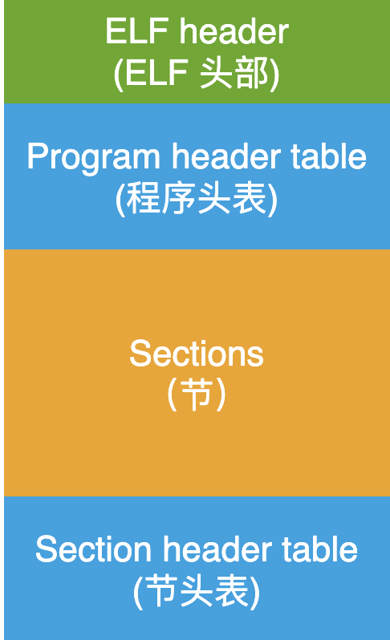
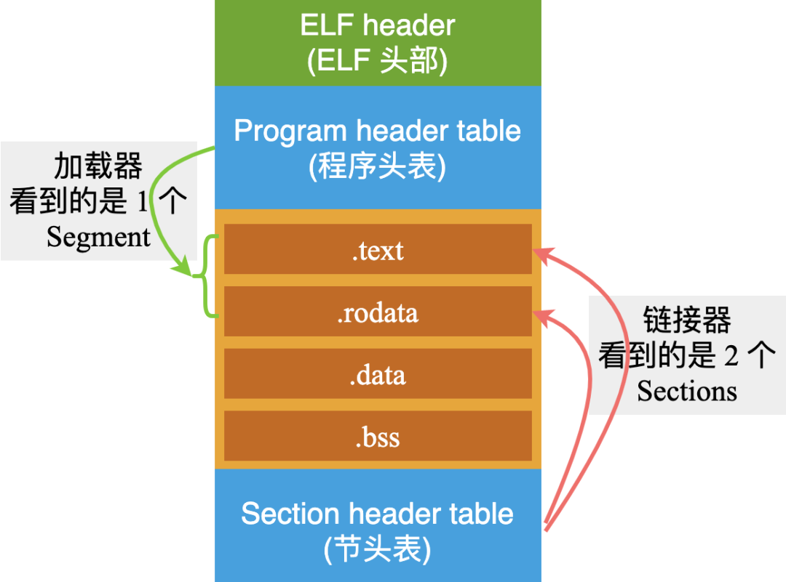

# Linux 系统中编译、链接的基石 - ELF 文件

## 初次见面
大家好，我是 ELF 文件，大名叫 Executable and Linkable Format。

经常在 Linux 系统中开发的小伙伴们，对于我肯定是再熟悉不过了，特别是那些需要了解编译、链接的家伙们，估计已经把我研究的透透的。

为了结识更多的小伙伴，今天呢，就是我的开放日，我会像洋葱一样，一层一层地拨开我的心，让更多的小伙伴来了解我，欢迎大家前来围观。

以前啊，我看到有些小伙伴在研究我的时候，看一下头部的汇总信息，然后再瞅几眼 Section 的布局，就当做熟悉我了。

从科学的态度上来说，这是远远不够的，未达究竟。

当你面对编译、链接的详细过程时，还是会一脸懵逼。

今天，我会从字节码的颗粒度，毫无保留、开诚布公、知无不言、言无不尽、赤胆忠心、一片丹心、鞠躬尽瘁、死而后已的把自己剖析一遍，让各位看官大开眼界、大饱眼福。

您了解这些知识之后呢，在今后继续学习编译、链接的底层过程，以及一个可执行程序在从硬盘加载到内存、一直到 main 函数的执行，心中就会非常的敞亮。

也就是说，掌握了 ELF 文件的结构和内容，是理解编译、链接和程序执行的基础。

你们不是有一句俗话嘛：磨刀不误砍柴工！

好了，下面我们就开始吧！

## 文件格式
作为一种文件，那么肯定就需要遵守一定的格式，我也不例外。
从宏观上看，可以把我拆卸成四个部分：



图中的这几个概念，如果不明白的话也没关系，下面我会逐个说明的。
在 Linux 系统中，一个 ELF 文件主要用来表示 3 种类型的文件：


既然可以用来表示 3 种类型的文件，那么在文件中，肯定有一个地方用来区分这 3 种情况。

也许你已经猜到了，在我的头部内容中，就存在一个字段，用来表示：当前这个 ELF 文件，它到底是一个可执行文件？是一个目标文件？还是一个共享库文件？

另外，既然我可以用来表示 3 种类型的文件，那么就肯定是在 3 种不同的场合下被使用，或者说被不同的家伙来操作我：
>可执行文件：被操作系统中的加载器从硬盘上读取，载入到内存中去执行;
>目标文件：被链接器读取，用来产生一个可执行文件或者共享库文件;
>共享库文件：在动态链接的时候，由 ld-linux.so 来读取;

就拿链接器和加载器来说吧，这两个家伙的性格是不一样的，它们看我的眼光也是不一样的。
链接器在看我的时候，它的眼睛里只有 3 部分内容：


也就是说，链接器只关心 ELF header, Sections 以及 Section header table 这 3 部分内容。
加载器在看我的时候，它的眼睛里是另外的 3 部分内容：


加载器只关心 ELF header, Program header table 和 Segment 这 3 部分内容。

对了，从加载器的角度看，对于中间部分的 Sections, 它改了个名字，叫做 Segments(段)。换汤不换药，本质上都是一样一样的。

可以理解为：一个 Segment 可能包含一个或者多个 Sections，就像下面这样：


这就好比超市里的货架上摆放的商品：有矿泉水、可乐、啤酒，巧克力，牛肉干，薯片。
从理货员的角度看：它们属于 6 种不同的商品；但是从超市经理的角度看，它们只属于 2 类商品：饮料和零食。
怎么样？现在对我已经有一个总体的印象了吧？
其实只要掌握到 2 点内容就可以了：
>一个 ELF 文件一共由 4 个部分组成;
>链接器和加载器，它们在使用我的时候，只会使用它们感兴趣的部分;
还有一点差点忘记给你提个醒了：在 Linux 系统中，会有不同的数据结构来描述上面所说的每部分内容。

我知道有些小伙伴比较性急，我先把这几个结构体告诉你。

初次见面，先认识一下即可，千万不要深究哦。

描述 ELF header 的结构体：

## ELF 头结构
描述 ELF header 的结构体：


描述 Program header table 的结构体：


描述 Section header table 的结构体：


### ELF header(ELF 头)
头部内容，就相当于是一个总管，它决定了这个完整的 ELF 文件内部的所有信息，比如：
>这是一个 ELF 文件;
>一些基本信息：版本，文件类型，机器类型;
>Program header table(程序头表)的开始地址，在整个文件的什么地方;
>Section header table(节头表)的开始地址，在整个文件的什么地方;

你是不是有点纳闷，好像没有说 Sections(从链接器角度看) 或者 Segments(从加载器角度看) 在 ELF 文件的什么地方。

为了方便描述，我就把 Sections 和 Segments 全部统一称为 Sections 啦！

其实是这样的，在一个 ELF 文件中，存在很多个 Sections，这些 Sections 的具体信息，是在 Program header table 或者 Section head table 中进行描述的。

就拿 Section head table 来举例吧：

假如一个 ELF 文件中一共存在 4 个 Section: .text、.rodata、.data、.bss，那么在 Section head table 中，将会有 4 个 Entry(条目)来分别描述这 4 个 Section 的具体信息(严格来说，不止 4 个 Entry，因为还存在一些其他辅助的 Sections)，就像下面这样：


在开头我就说了，我要用字节码的粒度，扒开来给你看！

为了不耍流氓，我还是用一个具体的代码示例来描述，只有这样，你才能看到实实在在的字节码。

程序的功能比较简单：


```c
// mymath.c
int my_add(int a, int b)
{
    return a + b;
}
// main.c

#include <stdio.h>
extern int my_add(int a, int b);

int main()
{
   int i = 1;
   int j = 2;
   int k = my_add(i, j);
   printf("k = %d \n", k);
}
```
从刚才的描述中可以知道：动态库文件 libmymath.so, 目标文件 main.o 和 可执行文件 main，它们都是 ELF 文件，只不过属于不同的类型。
这里就以可执行文件 main 来拆解它！
我们首先用指令 readelf -h main 来看一下 main 文件中，ELF header 的信息。

>readelf 这个工具，可是一个好东西啊！一定要好好的利用它。


这张图中显示的信息，就是 ELF header 中描述的所有内容了。这个内容与结构体 Elf32_Ehdr 中的成员变量是一一对应的！

有没有发现图中第 15 行显示的内容：Size of this header: 52 (bytes)。

也就是说：ELF header 部分的内容，一共是 52 个字节。那么我就把开头的这 52 个字节码给你看一下。

这回，我用 od -Ax -t x1 -N 52 main 这个指令来读取 main 中的字节码，简单解释一下其中的几个选项：
>-Ax: 显示地址的时候，用十六进制来表示。如果使用 -Ad，意思就是用十进制来显示地址;
>-t -x1: 显示字节码内容的时候，使用十六进制(x)，每次显示一个字节(1);
>-N 52：只需要读取 52 个字节;

这 52 个字节的内容，你可以对照上面的结构体中每个字段来解释了。


首先看一下前 16 个字节。

在结构体中的第一个成员是 unsigned char e_ident[EI_NIDENT];，EI_NIDENT 的长度是 16，代表了 EL header 中的开始 16 个字节，具体含义如下：
0 - 15 个字节


怎样样？我以这样的方式彻底暴露自己，向你表白，足以表现出我的诚心了吧？！

如果被感动了，别忘记在文章的最底部，点击一下在看和收藏，也非常感谢您转发给身边的小伙伴。赠人玫瑰，手留余香！

为了权威性，我把官方文档对于这部分的解释也贴给大家看一下：
