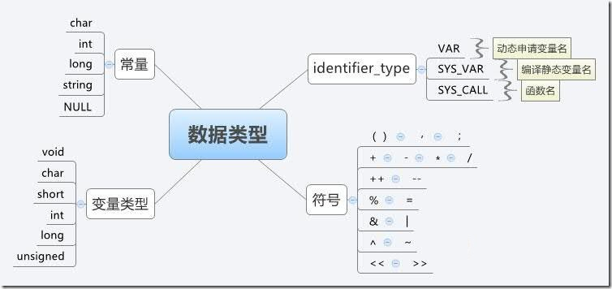
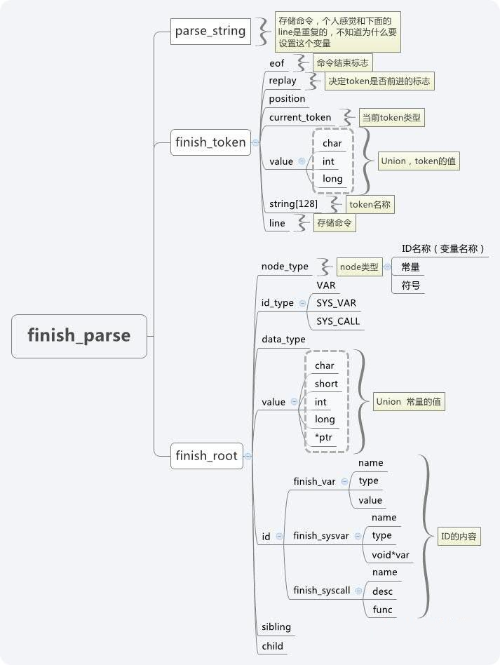

# 1. 自定义Finsh命令

​	除了Finsh自带命令，Finsh还提供多个宏接口来导出自定义命令，导出的命令可以直接在Finsh中执行

## 1.1 自定义msh命令

​	自定义的 `msh` 命令，可以在msh模式下被运行，将一个命令导出到msh模式可以使用如下的宏接口：

```c
MSH_CMD_EXPORT(command, desc);   //命令及其描述
```

​	这个命令可以导出有参数的命令，也可以导出无参数的命令。导出无参数的命令时，函数的入参为void，示例如下：

```c
void hello(void)
{
    rt_kprintf("hello world!\n");
}
MSH_CMD_EXPORT(hello, say hello to rt);
```

导出有参数的命令时，函数入参为`int argc, char *argv[]`, 示例如下：

```c
static void atcmd(int argc, char *argv[])
{
    ... 
}
MSH_CMD_EXPORT(atcmd, atcmd useage: atcmd <server|client>);
```

## 1.2 自定义C-style命令和变量

​	将自定义命令导出到C-style模式可以使用如下接口：

```c
#define FINSH_FUNCTION_EXPORT(name, desc);
```

​	与msh类似，不赘述。

## 1.3  自定义命令重命名

​	Finsh的函数名字长度有一定限制，它由 `finsh.h` 中的宏定义 `FINSH_NAME_MAX` 控制，默认为16字节，这意味着Finsh命令长度不能超出16字节。这里有个潜在的问题：当一个函数名长度超过16字节后，使用FINSH_FUNCTION_EXPORT导出这个函数到命令表后，在finsh符号表中可以看到完整的函数名，但是完整输入执行会出现`null node` 错误。这是因为虽然显示了完整的函数名，但是实际上Finsh中却保存了前16字节作为命令， 过多的输入会导致无法正确找到命令，这时就可以使用 `FINSH_FUNCTION_EXPORT_ALIAS` 来对导出的命令进行重命名。

```c
FINSH_FUNCTION_EXPORT_ALIAS(name, alias, desc)
```


| 参数  | 描述                    |
| :---- | ----------------------- |
| name  | 要导出的命名            |
| alias | 导出到Finsh时显示的名字 |
| desc  | 导出命令的描述          |

在重命名的命令名字前加 `__cmd_` 就可以将命令导出到msh模式，否则，命令会被导出到C-style模式


# 2. Finsh分析之语法解析器

​	如果说linux 的shell是属于脚本类的语言风格，那finsih  shell的语言风格明显是c的。毕竟c比较偏底层，资源占用少，这个对于资源贫瘠的嵌入式系统而言是非常适合的。finsh  shell从usart获取文本信息，在根据一定的语法规矩将文本语言重新按执行顺序组织一遍，最后再将重新组织的语句翻译成汇编指令，最后交由cpu执 行指令。当然finsih shell的汇编指令都是伪汇编指令，而且执行的环境也是虚拟出来的，而这个是编译执行过程，我之后再提。 

## 2.1 数据类型 

  语句的执行是以数据为基础的。受限于系统的架构，finsh shell里面的数据类型并不多，整体来说分成以下几个部分

 		

​	针对上述的代码，在int  a中，int是指代变量类型，a是变量名，因为这条指令是在串口中读取的，所以a是动态申请的变量，隶属于VAR中。像‘1’‘2’‘3’是属于int型 常量，而“+”“*”“-”是符号。而SYS_VAR和SYS_CALL是在编译的时候生成的，分别通过宏FINSH_VAR_EXPORT和 FINSH_FUNCTION_EXPORT添加到系统中的。

```c
    long hello()
    {
       rt_kprintf("Hello RT-Thread!\n");
       return 0;
    }
    FINSH_FUNCTION_EXPORT(hello, say hello world);
```

​	对于上述的hello函数，通过调用FINSH_FUNCTION_EXPORT就可以添加到finsh shell中，在终端中输入hello（），串口就可以打印"Hello RT-Thread!"。

```c
    #define FINSH_FUNCTION_EXPORT(name, desc)                     \
            const char __fsym_##name##_name[] = #name;                     \
            const char __fsym_##name##_desc[] = #desc;                     \
            const struct finsh_syscall __fsym_##name SECTION("FSymTab")= \
            {                            \
                __fsym_##name##_name,    \
                __fsym_##name##_desc,    \
                (syscall_func)&name        \
            };
```

## 2.2 函数调用 

具体分析FINSH_FUNCTION_EXPORT(hello, say hello world)，其实这个宏就是申请了**3个变量_fsym_hello_name[]=’hello’,_fsm_hello_desc[]=’Hello RT-Thread!\n’,** 		

  **_fsym_hello={_fsym_hello_name，,_fsm_hello_desc，hello}**。 说穿了就是_fsym_hello里有3个4字节的指针，分别指向_fsym_hello_name,_fsm_hello_desc[]和 hello()函数。那_fsym_hello是如何和SYS_CALL扯上关系的呢？这就要从SECTION("FSymTab")说起了。 SECTION()是一个宏变量，针对不同的编译平台对于不同的操作，但无论编译平台如何其作用是相同的。本人编译平台是MDK，打开rtthread- stm32.sct文件我们可以看到 		

```asm
    LR_IROM1 0x08000000 0x00080000 { ; load region size_region
      ER_IROM1 0x08000000 0x00080000 { ; load address = execution address
       *.o (RESET, +First)
       *(InRoot$$Sections)
       .ANY (+RO)
      }
      RW_IRAM1 0x20000000 0x00010000 { ; RW data
       .ANY (+RW +ZI)
      }
    }
```

​	这个文件作用主要是指出了编译工程后链接文件的各个段的地址空间。我们知道编译程序一般会生成text,rodata,data,bss以及一些其他的 段，我们可以通过sct将某个函数的代码段放到某个地址空间，也可以将它的数据段放到另一个地址空间。一般来说，我们不会蛋疼的去安排每个.c文件或是函 数的链接地址空间，因为系统已经默认优化好了但是我们必须知道是可以通过修改sct来改变链接地址空间的。这个相信研究过linux内核编译的同学一定心 领神会。然后再看rtthread-stm32.map文件，我截取了与FSymTab相关的一段。 		

```asm
    FSymTab$$Base       0x08013614   Number   0 led.o(FSymTab)
     __fsym_led         0x08013614   Data    12 led.o(FSymTab)
     __fsym_list_mem    0x08013620   Data    12 mem.o(FSymTab)
     __fsym_hello       0x0801362c   Data    12 cmd.o(FSymTab)
     __fsym_version     0x08013638   Data    12 cmd.o(FSymTab)
     __fsym_list_sem    0x08013644   Data    12 cmd.o(FSymTab)
     __fsym_list_event  0x08013650   Data    12 cmd.o(FSymTab)
     __fsym_list_mutex  0x0801365c   Data    12 cmd.o(FSymTab)
     __fsym_list_mailbox  0x08013668 Data    12 cmd.o(FSymTab)
     __fsym_list_msgqueue 0x08013674 Data    12 cmd.o(FSymTab)
     __fsym_list_mempool  0x08013680 Data    12 cmd.o(FSymTab)
     __fsym_list_timer  0x0801368c   Data    12 cmd.o(FSymTab)
     __fsym_list_device 0x08013698   Data    12 cmd.o(FSymTab)
     __fsym_list        0x080136a4   Data    12 cmd.o(FSymTab)
     __fsym_ls          0x080136b0   Data    12 dfs_raw.o(FSymTab)
     __fsym_mkdir       0x080136bc   Data    12 dfs_raw.o(FSymTab)
     __fsym_rm          0x080136c8   Data    12 dfs_raw.o(FSymTab)
     __fsym_cat         0x080136d4   Data    12 dfs_raw.o(FSymTab)
     __fsym_mkfs        0x080136e0   Data    12 dfs_elm.o(FSymTab)
    FSymTab$$Limit      0x080136ec   Number   0 dfs_elm.o(FSymTab)
    Region$$Table$$Base 0x080136ec   Number   0 anon$$obj.o(Region$$Table)
    Region$$Table$$Limit 0x0801370c  Number   0 anon$$obj.o(Region$$Table)
    VSymTab$$Base        0x0801370c  Number   0 cmd.o(VSymTab)
      __vsym_dummy      0x0801370c   Data    16 cmd.o(VSymTab)
    VSymTab$$Limit      0x0801371c   Number   0 cmd.o(VSymTab)
```

相信大家找到了fsym_hello了吧，所谓的SECTION("FSymTab")也就是把fsym_hello这个12个字节的常量，保存在FsymTab这个段内，链接的时候根据sct文件安排按顺序将FSymTab放到Flash的地址空间里去。也就是说，无论我在这个或那个文件用调用了FINSH_FUNCTION_EXPORT，说生成的_fsym***一定是连续分布在flash的地址空间了。FINSH_VAR_EXPORT的执行原理和FINSH_FUNCTION_EXPORT一样，只不过存的是变量的地址，我就不再重复说明了。

  **至于为什么要这么大费周章的将FSymTab和VSymTab的变量放到一起，就是为了方便生成syscall_table和sysvar_table。在finsh_system_init中有两个函数** 


```c
    finsh_system_function_init(&FSymTab$$Base, &FSymTab$$Limit);
	finsh_system_var_init(&VSymTab$$Base, &VSymTab$$Limit);

	void finsh_system_function_init(void* begin, void* end)
    {
        _syscall_table_begin = (struct finsh_syscall*) begin;
        _syscall_table_end = (struct finsh_syscall*) end;
    }
    void finsh_system_var_init(void* begin, void* end)
    {
        _sysvar_table_begin = (struct finsh_sysvar*) begin;
        _sysvar_table_end = (struct finsh_sysvar*) end;
    }
```

 再看一下rtthread-stm32.map，是不是找到了**FSymTab$$Base,FSymTab$$Limit**和**VSymTab$$Base,VSymTab$$Limit**，就这样我们生成了syscall_table和sysvar_table，而这系统就是用这两个表来查找SYS_CALL和SYS_VAR变量的。

 除了静态的生成SYS_CALL函数外，rt_thread也支持动态的加载SYS_CALL函数。 		

```c
    void finsh_syscall_append(const char* name, syscall_func func)
    {
        /* create the syscall */
        struct finsh_syscall_item* item;
        item = (struct finsh_syscall_item*)rt_malloc(sizeof(struct finsh_syscall_item));
        if (item != RT_NULL)
        {
            item->next = NULL;
            item->syscall.name = strdup(name);
            item->syscall.func = func;
            if (global_syscall_list == NULL)
            {
                global_syscall_list = item;
            }
            else
            {
                item->next = global_syscall_list;
                global_syscall_list = item;
            }
        }
    }
```

   注意这里将函数添加到了global_syscall_list链表中了，而这个链表的功能是相当于syscall_table的，只不过它是负责动态生成的SYS_CALL。与之对应的有global_sysvar_list链表，其对应的是SYS_VAR。


# 3. Finsh分析之命令的分割与加工

介绍完了finsh shell的数据类型，我现在开始说明语法解释器的运行流程。finsh shell初始化函数finsh_system_init完成的功能很简单，主要有4个方面： 				

1. 1. 初始化syscall_table和sysvar_table,这是通过记录下FSymTab和VSymTab在flash中的起始地址和结束地址来完成的。这个我在数据类型中已经提过了	
   2. 分配finsh shell结构体shell，这是整个finsh shell核心的结构体。 						
   3. 分配并初始化shell中的rx_sem信号量，注意这里信号量的value的值是0，说明一旦有进程请求该信号量，这个进程就会被阻塞。 						
   4. 创建tshell进程，进程的执行函数为finsh_thread_entry，并将其置为运行态。关于进程的优先级时间片之类的我就不分析了，这和具体的系统需求有关，如果你希望finsh shell响应命令更快就可以提高其优先级。 						

​    调度器启动后，但tshell成为运行态最高优先级后，系统就会运行finsh_thread_entry，最先调用的是finsh_init，它主要是 对shell里面的一些变量和全局变量进行初始化设置，比如finish_parse、 globe_node_talbe,global_variable之类的，后面都会说到，目前先按下不表。

   随后，tshell会被rx_sem阻塞住，直finsh  shell注册的usart接收中断后，调finsh_rx_ind释放rx_sem去唤醒tshell去接收串口数据。串口数据是一个字节一个字节的读 取的，并对每个字节进行分析。其他一些关于历史记录、自动补全的shell功能我就不提，重点是每当系统接收到一个回车符（windows和posix的 回车符是不同的，rt_thread已经有了针对的程序分支），就认为用户输入了一段完整的命令，开始调用finsh_run_line来进行语法分析。 这段命令会以‘；’为分隔符，被分成一句一句的命令，而这一句一句的命令就会被语法解释器分解成上文提过的各种数据类型，从而被系统的虚拟机识别，最后运 行。而组织这些数据类型的最关键的结构就是finish_parse: 

	


命令语句的读取和命令语句的执行不一定以相同的顺序执行，就拿我上一篇举的例子 					

   int a=2+3×(2-1); 					

​    命令读取自然是从开始到‘；’结束，但是命令的的执行确不是这样的。我们按顺序读取2+3×（2-1），但命令是最先从2-1开始执行的，因此在读取和执 行之间需要相应的转换措施  。不仅仅如此，对于这个命令，系统要清楚的知道‘int’是向内存空间声明变量，‘=’是赋值运算，‘2’是常量，‘+’是加法运算，从文本到它对应的实 际含义同样也需要一定的转换机制。而finsh shell提供的语法解释器恰好完成了这样的工作。 			

​    finish_parse是这个语法解释器的核心，你可以把它想象成工厂的流水生产线。parse_string是命令流水线，finsh_token是 加工车床。随着position的递增，推动命令一个字符一个字符进入finish_token。而finish_token加工命令不是以字符为单位 的，它是以token为单位的，比如‘int’是一个token，‘a’，‘2’，‘=‘也都是token。每当finish_token从流水线上获取 一个token后，它就停止流水线开始加工产品了。通过finish_token的加工，文本字符的命令被识别，重组生成finish_node这个半成 品零件。我们的虚拟机不识别文本的‘2’，但它能够识别加工后的finish_node——2。这样我们的生产线将命令原料以token为单位分割，加工 成一个个finish_node，但这样我们只是解决了之前提及的第二个问题，执行顺序的问题还是需要其他的方式解决。 				

​    由于我们完成了文本到finish_node的加工，我们可以从finish_node获取那些符号变量，比如‘=’‘+’‘（）’之类的，c对符号运 算有一个优先级表，finish_token会按照优先级表，利用符号将剩下的finish_node组织起来拼接起来，从而完成我们虚拟机可以直接运行 的命令指令。这样语法解释器的功能就完成了。 

​    本篇我主要讲述finsh_token是如何分割和加工命令。首先finsh_token从line从获取整句命令，再用 token_trim_space消除前面的空格和制表符，然后用token_get_string提供token的名称。token类型不外乎是关键 词、变量、常量和符号。而变量名称是一由字母数字和下划线组成的开头不为数字的组合，关键词一共就那么几个，剩下的不是符号的就是常量。当然常量有多种类 型，符号也有多种，但总的来说识别过程到不是很复杂，看看源码相信很快就能明白。不管要注意，只有常量的值会存放在finish_token的value 中，毕竟符号没有值，变量只是个名称，只有常量才有value。 				

   token类型识别后，我们需要将它转为响应的node。读这个识别的过程不可谓不辛苦，涉及十几个函数，又是循环又是递归，真的要介绍起来实在不知如何下手。原谅我偷个懒，绕开繁琐的过程，只是从转换好的结果说起吧。 				

​    token类型如果是符号的话，其转换过程是最为简单的。毕竟符号只是代表了单纯一个操作，没有涉及数据内容。生成符号node的函数也非常简单，调 finsh_node_allocate(type)就搞定了。符号node里的相关内容只有一个，那就是node_type也就是参数type。而具体 的type，可以从finsh_token_type中找到。 				

  稍微复杂一点的是常量，比如说‘2’，它的node里node_type=finsh_token_type_value_int，而value.int=2。Value放的是常量的值，node_type放的是常量的类型。 				

​    最为复杂的是变量，常量的类型我们可以从名称中判断出来，但我们却不能从变量名称中了解到这个变量究竟是数字、字符串抑或是函数。幸好按照c语言，一个 变量再使用前必须要声明，在finsh  shell中，声明变量的有三种方案。第一种是静态的编译时申请的，主要是通过FINSH_FUNCTION_EXPORT来声明函数变量，用 FINSH_VAR_EXPORT来声明其他的变量。第二种是系统运行时声明的，通过调用finsh_sysvar_append和 finsh_syscall_append，来动态添加。而其他的变量可以通过输入关键词声明+名称来完成声明，比如说上面命令里的‘int  a’。除了之前提过的SYS_VAR和SYS_CALL，finsih  shell还有一个VAR变量类，VAR对应的是这类的变量声明，它对应的内存区为global_variable。就拿‘int  a‘来说，系统调用了finsh_var_insert函数从global_variable表中找出空闲的VAR，并将a的名称‘a‘和变量类型 ‘int’赋给它。当然这个VAR还有一个value的值，声明的时候是不用管它的，就像c语言里，声明变量时不用考虑变量的值，道理是一样的。 					

​    每当读取一个变量名称时，finsh  shell会调用finsh_node_new_id来在全局域中找之前的声明变量，一旦变量名有符合的全局变量，就将建立相应的node，并将其与找到 的全局变量的内存地址对应起来。全部变量声明的类型一共有三个，global_variable存放的是VAR变量，sysvar_table和 global_sysvar_list放的是SYS_VAR变量，  syscall_table和global_syscall_list放的是SYS_CALL函数变量。但找到对应的变量 后，finsh_node_new_id会分配以node，其node_type=ID,id_type为变量类型。根据id_type,其变量的值id 分为finish_var,finish_sysvar和finish_syscall，而id对应着变量的名称、描述符和指向变量实体的指针。 				

   至于node的分配，和VAR分配的原理一样，也是从一块全局表中取出的。这样静态分配的坏处就是分配的变量数目是有限的，一旦超出预设值，就不能分配了。 					

​    到这里finsh_parse就把原来文本形式的命令加工了一个个散列的符号、常量和变量的node。这样的node是不能直接交给虚拟机的，还需要进 行重组。而所谓的重组就是以符号node为茎，以常量和变量node为叶，以符号优先级为序，拼接的过程，这个我们下篇再讲。 				
