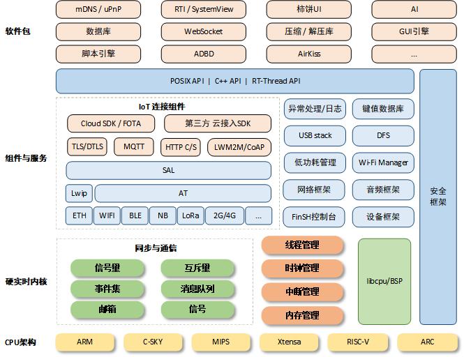
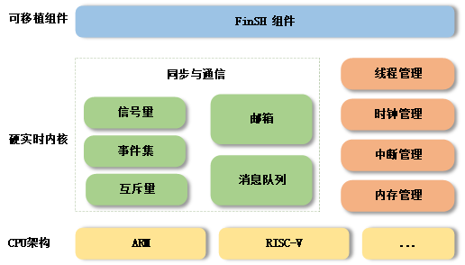
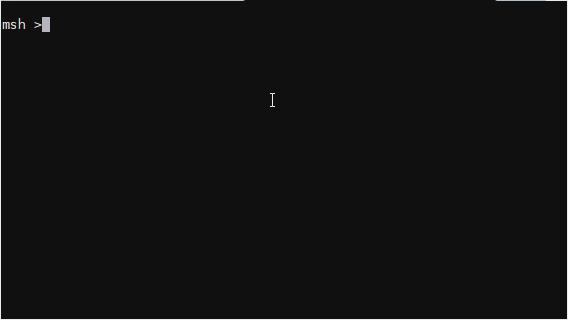
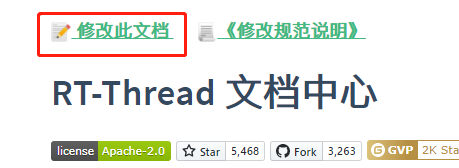
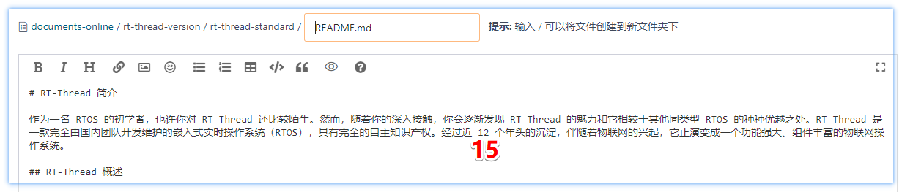
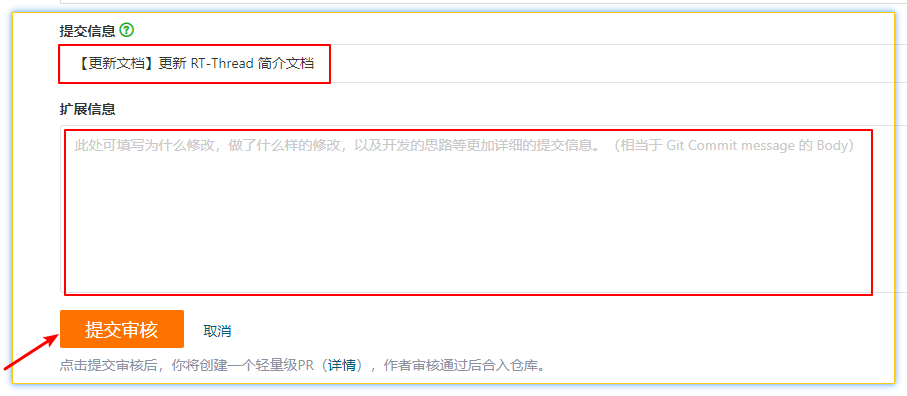

[](#入门学习)
[](#进阶学习)
[](#应用开发)

<p style="color: #AD5D0F;font-size: 22px; ;">
初次使用 RT-Thread 操作系统进行开发的小伙伴，可以参考本篇文档的学习路线进行上手入门。
</P>

# 版本简介

<!-- tabs:start -->

## ** 标准版本 **

RT-Thread，全称是 Real Time-Thread，顾名思义，它是一个嵌入式实时多线程操作系统，基本属性之一是支持多任务，允许多个任务同时运行并不意味着处理器在同一时刻真地执行了多个任务。事实上，一个处理器核心在某一时刻只能运行一个任务，由于每次对一个任务的执行时间很短、任务与任务之间通过任务调度器进行非常快速地切换（调度器根据优先级决定此刻该执行的任务），给人造成多个任务在一个时刻同时运行的错觉。在 RT-Thread 系统中，任务是通过线程实现的，RT-Thread 中的线程调度器也就是以上提到的任务调度器。

RT-Thread 主要采用 C 语言编写，浅显易懂，方便移植。它把面向对象的设计方法应用到实时系统设计中，使得代码风格优雅、架构清晰、系统模块化并且可裁剪性非常好。针对资源受限的微控制器（MCU）系统，可通过方便易用的工具，裁剪出仅需要 3KB Flash、1.2KB RAM 内存资源的 NANO 版本（NANO 是 RT-Thread 官方于 2017 年 7 月份发布的一个极简版内核)；而对于资源丰富的物联网设备，RT-Thread 又能使用在线的软件包管理工具，配合系统配置工具实现直观快速的模块化裁剪，无缝地导入丰富的软件功能包，实现类似 Android 的图形界面及触摸滑动效果、智能语音交互效果等复杂功能。

相较于 Linux 操作系统，RT-Thread 体积小，成本低，功耗低、启动快速，除此以外 RT-Thread 还具有实时性高、占用资源小等特点，非常适用于各种资源受限（如成本、功耗限制等）的场合。虽然 32 位 MCU 是它的主要运行平台，实际上很多带有 MMU、基于 ARM9、ARM11 甚至 Cortex-A 系列级别 CPU 的应用处理器在特定应用场合也适合使用 RT-Thread。

适用于需要使用 RT-Thread 的丰富功能，如各类外设、物联网组件、软件包等的场景。[更多...](/rt-thread-version/rt-thread-standard/README.md)



## ** Nano 版本  **

RT-Thread Nano 是一个极简版的硬实时内核，它是由 C 语言开发，采用面向对象的编程思维，具有良好的代码风格，是一款可裁剪的、抢占式实时多任务的 RTOS。其内存资源占用极小，功能包括任务处理、软件定时器、信号量、邮箱和实时调度等相对完整的实时操作系统特性。适用于家电、消费电子、医疗设备、工控等领域大量使用的 32 位 ARM 入门级 MCU 的场合。

下图是 RT-Thread Nano 的软件框图，包含支持的 CPU 架构与内核源码，还有可拆卸的 FinSH 组件：



**支持架构**：ARM：Cortex M0/ M3/ M4/ M7 等、RISC-V 及其他。

**功能**：线程管理、线程间同步与通信、时钟管理、中断管理、内存管理。[更多...](/rt-thread-version/rt-thread-nano/an0038-nano-introduction.md)

## ** Smart 版本 **


RT-Thread Smart 是基于 RT-Thread 操作系统上的混合操作系统，简称为 rt-smart，它把应用从内核中独立出来，形成独立的用户态应用程序，并具备独立的地址空间（32 位系统上是 4G 的独立地址空间）。

以下是 rt-smart 的整体结构框图，在硬件平台的基础上通过 MMU、系统调用的方式把整个系统分成了内核态及用户态。[更多...](/rt-thread-version/rt-thread-smart/rt-smart-quickstart/rt-smart-quickstart.md)


<!-- tabs:end -->


# 学习路线

从版本简介中可以看出，`Nano 版本` 是 `标准版本` 的极简内核版本，`Smart 版本` 是在 `标准版本` 上增加了用户态创造而来，所以学习 `标准版本` 是学习 RT-Thread 的基础。本篇文章以学习 **RT-Thread 标准版本** 为例，为初学者制定学习路线如下，分为入门学习、进阶学习、应用开发。
## 入门学习

<!-- tabs:start -->

### ** 无 RTOS 经验 **

<!--  <font size=5 > 无 RTOS 经验 </font> -->

**针对人群：有 C 语言、嵌入式基础，想系统学习 RT-Thread 操作系统**

#### 模拟运行

[Keil MDK 模拟器 STM32F103 体验](/rt-thread-version/rt-thread-standard/tutorial/quick-start/stm32f103-simulator/stm32f103-simulator.md)

#### 快速上手

推荐使用 [潘多拉开发板](https://item.taobao.com/item.htm?id=583527145598) 配套使用 [潘多拉开发板教程. pdf](https://www.rt-thread.org/document/site/tutorial/iot_board_tutorial.pdf)，或者以下主流的学习板进行学习，不建议没有任何基础就将 RT-Thread 移植到一块开发板上。

- [RT-Thread 潘多拉 STM32L475 上手指南](/rt-thread-version/rt-thread-standard/tutorial/quick-start/iot_board/quick-start.md)
- [野火霸道 STM32F103 上手指南](/rt-thread-version/rt-thread-standard/tutorial/quick-start/stm32f103-fire-arbitrary/quick-start.md)
- [正点原子 nanoSTM32F103 上手指南](/rt-thread-version/rt-thread-standard/tutorial/quick-start/stm32f103-atk-nano/quick-start)
- [野火挑战者 STM32F429 上手指南](/rt-thread-version/rt-thread-standard/tutorial/quick-start/stm32f429-fire-challenger/quick-start.md)
- [正点原子探索者 STM32F407 上手指南](/rt-thread-version/rt-thread-standard/tutorial/quick-start/stm32f407-atk-explorer/quick-start.md)
- [正点原子阿波罗 STM32F429 上手指南](/rt-thread-version/rt-thread-standard/tutorial/quick-start/stm32f429-atk-apolo/quick-start.md)
- [野火 I.MX RT1052 上手指南](/rt-thread-version/rt-thread-standard/tutorial/quick-start/imxrt1052-fire-mini/quick-start.md)
- [正点原子 I.MX RT1052 号令者上手指南](/rt-thread-version/rt-thread-standard/tutorial/quick-start/imxrt1052-atk-commander/quick-start.md)
- [其他...](/rt-thread-version/rt-thread-standard/tutorial/quick-start/iot_board/quick-start.md)

#### 内核学习

[内核视频教程](https://www.rt-thread.org/page/video.html)

[《内核实验手册》](https://www.rt-thread.org/document/site/rt-thread-version/rt-thread-standard/tutorial/experimental-manual/experimental-manual.pdf)

### ** 有 RTOS 经验 **

<!-- <font size=5 > 有 RTOS 经验 </font> -->

**针对人群：学过 FreeRTOS 或 uC/OS, 想把 RT-Thread 使用起来**

#### 快速上手

准备一块板子，根据 RT-Thread 支持的板子 BSP 进行 [快速上手](/rt-thread-version/rt-thread-standard/tutorial/quick-start/more.md)，或者根据 [STM32 系列 BSP 制作教程进行移植](https://github.com/RT-Thread/rt-thread/blob/master/bsp/stm32/README.md)。

如果使用 Ubuntu 进行开发，可以参考：[在 Ubuntu 下开发 RT-Thread](/rt-thread-version/rt-thread-standard/application-note/setup/qemu/windows/an0006-qemu-windows.md)。

#### 编程指南

快速学习内核，参考:[《RT-Thread 编程指南》](https://www.rt-thread.org/download/manual/um4003-rtthread-programming-manual.pdf)。

#### API 手册
查看 [在线 API 手册](https://www.rt-thread.org/document/api/) 或 [下载 API 手册](https://www.rt-thread.org/document/api/api.zip)。

#### 第三方 RTOS 兼容层
为方便之前有其他 RTOS 使用经验的用户快速上手 RT-Thread，以及将基于其他 RTOS 的 API 编写的应用层代码快速移植到 RT-Thread 上，RT-Thread 社区编写了第三方 RTOS 兼容层。目前支持以下第三方 RTOS 的 API 无感移植：

- [uCOS-II操作系统兼容层](https://github.com/mysterywolf/RT-Thread-wrapper-of-uCOS-II)
- [uCOS-III操作系统兼容层](https://github.com/mysterywolf/RT-Thread-wrapper-of-uCOS-III)

<!-- tabs:end -->

## 进阶学习

<!-- tabs:start -->

### ** 开发工具 **
#### Env 工具

Env 工具：Env 工具用于对源码功能进行配置或裁减，可以生成 MDK/IAR/GCC 工程，需要配合 MDK/IAR/GCC 使用，详见 [Env 用户手册](/development-tools/env/env.md)。

#### RT-Thread IDE

RT-Thread Studio ：可以在 Studio 中下载源码包并创建 rt-thread 工程，独立完成开发、编译、下载、调试等功能，并能进行功能裁剪，详见 [RT-Thread Studio 用户手册](/development-tools/rtthread-studio/um/studio-user-manual.md)。

### ** 设备与驱动 **

<!--  <font size=5 > 设备与驱动 </font> -->

[IO 设备模型](/rt-thread-version/rt-thread-standard/programming-manual/device/device.md)

[PIN 设备](/rt-thread-version/rt-thread-standard/programming-manual/device/pin/pin.md)

[UART 设备](/rt-thread-version/rt-thread-standard/programming-manual/device/uart/uart_v1/uart.md)

[UART 设备V2版本](/rt-thread-version/rt-thread-standard/programming-manual/device/uart/uart_v2/uart.md)

[CAN 设备](/rt-thread-version/rt-thread-standard/programming-manual/device/can/can.md)

[HWTIMER 设备](/rt-thread-version/rt-thread-standard/programming-manual/device/hwtimer/hwtimer.md)

[I2C 设备](/rt-thread-version/rt-thread-standard/programming-manual/device/i2c/i2c.md)

[PWM 设备](/rt-thread-version/rt-thread-standard/programming-manual/device/pwm/pwm.md)

[RTC 设备](/rt-thread-version/rt-thread-standard/programming-manual/device/rtc/rtc)

[SPI 设备](/rt-thread-version/rt-thread-standard/programming-manual/device/spi/spi)

[WATCHDOG 设备](/rt-thread-version/rt-thread-standard/programming-manual/device/watchdog/watchdog)

[SENSOR 设备](/rt-thread-version/rt-thread-standard/programming-manual/device/sensor/sensor)

[更多...](/rt-thread-version/rt-thread-standard/programming-manual/device/device.md)
### ** 组件 **

<!--  <font size=5 > 组件 </font> -->

[FinSH 控制台](/rt-thread-version/rt-thread-standard/programming-manual/finsh/finsh)

[文件系统](/rt-thread-version/rt-thread-standard/programming-manual/filesystem/filesystem)

[netdev 网卡](/rt-thread-version/rt-thread-standard/programming-manual/netdev/netdev)

[SAL 套接字抽象层](/rt-thread-version/rt-thread-standard/programming-manual/sal/sal)

[AT 命令](/rt-thread-version/rt-thread-standard/programming-manual/at/at)

[ulog 日志](/rt-thread-version/rt-thread-standard/programming-manual/ulog/ulog)

[utest 测试框架](/rt-thread-version/rt-thread-standard/programming-manual/utest/utest)

[动态模块](/rt-thread-version/rt-thread-standard/programming-manual/dlmodule/dlmodule)

[POSIX 接口](/rt-thread-version/rt-thread-standard/programming-manual/posix/posix)

[电源管理](/rt-thread-version/rt-thread-standard/programming-manual/pm/pm)

[更多...](/rt-thread-version/rt-thread-standard/programming-manual/finsh/finsh)

<!-- tabs:end -->

## 应用开发

| 应用开发列表 | 应用开发列表 |
| ------------------------------------------------------------ | ------------------------------------------------------------ |
| [使用 Eclipse 开发 RT-Thread](/rt-thread-version/rt-thread-standard/application-note/setup/qemu/eclipse/an0020-qemu-eclipse) | [CmBacktrace应用](https://www.rt-thread.org/document/site/application-note/debug/cmbacktrace/an0013-CmBacktrace/) |
| [使用 VS Code 开发 RT-Thread](/rt-thread-version/rt-thread-standard/application-note/setup/qemu/vscode/an0021-qemu-vscode) | [在STM32 Nucleo 开发板上使用 RW007 WiFi 模块](https://www.rt-thread.org/document/site/application-note/packages/rw007_module_using/an0034-rw007-module-using) |
| [使用 Env 创建 RT-Thread 项目工程](/rt-thread-version/rt-thread-standard/application-note/setup/standard-project/an0017-standard-project) | [在 STM32L4 上应用 littlefs 文件系统](https://www.rt-thread.org/document/site/application-note/components/dfs/an0027-littlefs/) |
| [搭建RT-Thread项目框架](https://www.rt-thread.org/document/site/application-note/setup/standard-project/an0017-standard-project/) | [在潘多拉上使用 SFUD 操作 Flash](https://www.rt-thread.org/document/site/application-note/components/sfud/an0048-sfud/) |
| [在IoT Board上实现电源管理](https://www.rt-thread.org/document/site/application-note/system/pm/an0025-pm/) | [STM32 通用 Bootloader](https://www.rt-thread.org/document/site/application-note/system/rtboot/an0028-rtboot/) |
| [网络协议栈驱动移植](https://www.rt-thread.org/document/site/application-note/components/network/an0010-lwip-driver-porting/) | [wireshark 抓取 tls 数据包](https://www.rt-thread.org/document/site/application-note/packages/mbedtls_wireshark_sniffer/an0029-mbedtls_wireshark_sniffer) |
| [在STM32F429上应用网络功能](https://www.rt-thread.org/document/site/application-note/components/network/an0011-network-started/) | [在 STM32 上应用 C++](https://www.rt-thread.org/document/site/application-note/components/cplusplus/an0035-cpp/) |
| [在STM32F429上应用文件系统](https://www.rt-thread.org/document/site/application-note/components/dfs/an0012-dfs/) | [STM32 上使用 PWM](https://www.rt-thread.org/document/site/application-note/driver/pwm/an0037-rtthread-driver-pwm/) |
| [FreeModbus 应用笔记](https://www.rt-thread.org/document/site/application-note/packages/freemodbus/an0036-freemodbus/) | [STM32 上使用 USB Host 读写 U 盘](https://www.rt-thread.org/document/site/application-note/driver/usb/an0046-rtthread-driver-usbh/) |
| [应用AT组件连接ESP8266模块](https://www.rt-thread.org/document/site/application-note/components/at/an0014-at-client/) | [QEMU网络视频教程](https://www.rt-thread.org/document/site/tutorial/qemu-network/) |
| [多线程非阻塞网络编程](https://www.rt-thread.org/document/site/application-note/components/network/an0019-tcpclient-socket/) | [使用QEMU运行动态模块组件](https://www.rt-thread.org/document/site/application-note/components/dlmodule/an0023-dlmodule/) |

[应用设计参考...](https://www.rt-thread.org/page/projects.html)

## Demo 示例



| Demo演示和教程                 | Sample示例                     |
| ------------------------------------------------------------ | ------------------------------------------------------------ |
| [基于RT-Thread和i.MX RT1052的开源AutoQuad飞控](https://mp.weixin.qq.com/s/OYyE1QmtFLp17IKHPEDUfg) | [内核示例代码](https://github.com/RT-Thread-packages/kernel-sample) |
| [基于RT-Thread的开源飞控StarryPilot](https://mp.weixin.qq.com/s/j3ihGjkZ5Jt0hwUkgY9AdQ) | [设备示例代码](https://github.com/RT-Thread-packages/peripheral-sample) |
| [基于RT-Thread的人体健康监测系统](https://mp.weixin.qq.com/s/ptiz9UFzbVH-jt2gNVvlHg) | [文件系统示例代码](https://github.com/RT-Thread-packages/filesystem-sample) |
| [基于RT-Thread的激光雷达避障小车](https://mp.weixin.qq.com/s/rjKExoGqhI1cPErGogEHDQ) | [网络示例代码](https://github.com/RT-Thread-packages/network-sample) |
| [基于RT-Thread的蓝牙遥控平衡小车](https://mp.weixin.qq.com/s/bslr8Z2vyoT5uOVNXsafjA) |                                                              |
| [蜂鸣器播放器](https://www.rt-thread.org/document/site/tutorial/beep-player/) |                                                              |
| [分布式温度监控系统](https://www.rt-thread.org/document/site/tutorial/temperature-system/) |                                                              |
| [智能车教程](https://www.rt-thread.org/document/site/tutorial/smart-car/) |                                                              |

## 代码贡献

| 开发指南                         | 代码规范                         | 提交代码                         |
| ------------------------------------------------------------ | ------------------------------------------------------------ | ------------------------------------------------------------ |
| [软件包开发指南](https://www.rt-thread.org/document/site/development-guide/package/package/) | [RT-Thread编程风格](https://github.com/RT-Thread/rt-thread/blob/master/documentation/coding_style_cn.md) | [向RT-Thread贡献代码](https://www.rt-thread.org/document/site/development-guide/github/github/) |
| [STM32系列BSP制作教程](https://github.com/RT-Thread/rt-thread/blob/master/bsp/stm32/docs/STM32系列BSP制作教程.md) | [BSP开发规范](https://github.com/RT-Thread/rtthread-specification) |                                                              |
| [传感器驱动开发指南](https://www.rt-thread.org/document/site/development-guide/sensor/sensor_driver_development/) |                                                              |                                                              |

# 文档中心说明

[](https://github.com/RT-Thread/rt-thread/blob/master/LICENSE)
<a href='https://github.com/RT-Thread/rt-thread/stargazers'></img></a>
<a href='https://github.com/RT-Thread/rt-thread/network/members'></img></a>
<a href='https://gitee.com/rtthread/rt-thread/stargazers'></img></a>
<a href='https://gitee.com/rtthread/rt-thread/members'></img></a>

## 简介

为加强 RT-Thread 开源社区建设，加速完善 RT-Thread 中文文档中心内容，现将文档中心编辑权限予以开放，详情参见[在线文档开发介绍](#在线文档开发介绍)。欢迎社区小伙伴踊跃参与修改，提交PR。本文档中心使用 docsify 搭建。

## 目录说明

如下是 RT-Thread 在线文档中心的主要目录说明：

development-tools：RT-Thread Studio IDE 和开发辅助工具 Env 的文档。

rt-thread-version：RT-Thread 各种版本，标准版本、nano版本、smart版本。

```tree
├─development-tools          # RT-Thread 工具
│  ├─env                        # Env 工具
│  ├─kconfig                    # Kconfig 工具
│  ├─rtthread-studio            # RT-Thread Studio IDE
│  │  ├─applications               # 应用笔记
│  │  ├─changelog                  # 版本信息
│  │  ├─drivers                    # 驱动开发
│  │  ├─faq                        # 常见问题
│  │  └─um                         # 用户手册
│  └─scons                      # Scons 工具
│
├─rt-thread-version          # RT-Thread 版本
│  ├─rt-thread-nano             # nano 版本
│  ├─rt-thread-smart            # smart 版本
│  └─rt-thread-standard         # 标准版本
│      ├─application-note          # 应用笔记
│      ├─development-guide         # 开发指南
│      ├─programming-manual        # 编程手册
│      └─tutorial                  # 系列教程
```

## 在线文档开发介绍

### 修改文档

当发现某文档一处错误时，在该文档页面最上方，点击 “修改此文档”



跳转至该文档的 gitee 页面，点击 “编辑”

> [!NOTE]
> 注：修改文档需要符合以下规则：
>
>（1）修改文档段落或添加文章后，文档中包含的中英文之间需要添加空格，可以使用 vscode-pangu 插件进行格式化。
>
>（2）为文章添加图片时，不要使用 URL 方式进行链接（URL 可能会失效），需要将图片上传至该仓库，采用相对路径进行链接，保证图片有效性。[正确示范](https://gitee.com/rtthread/docs-online/pulls/47/files) vs [错误示范](https://gitee.com/rtthread/docs-online/pulls/44/files)。
>
>（3）在编辑文档中的代码段时，需要符合 [RT-Thread 代码规范](https://github.com/RT-Thread/rt-thread/blob/master/documentation/coding_style_cn.md)。
>


进入可编辑状态，如将 12 改为 15



拉到最下面填写 提交信息，扩展信息可以根据情况填写，无误后，点击提交审核



> [!NOTE]
> 注：提交信息规范如下
>
> 对某文档某段描述进行更新或完善，或删除某段描述：【更新文档】更新/增加/删除了 xxx
>
> 修改文档中的错误：【修改错误】修改 xxx 为 xxx

然后等待审核即可，若审核不通过，还需要再次修改。

### 增加 / 删除文档

增加文档、删除文档则需要通过正常的 PR 流程进行提交（`fork -> clone -> 分支上开发 -> commit -> PR`）。

当需要增加文档时，最重要的是判断增加的是什么类型的文档，放在什么位置，以及文档名称等，然后进行提交，增加 / 删除 文档注意更新左侧栏。

- 如果不确定新增文档应该存放的位置，请新建 issue 咨询，或在论坛提问咨询，或在任意官方微信群咨询，确认后可以提交新文档。
- 如果非常确定新文档的存放位置，可以直接新增并提交。

> [!NOTE]
> 注：提交信息规范如下
>
> 增加一篇文档：【增加文档】xxxx 文档
>
> 删除一篇文档：【删除文档】删除 xxx 文档，由于 xxx 原因删除

## 注意事项

- 文档命名使用英文，有必要时候使用中杠。
- 每篇文档使用一个 figures 文件夹。
- 文档内容注意中英文之间增加一个空格。
- 网站文档已开启缓存，测试没有效果时，请使用 CTRL+F5 强制刷新页面，或让浏览器进入无痕模式。
- 标点符号需要使用中文标点符号；若出现连续、段落性英文，可以在句子间或该段落使用英文标点符号。

## 许可协议

<a rel="license" href="http://creativecommons.org/licenses/by-nc/4.0/"></a><br />本作品采用<a rel="license" href="http://creativecommons.org/licenses/by-nc/4.0/">知识共享署名-非商业性使用 4.0 国际许可协议</a>进行许可。