# 在 RT-Thread Nano 上添加控制台与 FinSH

本篇文档分为两部分：
- 第一部分是添加 UART 控制台（实现打印）：用来向控制台对接的终端输出打印信息；该部分只需要实现两个函数，串口初始化和系统输出函数，即可完成 UART 控制台打印功能。
- 第二部分是移植 FinSH 组件（实现命令输入），用以在控制台输入命令调试系统；该部分的实现基于第一部分，只需要添加 FinSH 组件源码并再对接一个系统输入函数即可实现。

下面将对这两部分进行说明。

## 在 Nano 上添加 UART 控制台（实现打印）

在 RT-Thread Nano 上添加 UART 控制台打印功能后，就可以在代码中使用 RT-Thread 提供的打印函数 rt_kprintf() 进行信息打印，从而获取自定义的打印信息，方便定位代码 bug 或者获取系统当前运行状态等。实现控制台打印（需要确认 rtconfig.h 中已使能 `RT_USING_CONSOLE` 宏定义），需要完成基本的硬件初始化，以及对接一个系统输出字符的函数，本小节将详细说明。

### 实现串口初始化

注：此部分为 3.1.5 版本中 `#error TODO 2` 的部分：`#error "TODO 2: Enable the hardware uart and config baudrate."`

使用串口对接控制台的打印，首先需要初始化串口，如引脚、波特率等。 初始化的串口函数 uart_init() 有以下两种调用方式，二选一：

1. 方法一：默认使用宏 INIT_BOARD_EXPORT() 进行自动初始化，不需要显式调用，如下所示。
2. 方法二：可以使用显式调用：uart_init() 需要在 board.c 中的 `rt_hw_board_init()` 函数中调用。

```c
/* 实现 1：初始化串口 */
static int uart_init(void);
```

**示例代码**：如下是基于 HAL 库的 STM32F103 串口驱动，完成添加控制台的示例代码，仅做参考。

```c
static UART_HandleTypeDef UartHandle;
static int uart_init(void)
{
    /* 初始化串口参数，如波特率、停止位等等 */
    UartHandle.Instance = USART1;
    UartHandle.Init.BaudRate   = 115200;
    UartHandle.Init.HwFlowCtl  = UART_HWCONTROL_NONE;
    UartHandle.Init.Mode       = UART_MODE_TX_RX;
    UartHandle.Init.OverSampling = UART_OVERSAMPLING_16;
    UartHandle.Init.WordLength = UART_WORDLENGTH_8B;
    UartHandle.Init.StopBits   = UART_STOPBITS_1;
    UartHandle.Init.Parity     = UART_PARITY_NONE;

    /* 初始化串口引脚等 */
    if (HAL_UART_Init(&UartHandle) != HAL_OK)
    {
        while(1);
    }

    return 0;
}
INIT_BOARD_EXPORT(uart_init);  /* 默认选择初始化方法一：使用宏 INIT_BOARD_EXPORT 进行自动初始化 */
```

```c
/* board.c */
void rt_hw_board_init(void)
{
    ....
    uart_init();   /* 初始化方法二：可以选择在 rt_hw_board_init 函数中直接调用 串口初始化 函数 */
    ....
}
```

### 实现 rt_hw_console_output

注：此部分为 3.1.5 版本中 `#error TODO 3` 的部分：`#error "TODO 3: Output the string 'str' through the uart."`

实现 finsh 组件输出一个字符，即在该函数中实现 uart 输出字符：

```c
/* 实现 2：输出一个字符，系统函数，函数名不可更改 */
void rt_hw_console_output(const char *str);
```

> [!NOTE]
> 注：注意：RT-Thread 系统中已有的打印均以 `\n` 结尾，而并非 `\r\n`，所以在字符输出时，需要在输出 `\n` 之前输出 `\r`，完成回车与换行，否则系统打印出来的信息将只有换行。

**示例代码**：如下是基于STM32F103 HAL 串口驱动对接的 rt_hw_console_output() 函数，实现控制台字符输出，示例仅做参考。

```c
void rt_hw_console_output(const char *str)
{
    rt_size_t i = 0, size = 0;
    char a = '\r';

    __HAL_UNLOCK(&UartHandle);

    size = rt_strlen(str);
    for (i = 0; i < size; i++)
    {
        if (*(str + i) == '\n')
        {
            HAL_UART_Transmit(&UartHandle, (uint8_t *)&a, 1, 1);
        }
        HAL_UART_Transmit(&UartHandle, (uint8_t *)(str + i), 1, 1);
    }
}
```

### 结果验证

在应用代码中编写含有 rt_kprintf() 打印的代码，编译下载，打开串口助手进行验证。如下图是一个在 main() 函数中每隔 1 秒进行循环打印 `Hello RT-Thread` 的示例效果：

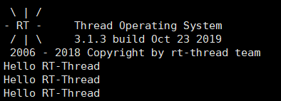

## 在 Nano 上添加 FinSH 组件（实现命令输入）

[RT-Thread FinSH](https://www.rt-thread.org/document/site/programming-manual/finsh/finsh/) 是 RT-Thread 的命令行组件（shell），提供一套供用户在命令行调用的操作接口，主要用于调试或查看系统信息。它可以使用串口 / 以太网 / USB 等与 PC 机进行通信，使用 FinSH 组件基本命令的效果图如下所示：

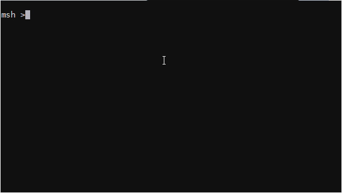

本文以串口 UART 作为 FinSH 的输入输出端口与 PC 进行通信，描述如何在 Nano 上实现 FinSH shell 功能。

在 RT-Thread Nano 上添加 FinSH 组件，实现 FinSH 功能的步骤主要如下：

1. 添加 FinSH 源码到工程。
2. 实现函数对接。

### 添加 FinSH 源码到工程

#### KEIL 添加 FinSH 源码

点击 Manage Run-Environment：

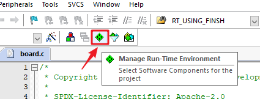

勾选 shell，这将自动把 FinSH 组件的源码到工程：

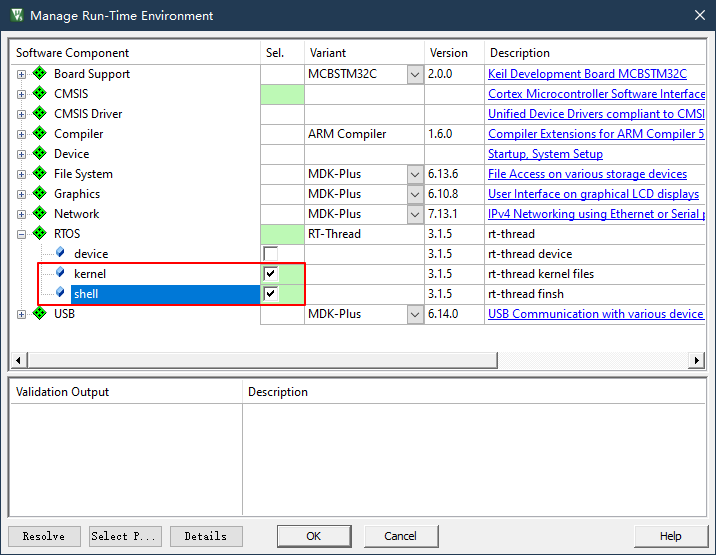

然后在 rtconfig.h 中打开 finsh 相关选项，如下图：

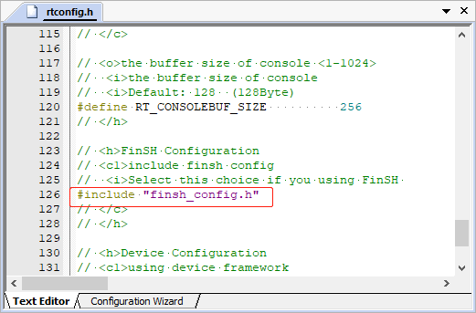

#### Cube MX 添加 FinSH 源码

打开一个 cube 工程，点击 Additional Software，在 Pack Vendor 中可勾选 RealThread 快速定位 RT-Thread 软件包，然后在 RT-Thread 软件包中勾选 shell，即可添加 FinSH 组件的源码到工程中。

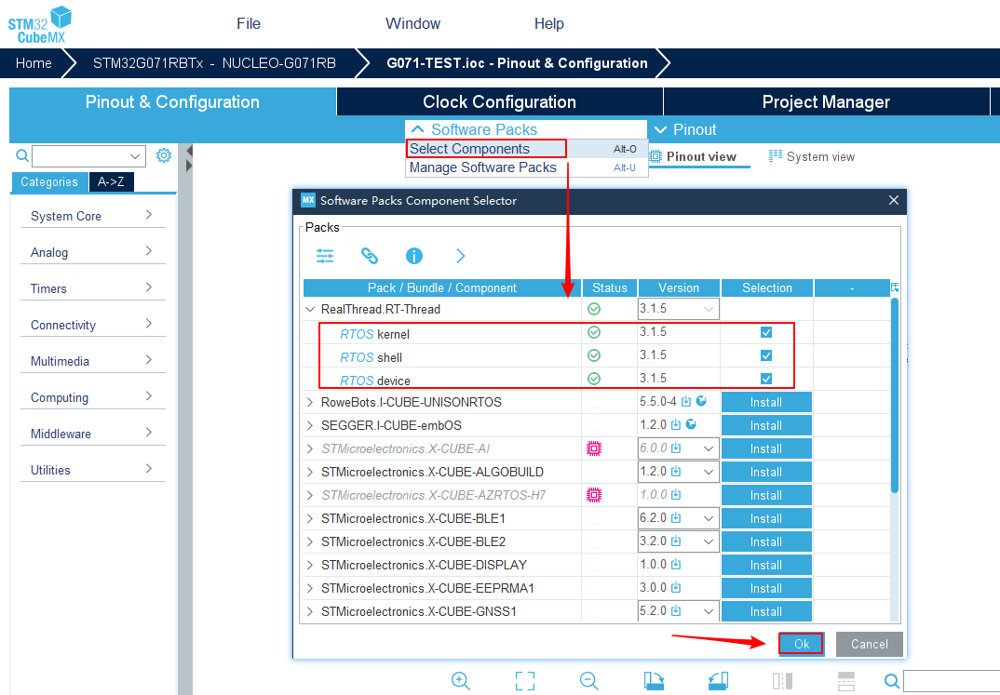

然后在生成后的代码中，找到 rtconfig.h，使能 `#include "finsh_config.h"` 。
注：3.1.5 版本中 rtconfgi.h 已经包含有 finsh_config.h 的相关宏定义。所以请二选一屏蔽掉重复的宏定义

#### 其他 IDE 添加 FinSH 源码

其他 IDE 添加 FinSH 源码，需要手动添加 FinSH 源码以及头文件路径到工程中，以 IAR IDE 为例进行结介绍。

1、复制 FinSH 源码到目标裸机工程：直接复制 Nano 源码中 rtthread-nano/components 文件夹下的 `finsh` 文件夹到工程中，如图：

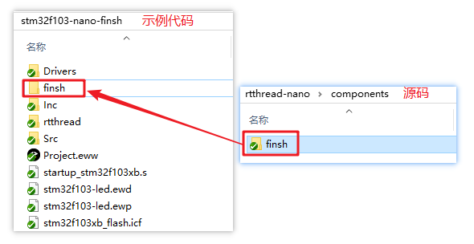

2、目标工程添加 FinSH 源码：

- 打开工程，新建 `finsh` 分组，添加工程中 `finsh` 文件夹下的所有. c 文件，如下图；

    ```
    cmd.c
    msh.c
    shell.c
    finsh_port.c
    ```

- 添加 `finsh` 文件夹的头文件路径（点击 `Project -> Options... ` 进入弹窗进行添加，如下图）；

- 在 rtconfig.h 中使能 `#define RT_USING_FINSH` 宏定义，这样 FinSH 将生效，如下图。

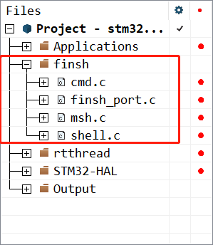

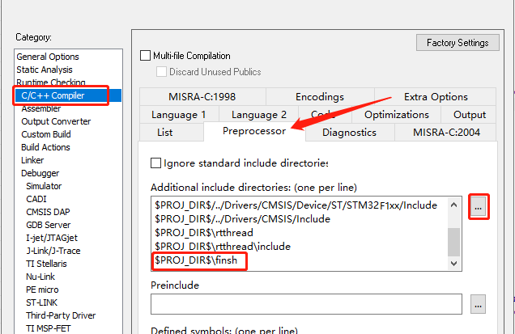

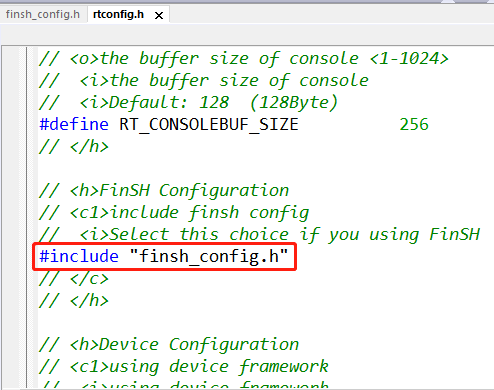

### 实现 rt_hw_console_getchar

注：此部分为 3.1.5 版本中 `#error TODO 4` 的部分：`#error "TODO 4: Read a char from the uart and assign it to 'ch'."`

要实现 FinSH 组件功能：既可以打印也能输入命令进行调试，控制台已经实现了打印功能，现在还需要在 board.c 中对接控制台输入函数，实现字符输入：

```c
/* 实现 3：finsh 获取一个字符，系统函数，函数名不可更改 */
char rt_hw_console_getchar(void);
```

- rt_hw_console_getchar()：控制台获取一个字符，即在该函数中实现 uart 获取字符，可以使用查询方式获取（注意不要死等，在未获取到字符时，需要让出 CPU），推荐使用中断方式获取。

**示例代码**：如下是基于 STM32F103  HAL 串口驱动对接的 rt_hw_console_getchar()，完成对接 FinSH 组件，其中获取字符采用查询方式，示例仅做参考，可自行实现中断方式获取字符。

```c
char rt_hw_console_getchar(void)
{
    int ch = -1;

    if (__HAL_UART_GET_FLAG(&UartHandle, UART_FLAG_RXNE) != RESET)
    {
        ch = UartHandle.Instance->DR & 0xff;
    }
    else
    {
        if(__HAL_UART_GET_FLAG(&UartHandle, UART_FLAG_ORE) != RESET)
        {
            __HAL_UART_CLEAR_OREFLAG(&UartHandle);
        }
        rt_thread_mdelay(10);
    }
    return ch;
}
```

### 结果验证

编译下载代码，打开串口助手，可以在串口助手中打印输入 help 命令，回车查看系统支持的命令：

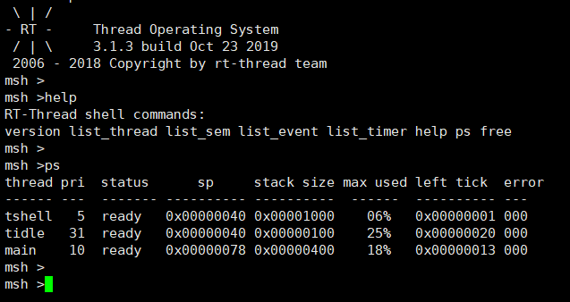

如果没有成功运行，请检查对接的函数实现是否正确。

## 移植示例代码

### 中断示例

如下是基于 STM32F103  HAL 串口驱动，实现控制台输出与 FinSH Shell，其中获取字符采用中断方式。原理是，在 uart 接收到数据时产生中断，在中断中把数据存入 ringbuffer 缓冲区，然后释放信号量，tshell 线程接收信号量，然后读取存在 ringbuffer 中的数据。示例仅做参考。

```c
/* 第一部分：ringbuffer 实现部分 */
#include <rtthread.h>
#include <string.h>

#define rt_ringbuffer_space_len(rb) ((rb)->buffer_size - rt_ringbuffer_data_len(rb))

struct rt_ringbuffer
{
    rt_uint8_t *buffer_ptr;

    rt_uint16_t read_mirror : 1;
    rt_uint16_t read_index : 15;
    rt_uint16_t write_mirror : 1;
    rt_uint16_t write_index : 15;

    rt_int16_t buffer_size;
};

enum rt_ringbuffer_state
{
    RT_RINGBUFFER_EMPTY,
    RT_RINGBUFFER_FULL,
    /* half full is neither full nor empty */
    RT_RINGBUFFER_HALFFULL,
};

rt_inline enum rt_ringbuffer_state rt_ringbuffer_status(struct rt_ringbuffer *rb)
{
    if (rb->read_index == rb->write_index)
    {
        if (rb->read_mirror == rb->write_mirror)
            return RT_RINGBUFFER_EMPTY;
        else
            return RT_RINGBUFFER_FULL;
    }
    return RT_RINGBUFFER_HALFFULL;
}

/**
 * get the size of data in rb
 */
rt_size_t rt_ringbuffer_data_len(struct rt_ringbuffer *rb)
{
    switch (rt_ringbuffer_status(rb))
    {
    case RT_RINGBUFFER_EMPTY:
        return 0;
    case RT_RINGBUFFER_FULL:
        return rb->buffer_size;
    case RT_RINGBUFFER_HALFFULL:
    default:
        if (rb->write_index > rb->read_index)
            return rb->write_index - rb->read_index;
        else
            return rb->buffer_size - (rb->read_index - rb->write_index);
    };
}

void rt_ringbuffer_init(struct rt_ringbuffer *rb,
                        rt_uint8_t           *pool,
                        rt_int16_t            size)
{
    RT_ASSERT(rb != RT_NULL);
    RT_ASSERT(size > 0);

    /* initialize read and write index */
    rb->read_mirror = rb->read_index = 0;
    rb->write_mirror = rb->write_index = 0;

    /* set buffer pool and size */
    rb->buffer_ptr = pool;
    rb->buffer_size = RT_ALIGN_DOWN(size, RT_ALIGN_SIZE);
}

/**
 * put a character into ring buffer
 */
rt_size_t rt_ringbuffer_putchar(struct rt_ringbuffer *rb, const rt_uint8_t ch)
{
    RT_ASSERT(rb != RT_NULL);

    /* whether has enough space */
    if (!rt_ringbuffer_space_len(rb))
        return 0;

    rb->buffer_ptr[rb->write_index] = ch;

    /* flip mirror */
    if (rb->write_index == rb->buffer_size-1)
    {
        rb->write_mirror = ~rb->write_mirror;
        rb->write_index = 0;
    }
    else
    {
        rb->write_index++;
    }

    return 1;
}
/**
 * get a character from a ringbuffer
 */
rt_size_t rt_ringbuffer_getchar(struct rt_ringbuffer *rb, rt_uint8_t *ch)
{
    RT_ASSERT(rb != RT_NULL);

    /* ringbuffer is empty */
    if (!rt_ringbuffer_data_len(rb))
        return 0;

    /* put character */
    *ch = rb->buffer_ptr[rb->read_index];

    if (rb->read_index == rb->buffer_size-1)
    {
        rb->read_mirror = ~rb->read_mirror;
        rb->read_index = 0;
    }
    else
    {
        rb->read_index++;
    }

    return 1;
}


/* 第二部分：finsh 移植对接部分 */
#define UART_RX_BUF_LEN 16
rt_uint8_t uart_rx_buf[UART_RX_BUF_LEN] = {0};
struct rt_ringbuffer  uart_rxcb;         /* 定义一个 ringbuffer cb */
static UART_HandleTypeDef UartHandle;
static struct rt_semaphore shell_rx_sem; /* 定义一个静态信号量 */

/* 初始化串口，中断方式 */
static int uart_init(void)
{
    /* 初始化串口接收 ringbuffer  */
    rt_ringbuffer_init(&uart_rxcb, uart_rx_buf, UART_RX_BUF_LEN);

    /* 初始化串口接收数据的信号量 */
    rt_sem_init(&(shell_rx_sem), "shell_rx", 0, 0);

    /* 初始化串口参数，如波特率、停止位等等 */
    UartHandle.Instance = USART2;
    UartHandle.Init.BaudRate   = 115200;
    UartHandle.Init.HwFlowCtl  = UART_HWCONTROL_NONE;
    UartHandle.Init.Mode       = UART_MODE_TX_RX;
    UartHandle.Init.OverSampling = UART_OVERSAMPLING_16;
    UartHandle.Init.WordLength = UART_WORDLENGTH_8B;
    UartHandle.Init.StopBits   = UART_STOPBITS_1;
    UartHandle.Init.Parity     = UART_PARITY_NONE;

    /* 初始化串口引脚等 */
    if (HAL_UART_Init(&UartHandle) != HAL_OK)
    {
        while (1);
    }

    /* 中断配置 */
    __HAL_UART_ENABLE_IT(&UartHandle, UART_IT_RXNE);
    HAL_NVIC_EnableIRQ(USART2_IRQn);
    HAL_NVIC_SetPriority(USART2_IRQn, 3, 3);

    return 0;
}
INIT_BOARD_EXPORT(uart_init);

/* 移植控制台，实现控制台输出, 对接 rt_hw_console_output */
void rt_hw_console_output(const char *str)
{
    rt_size_t i = 0, size = 0;
    char a = '\r';

    __HAL_UNLOCK(&UartHandle);

    size = rt_strlen(str);
    for (i = 0; i < size; i++)
    {
        if (*(str + i) == '\n')
        {
            HAL_UART_Transmit(&UartHandle, (uint8_t *)&a, 1, 1);
        }
        HAL_UART_Transmit(&UartHandle, (uint8_t *)(str + i), 1, 1);
    }
}

/* 移植 FinSH，实现命令行交互, 需要添加 FinSH 源码，然后再对接 rt_hw_console_getchar */
/* 中断方式 */
char rt_hw_console_getchar(void)
{
    char ch = 0;

    /* 从 ringbuffer 中拿出数据 */
    while (rt_ringbuffer_getchar(&uart_rxcb, (rt_uint8_t *)&ch) != 1)
    {
        rt_sem_take(&shell_rx_sem, RT_WAITING_FOREVER);
    }
    return ch;
}

/* uart 中断 */
void USART2_IRQHandler(void)
{
    int ch = -1;
    rt_base_t level;
    /* enter interrupt */
    rt_interrupt_enter();          //在中断中一定要调用这对函数，进入中断

    if ((__HAL_UART_GET_FLAG(&(UartHandle), UART_FLAG_RXNE) != RESET) &&
        (__HAL_UART_GET_IT_SOURCE(&(UartHandle), UART_IT_RXNE) != RESET))
    {
        while (1)
        {
            ch = -1;
            if (__HAL_UART_GET_FLAG(&(UartHandle), UART_FLAG_RXNE) != RESET)
            {
                ch =  UartHandle.Instance->DR & 0xff;
            }
            if (ch == -1)
            {
                break;
            }
            /* 读取到数据，将数据存入 ringbuffer */
            rt_ringbuffer_putchar(&uart_rxcb, ch);
        }
        rt_sem_release(&shell_rx_sem);
    }

    /* leave interrupt */
    rt_interrupt_leave();    //在中断中一定要调用这对函数，离开中断
}

#define USART_TX_Pin GPIO_PIN_2
#define USART_RX_Pin GPIO_PIN_3

void HAL_UART_MspInit(UART_HandleTypeDef *huart)
{
    GPIO_InitTypeDef GPIO_InitStruct = {0};
    if (huart->Instance == USART2)
    {
        __HAL_RCC_USART2_CLK_ENABLE();

        __HAL_RCC_GPIOA_CLK_ENABLE();
        /**USART2 GPIO Configuration
        PA2     ------> USART2_TX
        PA3     ------> USART2_RX
        */
        GPIO_InitStruct.Pin = USART_TX_Pin | USART_RX_Pin;
        GPIO_InitStruct.Mode = GPIO_MODE_AF_PP;
        GPIO_InitStruct.Speed = GPIO_SPEED_FREQ_LOW;
        HAL_GPIO_Init(GPIOA, &GPIO_InitStruct);
    }
}
```

## 常见问题

### Q: rt_kprintf() 不能打印浮点数吗？

A: 不可以。但是可以通过其他方法实现打印浮点数的目的，比如成倍扩大数值后，分别打印整数与小数部分。

### Q: 在实现 FinSH 完整功能时，却不能输入。


A：可能的原因有：UART 驱动未实现字符输入函数、未打开 FinSH 组件等；如果开启了 HEAP，需要确定 HEAP 是否过小，导致 tshell 线程创建失败 。

### Q: 出现 hard fault。

A： ps 后关注各个线程栈的最大利用率，若某线程出现 100% 的情况，则表示该线程栈过小，需要将值调大。

### Q：使用  AC6  编译错误。

A：汇编文件识别失败造成的，识别错误的情况下会识别为 c 文件，可以右击文件，将汇编文件的文件类型改为汇编类型，再次编译即可。


