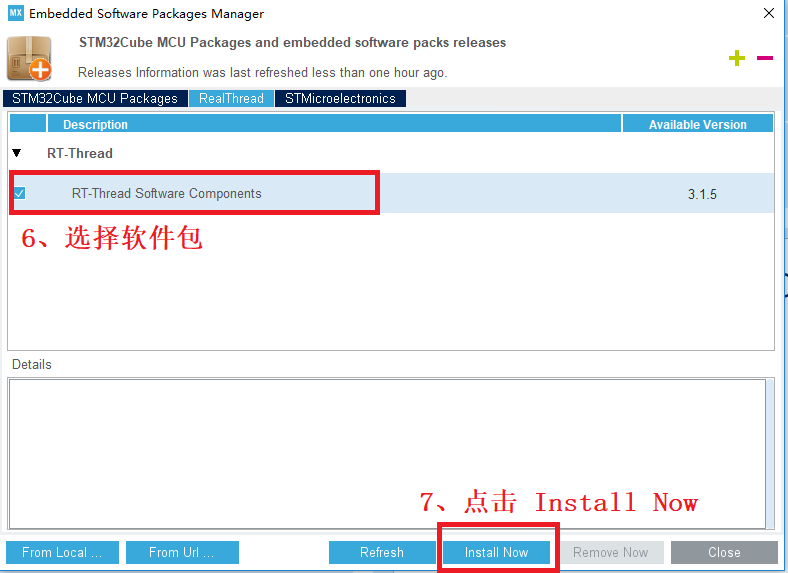
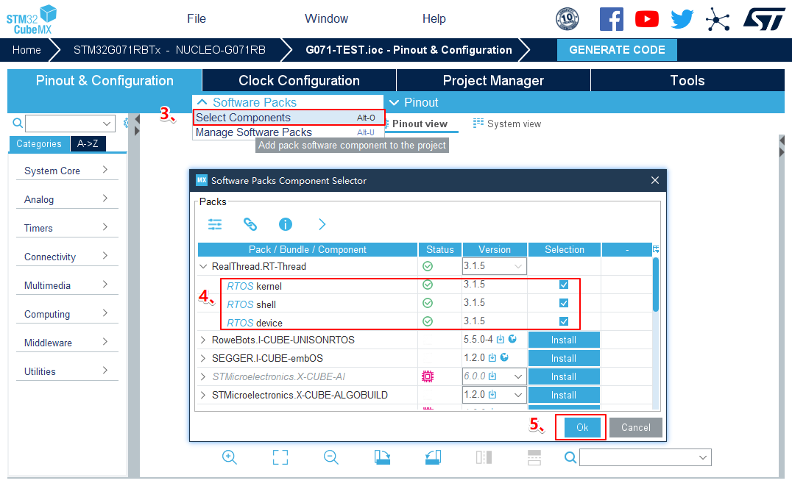
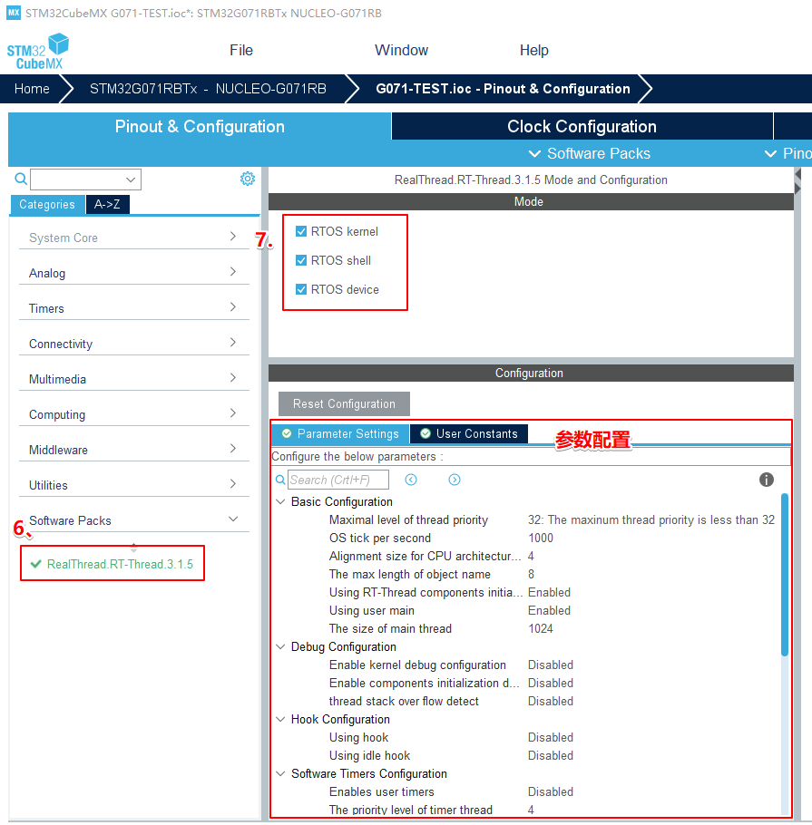
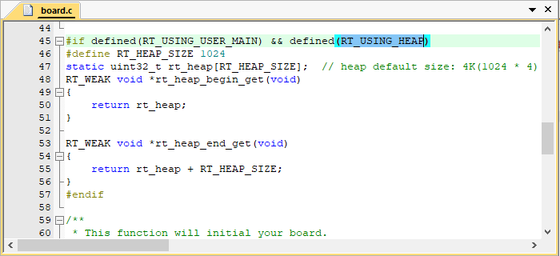

# 基于 CubeMX 移植 RT-Thread Nano

本文介绍了如何基于 CubeMX 移植 RT-Thread Nano，并说明生成代码工程的步骤。

RT-Thread Nano 已集成在 CubeMX 中，可以直接在 IDE 中进行下载添加。本文档介绍了如何使用 CubeMX 移植 RT-Thread Nano，并以一个 stm32f103 的基础工程作为示例进行讲解。

移植 Nano 的主要步骤：

1. 准备一个 CubeMX 基础工程，并获取 RT-Thread Nano pack 安装包进行安装。
2. 在基础工程中添加 RT-Thread Nano 源码。
3. 适配 Nano，主要从 中断、时钟、内存、应用 这几个方面进行适配，实现移植。
4. 最后可对 Nano 进行配置：Nano 是可裁剪的，可以通过配置文件 rtconfig.h 实现对系统的裁剪。

## 准备工作

- 下载 Cube MX 5.0 ，下载地址 <https://www.st.com/en/development-tools/stm32cubemx.html> 。
- 在 CubeMX 上下载 RT-Thread Nano pack 安装包。

### Nano pack 安装

要获取 RT-Thread Nano 软件包，需要在 CubeMX 中添加 <https://www.rt-thread.org/download/cube/RealThread.RT-Thread.pdsc> 。

具体步骤：进入打开 CubeMX，从菜单栏 `help` 进入 `Manage embedded software packages` 界面，点击 `From Url` 按钮，进入 `User Defined Packs Manager` 界面，其次点击 `new`，填入上述网址，然后点击 `check`，如下图所示：


`check` 通过后，点击 OK 回到 `User Defined Packs Manager` 界面，再次点击 OK，CubeMX 自动连接服务器，获取包描述文件。回到 `Manage embedded software packages` 界面，就会发现 `RT-Thread Nano 3.1.5` 软件包，选择该软件包，点击 `Install Now`，如下图所示：



点击安装之后，弹出 `Licensing Agreement` ，同意协议，点击 `Finish`，如下图所示：


等待安装完成，成功安装后，版本前面的小蓝色框变成填充的黄绿色，现象如下图所示：


至此，RT-Thread Nano 软件包安装完毕，退出 `Manage embedded software packages` 界面，进入 CubeMX 主界面。

### 创建基础工程

在 CubeMX 主界面的菜单栏中 `File` 选择 `New Project`，如下图所示


新建工程之后，在弹出界面芯片型号中输入某一芯片型号，方便锁定查找需要的芯片，双击被选中的芯片，如下图所示


时钟树的配置直接使用默认即可，然后还需要配置下载方式。

## 添加 RT-Thread Nano 到工程

### 选择 Nano 组件

选中芯片型号之后，点击 `Softwares Packages`->`Select Components`，进入组件配置界面，选择 `RealThread`， 然后根据需求选择 RT-Thread 组件，然后点击 OK 按钮，如下图所示：



> 注意：RT-Thread Nano 软件包中包含 kernel, shell 和 device 三个部分，仅选择 kernel 表示只使用 RT-Thread 内核，工程中会添加内核代码；选择 kernel 与 shell 表示在使用 RT-Thread Nano 的基础上使用 FinSH Shell 组件，工程中会添加内核代码与 FinSH 组件的代码，FinSH 的移植详见 [《在 RT-Thread Nano 上添加控制台与 FinSH》](../finsh-port/an0045-finsh-port.md)。再选择 device 表示使用 rt-thread 的 device 框架，用户基于此框架编写外设驱动并注册后，就可以使用 device 统一接口操作外设。

### 配置 Nano

选择组件之后，对组件参数进行配置。在工程界面 `Pinout & Configuration` 中，进入所选组件参数配置区，按照下图进行配置



### 工程管理

给工程取名、选择代码存放位置、选择生成代码的 `Toolchain/IDE`。`Cube MX` 不仅能够生成 `Keil4/Keil5` 的工程，而且还能够生成 `IAR7/IAR8` 等 IDE 的工程，功能强大，本文从下拉框中选择 MDK5，操作如图所示


### 配置 MCU

根据需求配置 MCU 的功能。

## 适配 RT-Thread Nano

### 中断与异常处理

RT-Thread 操作系统重定义 `HardFault_Handler`、`PendSV_Handler`、`SysTick_Handler` 中断函数，为了避免重复定义的问题，在生成工程之前，需要在中断配置中，代码生成的选项中，取消选择三个中断函数（对应注释选项是 `Hard fault interrupt`, `Pendable request`, `Time base :System tick timer`），最后点击生成代码，具体操作如下图 所示：


等待工程生成完毕，点击打开工程，如下图所示，即可进入 MDK5 工程中。


### 系统时钟配置

需要在 board.c 中实现 ` 系统时钟配置 `（为 MCU、外设提供工作时钟）与 `OS Tick 的配置 `（为操作系统提供心跳 / 节拍）。

如下代码所示， `HAL_Init()` 初始化 HAL 库， `SystemClock_Config() `配置了系统时钟， `SystemCoreClockUpdate()`  对系统时钟进行更新，`_SysTick_Config()` 配置了 OS Tick。此处 OS Tick 使用滴答定时器 systick 实现，需要用户在 board.c 中实现 `SysTick_Handler()` 中断服务例程，调用 RT-Thread 提供的 `rt_tick_increase()` ，如下图所示。

```c
/* board.c */
void rt_hw_board_init()
{
    HAL_Init();
    SystemClock_Config();

    /* System Clock Update */
    SystemCoreClockUpdate();

    /* System Tick Configuration */
    _SysTick_Config(SystemCoreClock / RT_TICK_PER_SECOND);

    /* Call components board initial (use INIT_BOARD_EXPORT()) */
#ifdef RT_USING_COMPONENTS_INIT
    rt_components_board_init();
#endif

#if defined(RT_USING_USER_MAIN) && defined(RT_USING_HEAP)
    rt_system_heap_init(rt_heap_begin_get(), rt_heap_end_get());
#endif
}
```


### 内存堆初始化

系统内存堆的初始化在 board.c 中的 rt_hw_board_init() 函数中完成，内存堆功能是否使用取决于宏 RT_USING_HEAP 是否开启，RT-Thread Nano 默认不开启内存堆功能，这样可以保持一个较小的体积，不用为内存堆开辟空间。

开启系统 heap 将可以使用动态内存功能，如使用 rt_malloc、rt_free 以及各种系统动态创建对象的 API。若需要使用系统内存堆功能，则打开 RT_USING_HEAP 宏定义即可，此时内存堆初始化函数 rt_system_heap_init() 将被调用，如下所示：


初始化内存堆需要堆的起始地址与结束地址这两个参数，系统中默认使用数组作为 heap，并获取了 heap 的起始地址与结束地址，该数组大小可手动更改，如下所示：



注意：开启 heap 动态内存功能后，heap 默认值较小，在使用的时候需要改大，否则可能会有申请内存失败或者创建线程失败的情况，修改方法有以下两种：

- 可以直接修改数组中定义的 RT_HEAP_SIZE 的大小，至少大于各个动态申请内存大小之和，但要小于芯片 RAM 总大小。
- 也可以参考[《RT-Thread Nano 移植原理》——实现动态内存堆](../nano-port-principle/an0044-nano-port-principle.md) 章节进行修改，使用 RAM ZI 段结尾处作为 HEAP 的起始地址，使用 RAM 的结尾地址作为 HEAP 的结尾地址，这是 heap 能设置的最大值的方法。

## 编写第一个应用

移植好 RT-Thread Nano 之后，则可以开始编写第一个应用代码。此时 main() 函数就转变成 RT-Thread 操作系统的一个线程，现在可以在 main() 函数中实现第一个应用：板载 LED 指示灯闪烁。

1. 首先在文件首部包含 RT-Thread 的相关头文件 `<rtthread.h>` 。
2. 在 main() 函数中（也就是在 main 线程中）写 LED 闪烁代码：初始化 LED 引脚、在循环中点亮 / 熄灭 LED。
3. 延时函数使用 RT-Thread 提供的延时函数 rt_thread_mdelay()，该函数会引起系统调度，切换到其他线程运行，体现了线程实时性的特点。


编译程序之后下载到芯片就可以看到基于 RT-Thread 的程序运行起来了，LED 正常闪烁。

> [!NOTE]
> 注：当添加 RT-Thread 之后，裸机中的 main() 函数会自动变成 RT-Thread 系统中 main 线程 的入口函数。由于线程不能一直独占 CPU，所以此时在 main() 中使用 while(1) 时，需要有让出 CPU 的动作，比如使用 `rt_thread_mdelay()` 系列的函数让出 CPU。

**与裸机 LED 闪烁应用代码的不同**：

1). 延时函数不同： RT-Thread 提供的 `rt_thread_mdelay()` 函数可以引起操作系统进行调度，当调用该函数进行延时时，本线程将不占用 CPU，调度器切换到系统的其他线程开始运行。而裸机的 delay 函数是一直占用 CPU 运行的。

2). 初始化系统时钟的位置不同：移植好 RT-Thread Nano 之后，不需要再在 main() 中做相应的系统配置（如 hal 初始化、时钟初始化等），这是因为 RT-Thread 在系统启动时，已经做好了系统时钟初始化等的配置，这在上一小节 “系统时钟配置” 中有讲解。

## 配置 RT-Thread Nano

配置 RT-Thread Nano 可以在上面小节 ` 添加 RT-Thread Nano ->  配置 Nano` 中，这是在生成工程之前做的配置。如果生成工程之后，想直接在目标工程的 IDE 中配置，那么直接修改工程中 rtconfig.h 文件即可，完整配置详见 [《 RT-Thread Nano 配置》](../nano-config/an0043-nano-config.md)。

## 常见问题

### Q: 出现三个中断重复定义

**A**: 参考生成工程章节中 **中断配置** 小节。

### Q: 生成的工程不包含 RT-Thread

**A**: 可能是没有添加 RT-Thread Nano 组件到工程，参考生成工程章节中 **选择 Nano 组件** 小节。

### Q: 在添加 Nano 时，选择 shell 后生成工程，编译工程报错。

**A**: 报错 "Undefined symbol rt_hw_console_getchar (referrred from shell.o)"。这是由于添加 FinSH 组件源码之后，还需要自行定义与实现该函数才能完成 FinSH 的移植，详见 [《在 RT-Thread Nano 上添加控制台与 FinSH》](../finsh-port/an0045-finsh-port.md)。

### Q: 生成的工程不包含 .S 文件

**A**: 生成的工程中发现 `context_rvds.S`， `context_iar.S` 或者其他文件存在丢失的情况，建议重新使用 CubeMX 生成工程。

### Q: check 网址失败

**A**: 建议升级 Cube MX 版本至 5.0 以上。

### Q: CubeMX 如何升级

**A**：本文创建工程基于 CubeMX 5.0.0，如果比较低的版本，建议升级，升级方式： `help -> Check for updates`，进入后，点击 Refresh，CubeMX 自动去获取最新的程序，成功获取后选择版本，点击 `Install now`，等待完成安装。
