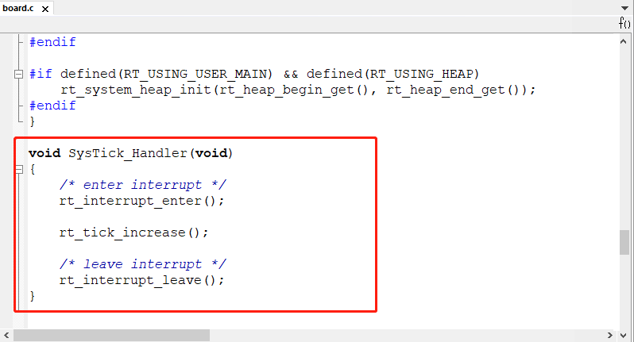

# 基于 IAR 移植 RT-Thread Nano

本文介绍了如何基于 IAR 移植 RT-Thread Nano，并以一个 stm32f103 的基础工程作为示例进行讲解。

移植 Nano 的主要步骤：

1. 准备一个基础的 IAR 工程，并获取 RT-Thread Nano 压缩包源码。
2. 在基础工程中添加 RT-Thread Nano 源码，添加相应头文件路径。
3. 适配 Nano，主要从 中断、时钟、内存、应用 这几个方面进行适配，实现移植。
4. 最后可对 Nano 进行配置：Nano 是可裁剪的，通过配置文件 rtconfig.h 实现对系统的裁剪。

## 准备工作

- 下载 RT-Thread Nano 发布版本代码。
- 准备一份基础的裸机源码工程，如 LED 指示灯闪烁示例代码。

### 下载 Nano 源码

[点击此处](https://www.rt-thread.org/download/nano/rt-thread-3.1.3.zip) 下载 RT-Thread Nano 源码。

### 基础工程准备 ###

在移植 RT-Thread Nano 之前，我们需要准备一个能正常运行的裸机工程。作为示例，本文使用的是基于 STM32F103 的一个 LED 闪烁程序。程序的主要截图如下：


在我们的例程中主要做了系统初始化与 LED 闪烁功能，编译下载程序后，就可以看到开发板上的 LED 在闪烁了。读者可以根据自己的需要和使用的芯片，准备一个类似的裸机工程。

## 添加 RT-Thread Nano 到工程 ##

### 添加 Nano 源文件

在准备好的 IAR 裸机工程下面新建 rtthread 文件夹，并在该文件中添加以下文件：

- Nano 源码中的 include、libcpu、src 文件夹。
- 配置文件：源码代码 rtthread/bsp 文件夹中的两个文件：`board.c` 与 `rtconfig.h`。


双击打开 IAR 裸机工程，新建 rtthread 分组，并在该分组下添加以下源码：

- 添加工程下 rtthread/src/ 文件夹中所有文件到工程；
- 添加工程下 rtthread/libcpu/ 文件夹中相应内核的 CPU 移植文件及上下文切换文件： `cpuport.c` 以及 `context_iar.S`；
- 添加 rtthread/ 文件夹下的 `board.c` 。


Cortex-M 芯片内核移植代码：

```
context_iar.s
cpuport.c
```

Kernel 文件包括：

```
clock.c
components.c
device.c
idle.c
ipc.c
irq.c
kservice.c
mem.c
mempool.c
object.c
scheduler.c
thread.c
timer.c
```

板级配置代码：

```
board.c
```

### 添加头文件路径

点击 `Project -> Options... ` 进入下图所示界面，添加 rtconfig.h 头文件所在位置的路径，添加 include 文件夹下的头文件路径。


## 适配 RT-Thread Nano

### 中断与异常处理

RT-Thread 会接管异常处理函数 `HardFault_Handler()` 和悬挂处理函数 `PendSV_Handler()`，这两个函数已由 RT-Thread 实现，所以需要删除工程里中断服务例程文件中的这两个函数，避免在编译时产生重复定义。如果此时对工程进行编译，没有出现函数重复定义的错误，则不用做修改。

### 系统时钟配置

需要在 board.c 中实现 ` 系统时钟配置 `（为 MCU、外设提供工作时钟）与 `OS Tick 的配置 `（为操作系统提供心跳 / 节拍）。

如下代码所示， `HAL_Init()` 初始化 HAL 库， `SystemClock_Config() `配置了系统时钟， `SystemCoreClockUpdate()`  对系统时钟进行更新，`_SysTick_Config()` 配置了 OS Tick。此处 OS Tick 使用滴答定时器 systick 实现，需要用户在 board.c 中实现 `SysTick_Handler()` 中断服务例程，调用 RT-Thread 提供的 `rt_tick_increase()` ，如下图所示。

```c
/* board.c */
void rt_hw_board_init()
{
    HAL_Init();
    SystemClock_Config();

    /* System Clock Update */
    SystemCoreClockUpdate();

    /* System Tick Configuration */
    _SysTick_Config(SystemCoreClock / RT_TICK_PER_SECOND);

    /* Call components board initial (use INIT_BOARD_EXPORT()) */
#ifdef RT_USING_COMPONENTS_INIT
    rt_components_board_init();
#endif

#if defined(RT_USING_USER_MAIN) && defined(RT_USING_HEAP)
    rt_system_heap_init(rt_heap_begin_get(), rt_heap_end_get());
#endif
}
```



由于 `SysTick_Handler()` 中断服务例程由用户在 board.c 中重新实现，做了系统 OS Tick，所以还需要删除工程里中断服务例程文件中的 `SysTick_Handler()` ，避免在编译时产生重复定义。如果此时对工程进行编译，没有出现函数重复定义的错误，则不用做修改。

### 内存堆初始化

系统内存堆的初始化在 board.c 中的 rt_hw_board_init() 函数中完成，内存堆功能是否使用取决于宏 RT_USING_HEAP 是否开启，RT-Thread Nano 默认不开启内存堆功能，这样可以保持一个较小的体积，不用为内存堆开辟空间。

开启系统 heap 将可以使用动态内存功能，如使用 rt_malloc、rt_free 以及各种系统动态创建对象的 API。若需要使用系统内存堆功能，则打开 RT_USING_HEAP 宏定义即可，此时内存堆初始化函数 rt_system_heap_init() 将被调用，如下所示：


初始化内存堆需要堆的起始地址与结束地址这两个参数，系统中默认使用数组作为 heap，并获取了 heap 的起始地址与结束地址，该数组大小可手动更改，如下所示：


注意：开启 heap 动态内存功能后，heap 默认值较小，在使用的时候需要改大，否则可能会有申请内存失败或者创建线程失败的情况，修改方法有以下两种：

- 可以直接修改数组中定义的 RT_HEAP_SIZE 的大小，至少大于各个动态申请内存大小之和，但要小于芯片 RAM 总大小。
- 也可以参考[《RT-Thread Nano 移植原理》——实现动态内存堆](../nano-port-principle/an0044-nano-port-principle.md) 章节进行修改，使用 RAM ZI 段结尾处作为 HEAP 的起始地址，使用 RAM 的结尾地址作为 HEAP 的结尾地址，这是 heap 能设置的最大值的方法。

## 编写第一个应用

移植好 RT-Thread Nano 之后，则可以开始编写第一个应用代码。此时 main() 函数就转变成 RT-Thread 操作系统的一个线程，现在可以在 main() 函数中实现第一个应用：板载 LED 指示灯闪烁，这里直接基于裸机 LED 指示灯进行修改。

1. 首先在文件首部增加 RT-Thread 的相关头文件 `<rtthread.h>` 。
2. 在 main() 函数中（也就是在 main 线程中）实现 LED 闪烁代码：初始化 LED 引脚、在循环中点亮 / 熄灭 LED。
3. 将延时函数替换为 RT-Thread 提供的延时函数 rt_thread_mdelay()。该函数会引起系统调度，切换到其他线程运行，体现了线程实时性的特点。


编译程序之后下载到芯片就可以看到基于 RT-Thread 的程序运行起来了，LED 正常闪烁。

> [!NOTE]
> 注：当添加 RT-Thread 之后，裸机中的 main() 函数会自动变成 RT-Thread 系统中 main 线程 的入口函数。由于线程不能一直独占 CPU，所以此时在 main() 中使用 while(1) 时，需要有让出 CPU 的动作，比如使用 `rt_thread_mdelay()` 系列的函数让出 CPU。

**与裸机 LED 闪烁应用代码的不同**：

1). 延时函数不同： RT-Thread 提供的 `rt_thread_mdelay()` 函数可以引起操作系统进行调度，当调用该函数进行延时时，本线程将不占用 CPU，调度器切换到系统的其他线程开始运行。而裸机的 delay 函数是一直占用 CPU 运行的。

2). 初始化系统时钟的位置不同：移植好 RT-Thread Nano 之后，不需要再在 main() 中做相应的系统配置（如 hal 初始化、时钟初始化等），这是因为 RT-Thread 在系统启动时，已经做好了系统时钟初始化等的配置，这在上一小节 “系统时钟配置” 中有讲解。

## 配置 RT-Thread Nano  ##

用户可以根据自己的需要通过打开或关闭 rtconfig.h 文件里面的宏定义，配置相应功能，如下是 rtconfig.h 的代码片段：

```c
...

// <h>IPC(Inter-process communication) Configuration
// <c1>Using Semaphore
//  <i>Using Semaphore
#define RT_USING_SEMAPHORE
// </c>
// <c1>Using Mutex
//  <i>Using Mutex
//#define RT_USING_MUTEX                 // 打开此宏则使能互斥量的使用
// </c>
// <c1>Using Event
//  <i>Using Event
//#define RT_USING_EVENT                 // 打开此宏则使能事件集的使用
// </c>
// <c1>Using MailBox
//  <i>Using MailBox
//#define RT_USING_MAILBOX              // 打开此宏则使能邮箱的使用
// </c>
// <c1>Using Message Queue
//  <i>Using Message Queue
//#define RT_USING_MESSAGEQUEUE          // 打开此宏则使能消息队列的使用
// </c>
// </h>

// <h>Memory Management Configuration
// <c1>Using Memory Pool Management
//  <i>Using Memory Pool Management
//#define RT_USING_MEMPOOL              // 打开此宏则使能内存池的使用

...
```

若不开启宏 RT_USING_HEAP，则只支持静态方式创建任务、信号量等对象。若要通过动态方式创建对象则需要在 rtconfig.h 文件里开启 RT_USING_HEAP 宏定义。完整配置详见 [《 RT-Thread Nano 配置》](../nano-config/an0043-nano-config.md)。

