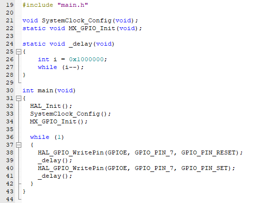
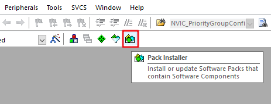
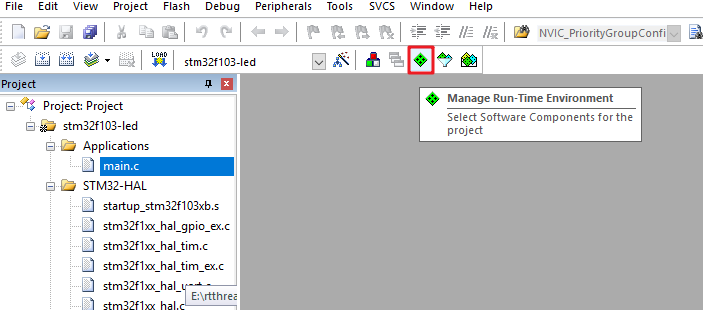
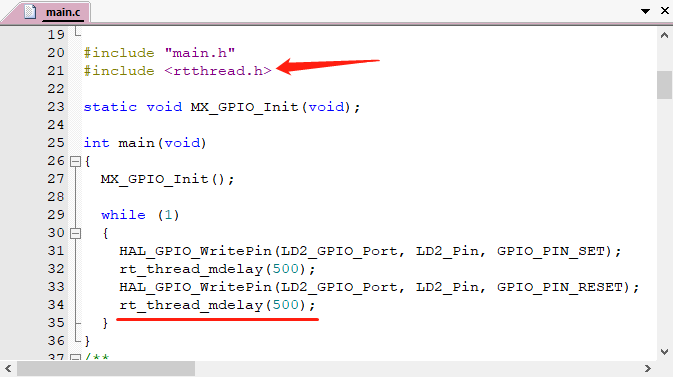
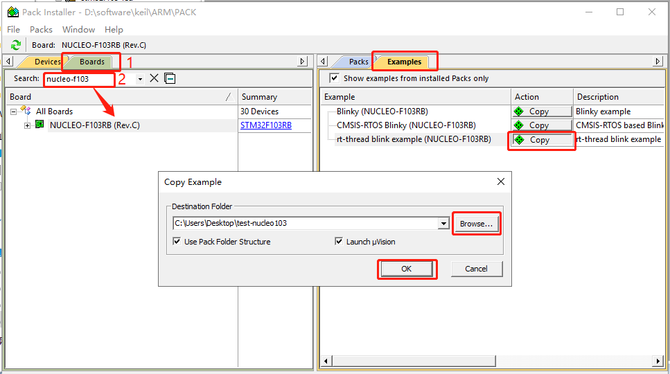
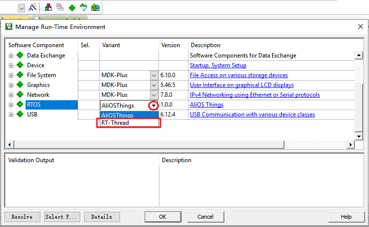

# 基于 Keil MDK 移植 RT-Thread Nano

本文介绍如何基于 Keil MDK 移植 RT-Thread Nano ，并以一个 stm32f103 的基础工程作为示例进行讲解。

RT-Thread Nano 已集成在 Keil MDK 中，可以直接在 IDE 中进行下载添加。本文档介绍了如何使用 MDK 移植 RT-Thread Nano，并以一个 stm32f103 的基础工程作为示例进行讲解。

移植 Nano 的主要步骤：

1. 准备一个基础的 keil MDK 工程，并获取 RT-Thread Nano pack 安装包并进行安装。
2. 在基础工程中添加 RT-Thread Nano 源码。
3. 适配 Nano，主要从 中断、时钟、内存这几个方面进行适配，实现移植。
4. 验证移植结果：编写第一个应用代码，基于 RT-Thread Nano 闪烁 LED。
5. 最后可对 Nano 进行配置：Nano 是可裁剪的，通过配置文件 rtconfig.h 实现对系统的裁剪。

## 准备工作

- 准备一份基础的裸机源码 (可通过 STM32CubeMx 可视化软件创建也可按照工程项目所需文档手动创建) 工程，如一份 stm32 的 LED 指示灯闪烁示例代码。
- 在 KEIL 上安装 RT-Thread Nano Pack。

### 基础工程准备

在移植 RT-Thread Nano 之前，我们需要准备一个能正常运行的裸机工程。作为示例，本文使用的是基于 STM32F103 的一个 LED 闪烁程序。程序的主要截图如下：



在我们的例程中主要做了系统初始化与 LED 闪烁功能，编译下载程序后，就可以看到 LED 闪烁了。读者可以根据自己的需要使用的芯片，准备一个类似的裸机工程。

### Nano Pack 安装

Nano Pack 可以通过在 Keil MDK IDE 内进行安装，也可以手动安装。下面开始介绍两种安装方式。

#### 方法一：在 IDE 内安装

打开 MDK 软件，点击工具栏的 Pack Installer 图标：



点击右侧的 Pack，展开 Generic，可以找到 RealThread::RT-Thread，点击 Action 栏对应的 Install ，就可以在线安装 Nano Pack 了。另外，如果需要安装其他版本，则需要展开 RealThread::RT-Thread，进行选择，箭头所指代表已经安装的版本。


#### 方法二：手动安装

我们也可以从官网下载安装文件，[RT-Thread Nano 离线安装包下载](https://www.rt-thread.org/download/mdk/RealThread.RT-Thread.3.1.5.pack)，下载结束后双击文件进行安装：


## 添加 RT-Thread Nano 到工程

打开已经准备好的可以运行的裸机程序，将 RT-Thread 添加到工程。如下图，点击 Manage Run-Time Environment。



在 Manage Rum-Time Environment 里 "Software Component" 栏找到 RTOS，Variant 栏选择 RT-Thread，然后勾选 kernel，点击 "OK" 就添加 RT-Thread 内核到工程了。


现在可以在 Project 看到 RT-Thread RTOS 已经添加进来了，展开 RTOS，可以看到添加到工程的文件：


Cortex-M 芯片内核移植代码：

```
context_rvds.s
cpuport.c
```

Kernel 文件包括：

```
clock.c
components.c
device.c
idle.c
ipc.c
irq.c
kservice.c
mem.c
mempool.c
object.c
scheduler.c
thread.c
timer.c
```

配置文件：

```
board.c
rtconfig.h
```

## 适配 RT-Thread Nano

### 中断与异常处理

RT-Thread 会接管异常处理函数 `HardFault_Handler()` 和悬挂处理函数 `PendSV_Handler()`，这两个函数已由 RT-Thread 实现，所以需要删除工程里中断服务例程文件中的这两个函数，避免在编译时产生重复定义。如果此时对工程进行编译，没有出现函数重复定义的错误，则不用做修改。

### 系统时钟配置

需要在 board.c 中实现 ` 系统时钟配置 `（为 MCU、外设提供工作时钟）与 `os tick ` 的配置 （为操作系统提供心跳 / 节拍）。

如下代码所示，用户需要在 board.c 文件中系统初始化和 OS Tick 的配置，用户需在 timer 定时器中断服务函数调用 rt_os_tick_callback function，cortex-m 架构使用 SysTick_Handler()

```c
/* board.c */

/* timer 定时器中断服务函数调用 rt_os_tick_callback function，cortex-m 架构使用 SysTick_Handler() */
void rt_os_tick_callback(void)
{
  rt_interrupt_enter(); /* 进入中断时必须调用 */

  rt_tick_increase();  /* RT-Thread 系统时钟计数 */

  rt_interrupt_leave(); /* 退出中断时必须调用 */
}

/* cortex-m 架构使用 SysTick_Handler() */
void SysTick_Handler()
{
    rt_os_tick_callback();
}

void rt_hw_board_init(void)
{
  /*
   * TODO 1: OS Tick Configuration
   * Enable the hardware timer and call the rt_os_tick_callback function
   * periodically with the frequency RT_TICK_PER_SECOND.
   */

  /* 1、系统、时钟初始化 */
  HAL_Init(); // 初始化 HAL 库
  SystemClock_Config(); // 配置系统时钟
  SystemCoreClockUpdate(); // 对系统时钟进行更新

  /* 2、OS Tick 频率配置，RT_TICK_PER_SECOND = 1000 表示 1ms 触发一次中断 */
  SysTick_Config(SystemCoreClock / RT_TICK_PER_SECOND);

  /* Call components board initial (use INIT_BOARD_EXPORT()) */
#ifdef RT_USING_COMPONENTS_INIT
  rt_components_board_init();
#endif

#if defined(RT_USING_USER_MAIN) && defined(RT_USING_HEAP)
  rt_system_heap_init(rt_heap_begin_get(), rt_heap_end_get());
#endif
}
```


由于 `SysTick_Handler()` 中断服务例程由用户在 board.c 中重新实现，做了系统 OS Tick，所以还需要删除工程里中原本已经实现的 `SysTick_Handler()` ，避免在编译时产生重复定义。如果此时对工程进行编译，没有出现函数重复定义的错误，则不用做修改。

### 内存堆初始化

系统内存堆的初始化在 board.c 中的 rt_hw_board_init() 函数中完成，内存堆功能是否使用取决于宏 RT_USING_HEAP 是否开启，RT-Thread Nano 默认不开启内存堆功能，这样可以保持一个较小的体积，不用为内存堆开辟空间。

开启系统 heap 将可以使用动态内存功能，如使用 rt_malloc、rt_free 以及各种系统动态创建对象的 API。若需要使用系统内存堆功能，则打开 RT_USING_HEAP 宏定义即可，此时内存堆初始化函数 rt_system_heap_init() 将被调用，如下所示：


初始化内存堆需要堆的起始地址与结束地址这两个参数，系统中默认使用数组作为 heap，并获取了 heap 的起始地址与结束地址，该数组大小可手动更改，如下所示：


注意：开启 heap 动态内存功能后，heap 默认值较小，在使用的时候需要改大，否则可能会有申请内存失败或者创建线程失败的情况，修改方法有以下两种：

- 可以直接修改数组中定义的 RT_HEAP_SIZE 的大小，至少大于各个动态申请内存大小之和，但要小于芯片 RAM 总大小。
- 也可以参考 [《RT-Thread Nano 移植原理》——实现动态内存堆](../nano-port-principle/an0044-nano-port-principle.md) 章节进行修改，使用 RAM ZI 段结尾处作为 HEAP 的起始地址，使用 RAM 的结尾地址作为 HEAP 的结尾地址，这是 heap 能设置的最大值的方法。

## 编写第一个应用

移植好 RT-Thread Nano 之后，则可以开始编写第一个应用代码验证移植结果。此时 main() 函数就转变成 RT-Thread 操作系统的一个线程，现在可以在 main() 函数中实现第一个应用：板载 LED 指示灯闪烁，这里直接基于裸机 LED 指示灯进行修改。

1. 首先在文件首部增加 RT-Thread 的相关头文件 `<rtthread.h>` 。
2. 在 main() 函数中（也就是在 main 线程中）实现 LED 闪烁代码：初始化 LED 引脚、在循环中点亮 / 熄灭 LED。
3. 将延时函数替换为 RT-Thread 提供的延时函数 rt_thread_mdelay()。该函数会引起系统调度，切换到其他线程运行，体现了线程实时性的特点。



编译程序之后下载到芯片就可以看到基于 RT-Thread 的程序运行起来了，LED 正常闪烁。

> [!NOTE]
> 注：当添加 RT-Thread 之后，裸机中的 main() 函数会自动变成 RT-Thread 系统中 main 线程 的入口函数。由于线程不能一直独占 CPU，所以此时在 main() 中使用 while(1) 时，需要有让出 CPU 的动作，比如使用 `rt_thread_mdelay()` 系列的函数让出 CPU。

**与裸机 LED 闪烁应用代码的不同**：

1). 延时函数不同： RT-Thread 提供的 `rt_thread_mdelay()` 函数可以引起操作系统进行调度，当调用该函数进行延时时，本线程将不占用 CPU，调度器切换到系统的其他线程开始运行。而裸机的 delay 函数是一直占用 CPU 运行的。

2). 初始化系统时钟的位置不同：移植好 RT-Thread Nano 之后，不需要再在 main() 中做相应的系统配置（如 hal 初始化、时钟初始化等），这是因为 RT-Thread 在系统启动时，已经做好了系统时钟初始化等的配置，这在上一小节 “系统时钟配置” 中有讲解。

## 配置 RT-Thread Nano

用户可以根据自己的需要通过修改 rtconfig.h 文件里面的宏定义配置相应功能。

RT-Thread Nano 默认未开启宏 RT_USING_HEAP，故只支持静态方式创建任务、信号量等对象。若要通过动态方式创建对象则需要在 rtconfig.h 文件里开启 RT_USING_HEAP 宏定义。

MDK 的配置向导 configuration Wizard 可以很方便的对工程进行配置，Value 一栏可以选中对应功能及修改相关值，等同于直接修改配置文件 rtconfig.h。更多细节配置详见 [《 RT-Thread Nano 配置》](../nano-config/an0043-nano-config.md)。


## 获取示例代码

Keil MDK 中集成的 RT-Thread Nano 软件包附带示例代码，如果需要参照示例代码，则可以在 Keil 中打开相应的示例代码工程。

首先点击 Pack Installer，进入下图所示界面：



右侧界面切换到 Examples，然后在左侧界面搜索 Device 或者 Boards，点击搜索出的芯片或者开发板，会显示与其相关的所有示例代码，同时可以看到 RT-Thread 的示例代码也在其中，点击 Copy，选择一个路径，然后点击 OK 即可打开示例代码工程。

## 常见问题

### Q: 如何升级 pack?

**A**: Pack 升级步骤基本如同软件包，展开 RealThread::RT-Thread 后，选择比较新的 Nano 版本，点击 Install 进行安装。如下图所示，点击红色箭头指中的 Install 进行升级，即可安装相应版本，矩形方框框选的代表已经安装的包，点击红色箭头指中的 Remove 即可卸载。

> 需要注意的是，若多个版本同时安装，则最终向工程添加 Nano 时，只能选择高版本进行添加。


### Q: 在安装 pack 后，未找到可选的 RT-Thread pack。

**A**: 点击下图中的下拉小三角即可找到 RT-Thread，选择 RT-Thread 即可。



### Q: 在添加 Nano 时，选择 shell 后，编译报错。

**A**: 详见 [《在 RT-Thread Nano 上添加控制台与 FinSH》](../finsh-port/an0045-finsh-port.md)。


