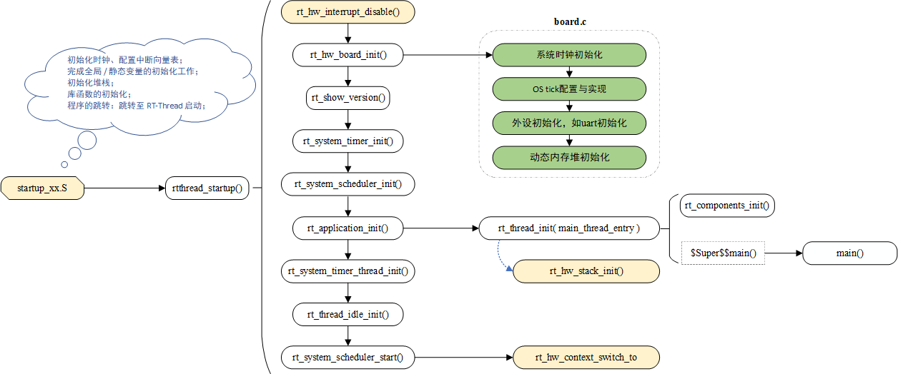
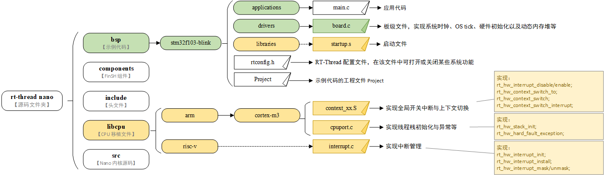

# RT-Thread Nano 移植原理

本片文档介绍 Nano 移植原理，针对的是不同 MCU 的移植，如 Cortex M，RISC-V，或者是其他 MCU 的移植。移植过程主要分为两个部分：libcpu 移植与板级移植，在讲解移植之前，本文档对 RT-Thread Nano 的启动流程与移植目录结构先进行说明。

## 启动流程

RT-Thread 启动流程如下所示，在图中标出颜色的部分需要用户特别注意（黄色表示 libcpu 移植相关的内容，绿色部分表示板级移植相关的内容）。



RT-Thread 启动代码统一入口为  `rtthread_startup() ` ，芯片启动文件在完成必要工作（如初始化时钟、配置中断向量表、初始化堆栈等）后，最终会在程序跳转时，跳转至 RT-Thread 的启动入口中。RT-Thread 的启动流程如下：

1. 全局关中断，初始化与系统相关的硬件。
2. 打印系统版本信息，初始化系统内核对象（如定时器、调度器）。
3. 初始化用户 main 线程（同时会初始化线程栈），在 main 线程中对各类模块依次进行初始化。
4. 初始化软件定时器线程、初始化空闲线程。
5. 启动调度器，系统切换到第一个线程开始运行（如 main 线程），并打开全局中断。

## 移植目录结构

在 `rtthread-nano` 源码中，与移植相关的文件位于下图中有颜色标记的路径下（黄色表示 libcpu 移植相关的文件，绿色部分表示板级移植相关的文件）：



## libcpu 移植

RT-Thread 的 libcpu 抽象层向下提供了一套统一的 CPU 架构移植接口，这部分接口包含了全局中断开关函数、线程上下文切换函数、时钟节拍的配置和中断函数、Cache 等等内容，RT-Thread 支持的 cpu 架构在源码的 `libcpu` 文件夹下。

### 启动文件 startup.s

启动文件由芯片厂商提供，位于芯片固件库中。每款芯片都有相对应的启动文件，在不同开发环境下启动文件也不相同。当系统加入 RT-Thread 之后，会将 RT-Thread 的启动放在调用 main() 函数之前，如下图所示：


startup.s：主要完成初始化时钟、配置中断向量表；完成全局 / 静态变量的初始化工作；初始化堆栈；库函数的初始化；程序的跳转等内容。

程序跳转：芯片在 KEIL MDK 与 IAR 下的启动文件不用做修改，会自动转到 RT-Thread 系统启动函数 `rtthread_startup()` 。GCC 下的启动文件需要修改，让其跳转到 RT-Thread 提供的 entry() 函数，其中 entry() 函数调用了 RT-Thread 系统启动函数 `rtthread_startup()`。

**举例**： stm32 在 GCC 开发环境下的启动文件，修改 GCC 启动文件，使其跳转到 entry 函数。以下是启动文件的代码片段：

```c
//修改前：
  bl  SystemInit
  bl  main

//修改后：
  bl  SystemInit
  bl  entry            /* 修改此处，由 main 改为 entry */
```

RT-Thread 在 entry 函数中实现了 GCC 环境下的 RT-Thread 启动：

```c
int entry(void)
{
    rtthread_startup();
    return 0;
}
```

最终调用 main() 函数进入用户 main()。

### 上下文切换 context_xx.S

上下文切换表示 CPU 从一个线程切换到另一个线程、或者线程与中断之间的切换等。在上下文切换过程中，CPU 一般会停止处理当前运行的代码，并保存当前程序运行的具体位置以便之后继续运行。

在该文件中除了实现上下文切换的函数外，还需完成全局开关中断函数，详见编程指南 [《内核移植》 - CPU 架构移植](../../../programming-manual/porting/porting/) 章节中的 “实现全局开关中断” 小节与 “实现上下文切换” 小节。

| 需实现的函数                                                 | 描述                                                         |
| ------------------------------------------------------------ | ------------------------------------------------------------ |
| rt_base_t rt_hw_interrupt_disable(void);                     | 关闭全局中断                                                 |
| void rt_hw_interrupt_enable(rt_base_t level);                | 打开全局中断                                                 |
| void rt_hw_context_switch_to(rt_uint32 to);                  | 没有来源线程的上下文切换，在调度器启动第一个线程的时候调用，以及在 signal 里面会调用 |
| void rt_hw_context_switch(rt_uint32 from, rt_uint32 to);     | 从 from 线程切换到 to 线程，用于线程和线程之间的切换         |
| void rt_hw_context_switch_interrupt(rt_uint32 from, rt_uint32 to); | 从 from 线程切换到 to 线程，用于中断里面进行切换的时候使用   |

注意：在 Cortex-M 中，PendSV 中断处理函数是 PendSV_Handler()，线程切换的实际工作在 PendSV_Handler() 里完成。

### 线程栈初始化 cpuport.c

在 RT-Thread 中，线程具有独立的栈，当进行线程切换时，会将当前线程的上下文存在栈中，当线程要恢复运行时，再从栈中读取上下文信息，进行恢复。

故障异常处理函数 rt_hw_hard_fault_exception()，在发生硬件错误时，执行 HardFault_Handler 中断，会执行该函数。

该文件中主要实现线程栈的初始化 rt_hw_stack_init() 与 hard fault 异常处理函数，线程栈初始化函数的参数以及实现的步骤详见编程指南 [《内核移植》 - CPU 架构移植](../../../programming-manual/porting/porting/) 章节中的 ”实现线程栈初始化“ 小节。

| 需实现的函数                 | 描述                   |
| ---------------------------- | ---------------------- |
| rt_hw_stack_init()           | 实现线程栈的初始化     |
| rt_hw_hard_fault_exception() | 异常函数：系统硬件错误 |

### 中断与异常挂接 interrupt.c

> [!NOTE]
> 注：注意：在 Cortex-M 内核上，所有中断都采用中断向量表的方式进行处理，即当一个中断触发时，处理器将直接判定是哪个中断源，然后直接跳转到相应的固定位置进行处理，不需要再自行实现中断管理。

在一些非 Cortex-M 架构中，系统没有实现类似中断向量表的功能，物理中断要和用户的中断服务例程相关联，就需要使用中断管理接口对中断进行管理，这样当发生中断时就可以触发相应的中断，执行中断服务例程。

详见编程指南 [《中断管理》](../../../programming-manual/interrupt/interrupt.md) 章节。

| 需实现的中断管理接口      | 描述               |
| ------------------------- | ------------------ |
| rt_hw_interrupt_init()    | 硬件中断初始化     |
| rt_hw_interrupt_install() | 中断服务程序挂接   |
| rt_hw_interrupt_mask()    | 屏蔽指定的中断源   |
| rt_hw_interrupt_umask()   | 打开被屏蔽的中断源 |

## 板级移植 board.c

> [!NOTE]
> 注：board.c、rtconfig.h 是与硬件 / 板级相关的文件，在移植时需自行实现。Cortex M 架构可参考 Nano 源码 bsp 文件夹中已有的的 board.c、rtconfig.h 。

板级移植主要是针对 `rt_hw_board_init()` 函数内容的实现，该函数在板级配置文件 board.c 中，函数中做了许多系统启动必要的工作，其中包含：

1. 配置系统时钟。
2. 实现 OS 节拍。（其中步骤 1 和 2 为 3.1.5 版本中  `#error TODO 1` 的部分：`#error "TODO 1: OS Tick Configuration."`）
3. 初始化外设：如 GPIO/UART 等等，若需要请在此处调用。
4. 初始化系统内存堆，实现动态堆内存管理。
5. 板级自动初始化，使用 INIT_BOARD_EXPORT() 自动初始化的函数会在此处被初始化。
6. 其他必要的初始化，如 MMU 配置（需要时请自行在 rt_hw_board_init 函数中调用应用函数实现）。

```c
/* board.c */
void rt_hw_board_init(void)
{
    /* 第一部分：系统初始化、系统时钟配置等 */
    HAL_init();                // 一些系统层初始化，若需要则增加此部分
    SystemClock_Config();      // 配置系统时钟
    SystemCoreClockUpdate();   // 更新系统时钟频率 SystemCoreClock

    /* 第二部分：配置 OS Tick 的频率，实现 OS 节拍（并在中断服务例程中实现 OS Tick 递增） */
    _SysTick_Config(SystemCoreClock / RT_TICK_PER_SECOND);

    /* 第三部分：初始化硬件外设，若有需要，则放在此处调用 */

    /* 第四部分：系统动态内存堆初始化 */
#if defined(RT_USING_USER_MAIN) && defined(RT_USING_HEAP)
    rt_system_heap_init(rt_heap_begin_get(), rt_heap_end_get());
#endif

    /* 第五部分：使用 INIT_BOARD_EXPORT() 进行的初始化 */
#ifdef RT_USING_COMPONENTS_INIT
    rt_components_board_init();
#endif

    /* 第六部分：其他初始化 */
}
```

### 一、配置系统时钟

系统时钟是给各个硬件模块提供工作时钟的基础，在 `rt_hw_board_init()` 函数中完成，可以调用库函数实现配置，也可以自行实现。

如下是配置系统时钟调用示例：

```c
/* board.c */
void rt_hw_board_init()
{
    /* 第一部分：系统初始化、系统时钟配置等 */
    rt_hw_clock_init()    // 时钟初始化，函数名不做要求，函数自行实现，如 SystemClock_Config()、SystemCoreClockUpdate()
    ...
}
```

### 二、实现 OS 节拍

OS 节拍也叫时钟节拍或 OS tick。任何操作系统都需要提供一个时钟节拍，以供系统处理所有和时间有关的事件。

**时钟节拍的实现**：通过硬件 timer 实现周期性中断，在定时器中断中调用 `rt_tick_increase()` 函数实现全局变量 rt_tick 自加，从而实现时钟节拍。一般地，在 Cortex M 上直接使用内部的滴答定时器 Systick 实现。

**示例**：如下是 stm32 配置 OS 节拍示例，在初始化时钟节拍后，直接在 SysTick_Handler() 中断服务例程中调用 `rt_tick_increase()`。

```c
/* board.c */
void rt_hw_board_init()
{
    ...
    /* 第二部分：配置 OS Tick 的频率，实现 OS 节拍（并在中断服务例程中实现 OS Tick 递增） */
    _SysTick_Config(SystemCoreClock / RT_TICK_PER_SECOND);  // 使用 SysTick 实现时钟节拍
    ...
}

/* systick 中断服务例程 */
void SysTick_Handler(void)
{
    /* enter interrupt */
    rt_interrupt_enter();

    rt_tick_increase();

    /* leave interrupt */
    rt_interrupt_leave();
}
```

对于使用了 RT-Thread 中断管理的 CPU 架构，中断服务例程需要通过 `rt_hw_interrupt_install()` 进行装载（关于中断及其装载，详见本文档的” 中断管理 “ 小节），如下示例：

```c
/* board.c */
void rt_hw_board_init()
{
    ...
    /* 第二部分：配置 OS Tick 的频率，实现 OS 节拍（并在中断服务例程中实现 OS Tick 递增） */
    rt_hw_timer_init();      // 使用 硬件定时器 实现时钟节拍，一般命名为 rt_hw_timer_init()
    ...
}

int rt_hw_timer_init(void)   // 函数自行实现，并需要装载中断服务例程
{
    ...
    rt_hw_interrupt_install(IRQ_PBA8_TIMER2_3, rt_hw_timer_isr, RT_NULL, "tick");
    rt_hw_interrupt_umask(IRQ_PBA8_TIMER2_3);
}

/* TIMER 中断服务例程 */
static void rt_hw_timer_isr(int vector, void *param)
{
    rt_interrupt_enter();
    rt_tick_increase();
    rt_interrupt_leave();
}
```

> [!NOTE]
> 注：在初始化时钟节拍的时候，会用到宏 `RT_TICK_PER_SECOND`。通过修改该宏的值，可以修改系统中一个时钟节拍的时间长度。

### 三、硬件外设初始化

硬件初始化，如 UART 初始化等（对接控制台），需要在 rt_hw_board_init() 函数中手动调用 UART 初始化函数。

```c
/* board.c */
void rt_hw_board_init(void)
{
    ....
    /* 第三部分：初始化硬件外设，若有需要，则放在此处调用 */
    uart_init();
    ....
}
```
注意，uart_init() 或者其他的外设初始化函数，若已经使用了宏 INIT_BOARD_EXPORT() 进行初始化，则不需要在此进行显式调用。两种初始化方法选择一种即可。

### 四、实现动态内存堆

RT-Thread Nano 默认不开启动态内存堆功能，开启 RT_USING_HEAP 将可以使用动态内存功能，即可以使用 rt_malloc、rt_free 以及各种系统动态创建对象的 API。动态内存堆管理功能的初始化是通过 rt_system_heap_init() 函数完成的，动态内存堆的初始化需要指定堆内存的起始地址和结束地址，函数原型如下：

```c
void rt_system_heap_init(void *begin_addr, void *end_addr)
```

开启 RT_USING_HEAP 后，系统默认使用数组作为 heap，heap 的起始地址与结束地址作为参数传入 heap 初始化函数，heap 初始化函数 rt_system_heap_init() 将在 rt_hw_board_init() 中被调用。

开启 heap 后，系统中默认使用数组作为 heap（heap 默认较小，实际使用时请根据芯片 RAM 情况改大），获得的 heap 的起始地址与结束地址，作为参数传入 heap 初始化函数：

```c
#define RT_HEAP_SIZE 1024
static uint32_t rt_heap[RT_HEAP_SIZE];
RT_WEAK void *rt_heap_begin_get(void)
{
    return rt_heap;
}

RT_WEAK void *rt_heap_end_get(void)
{
    return rt_heap + RT_HEAP_SIZE;
}

void rt_hw_board_init(void)
{
    ....
#if defined(RT_USING_USER_MAIN) && defined(RT_USING_HEAP)
    rt_system_heap_init(rt_heap_begin_get(), rt_heap_end_get());    //传入 heap 的起始地址与结束地址
#endif
    ....
}
```

如果不想使用数组作为动态内存堆，则可以重新指定系统 HEAP 的大小，例如使用 RAM ZI 段结尾处作为 HEAP 的起始地址（这里需检查与链接脚本是否对应），使用 RAM 的结尾地址作为 HEAP 的结尾地址，这样可以将空余RAM 全部作为动态内存 heap 使用。如下示例重新定义了 HEAP 的起始地址与结尾地址，并作为初始化参数进行系统 HEAP 初始化。

```c
#define STM32_SRAM1_START              (0x20000000)
#define STM32_SRAM1_END                (STM32_SRAM1_START + 20 * 1024)   // 结束地址 = 0x20000000（基址） + 20K(RAM大小)

#if defined(__CC_ARM) || defined(__CLANG_ARM)
extern int Image$$RW_IRAM1$$ZI$$Limit;                   // RW_IRAM1，需与链接脚本中运行时域名相对应
#define HEAP_BEGIN      ((void *)&Image$$RW_IRAM1$$ZI$$Limit)
#endif

#define HEAP_END                       STM32_SRAM1_END
```

```c
void rt_hw_board_init(void)
{
    ....
#if defined(RT_USING_USER_MAIN) && defined(RT_USING_HEAP)
    rt_system_heap_init((void *)HEAP_BEGIN, (void *)HEAP_END);
#endif
    ....
}
```

#### 链接脚本

链接脚本，也称分散加载文件，决定在生成 image 文件时如何来分配相关数据的存放基址，如果不指定特定的链接脚本，连接器就会自动采用默认的链接脚本来生成镜像。

举例 stm32 在 KEIL MDK 开发环境下的链接脚本文件 xxx.sct：

```c
LR_IROM1 0x08000000 0x00020000  {    ; load region size_region
  ER_IROM1 0x08000000 0x00020000  {  ; load address = execution address
   *.o (RESET, +First)
   *(InRoot$$Sections)
   .ANY (+RO)
  }
  RW_IRAM1 0x20000000 0x00005000  {  ; RW data
   .ANY (+RW +ZI)
  }
}
```

其中 `RW_IRAM1 0x20000000 0x00005000` 表示定义一个运行时域 RW_IRAM1（默认域名），域基址为 0x20000000，域大小为 0x00005000（即 20K ），对应实际 RAM 大小。`.ANY (+RW +ZI)` 表示加载所有匹配目标文件的可读写数据 RW-Data、清零数据 ZI-Data。所以运行时所占内存的结尾处就是 ZI 段结尾处，可以将 ZI 结尾处之后的内存空间作为系统动态内存堆使用。


