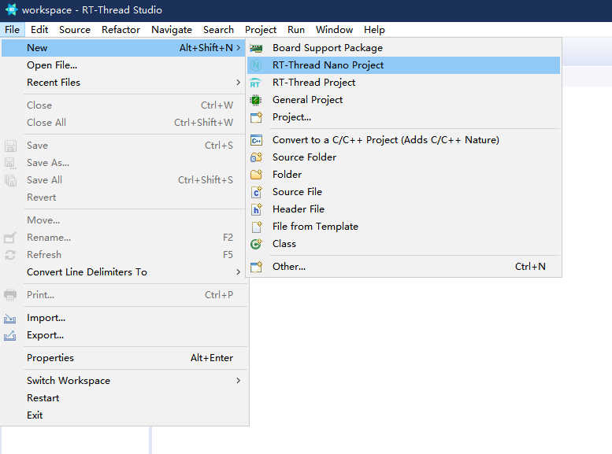
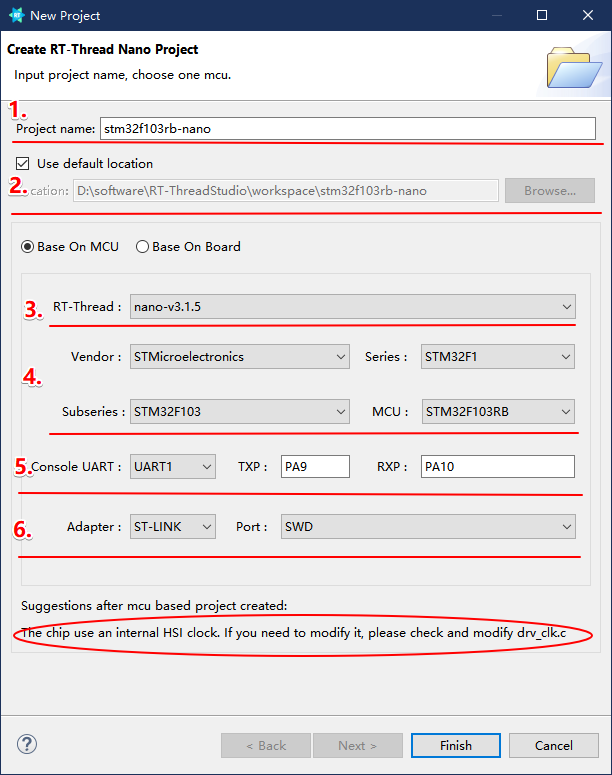
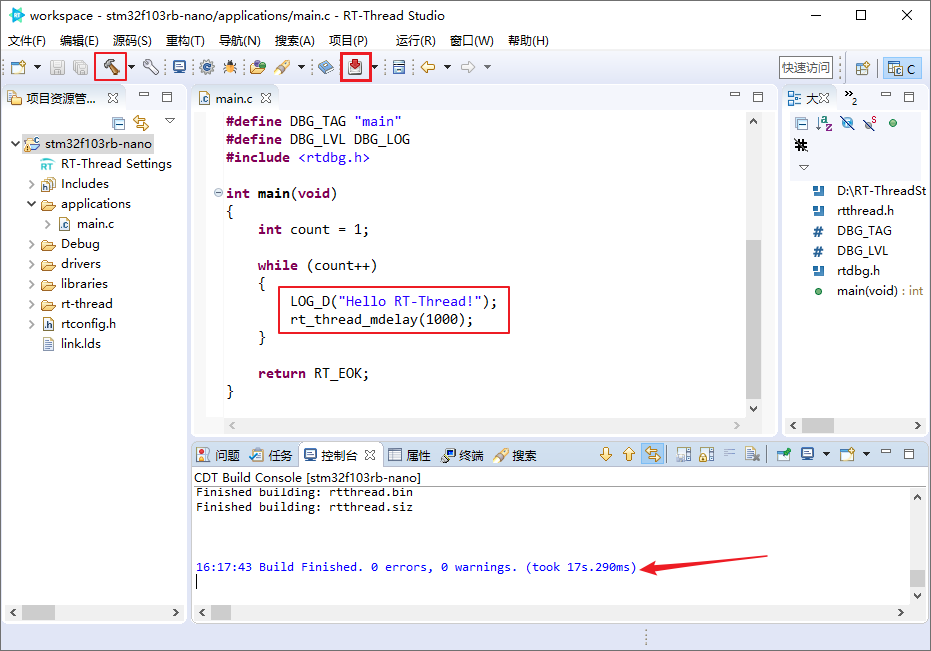
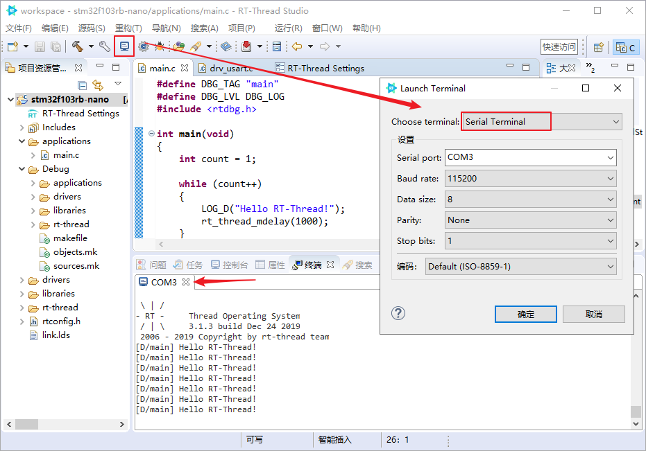
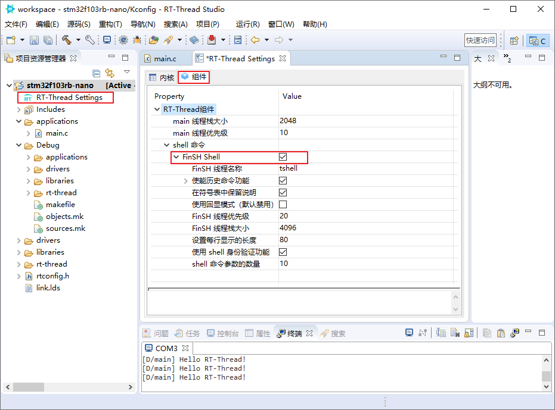
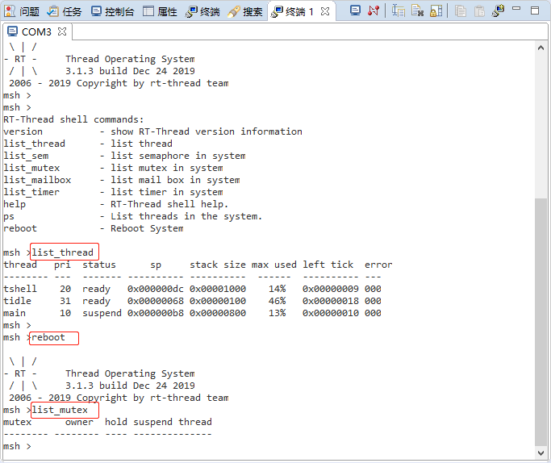

# 在 RT-Thread Studio 上使用 RT-Thread Nano

本文介绍了如何在 RT-Thread Studio 上使用 RT-Thread Nano，并以创建 stm32f103RB 的 Nano 工程为例。

## 准备工作

[安装 RT-Thread Studio](https://www.rt-thread.org/page/studio.html)。

## 新建 Nano 工程

打开 IDE，新建 Nano 工程：

进入新建工程的配置向导：

1. 设置工程名称
2. 工程保存路径
3. 基于芯片创建，nano 版本选择
4. 芯片选择
5. 串口控制台与引脚号配置
6. 调试配置

工程使用芯片内部 HSI 时钟，如需修改，则请修改 drv_clk.c

注：可以通过修改 drv_clk.c 的 `SystemClock_Config()` 更改系统时钟。

工程创建完毕，连接硬件，可直接进行编译下载，如下所示：

由于在创建工程向导中配置了控制台串口号及其引脚号，所以工程中已经实现了 uart 的驱动以及 `rt_hw_console_output()` ，默认可以进行打印。打开串口终端，可以发现在终端中执行了打印。

## 基于 Nano 添加 FinSH

双击 `RT-Thread Settings` 进入配置，打开组件，勾选 FinSH Shell，保存配置。此操作将把 FinSH 组件的源码加入工程中。

其中，`rt_hw_console_getchar()` 已经在 drv_uart.c 中实现，无需再实现对接 FinSH 的代码。

链接硬件，编译下载后，在串口终端中按下 Tab 键，可查看系统中的命令：

## 常见问题

### Q：如何修改系统时钟？

A： 可以通过修改 drv_clk.c 的 `SystemClock_Config()` 更改系统时钟。
