# 上手体验以及 vscode 插件使用

## 开箱

包装内自带了两根 Type-C 线和一根网线。开发板整体接口还是很丰富的：SDIO、USB、ETH、LCD、Camera：

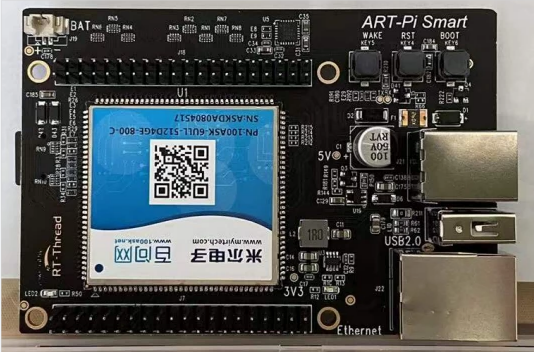

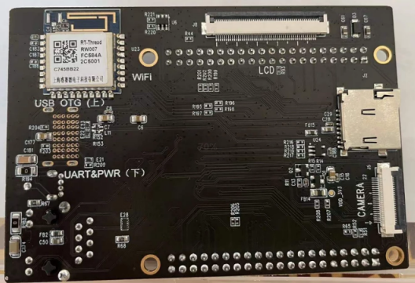

## 上电

拿到新开发板的第一件事，当然是插电，开机，打印 `hello, world`！

1. 插入 Type-C 电源和网线，打开终端，波特率设置为 115200

   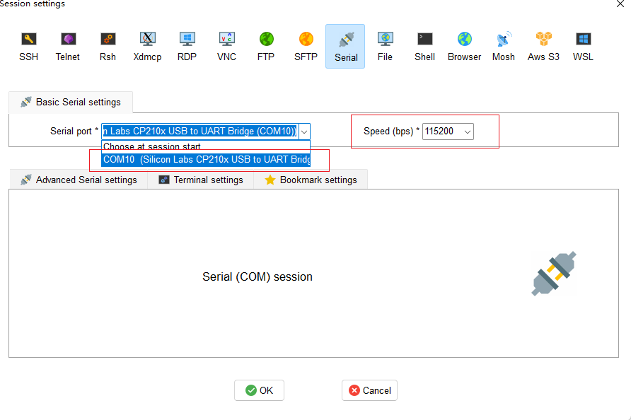

2. 上电调试信息：

  ```shell
   U-Boot 2017.03-g002b758ac9-dirty (Nov 24 2021 - 20:08:02 +0800)
   
   CPU:   Freescale i.MX6ULL rev1.1 696 MHz (running at 396 MHz)
   CPU:   Industrial temperature grade (-40C to 105C) at 38C
   Reset cause: WDOG
   Model: Freescale i.MX6 ULL 14x14 EVK Board
   Board: MX6ULL 14x14 EVK
   DRAM:  512 MiB
   MMC:   FSL_SDHC: 0, FSL_SDHC: 1
   *** Warning - bad CRC, using default environment
   
   Display: TFT7016 (1024x600)
   Video: 1024x600x24
   In:    serial
   Out:   serial
   Err:   serial
   switch to partitions #0, OK
   mmc1(part 0) is current device
   Net:   eth1: ethernet@020b4000, eth0: ethernet@02188000 [PRIME]
   Normal Boot
   Hit any key to stop autoboot:  0
   reading /kernel/rtthread.bin
   1149312 bytes read in 73 ms (15 MiB/s)
   ## Starting application at 0x80001000 ...
   
    \ | /
   - RT -     Thread Smart Operating System
    / | \     5.0.0 build Dec 15 2021
    2006 - 2020 Copyright by rt-thread team
    lwIP-2.1.2 initialized!
    [15] E/drv.enet: emac device init success
   
    [20] I/I2C: I2C bus [i2c3] registered
    [24] I/I2C: I2C bus [i2c4] registered
    [83] E/drv.enet:
    PHY Link down, please check the cable connection and link partner setting.
   
    [94] I/SDIO: SD card capacity 31166976 KB.
    [156] I/SDIO: emmc card capacity 3817472 KB.
    found part[0], begin: 2098176, size: 500.0MB
    found part[1], begin: 526386176, size: 1.0GB
    found part[2], begin: 1600128000, size: 10.0MB
    found part[3], begin: 1610613760, size: 200.0MB
    [266] I/touch: rt_touch init success
    [270] I/gt911: touch device gt911 init success
    [275] I/sal.skt: Socket Abstraction Layer initialize success.
    emmc file system initialization done!
    Dir / sd0 mount failed!
    [1751] E/[RW007]: The wifi Stage 1 status 0 0 0 1
    [1758] I/WLAN.dev: wlan init success
    [1763] I/WLAN.lwip: eth device init ok name:w0
    [1768] I/WLAN.dev: wlan init success
    [1773] I/WLAN.lwip: eth device init ok name:w1
   
    rw007  sn: [rw00700000000fc584a2c5001]
    rw007 ver: [RW007_2.1.0-a7a0d089-57]
   
    [5247] D/drv.enet: enet1 link up
   
    [5789] W/WLAN.mgnt: F:rt_wlan_connect L:1091 not find ap! ssid:rt-thread
    hello rt-smart!
    /sd/wifi.sh wi-fi configuration file not exist in sd card!
    [5807] I/mcf.link.tcp: TCPServer Waiting for client on port 5555...
   
    [5814] I/mcf.link: MCF link port(3) register successfully.
    msh />[5850] I/mcf.trans: MCF(V0.1.0) initialized successfully.
    [5855] I/urpc: uRPC(V0.1.0) initialize successfully.
    [5861] I/mcf.trans: MCF protocol started successfully.


3.  在终端输入命令 `help` 查看帮助信息

   ```shell
   msh />help
   RT-Thread shell commands:
   reboot           - reboot system
   cpu_usage        - display cpu usage
   dbg              - dbg
   memcheck         - check memory data
   memtrace         - dump memory trace information
   gic_dump         - show gic status
   list_page        - show page info
   list_fd          - list file descriptor
   lsof             - list open files
   mount            - mount<device><mountpoint><fstype>
   unmount          - unmount the mountpoint
   hello            - say hello world
   clear            - clear the terminal screen
   version          - show RT-Thread version information
   list_thread      - list thread
   list_sem         - list semaphore in system
   list_event       - list event in system
   list_mutex       - list mutex in system
   list_mailbox     - list mail box in system
   list_msgqueue    - list message queue in system
   list_memheap     - list memory heap in system
   list_mempool     - list memory pool in system
   list_timer       - list timer in system
   list_device      - list device in system
   list             - list all symbol in system
   help             - RT-Thread shell help.
   ps               - List threads in the system.
   free             - Show the memory usage in the system.
   ls               - List information about the FILEs.
   cp               - Copy SOURCE to DEST.
   mv               - Rename SOURCE to DEST.
   cat              - Concatenate FILE(s)
   rm               - Remove(unlink) the FILE(s).
   cd               - Change the shell working directory.
   pwd              - Print the name of the current working directory.
   mkdir            - Create the DIRECTORY.
   mkfs             - format disk with file system
   df               - disk free
   echo             - echo string to file
   set              - set or show environment variable
   list_channel     - list IPC channel information
   list_process     - list process
   kill             - send a signal to a process
   killall          - kill processes by name
   list_shm         - show share memory info
   sys_log          - sys_log 1(enable)/0(disable)
   ifconfig         - list the information of all network interfaces
   ping             - ping network host
   dns              - list and set the information of dns
   netstat          - list the information of TCP / IP
   pwm_enable       - pwm_enable pwm1 1
   pwm_disable      - pwm_disable pwm1 1
   pwm_set          - pwm_set pwm1 1 100 50
   date             - get date and time or set [year month day hour min sec]
   wifi             - wifi command.
   
  ```

4. 执行用户 app。用户 app 存放在目录 **/root/bin** 目录下

   ```shell
   msh /root/bin>pong.elf &
   msh /root/bin>
   Pong: wait on the IPC channel: 3
   
   msh /root/bin>ping
   msh /root/bin>ping.elf
   msh /root/bin>
   Ping: send count = 0
   Pong: receive count = 0
   Pong: reply count = 0
   Ping: receive the reply 0
   
   Ping: send count = 1
   Pong: receive count = 1
   Pong: reply count = 1
   Ping: receive the reply 1
   
   Ping: send count = 2
   Pong: receive count = 2
   Pong: reply count = 2
   Ping: receive the reply 2
   
   Ping: send count = 3
   Pong: receive count = 3
   Pong: reply count = 3
   Ping: receive the reply 3
   
   Ping: send count = 4
   Pong: receive count = 4
   Pong: reply count = 4
   Ping: receive the reply 4
   
   Ping: send count = 5
   Pong: receive count = 5
   Pong: reply count = 5
   Ping: receive the reply 5
   
   Ping: send count = 6
   Pong: receive count = 6
   Pong: reply count = 6
   Ping: receive the reply 6
   
   Ping: send count = 7
   Pong: receive count = 7
   Pong: reply count = 7
   Ping: receive the reply 7
   ```

## 下载源码

ART-Pi Smart 的最新源码仓库地址：[ART-Pi-smart: ART-Pi smart开发板的SDK仓库 (gitee.com)](https://gitee.com/rtthread/ART-Pi-smart)

使用 git 工具下载源码：`git clone https://gitee.com/rtthread/ART-Pi-smart.git `

## vscode 插件体验

RT-Thread 官方提供了 vscode 插件用来开发用户 app 代码。下面分享一下 ART-Pi Smart Vscode 插件的使用体验。

### 安装插件

打开 vscode，在扩展中搜索 RT-Thread Smart

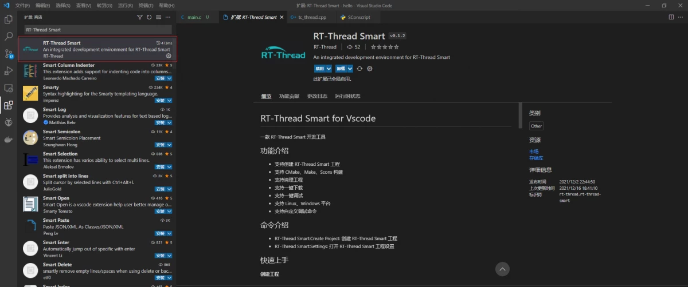

### 创建工程

- 使用快捷键 `ctrl + shift + p`, 选择创建 RT-Thread Smart 工程

  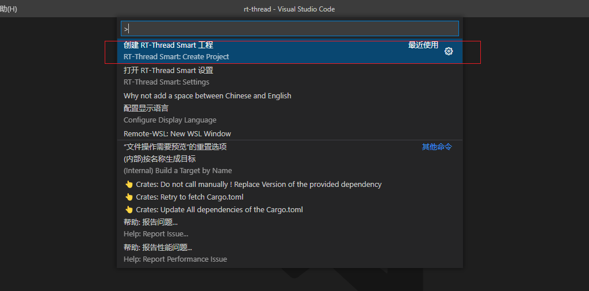

- 选择 RT-Thread Smart SDK 的根目录，回车

  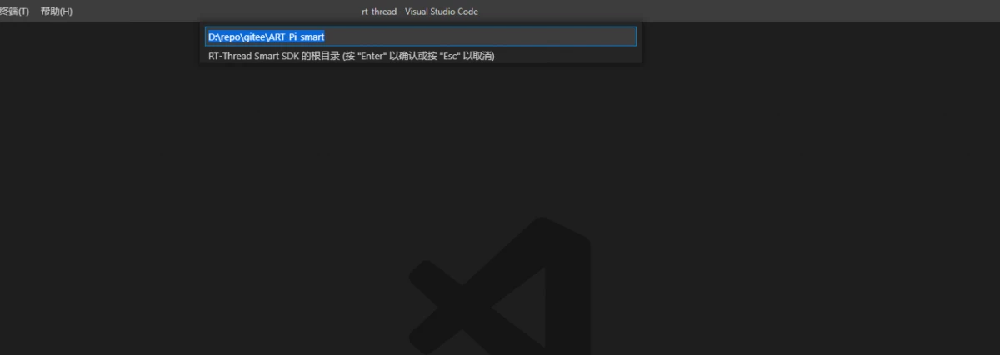

  gitee 下载下来的源码目录结构如下

  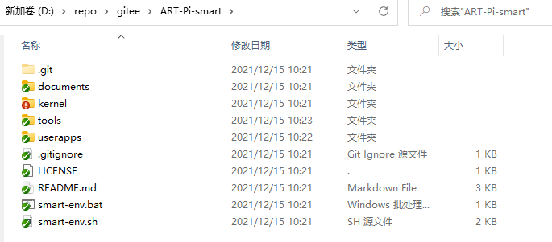

- 新建一个 `hello`工程，回车

  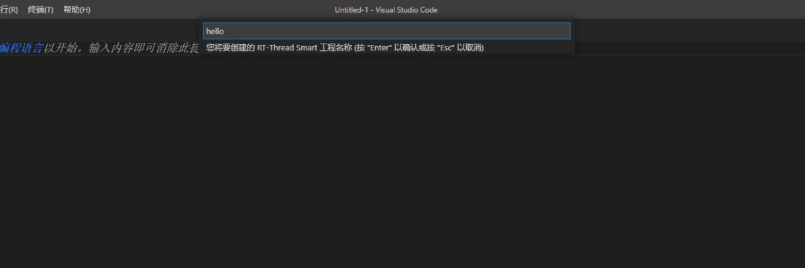

- 选择编译工具，目前 windows 下只有 scons。如果开发环境中没有安装 scons，需要使用命令 `pip install scons ` 安装 scons 工具。

  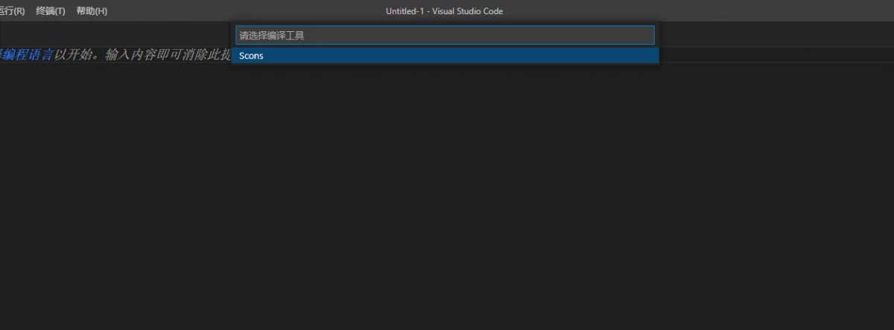

- 通过上面的步骤，一个用户 app 示例就创建完成了

  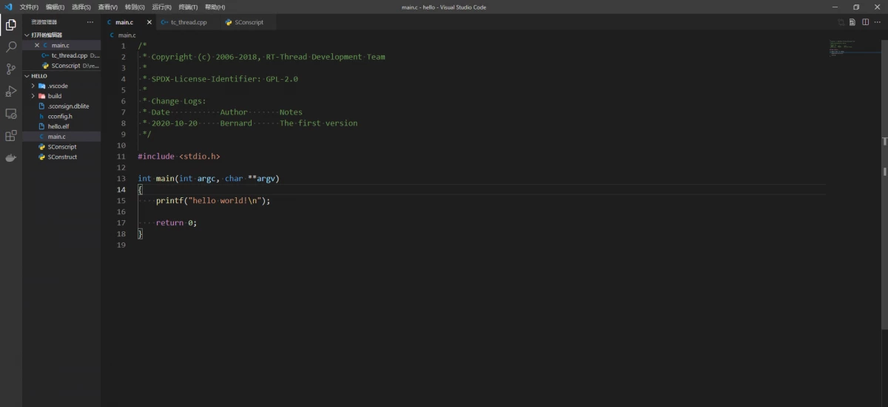

### 下载用户态代码

vscode 支持下载用户代码到 Smart 开发板。

- 在终端输入命令 `ifconfig` 获取开发板 IP 地址。这里的 MAC 在代码中是写死的，不知道为什么要使用这种方法。如果你的局域网中插入两块 Smart 开发板，可能会有问题，因为这两块开发板的 IP 地址是一样的。

  ```shell
  msh />ifconfig
  network interface device: e1 (Default)
  MTU: 1500
  MAC: a8 5e 45 91 92 93
  FLAGS: UP LINK_UP INTERNET_UP DHCP_ENABLE ETHARP BROADCAST IGMP
  ip address: 192.168.110.34
  gw address: 192.168.110.1
  net mask  : 255.255.255.0
  ipv6 link-local: FE80::AA5E:45FF:FE91:9293 VALID
  ipv6[1] address: 0.0.0.0 INVALID
  ipv6[2] address: 0.0.0.0 INVALID
  dns server #0: 211.136.150.66
  dns server #1: 211.136.112.50
  
  network interface device: w0
  MTU: 1500
  MAC: fc 58 4a 2c 50 01
  FLAGS: UP LINK_DOWN INTERNET_DOWN DHCP_ENABLE ETHARP BROADCAST IGMP
  ip address: 0.0.0.0
  gw address: 0.0.0.0
  net mask  : 0.0.0.0
  ipv6 link-local: FE80::FE58:4AFF:FE2C:5001 VALID
  ipv6[1] address: 0.0.0.0 INVALID
  ipv6[2] address: 0.0.0.0 INVALID
  dns server #0: 211.136.150.66
  dns server #1: 211.136.112.50
  
  network interface device: w1
  MTU: 1500
  MAC: fc 58 4a 2c 50 00
  FLAGS: UP LINK_DOWN INTERNET_DOWN DHCP_ENABLE ETHARP BROADCAST IGMP
  ip address: 0.0.0.0
  gw address: 0.0.0.0
  net mask  : 0.0.0.0
  ipv6 link-local: FE80::FE58:4AFF:FE2C:5000 VALID
  ipv6[1] address: 0.0.0.0 INVALID
  ipv6[2] address: 0.0.0.0 INVALID
  dns server #0: 211.136.150.66
  dns server #1: 211.136.112.50
  ```

- 编译代码

  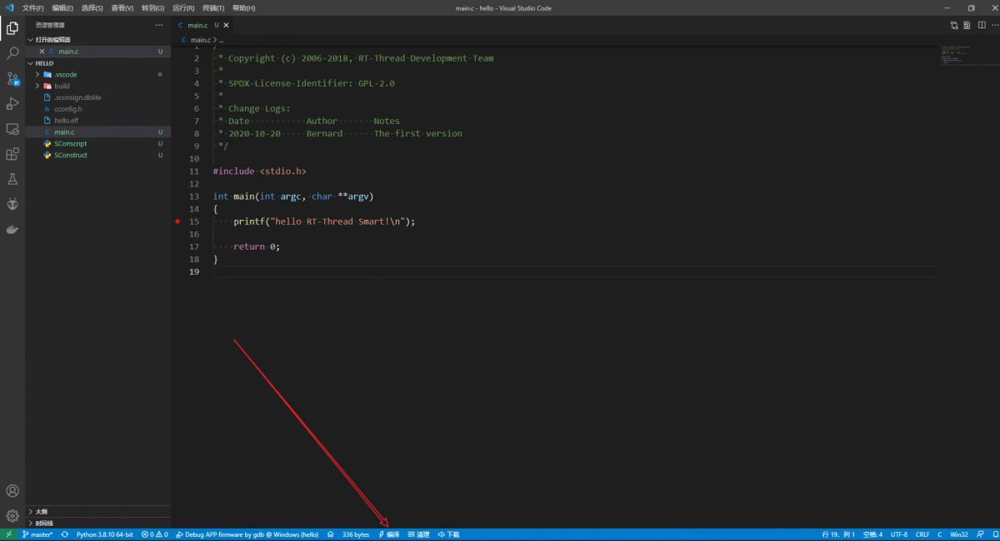

- 设置 IP 地址，使用快捷键 `ctrl + shift + p` 选择打开 RT-Thread Smart 设置

  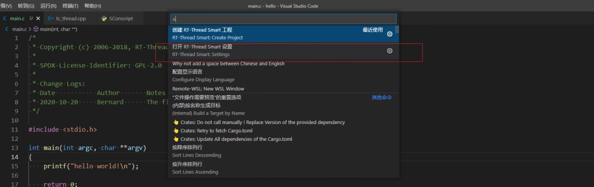

  填入开发板 IP 地址，保存设置并退出

  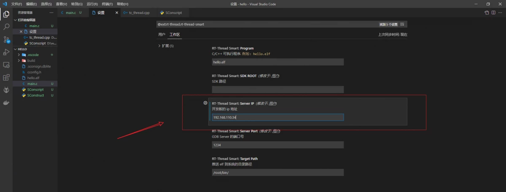

- 下载代码

  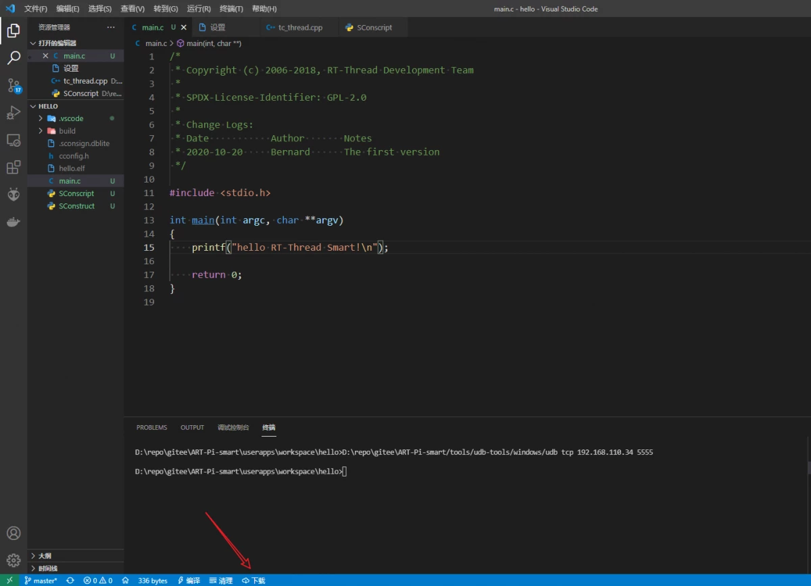

  当终端显示以下界面时，表示代码下载成功

  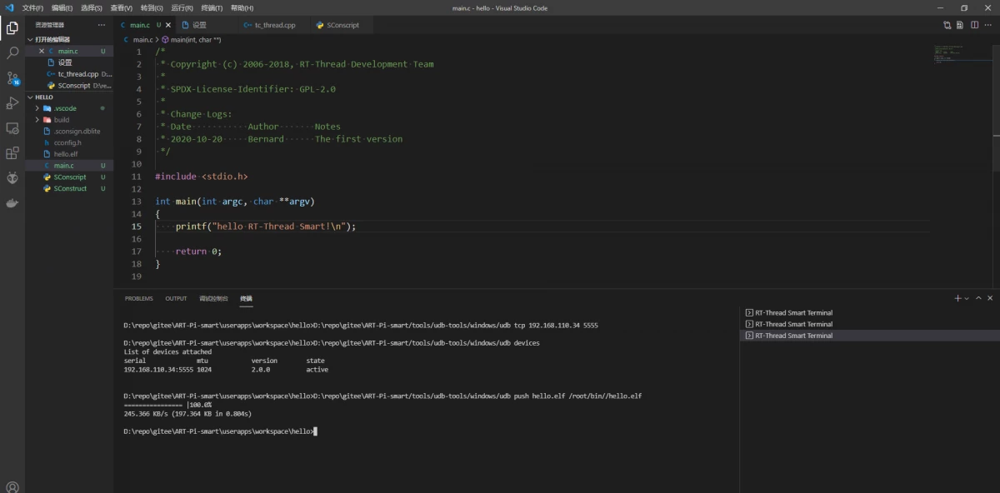

- 运行可执行文件

  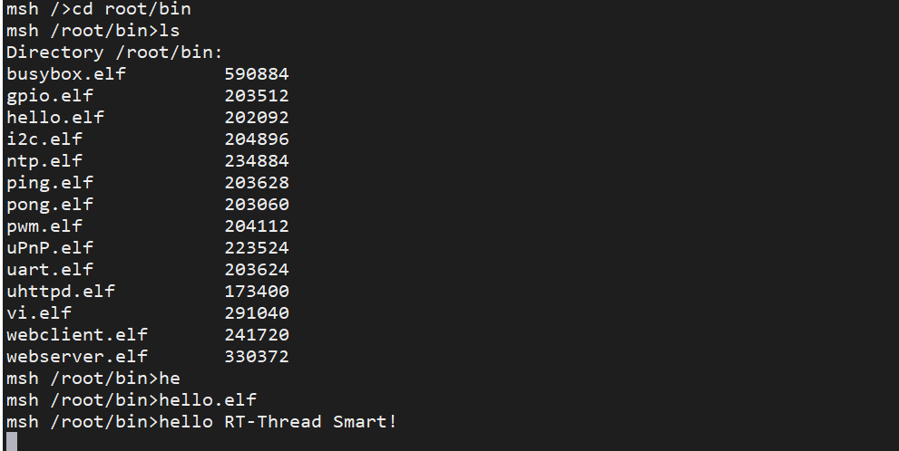

### 调试用户态代码

- 使用快捷键 `F5` 进入调试模式，可以在代码处设置断点

  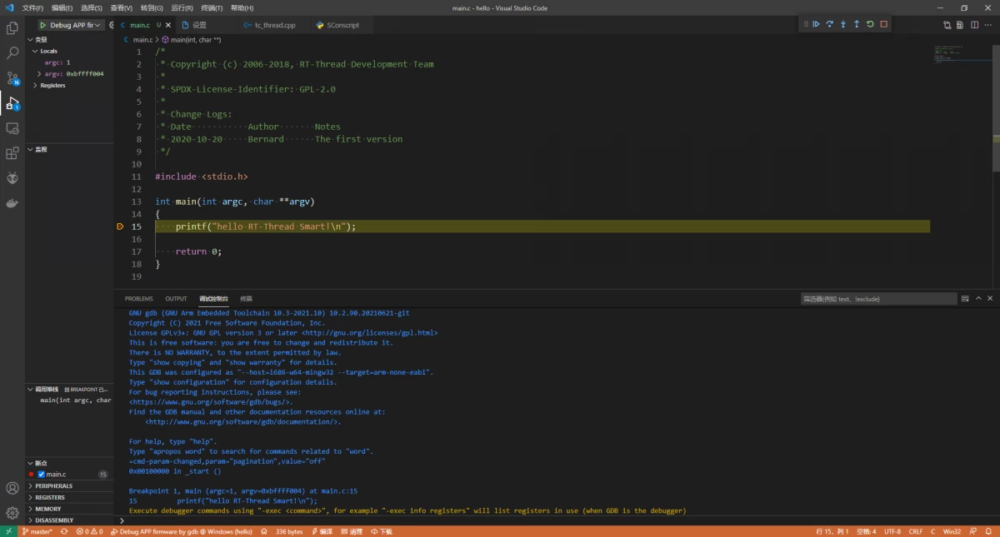

- 可以使用快捷键 `F11`  进行单步调试

### UDB 工具

在下载代码和调试代码时，在终端发现 vscode smart 插件使用的是一个叫 **udb** 的工具。udb 工具位于 **ART-Pi-smart\tools\udb-tools**。RT-Thread 提供了windows 和 linux 两个版本的 udb 工具。

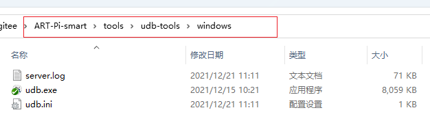

windows 下目录结构：

- server.log ：udb 的运行日志
- udb.exe    ：可执行文件
- udb.ini      ：tcp 配置文件，保存了 smart 开发板的 ip  地址

#### udb 命令

在该目录下打开 windows 终端，输入命令 `udb.exe --help ` 查看 udb 命令。

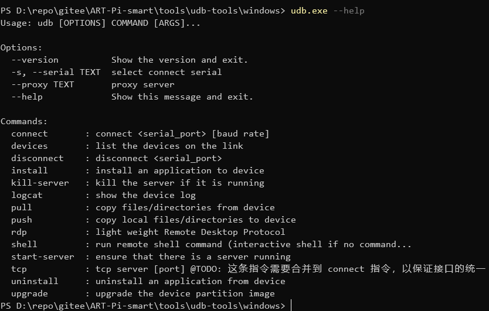

#### udb devices

查看当前 udb 链路设备

```bash
PS D:\repo\gitee\ART-Pi-smart\tools\udb-tools\windows> .\udb.exe devices
List of devices attached
serial              mtu            version        state
192.168.110.34:5555 1024           2.0.0          active
```

#### udb push

推送本地文件到远端设备

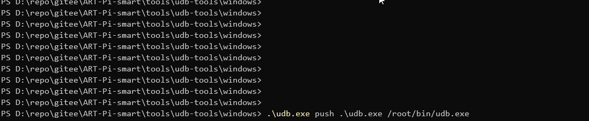

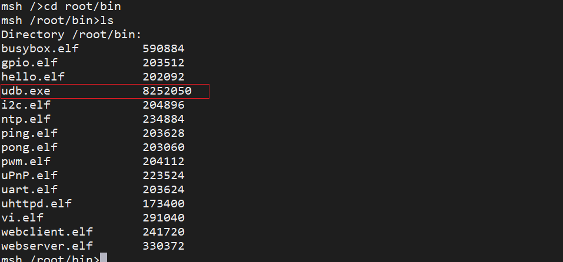

#### udb pull

拉取远端文件到本地

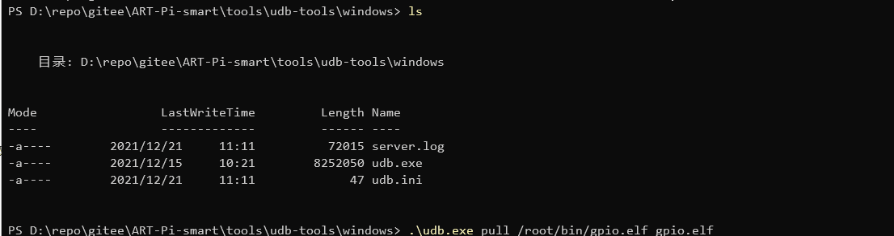