# 使用 VS Code 开发 GUI 应用

## RT-Thread Smart 简介

RT-Thread Smart（简称 rt-smart）是基于 RT-Thread 操作系统衍生的新分支，面向带 MMU，中高端应用的芯片，例如 ARM Cortex-A 系列芯片，MIPS 芯片，带 MMU 的 RISC-V 芯片等。rt-smart 在 RT-Thread 操作系统的基础上启用独立、完整的进程方式，同时以混合微内核模式执行。

## SDL 简介

SDL（Simple DirectMedia Layer）是一个跨平台开发库库，使用 C 语言写成。旨在通过 OpenGL 和 Direct3D 提供对音频、键鼠、鼠标、操作杆和图形硬件的底层访问。视频回放软件、模拟器和流行游戏（包括 Value 的获奖目录和许多 Humble Bundle 游戏）都使用了它。


SDL 支持 Windows、Mac OS X、Linux、iOS 和 Android。

SDL 2.0 是在 zlib 许可下发布的，这个许可允许用户可以在任何软件中自由的使用 SDL。

## RT-Thread Smart for VS Code 插件简介

为了使用户能够在各种平台上方便、快捷的开发 rt-smart 用户程序，RT-Thread 推出了这样一款便利且小巧的插件。

支持的功能包括：

- 创建 RT-Thread Smart 工程

- 支持 CMake、Make、SCons 等构建方式

- 支持清理工程

- 支持一键下载、调试

- 支持在不同的平台，例如 Linux、Windows 下进行开发

支持的命令包括：

- RT-Thread Smart:Create Project： 创建 RT-Thread Smart 工程

- RT-Thread Smart:Settings：打开 RT-Thread Smart 工程设置

## 搭建 ART-Pi Smart 环境

### 硬件环境搭建

- 串口连接：下方的 USB Type-C 接口，既是用作电源供电，同时也是 USB 转 UART 接口，主要用于系统的控制台命令行交互，包括控制台输入和输出

  | **波特率** | **数据位** | **停止位** |
  | ---------- | ---------- | ---------- |
  | 115200     | 8          | 1          |

- 网络接口：通过路由器和网线（或者通过板载的 RW007 WiFi 模块），将开发板和测试电脑连接在同一个局域网内 

  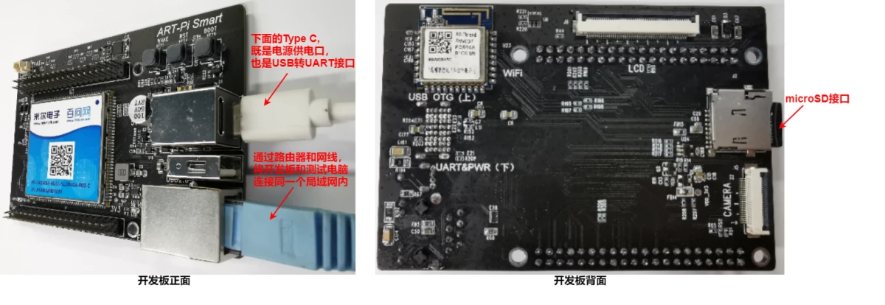

- 显示接口：开发板未上电之前，先将 4.3 寸 LCD 显示器的 40 Pin FPC 排线连接到 ART-Pi Smart 开发板背面的 LCD 硬件插槽

  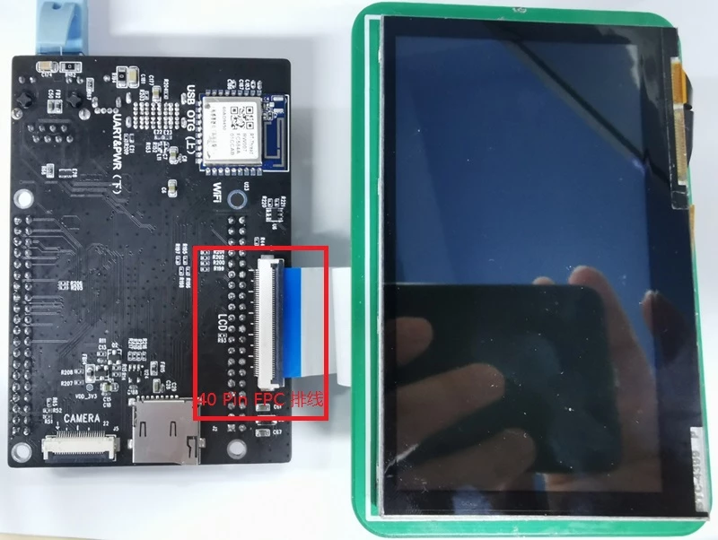
  
### 软件环境搭建

#### 下载 ART-Pi Smart SDK

[ART-Pi-Smart SDK 仓库](https://gitee.com/rtthread/ART-Pi-smart) 是 RT-Thread 团队对 ART-Pi Smart 开发板所作的支持包，用于学习和评估 RT-Thread Smart 微内核操作系统，让用户可以更简单方便地开发自己的应用程序。

ART-Pi smart 开发板的 SDK 仓库，主要包括 RT-Thread Smart 的源码，BSP 驱动，应用程序 demo 等。

SDK 下载方法：通过 Git 下载 ART-Pi Smart SDK 包：

```shell
git clone https://gitee.com/rtthread/ART-Pi-smart.git
```

#### 下载工具链

- rt-smart 采用的工具链为：arm-linux-musleabi 工具链

- 需要用户自行通过下面网址下载 Linux 版本或 Windows 版本的工具链

- 链接: https://pan.baidu.com/s/1p7PRhV3dTGIb7hxv34YWYw 提取码: ndxq 

- 将下载的工具链，解压到指定的路径 tools/gnu_gcc 下面

  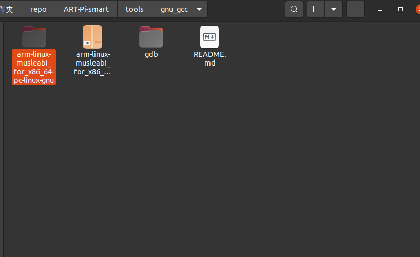

#### Linux 开发环境准备

输入下面的命令，配置 Linux 开发环境：

```shell
$ sudo apt update
$ sudo apt install git bzip2 wget patch
$ sudo apt install gcc
$ sudo apt install g++
$ sudo apt install libncurses-dev
$ sudo apt install libpng-dev
$ sudo apt install libncurses5
$ sudo apt install automake
$ sudo apt install make
```

#### 编译 SDL

在创建 SDL 应用程序前，需要将 SDL 编译为静态库文件。

- 在 SDK 目录下打开终端，配置环境变量：

  ```shell
  liukang@liukang-virtual-machine:~/repo/ART-Pi-smart$ ls
  documents  kernel  LICENSE  README.md  smart-env.bat  smart-env.sh  tools  userapps
  liukang@liukang-virtual-machine:~/repo/ART-Pi-smart$ ./smart-env.sh 
  ```

- 在 userapps/gnu-apps/sdl 目录下，执行 build_sdl.sh 文件：

  ```shell
  liukang@liukang-virtual-machine:~/repo/ART-Pi-smart$ cd userapps/gnu-apps/sdl/
  liukang@liukang-virtual-machine:~/repo/ART-Pi-smart/userapps/gnu-apps/sdl$ ./build_sdl.sh
  ```

- 上一步执行成功后，会在 userapps/sdk/lib 目录下生成 libSDL2.a 库文件；将该库文件复制到 userapps/sdk/rt-thread/lib 目录下：

  ```shell
  liukang@liukang-virtual-machine:~/repo/ART-Pi-smart/userapps/gnu-apps/sdl$ cp ../../sdk/lib/libSDL2.a ../../sdk/rt-thread/lib/
  ```

- 完整流程如下图所示：

  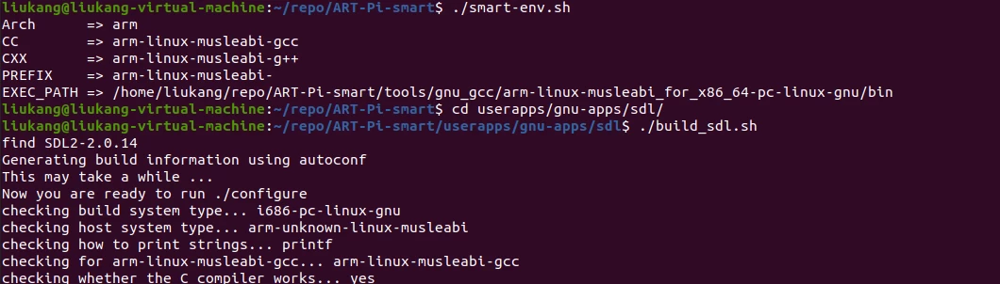

#### 下载 VS Code 插件

在使用RT-Thread Smart插件时，首先是需要在VS Code中安装它。目前VS Code RT-Thread Smart插件已经上传到VS Code市场，所以安装非常方便，可以直接在VS Code 的扩展市场中**搜索** **RT-Thread Smart**，点击安装即可：

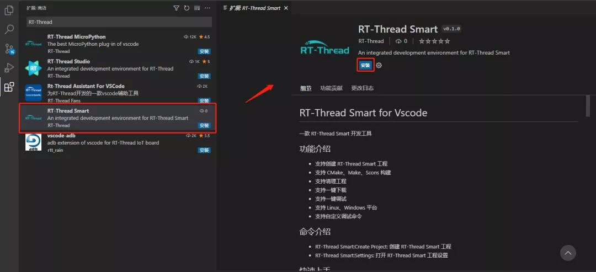

### 创建 SDL Demo

这里将以 Linux 环境下使用 VS Code 开发 rt-smart SDL 应用程序为例来体验 VS Code 的 RT-Thread Smart 插件扩展。

- 在 VS Code 上使用 **Ctrlt+Shift+P** 快捷键，输入 RT-Thread 关键字，选择 “创建 RT-Thread Smart 工程”：

  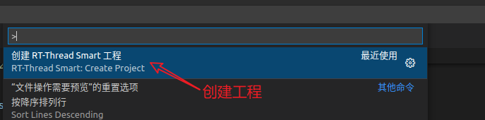

- 输入 ART-Pi Smart的 SDK 根目录：

  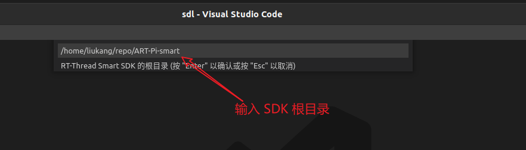

- 输入工程名称：

  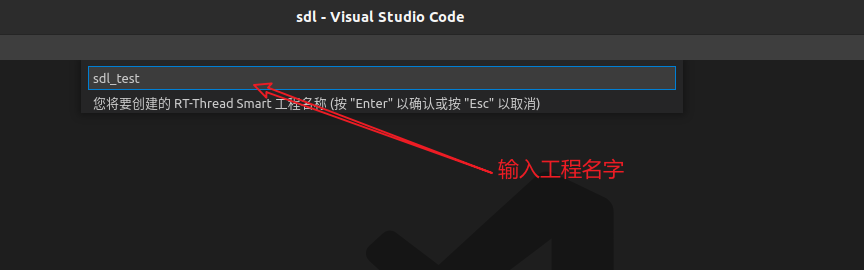

- 选择构建方式，这里以 Make 为例：

  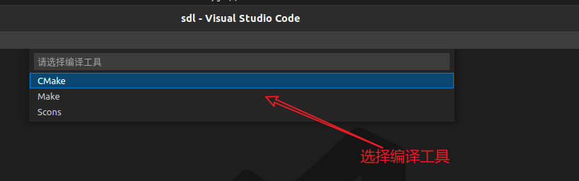

- 修改 Makefile 文件；需要在 Makefile 文件中，链接 SDL 静态库：

  ```makefile
  # rt-thread 路径
  RT_DIR = $(UROOT_DIR)/sdk/rt-thread
  INC_DIR =$(UROOT_DIR)/sdk/rt-thread/include
  LIB_DIR = ${UROOT_DIR}/sdk/rt-thread/lib
  # sdl 路径
  SDL_DIR = ${UROOT_DIR}/sdk/include/sdl
  
  # 配置编译参数
  CFLAGS = -march=armv7-a -marm -msoft-float -D__RTTHREAD__ -Wall -O0 -g -gdwarf-2 -n --static
  
  # 加入头文件搜索路径
  CFLAGS += -I. -I$(UROOT_DIR) -I$(PROJECT_DIR) -I$(RT_DIR)/components/dfs -I$(RT_DIR)/components/drivers -I$(RT_DIR)/components/finsh -I$(RT_DIR)/components/net -I$(RT_DIR)/components/net/netdev -I$(RT_DIR)/components/net/arpa -I${INC_DIR} -I${INC_DIR}/libc -I${INC_DIR}/sys -I${SDL_DIR}
  
  # 加入链接文件
  LDFLAGS = -march=armv7-a -marm -msoft-float -T ${UROOT_DIR}/linker_scripts/arm/cortex-a/link.lds
  
  # 加入库文件
  LDFLAGS += -L$(LIB_DIR) -Wl,--whole-archive -lrtthread -Wl,--no-whole-archive -n --static -Wl,--start-group -lc -lgcc -lrtthread -lSDL2 -Wl,--end-group
  ```

- 查询开发板的 IP 地址：

  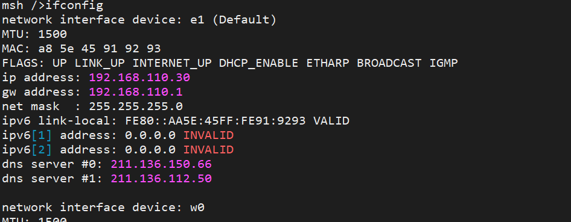

- 设置开发板的 IP 地址；在 VS Code 插件中，使用快捷键 **Ctrlt+Shift+P**，选择 “打开 RT-Thread Smart 设置”，输入开发板的 IP 地址：

  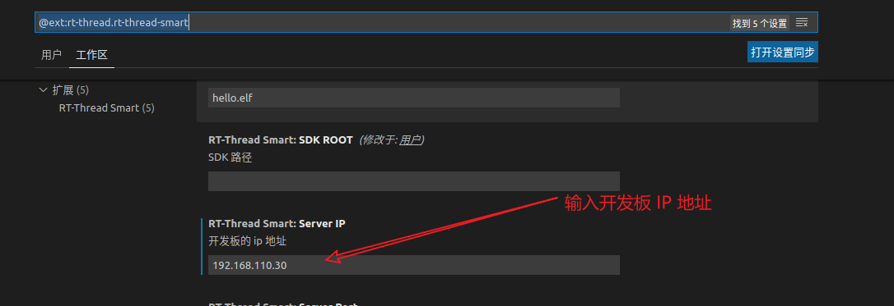

#### 画线

- 在新建工程 main.c 文件中，输入以下代码：

  ```c
  #include <SDL.h>
  #include <stdio.h>
  
  #define POINTS_COUNT 4
  
  extern Uint32 rtt_screen_width;
  extern Uint32 rtt_screen_heigth;
  
  static SDL_Point points[POINTS_COUNT] = {
      {320, 200},
      {300, 240},
      {340, 240},
      {320, 200}
  };
  
  SDL_Rect rect = {0, 0, 320, 240};
  
  int main(void)
  {
  	//The window we'll be rendering to
  	SDL_Window* window = NULL;
  
  	//The surface contained by the window
  	SDL_Renderer *renderer;
  
      //use dummy video driver
      SDL_setenv("SDL_VIDEODRIVER","rtt",1);
  	//Initialize SDL
  	if( SDL_Init( SDL_INIT_VIDEO ) < 0 )
  	{
  		printf( "SDL could not initialize! SDL_Error: %s\n", SDL_GetError() );
  		return -1;
  	}
  
  	window = SDL_CreateWindow( "SDL Tutorial", SDL_WINDOWPOS_UNDEFINED, SDL_WINDOWPOS_UNDEFINED, rtt_screen_width, rtt_screen_heigth, SDL_WINDOW_SHOWN );
  	if( window == NULL )
  	{
  		printf( "Window could not be created! SDL_Error: %s\n", SDL_GetError() );
  		return -1;
  	}
  
  	renderer = SDL_CreateRenderer(window, -1, 0);
  
      SDL_SetRenderDrawColor(renderer, 255, 0, 0, SDL_ALPHA_OPAQUE);
      SDL_RenderDrawLine(renderer, 0, 0,320, 200);
  
      //SDL_RenderDrawLine(renderer, 320, 0, 320, 480);
      SDL_RenderDrawLines(renderer, points, POINTS_COUNT);
  
  	SDL_RenderPresent(renderer);
  	SDL_Delay( 2000 );
  
      //destory renderer
      if (renderer) {
          SDL_DestroyRenderer(renderer);
      }
   	//Destroy window
  	SDL_DestroyWindow( window );
  
  	//Quit SDL subsystems
  	SDL_Quit();
  
  	return 0;
  }
  ```

- 编译工程：

  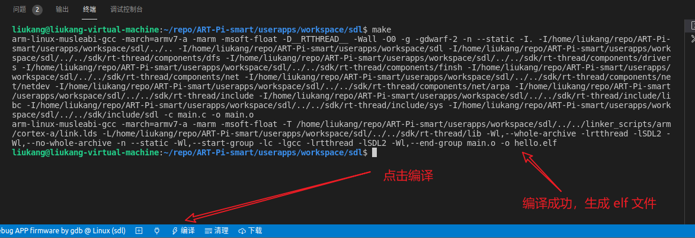

- 下载代码

  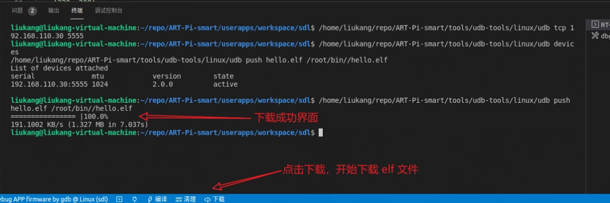

- 运行代码，在调试终端输入命令：`./hello.elf &` 执行用户 APP：

  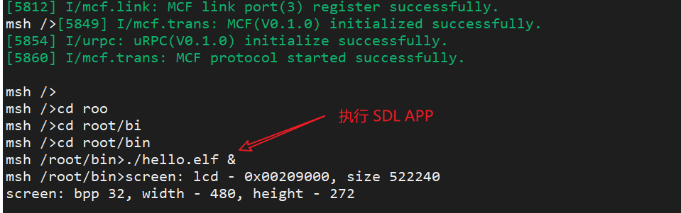

- LCD 显示效果如下：

  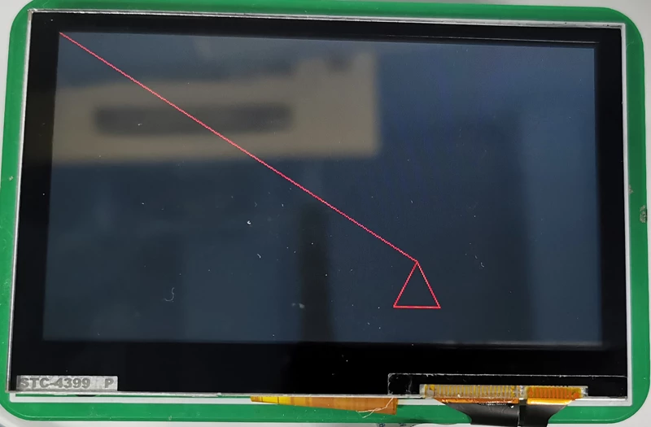

- 代码调试；在 VS Code 插件中，使用快捷键 F5 进入 Debug 模式：

  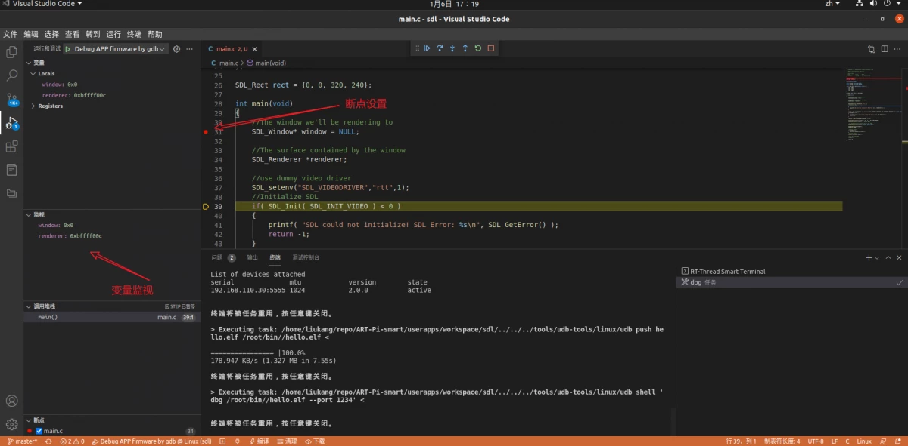

#### 画方框

 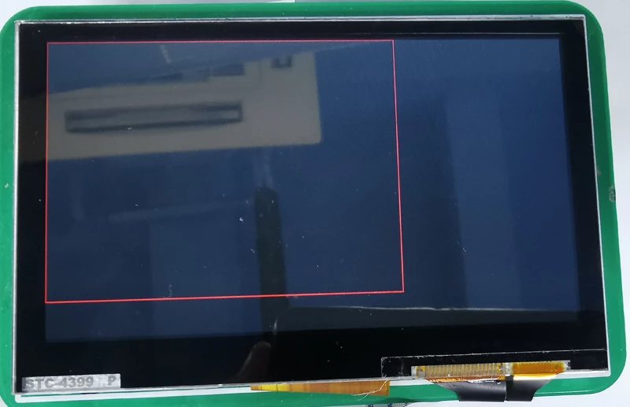
      
#### 背景填充

 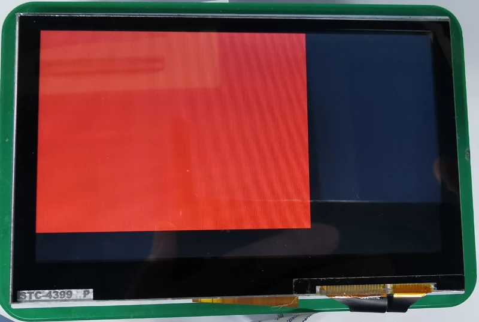  

#### 图片显示

- 先将图片上传到 ART-Pi Smart 文件目录下；在 VS Code 终端中手动输入命令 `/home/liukang/repo/ART-Pi-smart/tools/udb-tools/linux/udb push /home/liukang/repo/ART-Pi-smart/userapps/gnu-apps/sdl/test.bmp /root/bin/test.bmp` 上传图片到 ART-Pi Smart 开发板：

  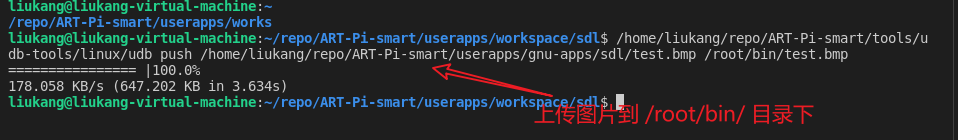

- 图片显示代码：

  ```c
  #include <SDL.h>
  #include <stdio.h>
  
  #define POINTS_COUNT 4
  
  extern Uint32 rtt_screen_width;
  extern Uint32 rtt_screen_heigth;
  
  SDL_Rect rect = {0, 0, 320, 240};
  
  int main(void)
  {
  	//The window we'll be rendering to
  	SDL_Window* window = NULL;
  
  	//The surface contained by the window
  	SDL_Surface* screenSurface = NULL;
  	SDL_Renderer *renderer = NULL;
  	SDL_Texture *texture = NULL;
  
      //use dummy video driver
      SDL_setenv("SDL_VIDEODRIVER","rtt",1);
  	//Initialize SDL
  	if( SDL_Init( SDL_INIT_VIDEO ) < 0 )
  	{
  		printf( "SDL could not initialize! SDL_Error: %s\n", SDL_GetError() );
  		return -1;
  	}
  
  	window = SDL_CreateWindow( "SDL Tutorial", SDL_WINDOWPOS_UNDEFINED, SDL_WINDOWPOS_UNDEFINED, rtt_screen_width, rtt_screen_heigth, SDL_WINDOW_SHOWN );
  	if( window == NULL )
  	{
  		printf( "Window could not be created! SDL_Error: %s\n", SDL_GetError() );
  		return -1;
  	}
  	renderer = SDL_CreateRenderer(window, -1, 0);
  
  	screenSurface = SDL_LoadBMP("test.bmp");
  	if(!screenSurface)
  	{
  		printf("SDL_LoadBMP failed\n");	
  		goto end;
  	}
  	texture = SDL_CreateTextureFromSurface(renderer, screenSurface);
  	SDL_SetRenderTarget(renderer,texture);
  	SDL_RenderCopy(renderer,texture,NULL,NULL);
  
  	SDL_RenderPresent(renderer);
  	SDL_Delay( 2000 );
  end:
      //destory renderer
      if (renderer) {
          SDL_DestroyRenderer(renderer);
      }
   	//Destroy window
  	SDL_DestroyWindow( window );
  
  	//Quit SDL subsystems
  	SDL_Quit();
  
  	return 0;
  }
  ```

- 编译、下载、执行 APP，LCD 显示如下：

  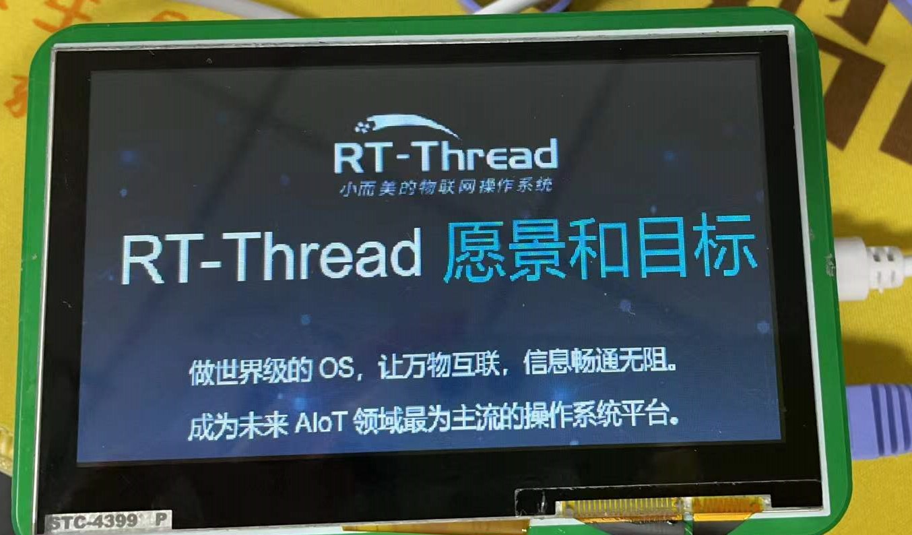

以上完整 Demo 代码存放在 **ART-Pi-smart/userapps/gnu-apps/sdl/SDL2-2.0.14/test/testrtt.c** 文件中。

## 结尾

本文档只是非常简单的在 VS Code 插件上演示了 SDL 的部分基础功能，感兴趣的小伙伴们可以在 RT-Thread Smart 上开发一些更好玩的 Demo：触摸、游戏、音乐播放、视频播放、智能家居等。最后，如果我的文章对你有所帮助，请收藏、点赞、关注！

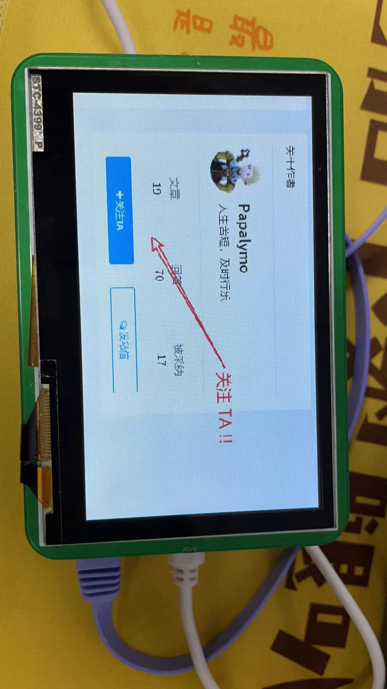

## RT-Smart 交流平台

如果遇到什么问题需要协助，或有什么建议和意见需要反馈的，可以加入 ART-Pi Smart 官方交流 QQ 群或者登录论坛的 rt-smart 板块发帖反馈。

- ART-Pi Smart ：

  https://art-pi.gitee.io/smart-website/

- ART-Pi Smart SDK ：

  https://gitee.com/rtthread/ART-Pi-smart

- **ART-Pi Smart 官方交流 QQ 群** ：622828244

- rt-smart 论坛板块（发帖反馈）：

  https://club.rt-thread.org/ask/tag/1339.html 
