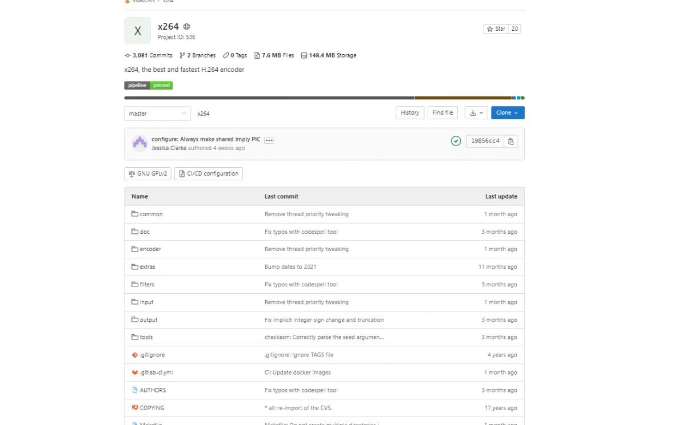
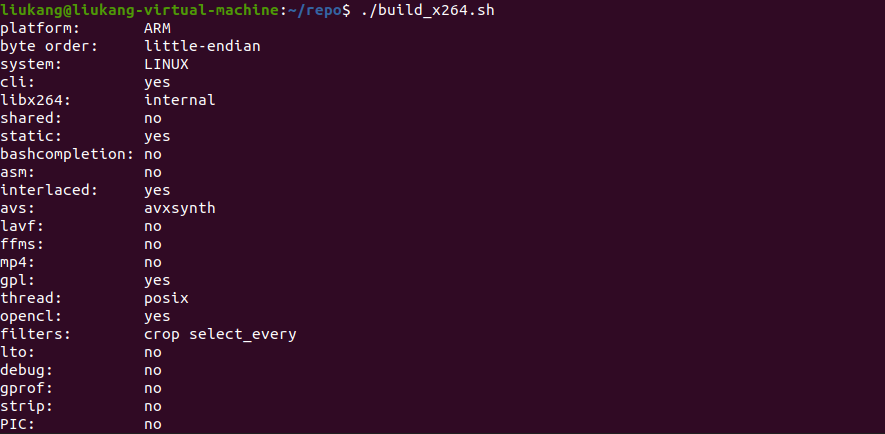
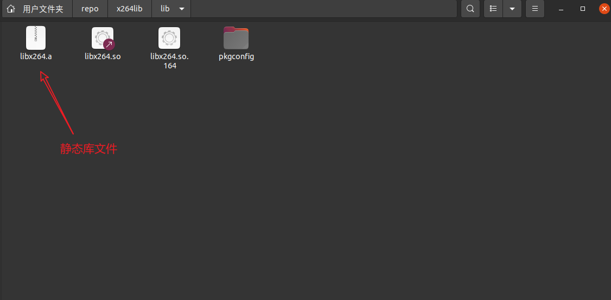
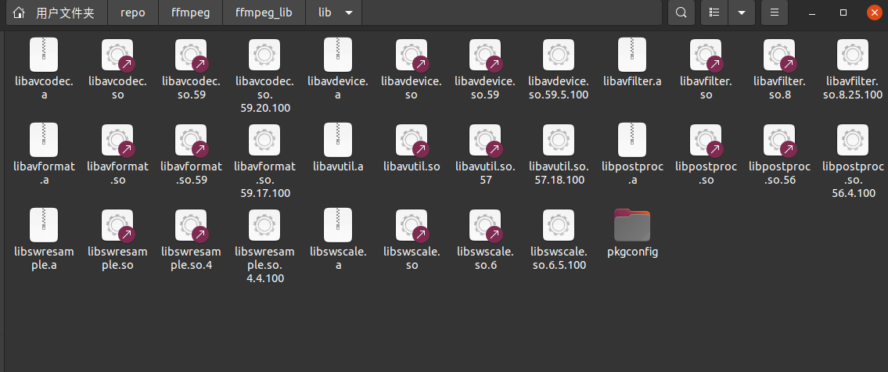
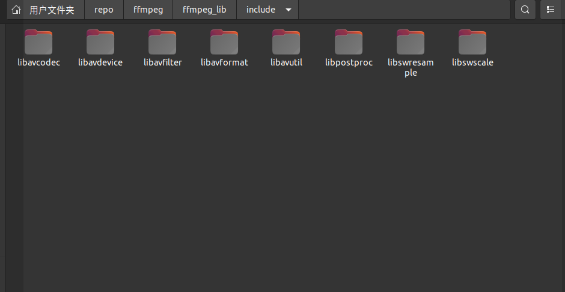

# 基于 FFmpeg + SDL2 实现视频播放

基于文档《使用 VS Code 开发 GUI 应用》，使用 FFmpeg+SDL2 在 ART-Pi Smart 平台上实现视频播放功能；由于 ART-Pi Smart 没有音频模块，所以没有实现音频的解码播放。

## X264

### 简介

**X264** 是由 VideoLAN 开发的一个免费开源软件库和命令行实用程序，用于将视频流编码为 H.264 / MPEG-4 AVC 格式，根据GNU通用公共许可证的条款发布的。

FFmpeg 是一个编解码库，功能丰富，其自带 H.264 解码功能，但是要实现 H.264 编码需要集成 X264 将其作为编码器。

### 下载

```shell
git clone https://code.videolan.org/videolan/x264.git
```

源码目录：



### 交叉编译

1. 在 x264 文件夹同级目录下创建 **build_x264.sh** 文件

2. build_x264.sh 文件内容如下，注意：RTT_EXEC_PATH 和 ROOTDIR 修改为自己本地路径：

   ```sh
   # Get initial variables
   export RTT_EXEC_PATH=/home/liukang/repo/ART-Pi-smart/tools/gnu_gcc/arm-linux-musleabi_for_x86_64-pc-linux-gnu/bin
   export PATH=$PATH:$RTT_EXEC_PATH:$RTT_EXEC_PATH/../arm-linux-musleabi/bin
   
   export CROSS_COMPILE="arm-linux-musleabi"
   
   if [ "$1" == "debug" ]; then
       export CFLAGS="-march=armv7-a -marm -msoft-float -D__RTTHREAD__ -O0 -g -gdwarf-2 -Wall -n --static"
   else
       export CFLAGS="-march=armv7-a -marm -msoft-float -D__RTTHREAD__ -O2 -Wall -n --static"
   fi
   
   export AR=${CROSS_COMPILE}-ar
   export AS=${CROSS_COMPILE}-as
   export LD=${CROSS_COMPILE}-ld
   export RANLIB=${CROSS_COMPILE}-ranlib
   export CC=${CROSS_COMPILE}-gcc
   export CXX=${CROSS_COMPILE}-g++
   export NM=${CROSS_COMPILE}-nm
   
   ROOTDIR="/home/liukang/repo/ART-Pi-smart/userapps"
   
   APP_NAME="x264"
   
   APP_DIR=${APP_NAME}
   LIB_DIR=${ROOTDIR}/sdk/lib
   INC_DIR=${ROOTDIR}/sdk/include
   
   RT_DIR=${ROOTDIR}/sdk/rt-thread
   RT_INC=" -I. -Iinclude -I${ROOTDIR} -I${RT_DIR}/include -I${RT_DIR}/components/dfs -I${RT_DIR}/components/drivers -I${RT_DIR}/components/finsh -I${RT_DIR}/components/net -I${INC_DIR}/sdl -DHAVE_CCONFIG_H"
   RT_INC+=" -I${ROOTDIR}/../kernel/bsp/imx6ull-artpi-smart/drivers/"
   
   export CPPFLAGS=${RT_INC}
   export LDFLAGS="-L${LIB_DIR} "
   
   export LIBS="-T ${ROOTDIR}/linker_scripts/arm/cortex-a/link.lds -march=armv7-a -marm -msoft-float -L${RT_DIR}/lib -Wl,--whole-archive -lrtthread -Wl,--no-whole-archive -n -static -Wl,--start-group -lc -lgcc -lrtthread -Wl,--end-group"
   
   # default build
   function builddef() {
       cd ${APP_DIR}
       ./configure \
       --prefix=/home/liukang/repo/x264lib \
       --host=${CROSS_COMPILE} \
       --disable-asm \
       --enable-static 
       make clean
       if [ "$1" == "verbose" ]; then
           make V=1
       else
           make
       fi
       make install
   }
   
   builddef $1
   
   ```

3. 运行 **build_x264.sh** 文件，生成静态库：

   

4. 上面步骤成功后，在 x264lib 文件夹下，会生成 x264 的静态库文件和头文件：

   静态库文件：
   
   

   头文件：
   
   

## FFmpeg

### 简介

FFmpeg 是一套可以用来记录、转换数字音频、视频，并能将其转化为流的开源计算机程序。采用 LGP L或 GPL 许可证。它提供了录制、转换以及流化音视频的完整解决方案。它包含了非常先进的音频/视频编解码库 libavcodec，为了保证高可移植性和编解码质量，libavcodec 里很多 code 都是从头开发的。

FFmpeg 在 Linux平台下开发，但它同样也可以在其它操作系统环境中编译运行，包括 Windows、Mac OS X 等。这个项目最早由 Fabrice Bellard 发起，2004 年至 2015 年间由 Michael Niedermayer 主要负责维护。下面介绍如何将 FFmpeg 移植到 ART-Pi Smart 平台上，实现视频的解码功能。

### 下载

打开 FFmpeg 官网，下载源码:


### 交叉编译

1. 解压 tar.bz2 文件：

   ```
   tar -jxvf ffmpeg-snapshot.tar.bz2
   ```

2. 在 ffmpeg 文件夹同级目录下创建 **build_ffmpeg.sh** 文件

   ```sh
   # Get initial variables
   ROOTDIR="/home/liukang/repo/ART-Pi-smart/userapps"
   
   APP_NAME="ffmpeg"
   
   APP_DIR=${APP_NAME}
   LIB_DIR=${ROOTDIR}/sdk/lib
   INC_DIR=${ROOTDIR}/sdk/include
   
   RT_DIR=${ROOTDIR}/sdk/rt-thread
   RT_INC=" -I. -Iinclude -I${ROOTDIR} -I${RT_DIR}/include -I${RT_DIR}/components/dfs -I${RT_DIR}/components/drivers -I${RT_DIR}/components/finsh -I${RT_DIR}/components/net -I${INC_DIR}/sdl -DHAVE_CCONFIG_H"
   RT_INC+=" -I${ROOTDIR}/../kernel/bsp/imx6ull-artpi-smart/drivers/"
   
   export CPPFLAGS=${RT_INC}
   export LDFLAGS="-L${LIB_DIR} "
   
   export LIBS="-T ${ROOTDIR}/linker_scripts/arm/cortex-a/link.lds -march=armv7-a -marm -msoft-float -L${RT_DIR}/lib -Wl,--whole-archive -lrtthread -Wl,--no-whole-archive -n -static -Wl,--start-group -lc -lgcc -lrtthread -Wl,--end-group"
   
   export RTT_EXEC_PATH=/home/liukang/repo/ART-Pi-smart/tools/gnu_gcc/arm-linux-musleabi_for_x86_64-pc-linux-gnu/bin
   export PATH=$PATH:$RTT_EXEC_PATH:$RTT_EXEC_PATH/../arm-linux-musleabi/bin
   
   export CROSS_COMPILE="arm-linux-musleabi"
   
   if [ "$1" == "debug" ]; then
       export CFLAGS="-march=armv7-a -marm -msoft-float -D__RTTHREAD__ -O0 -g -gdwarf-2 -Wall -n --static"
   else
       export CFLAGS="-march=armv7-a -marm -msoft-float -D__RTTHREAD__ -O2 -Wall -n --static"
   fi
   
   # default build
   function builddef() {
       cd ${APP_DIR}
       ./configure \
       --cross-prefix=${CROSS_COMPILE} --enable-cross-compile --target-os=linux \
       --cc=${CROSS_COMPILE}-gcc \
       --ar=${CROSS_COMPILE}-ar \
       --ranlib=${CROSS_COMPILE}-ranlib \
       --arch=arm --prefix=/home/liukang/repo/ffmpeg/ffmpeg_lib \
       --pkg-config-flags="--static" \
       --enable-gpl --enable-nonfree --disable-ffplay --enable-swscale --enable-pthreads --disable-armv5te --disable-armv6 --disable-armv6t2 --disable-x86asm  --disable-stripping \
       --enable-libx264 --extra-cflags=-I/home/liukang/repo/x264lib/include --extra-ldflags=-L/home/liukang/repo/x264lib/lib --extra-libs=-ldl
       make clean
       if [ "$1" == "verbose" ]; then
           make V=1
       else
           make
       fi
       make install
   }
   
   builddef $1
   
   ```

3. 运行 **build_ffmpeg.sh** 文件

   

4. 上面步骤成功后，在 ffmpeg_lib 文件夹下，会生成 ffmpeg 的静态库文件和头文件：

   Lib 库：
   
   
   
   头文件：
   
   

## 视频播放 Demo

1. 使用 VS Code 生成 makefile 工程

2. 将上面生成的静态库文件放在 Smart SDK 目录下

   

3. 修改 makefile 文件，添加静态库

   ```
   #程序版本号
   VERSION = 1.0.0     
   
   CROSS_COMPILE = arm-linux-musleabi-
   CC = $(CROSS_COMPILE)gcc
   CXX = $(CROSS_COMPILE)g++
   
   
   # project 根路径
   PROJECT_DIR := $(shell pwd)
   
   # userapps 根路径
   UROOT_DIR = $(PROJECT_DIR)/../..
   
   # rt-thread 路径
   RT_DIR = $(UROOT_DIR)/sdk/rt-thread
   INC_DIR =$(UROOT_DIR)/sdk/rt-thread/include
   LIB_DIR = ${UROOT_DIR}/sdk/rt-thread/lib
   # sdl 路径
   SDL_DIR = ${UROOT_DIR}/sdk/include/sdl
   # ffmpeg
   FFMPEG_DIR = ${UROOT_DIR}/sdk/include/ffmpeg
   
   #x264
   X264_DIR = ${UROOT_DIR}/sdk/include/x264
   
   # 配置编译参数
   CFLAGS = -march=armv7-a -marm -msoft-float -D__RTTHREAD__ -Wall -O0 -g -gdwarf-2 -n --static
   
   # 加入头文件搜索路径
   CFLAGS += -I. -I$(UROOT_DIR) -I$(PROJECT_DIR) -I$(RT_DIR)/components/dfs -I$(RT_DIR)/components/drivers -I$(RT_DIR)/components/finsh -I$(RT_DIR)/components/net \
   		-I$(RT_DIR)/components/net/netdev -I$(RT_DIR)/components/net/arpa -I${INC_DIR} -I${INC_DIR}/libc -I${INC_DIR}/sys -I${SDL_DIR} -I${FFMPEG_DIR} \
   		-I${FFMPEG_DIR}/libavcodec -I${FFMPEG_DIR}/libavdevice -I${FFMPEG_DIR}/libavfilter -I${FFMPEG_DIR}/libavformat \
   		-I${FFMPEG_DIR}/libavutil -I${FFMPEG_DIR}/libpostproc -I${FFMPEG_DIR}/libswresample -I${FFMPEG_DIR}/libswscale -I${X264_DIR}
   
   # 加入链接文件
   LDFLAGS = -march=armv7-a -marm -msoft-float -T ${UROOT_DIR}/linker_scripts/arm/cortex-a/link.lds
   
   # 加入库文件
   LDFLAGS += -L$(LIB_DIR) -Wl,--whole-archive -Os -lrtthread -lSDL2 -lavcodec -lavdevice -lavfilter -lavformat -lavutil -lpostproc -lswresample -lswscale -lx264 -Wl,--no-whole-archive -n --static -Wl,--start-group -lc -lgcc -lrtthread -lSDL2 -lavcodec -lavdevice -lavfilter -lavformat -lavutil -lpostproc -lswresample -lswscale -lx264 -Wl,--end-group
   
   default:
   	$(CC) $(CFLAGS) -c main.c -o main.o
   	$(CC) $(LDFLAGS) main.o -o hello.elf
   
   clean:
   	@rm *.o *.elf
   
   .PHONY: default clean
   
   ```

4. 编译

   

5. 通过 SD Card 启动 elf 文件，将生成的 hello.elf 文件和视频文件放到 SD 卡中，插入到 ART-Pi Smart：

 

## 完整代码

```c
#include <stdio.h>
#include <SDL.h>
#include <libavcodec/avcodec.h>
#include <libavformat/avformat.h>
#include <libswscale/swscale.h>

extern Uint32 rtt_screen_width;
extern Uint32 rtt_screen_heigth;

int main (int argc, char *argv[]) 
{
    int ret = -1;
    AVFormatContext *pFormatCtx = NULL; 
    int videoStream;
    AVCodecParameters *pCodecParameters = NULL; 
    AVCodecContext *pCodecCtx = NULL;
    AVCodec *pCodec = NULL;
    AVFrame *pFrame = NULL;
    AVPacket packet;

    SDL_Rect rect;
    SDL_Window *win = NULL;
    SDL_Renderer *renderer = NULL;
    SDL_Texture *texture = NULL;

	if(( argc != 2 ))
	{
		printf("error input arguments!\n");
		return(1);
	}

    // 默认窗口大小
    int w_width  = rtt_screen_width;
    int w_height = rtt_screen_heigth;
    
    // use dummy video driver
    SDL_setenv("SDL_VIDEODRIVER","rtt",1);
    //Initialize SDL
    if( SDL_Init( SDL_INIT_VIDEO ) < 0 )
    {
        printf( "SDL could not initialize! SDL_Error: %s\n", SDL_GetError());
        return -1;
    }

    // 打开输入文件
    if (avformat_open_input(&pFormatCtx, argv[1], NULL, NULL) != 0) 
	{
        printf("Couldn't open video file!: %s\n", argv[1]);
        goto __exit; 
    }

    // 找到视频流
    videoStream = av_find_best_stream(pFormatCtx, AVMEDIA_TYPE_VIDEO, -1, -1, NULL, 0);
    if (videoStream == -1) 
	{
        printf("Din't find a video stream!\n");
        goto __exit;// Didn't find a video stream
    }

    // 流参数
    pCodecParameters = pFormatCtx->streams[videoStream]->codecpar;

    // 获取解码器
    pCodec = avcodec_find_decoder(pCodecParameters->codec_id);
    if (pCodec == NULL) 
	{
        printf("Unsupported codec!\n");
        goto __exit; // Codec not found
    }

    // 初始化一个编解码上下文
    pCodecCtx = avcodec_alloc_context3(pCodec);
    if (avcodec_parameters_to_context(pCodecCtx, pCodecParameters) != 0) 
	{
        printf("Couldn't copy codec context\n");
        goto __exit;// Error copying codec context
    }

    // 打开解码器
    if (avcodec_open2(pCodecCtx, pCodec, NULL) < 0) 
	{
        printf("Failed to open decoder!\n");
        goto __exit; // Could not open codec
    }

    // Allocate video frame
    pFrame = av_frame_alloc();

    w_width = pCodecCtx->width;
    w_height = pCodecCtx->height;

    // 创建窗口
    win = SDL_CreateWindow("Media Player",
                           SDL_WINDOWPOS_UNDEFINED,
                           SDL_WINDOWPOS_UNDEFINED,
                           w_width, w_height,
                           SDL_WINDOW_SHOWN );
    if (!win) 
	{
        printf("Failed to create window by SDL\n");
        goto __exit;
    }

    // 创建渲染器
    renderer = SDL_CreateRenderer(win, -1, 0);
    if (!renderer) 
	{
        printf("Failed to create Renderer by SDL\n");
        goto __exit;
    }

    // 创建纹理
    texture = SDL_CreateTexture(renderer, SDL_PIXELFORMAT_IYUV,
                                SDL_TEXTUREACCESS_STREAMING,
                                w_width,
                                w_height);


    // 读取数据
    while (av_read_frame(pFormatCtx, &packet) >= 0) 
	{
        if (packet.stream_index == videoStream) 
		{
            // 解码
            avcodec_send_packet(pCodecCtx, &packet);
            while (avcodec_receive_frame(pCodecCtx, pFrame) == 0) 
			{
                SDL_UpdateYUVTexture(texture, NULL,
                                     pFrame->data[0], pFrame->linesize[0],
                                     pFrame->data[1], pFrame->linesize[1],
                                     pFrame->data[2], pFrame->linesize[2]);

                // set size of Window
                rect.x = 0;
                rect.y = 0;
                rect.w = pCodecCtx->width;
                rect.h = pCodecCtx->height;

                SDL_RenderClear(renderer);
                SDL_RenderCopy(renderer, texture, NULL, &rect);
                SDL_RenderPresent(renderer);
            }
        }

        av_packet_unref(&packet);
    }

__exit:

    if (pFrame) 
	{
        av_frame_free(&pFrame);
    }

    if (pCodecCtx) 
	{
        avcodec_close(pCodecCtx);
    }

    if (pCodecParameters) 
	{
        avcodec_parameters_free(&pCodecParameters);
    }

    if (pFormatCtx) 
	{
        avformat_close_input(&pFormatCtx);
    }

    if (win) 
	{
        SDL_DestroyWindow(win);
    }

    if (renderer) 
	{
        SDL_DestroyRenderer(renderer);
    }

    if (texture) 
	{
        SDL_DestroyTexture(texture);
    }

    SDL_Quit();

    return ret;
}

```

## 实机演示

[https://github.com/liukangcc/ART-Pi-Smart/blob/main/figures/8.gif](https://github.com/liukangcc/ART-Pi-Smart/blob/main/figures/8.gif)

该仓库放置了编译好的 FFmpeg 和 X264 库文件：[https://github.com/liukangcc/ART-Pi-Smart](https://github.com/liukangcc/ART-Pi-Smart)