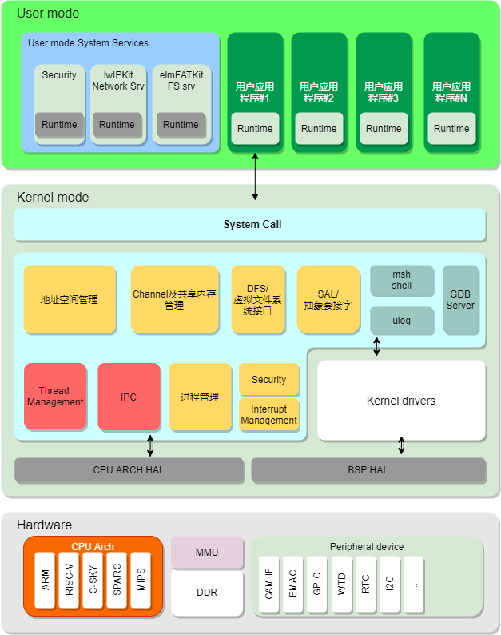
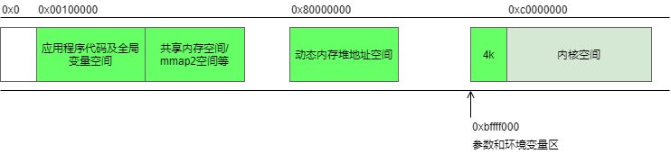
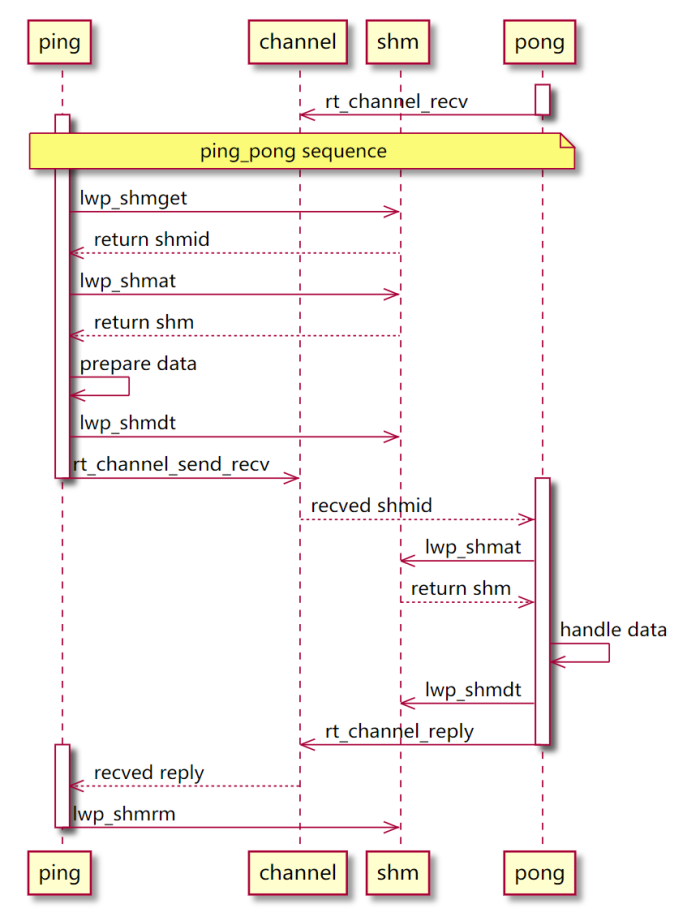

# RT-Thread Smart 架构说明

## RT-Thread Smart 的架构

RT-Thread Smart 是基于 RT-Thread 操作系统上的混合操作系统，简称为 rt-smart，它把应用从内核中独立出来，形成独立的用户态应用程序，并具备独立的地址空间（32 位系统上是 4G 的独立地址空间）。

以下是 rt-smart 的整体结构框图，在硬件平台的基础上通过 MMU、系统调用的方式把整个系统分成了内核态及用户态。



RT-Thread Smart 的核心实现是 lwP，进程管理模块（ `rtthread-smart/kernel/components/lwp` ）。它包括了如下的几个部分：

* 面向用户态的系统调用（system call，`lwp_syscall.c/h`）；
* 用户态进程管理（`lwp_pid.c/h, lwp.c/h`）；
* elf 可执行应用程序加载器；
* 基于 MMU 的虚拟内存管理，地址空间管理；
* 进程间的 channel 通信机制及共享内存机制；

而在整体操作系统中，内核中还额外的包括了（原 RT-Thread 操作系统上的）：

* 文件系统接口（DFS） - 虚拟文件系统接口；
* BSD socket 接口（SAL/socket） - 抽象套接字；
* 设备驱动框架接口；
* 可选的设备驱动（如 UART，GPIO，IIC 等）；

## 用户态环境

用户态应用是一份 elf（Executable Linkable Format）文件，由 GNU GCC 编译链接而产生。在 RT-Thread Smart 中，它被固定加载到虚拟地址 0x100000 处执行。

一般来说，应用程序具备自己独立的 3G 地址空间，而高 1G 地址空间则留给了内核。对于一个 32 位芯片来说，典型的 RT-Thread Smart 应用程序及内核空间的内存分布如下图所示：



RT-Thread Smart 的用户态是固定地址方式运行，当需要系统服务时通过系统调用的方式陷入到内核中。用户态应用环境也存在对应的 API 环境：

* libc，rt-smart 选择的是 [musl libc](https://musl.libc.org)（在内核中目前也是 musl libc）。它提供了常规意义上的 POSIX 接口调用及 C 运行环境；
* 原 RT-Thread API 环境，也称为 RT-Thread CRT 环境。在这套 API 中，具备了原 RT-Thread 的 API 接口，例如 rt_thread_create，rt_malloc 等。一些原 RT-Thread 软件包，应用程序也非常方便的移植到 rt-smart 用户态环境中执行。同样的，因为 RT-Thread 内核中也存在一套 POSIX 环境，所以一些用户态应用也可以经过重新编译的方式，和内核编译在一起，从而在内核中执行。

## 基本的 IPC 客户端与服务端

IPC 服务（`rtthread-smart/kernel/components/lwp/lwp_ipc.c/h`）是实现用户应用程序和其他服务的桥梁，同时也可以是用户进程与用户进程之间的通信机制、内核与用户进程之间的通信机制。

在使用 IPC 服务时，需要先创建出对应的通道（channel），然后在通道上进行数据收发。一个 IPC 通道是一个双向数据传递的软件抽象，数据收发过程包括如下几种操作:

| 函数名 | 说明 |
| --- | --- |
| rt_channel_send | 向指定的 IPC channel 发送消息，当接收任务从 channel 中取走消息，并处理完毕后返回 |
| rt_channel_send_recv | 向指定的 IPC channel 发送消息，同时等待对端回复相应的消息 |
| rt_channel_notify | 向指定的 IPC channel 发送消息，并且不管后续情况直接返回 |
| rt_channel_recv | 从指定的 IPC channel 接收消息，直到接收到消息然后返回 |

以下是一份最基本的客户端与服务端，他们之间通过 IPC channel 的方式进行交互。先看 pong 服务端的代码情况，它实现的是一个消息接收，当收到消息数据时，再返回给客户端。

```c
#include <stdio.h>
/* 使用 IPC 服务，需要包含 lwp.h 头文件 */
#include <lwp.h>
/* 包含 rtthread.h，可以使用原来的 RT-Thread API */
#include <rtthread.h>

int main(int argc, char **argv)
{
    int i;
    int channel;
    char *str;
    int shmid; /* 数据传输的共享内存块 ID */
    struct rt_channel_msg msg_text;

    /* 创建一个名字是 pong 的通道 */
    channel = rt_channel_open("pong", O_CREAT);
    if (channel == -1)
    {
        printf("Error: channel_open: fail to create the IPC channel for pong!\n");
        return -1;
    }
    /* 输出等待的通道号 */
    printf("\nPong: wait on the IPC channel: %d\n", channel);

    /* 接收 100 次消息，然后退出 */
    for (i = 0; i < 100; i++)
    {
        /* 从 pong 通道中接收消息，消息会放置在 msg_text 中 */
        rt_channel_recv(channel, &msg_text);

        /* 对应的共享内存 id */
        shmid = (int)msg_text.u.d;
        /* 通过共享内存 id，拿到对应的数据块 */
        if (shmid < 0 || !(str = (char *)lwp_shmat(shmid, NULL)))
        {
            /* 接收错误，恢复错误信息 */
            msg_text.u.d = (void *)-1;
            printf("Pong: receive an invalid data.\n");
            rt_channel_reply(channel, &msg_text);
            continue;
        }

        /* 在终端上输出接收到的字符串 */
        printf("Pong: receive %s\n", str);
        /* 脱离数据块，代表本端不再使用这块数据 */
        lwp_shmdt(str);

        /* 准备回复信息 */
        printf("Pong: reply count = %d\n", i);
        msg_text.type = RT_CHANNEL_RAW;
        msg_text.u.d = (void *)i;
        /* 恢复给发送端 */
        rt_channel_reply(channel, &msg_text);
    }

    /* 关闭这个通道 */
    rt_channel_close(channel);

    return 0;
}
```

以下是 ping 客户端的代码，它会把一段字符串数据发送给 pong 进程。它会先准备这段字符串数据，然后从共享内存中创建出一块共享内存数据块，并把数据复制到共享内存数据块上，然后把共享内存数据 id 通过通道发送给 pong 进程：

```c
#include <stdio.h>
#include <string.h>

/* 使用 IPC 服务，需要包含 lwp.h 头文件 */
#include <lwp.h>
#include <rtthread.h>

/*
 * 因为需要把一段数据发送到接收端，而这段数据是在自己的进程空间中，所以
 * 需要以共享内存的方式，把数据放到共享内存上，然后把对应的 id 发送到接收
 * 端。这个过程中包括了开辟对应的共享内存页，复制数据，并返回对应的共享
 * 内存 id。
 */
rt_inline int prepare_data(void *data, size_t len)
{
    int shmid;
    void *shm_vaddr;

    /* 以当前的任务 ID 来做为共享内存标识的 key */
    size_t key = (size_t) rt_thread_self();

    /* 创建新的共享内存，并返回 id */
    shmid = lwp_shmget(key, len, 1);
    if (shmid == -1)
    {
        printf("Fail to allocate a shared memory!\n");
        return -1;
    }

    /* 通过 id 获得共享内存数据块映射在本进程空间的地址 */
    shm_vaddr = lwp_shmat(shmid, NULL);
    if (shm_vaddr == RT_NULL)
    {
        printf("invalid address!\n");
        lwp_shmrm(shmid);
        return -1;
    }

    /* 把数据复制到共享内存上 */
    memcpy(shm_vaddr, data, len);
    /* 脱离共享内存，表示不再使用它了 */
    lwp_shmdt(shm_vaddr);

    return shmid;
}

int main(int argc, char **argv)
{
    int i;
    int channel;

    /* 用于放置消息的字符串数组 */
    char ping[256] = { 0 };
    size_t len = 0;

    /* 定义发送的消息结构体和收到回复的消息结构体  */
    struct rt_channel_msg ch_msg, ch_msg_ret;

    /* 打开名字是 pong 的数据通道 */
    channel = rt_channel_open("pong", 0);
    if (channel == -1)
    {
        printf("Error: could not find the pong channel!\n");
        return -1;
    }

    /* 100 次的经过 IPC 通道发送 ping 消息 */
    for (i = 0; i < 100; i++)
    {
        printf("\n");

        /* 初始化通道上要发送的消息结构体 */
        ch_msg.type = RT_CHANNEL_RAW;
        snprintf(ping, 255, "count = %d", i);
        len = strlen(ping) + 1;
        ping[len] = '\0';

        /* 复制数据到共享内存中，并返回共享内存数据块的 id */
        int shmid = prepare_data(ping, len);
        if (shmid < 0)
        {
            printf("Ping: fail to prepare the ping message.\n");
            continue;
        }
        /* 把共享内存块 id 赋值到消息结构体上 */
        ch_msg.u.d = (void *)shmid;

        printf("Ping: send %s\n", ping);
        /* 发送消息并等待回复 */
        rt_channel_send_recv(channel, &ch_msg, &ch_msg_ret);
        printf("Ping: receive the reply %d\n", (int) ch_msg_ret.u.d);

        /* 删除对应的共享内存块 */
        lwp_shmrm(shmid);
    }

    /* 关闭通道 */
    rt_channel_close(channel);

    return 0;
}
```

整体的消息流图如下所示


