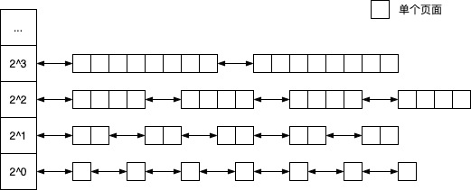

# RT-Thread Smart 进程概述

## 综述

在操作系统概念中，进程是资源分配的实体，而线程是执行的实体。同一个进程的所有线程共享相同的资源，而每个进程至少需要拥有一个线程，线程在进程的地址空间运行，完成内核或用户规定的任务。

RT-Thread Smart 的线程可以分为两类：

- 内核线程：运行于内核地址空间，没有对应的用户态进程，因此不能访问用户地址空间。它们用来完成特定于内核的任务，或者兼容所有原 RT-Thread 的应用代码。
- 用户线程：所有的用户线程都属于某一个用户进程，它们共享进程拥有的资源，比如进程的用户态和内核态地址空间。不同进程间的线程不能直接相互访问。

内核线程和用户线程如下图所示：


所有的进程都只能在用户态创建，通过系统调用访问内核的资源，下文如无特别说明，所述进程都是指用户态进程。而内核线程只运行在内核地址空间，一般不会访问用户地址空间的数据。

## 进程管理

进程管理涉及到进程的创建、运行和退出过程，以及对系统资源的分配和使用。

除内存和地址空间外，进程需要使用的系统资源主要包括为：

- 进程的内存和映射到的用户地址空间
- 进程的打开文件描述符表
- 进程运行过程中申请的内核对象

进程在创建和运行过程中申请并使用上述资源，在进程退出时系统回收这些资源以分配给其它进程使用。进程使用的资源情况如下图所示：


下面对进程生命周期中的资源使用情况进行介绍，内存和地址映射之后单独说明。

### 进程的创建

进程的创建过程是由 ELF 装载器来完成的，它主要完成两个步骤：

1. 读取并分析 ELF 文件的代码段和数据段，根据它们的分布信息分配内存并建立相应的用户空间地址映射。
2. 设置进程的三个标准文件描述符 0、1、 2 ，分别表示标准输入、标准输出和标准错误。其它描述符在打开文件时创建。

进程运行时，内核和用户资源分配如下图所示，其中每个进程的文件描述符表是相互独立的：


每个文件描述符是一个整数，对应于一个打开的文件，以该值为索引，可在进程的文件描述符表中得到对应的结构体 `struct dfs_fd` 的指针。除了进程的三个标准文件描述符（标准输入、标准输出和标准错误），其它文件描述符在文件打开和关闭时动态创建和回收。在目前的版本中，对这三个文件描述符的访问都会重定向到系统的 console 设备。

### 进程资源管理

进程运行过程中会执行创建线程、访问设备、申请信号量等操作，这些操作的对象在内核中都对应一个内核数据，通过 `rt_object` 机制按照数据类型分别进行管理。同时，为了在进程退出时对这些资源进行释放，这些内核数据又按照所属的进程串联起来。

系统运行时，内核对象的管理如下图所示：


每种类型的内核对象通过成员变量 `rt_object` 串联在一起，链表头为类型的成员变量 `object_list` ；同时，每个进程所使用的内核对象通过成员变量 `lwp_obj_list` 串联在一起，链表头为进程的成员变量 `object_list` 。

### 进程的退出

进程的退出是指进程内的所有线程全部结束运行之后，对进程所占用资源的释放过程，按顺序依次为：

- 释放进程中所有尚未释放的内核对象资源。
- 关闭进程所有尚未关闭的文件，之后释放文件描述符表本身。
- 遍历 `map_area` 树的节点信息，对于进程用户态所有映射中使用的自动映射类型的物理内存进行释放（归还到页管理器）。
- 如果退出的进程在前台运行，则将其父进程设置前台进程；如果父进程不存在，则将前台控制权交给内核 msh 线程。（参见后续的控制台输入问题)
- 回收 MMU 管理相关的数据结构，以及进程管理结构体，更新进程树结构。如果父进程调用了 `waitpid()` 接口，会在父进程取走状态信息后由父进程释放。

### 进程组织结构

当进程启动了另外一个进程，后者就成为其子进程，而父进程可通过 `waitpid()` 接口等待子进程结束，获取其退出状态。在 RT-Thread Smart 中，父子进程的组织如下图所示：


其中：

- 父进程的成员变量 `first_child` 指向其第一个子进程
- 子进程的成员变量 `sibling` 指向兄弟进程
- 子进程的成员变量 `parent` 指向自己的父进程

## 内存管理

作为系统中最常用的资源，内存的使用效率直接关系到系统性能的高低。内核对内存的管理主要分为物理内存的分配和虚拟地址空间的分配。

### 物理内存分配

除了原来宏内核提供的小内存块分配算法外，为支持 LWP 所需要的物理页面映射，物理内存分配器添加了对整页面申请和释放的支持。该分配器采用伙伴分配算法，将系统中所有可用的物理内存页面按照每 1 个页面、2 个页面、4 个页面等等划分为不同的单元，每相邻的两个单元互为 “伙伴”。

当释放一个单元时，如果它的伙伴处于空闲状态，那么它们就可以合并成一个更大的单元。相反地，当分配一个单元时，如果物理内存分配器中没有刚好满足大小的空闲单元，那么逐级向上查找更大的空闲单元，找到后对半分割，一半留在伙伴分配器中标记为空闲状态，另一半再次分割，直到分割到满足需求的单元大小。

伙伴分配算法管理页面的方式如下图所示：



### 内核地址空间映射

整个系统的地址空间划分为两大部分：内核空间和用户空间。在 RT-Thread Smart 中，系统地址空间布局如下：

- 用户态地址为 0x0000_0000 - 0xBFFF_FFFF
- 内核态地址从 0xC000_0000 - 0xFFFF_FFFF

系统中所有进程共享相同的内核空间，通过系统调用进行访问；而每个进程拥有自己独立的用户地址空间，相互之间隔离，即相同的虚拟地址在不同的进程中对应于不同的物理页面。而另一方面，属于同一个进程的不同线程共享相同的地址空间。系统地址空间划分如下图所示：


其中，内核地址空间空间映射内核的代码和数据，它们被内核线程直接访问，或者用户线程通过系统调用访问。内核地址空间分布如下图所示：


除动态映射区，内核地址空间的映射一经建立便不再改变，且对所有的进程保持一致，即在所有进程的地址空间中，相同的内核线性地址映射到相同的物理地址。

内核空间的可动态映射区域管理的地址范围为 0xF000_0000 - 0xFFFF_FFFF, 主要用来映射设备 IO 寄存器和用户线程的 TLS 数据。此外，由于这些地址可由用户态进程直接访问，它还被用来映射可由用户态访问的平台相关系统信息和特定于进程的数据。

内核态的可映射区域一旦映射不会自动解除，对这部分的映射和解映射过程由内核代码完成，用户进程可通过系统调用完成相关操作。

### 进程地址空间管理和共享内存

每个进程拥有自己独立的地址空间，同时它们共享相同的内核地址空间。为了实现该特性，每个进程维护一张自己的地址映射表，它们映射到内核地址空间的部分相同，而映射到用户地址空间的部分特定于进程，各不相同。

每个进程通过结构体 `rt_mem_info` 管理自己的地址空间。在进程创建时，ELF 加载器读取可执行文件的地址分布，建立线性地址区域 0x0010_0000 - 0xBFFF_FFFF 之间的映射，而内核地址空间的部分则从全局内存映射表的内核态部分复制，以保证所有进程的内核态部分映射都是相同的。系统调度器在切换线程时，会根据所属目标进程的内存映射表切换 MMU 配置数据，以符合当前线程的地址空间设置。如果线程不属于任何进程，说明目标是一个内核态线程，此时使用全局的 MMU 设置。

地址空间的隔离使得 ELF 的链接和加载更加简单，无需考虑其它进程的影响，进程本身运行也更加安全可靠。但是它也带来了另一个问题，进程间不能像线程那样随意共享数据，因为相同的虚拟地址会被映射到不同的物理地址。为了实现进程之间以及进程和内核间的大量数据共享，RT-Thread Smart 引入了共享页面机制，即将同一个页面可以映射到不同进程的地址空间。在支持共享页面的系统中，页面映射如下图所示：


上图中三个进程共享相同的内核地址空间映射，但是拥有各自不同的用户地址空间映射。同时，进程 2 和进程 3 还映射到了相同的物理页面，可通过该页面进行数据交换。

注意，出于安全性的考虑，内核地址空间不允许用户进程直接访问，因此不能通过内核地址空间来实现进程间的数据共享。另外，与内核地址空间映射不同，同一个共享页面在不同进程地址空间的映射地址可能也不同，不同进程需要先将共享页面 “附着” 到自己的地址空间，然后通过得到的地址进行访问。

## 附注

### console 设备说明

如果同时多个任务都在等待 console 输入，为了防止多个任务同时从 console 读取数据，系统引入前后台的概念，只有前台进程才能对 console 进行访问。另一方面，作为逻辑设备，console 需要有一个关联的物理设备来实际完成输入输出，进程和 console 的交互过程有如下特性：

- 前台进程可以从与 console 关联的硬件设备中获取输入数据。当前台进程执行阻塞式读操作且设备中尚无数据时，进程阻塞等待，直到新数据到达。
- 后台进程的读访问 console 时, 非阻塞式读操作会立即返回，提示无数据输入；而阻塞式读操作阻塞等待，直到被其它条件终止或者转换为前台进程。
- 进程具有前后台的自动和主动切换功能。
- 无论前后台进程，对输出都无须做特殊处理，直接输出到关联的物理设备。

前后台进程的划分存在如下规则：

- 前台进程启动的新进程默认是前台进程。
- 前台进程在可以通过 `msh_exec()` 接口启动新进程，如果启动新进程的命令以字符 "&" 结尾，新的进程以后台进程状态运行。
- 无论是否使用字符 "&" 启动新进程，后台进程启动的进程都是后台进程。
- 当前台进程结束时，会自动把父进程设置为前台进程；若父进程不存在，设置为内核的 msh 线程。

在某些情况下，比如在 msh 中启动了一个新进程而没有使用 "&" ，而新进程又不接受命令输入；或是一个前台进程结束后，转到前台的父进程不接受命令输入。这种情况下会造成 console 失去响应，此时可以按 `ctrl-d` 来强制把输入切回内核 msh 线程。

### RT-Thread 用户态版本 API 和原系统 API 的差异

宏内核版本的 RT-Thread API 有些与内核功能直接相关，有些为用户提供应用接口。对于前者，RT-Thread Smart  在内核中保留了同样的接口实现，而在用户态并没有对应的接口；而在用户态中，函数声明与后者保持一致，以保持向下兼容性，但某些参数的意义会略有差异。

下面举例说明这些参数意义略有差异的函数：

* `rt_thread_create()`

```c
rt_thread_t rt_thread_create(const char *name,
        void (*entry)(void *parameter),
        void       *parameter,
        rt_uint32_t stack_size,
        rt_uint8_t  priority,
        rt_uint32_t tick);
```

对于 `rt_thread_create()` 函数，在内核版本中参数 `stack_size` 是指线程内核栈大小；而在 RT-Thead Smart 的对应用户态接口中，此参数为线程用户态栈大小，线程的内核态部分由系统指定，用户接口无法设置。

* `rt_mb_init()` 和 `rt_mq_init()`

```c
rt_err_t rt_mb_init(rt_mailbox_t mb,
                    const char  *name,
                    void        *msgpool,
                    rt_size_t    size,
                    rt_uint8_t   flag);

rt_err_t rt_mq_init(rt_mq_t mq,
                    const char *name,
                    void       *msgpool,
                    rt_size_t   msg_size,
                    rt_size_t   pool_size,
                    rt_uint8_t  flag);
```

以上两个函数，在内核版本中是把参数 `msgpool` 指向的内存来作为消息存储区使用的；但在用户态版本中，由于内核中直接使用用户态地址会引发各种问题，所以用户态版本的参数 `msgpool` 会被忽略，而由系统使用创建 `mb` 和 `mq` 的方式申请存储区，这意味着用户态代码不能通过直接访问 `msgpool` 而得到消息数据，这一点是要特别注意的。

