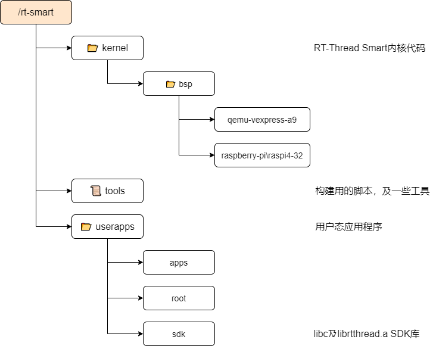
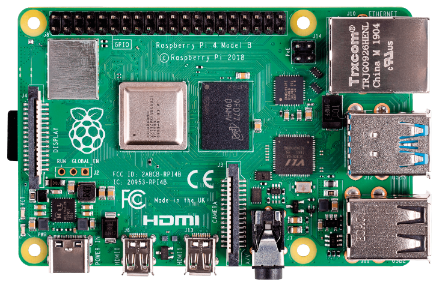
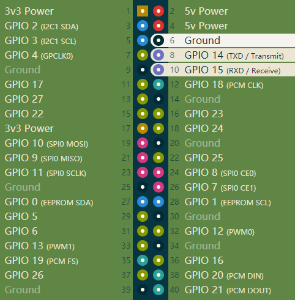
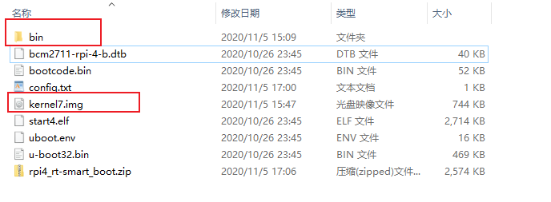

# RT-Thread Smart 入门指南

RT-Thread Smart（简称 rt-smart）是基于 RT-Thread 操作系统衍生的新分支，面向带 MMU，中高端应用的芯片，例如 ARM Cortex-A 系列芯片，MIPS 芯片，带 MMU 的 RISC-V 芯片等。rt-smart 在 RT-Thread 操作系统的基础上启用独立、完整的进程方式，同时以混合微内核模式执行。

rt-smart 软件包是 RT-Thread Smart 的用户体验软件包，可在 QEMU 模拟的 VExpress-A9 机器中或树莓派 4B 开发板上执行。本文档是针对 QEMU、树莓派 4B 开发板上快速上手 rt-smart 入门指南文档。

## 软件包说明
### 下载 rt-smart 软件包

下载 [rt-smart.zip](http://117.143.63.254:9012/www/rt-smart/) 软件包，解压后的目录说明如下图所示：



### 准备工具链

针对 Linux 和 Windows 环境需要下载对应的 arm-linux-musleabi 工具链，如果是 rt-smart 的软件包，则自带 Linux 环境下的工具链。

- Linux 版本工具链下载：[Linux 版本工具链](http://117.143.63.254:9012/www/rt-smart/)

- Windows 版本工具链下载：[Windows 版本工具链](http://117.143.63.254:9012/www/rt-smart/)

请根据自己的开发环境选择对用的工具链下载使用。

下载下来后分别解压展开到 `rt-smart/tools/gnu_gcc` 目录下，rt-smart 目录下的 smart-env.bat/sh 设置的环境变量，其中工具链路径都指向到这个目录下。

## Linux 下编译并在 QEMU 模拟环境上执行

在 Linux 系统下，需要安装一些基本的环境，然后才能编译 rt-smart。本文档是基于 Ubuntu16.04 系统环境操作，其它 Linux 版本类似。

### 安装编译环境

首先安装编译时需要用到的其他工具，软件包，可以通过如下的一些命令来安装：

```bash
sudo apt-get update
sudo apt-get install vim scons git bzip2 net-tools
sudo apt-get install python-all python-all-dev
sudo apt-get install qemu-system-arm qemu-system-common qemu-utils
```

以上命令会安装一些系统基础工具、python 环境、scons、qemu 工具等。

### 编译应用程序

```bash
# 进入到 rt-smart 目录
cd rt-smart

# 设置对应的环境变量，和原 RT-Thread 相比，多了 RTT_CC_PREFIX 环境变量
source smart-env.sh

# 编译用户态程序
cd userapps
scons

scons: Reading SConscript files ...
scons: done reading SConscript files.
scons: Building targets ...
CC build/hello/main.o
CC build/ping/main.o
CC build/pong/main.o
CC build/vi/optparse-v1.0.0/optparse.o
CC build/vi/vi.o
CC build/vi/vi_utils.o
CC build/webclient/main.o
LINK root/bin/hello.elf
LINK root/bin/ping.elf
LINK root/bin/pong.elf
LINK root/bin/vi.elf
LINK root/bin/webclient.elf
scons: done building targets.
```

编译成功后，`userapps/apps` 下的应用程序会编译成一个个的 elf 可执行文件，并放置于 `userapps/root/bin` 目录下，可以把它转换成 romfs、C 语言数组的方式给 rt-smart 内核使用，这样可以不依赖于其他文件系统就可以直接执行，生成 romfs、C 语言数组可以用如下的命令行：

```bash
cd userapps
python ../tools/mkromfs.py root ../kernel/bsp/qemu-vexpress-a9/applications/romfs.c
```

### 编译 rt-smart 内核

```bash
cd rt-smart/kernel/bsp/qemu-vexpress-a9
scons
... ...
CC build/kernel/src/thread.o
CC build/kernel/src/timer.o
LINK rtthread.elf
arm-linux-musleabi-objcopy -O binary rtthread.elf rtthread.bin
arm-linux-musleabi-size rtthread.elf
   text    data     bss     dec     hex filename
1219480   40652  122444 1382576  1518b0 rtthread.elf
scons: done building targets.
```

如果编译无误，会生成 rtthread.elf 内核文件。

### 模拟执行

通过 qemu 模拟的 vexpress-a9 开发板来直接运行：

```bash
cd rt-smart/kernel/bsp/qemu-vexpress-a9
./qemu-nographic.sh

 \ | /
- RT -     Thread Smart Operating System
 / | \     5.0.0 build Nov 15 2020
 2006 - 2020 Copyright by rt-thread team
lwIP-2.0.2 initialized!
try to allocate fb... | w - 640, h - 480 | done!
fb => 0x61100000
[I/sal.skt] Socket Abstraction Layer initialize success.
[I/SDIO] SD card capacity 65536 KB.
Dir /mnt mount failed!
hello rt-thread
msh />
msh />/bin/hello.elf
msh />hello world!
```

退出 qemu 的方法: "Ctrl+A, X"。上面我们也运行了这次编译的应用程序 `/bin/hello.elf`，并看到它输出 `hello world!`。

在第一次执行时，会输出 `Dir /mnt mount failed!`，这个是因为最开始执行时，qemu 的脚本会生成一个空的 sd.bin 文件做为一个 sd 卡给到 vexpress-a9 使用。所以在第一次执行时，需要对 sd0 进行格式化:

```bash
 \ | /
- RT -     Thread Smart Operating System
 / | \     5.0.0 build Nov 24 2020
 2006 - 2020 Copyright by rt-thread team
lwIP-2.0.2 initialized!
try to allocate fb... | w - 640, h - 480 | done!
fb => 0x61100000
[I/sal.skt] Socket Abstraction Layer initialize success.
[I/SDIO] SD card capacity 65536 KB.
[I/SDIO] switching card to high speed failed!
Dir /mnt mount failed!
hello rt-thread
msh />mkfs sd0
msh />

# Ctrl + A, X 退出
QEMU: Terminated

bernard@fuchsia-NUC8i7BEH:~/workspace/rt-smart/smart/kernel/bsp/qemu-vexpress-a9$ ./qemu-nographic.sh
 \ | /
- RT -     Thread Smart Operating System
 / | \     5.0.0 build Nov 24 2020
 2006 - 2020 Copyright by rt-thread team
lwIP-2.0.2 initialized!
try to allocate fb... | w - 640, h - 480 | done!
fb => 0x61100000
[I/sal.skt] Socket Abstraction Layer initialize success.
[I/SDIO] SD card capacity 65536 KB.
[I/SDIO] switching card to high speed failed!
file system initialization done!
hello rt-thread
msh />
```
## Windows 下编译并在树莓派 4B 上执行

在 Windows 上同样也可以进行编译，在 qemu 或树莓派 4B 开发板上执行起来，这里主要提及如何在树莓派 4B 上执行的方式。



### 准备编译环境

在 Windows 上编译 rt-smart，可以借助 RT-Thread 的 env 工具，env 工具下载及安装请参考 [这里](https://www.rt-thread.org/page/download.html), 请确保 env 可以正常使用。因为 rt-smart 软件包并不携带 Windows 环境下的工具链，所以务必记得安装前面描述的 准备工具链 章节下载 Windows 工具链并在 `rt-smart\tools\gnu_gcc` 下解压展开。打开 env 的终端窗口，切换到这个 rt-smart 代码包根目录，运行 smart-env.bat，它会设置一定的环境变量，然后整体的 smart 开发环境就可以使用了。

```bash
# 进入 rt-smart 目录，设置环境变量
cd rt-smart
> smart-env.bat
```

注：此处运行 smart-env.bat 设置环境，它包括编译器设置，同时它也会设置工具链的前缀，可以在 env 终端下输入以下命令查看返回结果是否生效：

```bash
# 查看环境变量是否生效
> set RTT_CC_PREFIX
RTT_CC_PREFIX=arm-linux-musleabi-
```

### 编译应用程序
当要编译应用程序时，使用方式和 Linux 的类似：

```bash
# 进入 userapps 目录进行编译
cd rt-smart\userapps
scons
```

### 编译 rt-smart 内核

```bash
# 进入 raspberry-pi\raspi4-32 目录进行编译
cd rt-smart\kernel\bsp\raspberry-pi\raspi4-32
scons
... ...
CC build/kernel/src/signal.o
CC build/kernel/src/thread.o
CC build/kernel/src/timer.o
LINK rtthread.elf
arm-linux-musleabi-objcopy -O binary rtthread.elf kernel7.img
arm-linux-musleabi-size rtthread.elf
   text    data     bss     dec     hex filename
 710780   40448   64730  815958   c7356 rtthread.elf
scons: done building targets.
```

编译无误后，会在当前目录下生成 kernel7.img 文件，这个是树莓派上 32 位的版本。目前 rt-smart 还只支持 32 位系统，所以在树莓派 4B 上是以 32 位模式来执行。

### 在树莓派上执行
#### 准备硬件连接

为了在树莓派 4B 上执行，需要准备如下硬件清单，并连接串口线到开发板，连接图示如下：

- 树莓派 4B
- SD 卡（32GB 或 32GB 以下）
- USB 转 TTL 串口线
- 网线
- TYPE-C（用于供电）
- 读卡器（用于把编译好的文件写入到 SD 卡中）



#### 准备 SD 卡上的软件

树莓派的加载需要将一些 boot 文件放到 sd 卡中。[rpi4_rt-smart_boot.zip](http://117.143.63.254:9012/www/rt-smart/) 为树莓派的加载需要的一些 boot 文件，将下载后的文件解压后和 kernel7.img 一起放入空的 SD 卡根目录，如下图所示，其中 bin 文件夹中存放 `userapps\root\bin` 目录下已编译好的可执行 elf 文件。



打开串口调试助手，插上电源，可以看到程序已经正常的运行起来，进入 bin 目录下即可执行示例程序：

```bash
heap: 0xc00c9a0a - 0xc40c9a0a
\ | /
- RT -     Thread Smart Operating System
/ | \     5.0.0 build Nov 15 2020
 2006 - 2020 Copyright by rt-thread team
lwIP-2.0.2 initialized!
version is B1
bcmgenet: PHY startup ok!
[I/sal.skt] Socket Abstraction Layer initialize success.
[I/SDIO] SD card capacity 31465472 KB.
found part[0], begin: 4194304, size: 256.0MB
found part[1], begin: 272629760, size: 29.772GB
file system initialization done!
hello rt-thread!
msh />/bin/hello.elf
msh />hello world!
```


