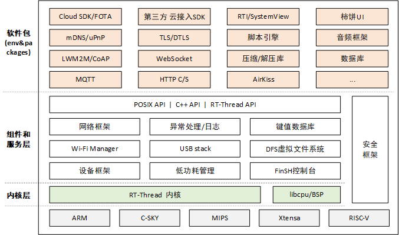

# RT-Thread 简介

作为一名 RTOS 的初学者，也许你对 RT-Thread 还比较陌生。然而，随着你的深入接触，你会逐渐发现 RT-Thread 的魅力和它相较于其他同类型 RTOS 的种种优越之处。RT-Thread 是一款完全由国内团队开发维护的嵌入式实时操作系统（RTOS），具有完全的自主知识产权。经过 16 个年头的沉淀，伴随着物联网的兴起，它正演变成一个功能强大、组件丰富的物联网操作系统。

## RT-Thread 概述

RT-Thread，全称是 Real Time-Thread，顾名思义，它是一个嵌入式实时多线程操作系统，基本属性之一是支持多任务，允许多个任务同时运行并不意味着处理器在同一时刻真地执行了多个任务。事实上，一个处理器核心在某一时刻只能运行一个任务，由于每次对一个任务的执行时间很短、任务与任务之间通过任务调度器进行非常快速地切换（调度器根据优先级决定此刻该执行的任务），给人造成多个任务在一个时刻同时运行的错觉。在 RT-Thread 系统中，任务通过线程实现的，RT-Thread 中的线程调度器也就是以上提到的任务调度器。

RT-Thread 主要采用 C 语言编写，浅显易懂，方便移植。它把面向对象的设计方法应用到实时系统设计中，使得代码风格优雅、架构清晰、系统模块化并且可裁剪性非常好。针对资源受限的微控制器（MCU）系统，可通过方便易用的工具，裁剪出仅需要 3KB Flash、1.2KB RAM 内存资源的 NANO 版本（NANO 是 RT-Thread 官方于 2017 年 7 月份发布的一个极简版内核)；而对于资源丰富的物联网设备，RT-Thread 又能使用在线的软件包管理工具，配合系统配置工具实现直观快速的模块化裁剪，无缝地导入丰富的软件功能包，实现类似 Android 的图形界面及触摸滑动效果、智能语音交互效果等复杂功能。

相较于 Linux 操作系统，RT-Thread 体积小，成本低，功耗低、启动快速，除此以外 RT-Thread 还具有实时性高、占用资源小等特点，非常适用于各种资源受限（如成本、功耗限制等）的场合。虽然 32 位 MCU 是它的主要运行平台，实际上很多带有 MMU、基于 ARM9、ARM11 甚至 Cortex-A 系列级别 CPU 的应用处理器在特定应用场合也适合使用 RT-Thread。

## 许可协议

RT-Thread 系统完全开源，遵循 Apache License 2.0 开源许可协议，可以免费在商业产品中使用，并且不需要公开私有代码，没有潜在商业风险。

## RT-Thread 的架构

近年来，物联网（Internet Of Things，IoT）概念广为普及，物联网市场发展迅猛，嵌入式设备的联网已是大势所趋。终端联网使得软件复杂性大幅增加，传统的 RTOS 内核已经越来越难满足市场的需求，在这种情况下，物联网操作系统（IoT OS）的概念应运而生。**物联网操作系统是指以操作系统内核（可以是 RTOS、Linux 等）为基础，包括如文件系统、图形库等较为完整的中间件组件，具备低功耗、安全、通信协议支持和云端连接能力的软件平台，**RT-Thread 就是一个 IoT OS。

RT-Thread 与其他很多 RTOS 如 FreeRTOS、uC/OS 的主要区别之一是，它**不仅仅是一个实时内核，还具备丰富的中间层组件**，如下图所示。

它具体包括以下部分:

- 内核层：RT-Thread 内核，是 RT-Thread 的核心部分，包括了内核系统中对象的实现，例如多线程及其调度、信号量、邮箱、消息队列、内存管理、定时器等；libcpu/BSP（芯片移植相关文件 / 板级支持包）与硬件密切相关，由外设驱动和 CPU 移植构成。
- 组件与服务层：组件是基于 RT-Thread 内核之上的上层软件，例如虚拟文件系统、FinSH 命令行界面、网络框架、设备框架等。采用模块化设计，做到组件内部高内聚，组件之间低耦合。
- RT-Thread 软件包：运行于 RT-Thread 物联网操作系统平台上，面向不同应用领域的通用软件组件，由描述信息、源代码或库文件组成。RT-Thread 提供了开放的软件包平台，这里存放了官方提供或开发者提供的软件包，该平台为开发者提供了众多可重用软件包的选择，这也是 RT-Thread 生态的重要组成部分。软件包生态对于一个操作系统的选择至关重要，因为这些软件包具有很强的可重用性，模块化程度很高，极大的方便应用开发者在最短时间内，打造出自己想要的系统。RT-Thread 已经支持的软件包数量已经达到 400+，如下举例：
- 物联网相关的软件包：Paho MQTT、WebClient、mongoose、WebTerminal 等等。
- 脚本语言相关的软件包：目前支持 Lua、JerryScript、MicroPython、PikaScript。
- 多媒体相关的软件包：Openmv、mupdf。
- 工具类软件包：CmBacktrace、EasyFlash、EasyLogger、SystemView。
- 系统相关的软件包：RTGUI、Persimmon UI、lwext4、partition、SQLite 等等。
- 外设库与驱动类软件包：RealTek RTL8710BN SDK。
- 其他。
