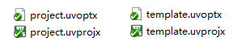
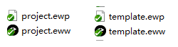
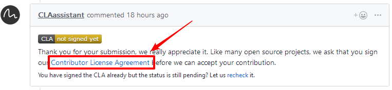

# BSP 提交自查

当一个 BSP 制作完成之后，需要提交者自查以下内容，缩短 review 周期。以下所有要求不针对厂商提供的库文件驱动等等，但为防止库文件 ci 不通过，需要增加一个 `.ignore_format.yml` 文件到新的 bsp 路径（文件内容参照如下），加入库文件相对路径，将忽略检查该库文件的格式。例如：

```python
# files format check exclude path, please follow the instructions below to modify;
# If you need to exclude an entire folder, add the folder path in dir_path;
# If you need to exclude a file, add the path to the file in file_path.

file_path:

dir_path:
    
```


## 代码规范部分

首先了解代码规范，可以查看 rt-thread 源码中的文档：[代码格式](https://gitee.com/rtthread/rt-thread/blob/gitee_master/documentation/coding_style_cn.md)，请仔细阅读每一条内容。

举例代码格式要求：

- 不允许中文注释
- 4 个空格缩进
- 大括号换行

了解上述链接中的代码规范之后，根据链接中的文档要求编写代码，代码格式可以使用 [astyle 格式化](https://club.rt-thread.org/ask/article/2993.html#)。

## readme 检查

是否清晰可读

1. 开发板的照片
2. 芯片资源的介绍中是否包含 FLASH，RAM（需要在 heap 配置时候检查大小，链接脚本是否配置正确）
3. 添加开发板资源的链接
4. 硬件连接是否清晰
5. [文档](https://www.rt-thread.org/document/site/)中英文之间添加空格，可以使用 vscode-pangu 插件一键格式化文档
6. 检查联系人信息，添加维护人自己的名字和 github 链接

## 命名检查

函数、变量名：

(1)小写命名

(2)不包含芯片厂商名，bsp 函数命名规范具体如下：

- 驱动 ops 命名规则：`_外设名_操作 `，以 uart 举例：
    - static _uart_read/write()
- 驱动注册接口命名规则：`rt_hw_外设_init()`，以 uart 举例：
    - int rt_hw_uart_init(void)

## 代码检查

1. 应用代码不包含设备驱动头文件，如 main 中不出现 #include "drv_gpio.h" ，驱动头文件可以包含在 board.h 中。
2. GCC 代码 rtt 启动部分是否修改（entry）
3. HEAP 大小配置是否正确
4. 检查链接脚本 ram/rom 大小是否正确
5. 中断需要 rt_interrupt_enter(); 与 rt_interrupt_leave();
6. 驱动合并重复代码
7. 驱动函数名小写
8. 不允许提交空文件

代码精简：

1. 是否存在无用的文件
2. 是否存在注释的代码, 如: `if 0`
3. 没有多于一行的连续换行

## license 检查

- 所有文件都要有 license 文件头
- 不能有 GPL 等与 Apache2.0 版权冲突的版权
- 非 Apache2.0 的兼容 license，需要更新 bsp 目录下的 license 声明：[Copyright_Notice.md](https://gitee.com/rtthread/rt-thread/blob/gitee_master/bsp/Copyright_Notice.md)，bsp 按照字母顺序排列。

## 工程文件检查

- 若支持MDK5，应上传：



- 若支持IAR，应上传：



## 使用工具格式化代码

本部分在 [代码格式](https://gitee.com/rtthread/rt-thread/blob/gitee_master/documentation/coding_style_cn.md) 中有记录。

1、astyle 格式化代码，参数：

```
!E --style=allman --indent=spaces=4 --indent-preproc-block --pad-oper --pad-header --unpad-paren --suffix=none --align-pointer=name  --convert-tabs --verbose
```

2、使用 [formatting](https://github.com/mysterywolf/formatting) 扫描文件来格式化代码。

## 基本功能验证

提交的 bsp 需要通过测试，并支持最基本的功能：uart 控制台，pin 设备。

最基本功能的效果：

- 可以运行 finsh 控制台，可以输入命令；
- 可以点灯。

注意：除以上基本功能之外的功能，请等待 PR 合并之后再行提交。

## 添加 bsp 到 CI

打开源码根目录下 [.github/workflows/action.yml](https://gitee.com/rtthread/rt-thread/blob/gitee_master/.github/workflows/action.yml) 文件，添加 bsp 到 ci。

## 提交 PR 之后的检查项

- 提交 PR 之后，检查 CLA 是否签署（一个账户只需要在第一次提交时候签署）。注意不要使用非 GitHub 账号提交 commmit，或者使用不同的账号提交 commit 后提 Pull Request，这会导致 CLA 签署失败。



- 再检查 ci 是否正常运行（ci 检查需要一段时间），有无报错信息，全部通过后显示如下：


- 接下来等待 review 结果，若有反馈需要修改，请进行修改，直到合并。