# 应用 AT 组件连接 ESP8266 模块

本文介绍了 RT-Thread AT 组件的基本知识和 AT 客户端的使用方法，帮助开发者更好地使用 RT-Thread AT 组件。

## 简介

为了方便用户使用 AT 命令，简单的适配不同的 AT 模块， RT-Thread 提供了 AT 组件用于 AT 设备的连接和数据通讯。**AT 组件的实现包括客户端的和服务器两部分**。对于嵌入式设备而言，更多的情况下设备使用 AT 组件作为客户端连接服务器设备，所以本文将为大家重点介绍 AT 组件中客户端的主要功能、移植方式和实现原理，并介绍在客户端的基础上实现标准 BSD Socket API，使用 AT 命令完成复杂网络通讯。

本文准备资料如下：

* [RT-Thread 源码](https://www.rt-thread.org/page/download.html)

* [Env 工具](https://www.rt-thread.org/page/download.html)

## AT Client 功能

本文将基于正点原子 STM32F4 探索者开发板和乐鑫 ESP8266 开发板，给出了 AT 组件中 AT Client 功能的配置、移植和使用方式。

**AT Client 功能主要用于完成 AT 命令的数据收发和解析过程。**

下图为本文使用的两个开发板的底板图，开发者可以使用 ESP8266 开发板或模组，若缺少正点原子 STM32F4 探索者开发板可使用其他带额外串口的开发板代替，需确保开发板正常运行 RT-Thread 系统且串口使用正常：

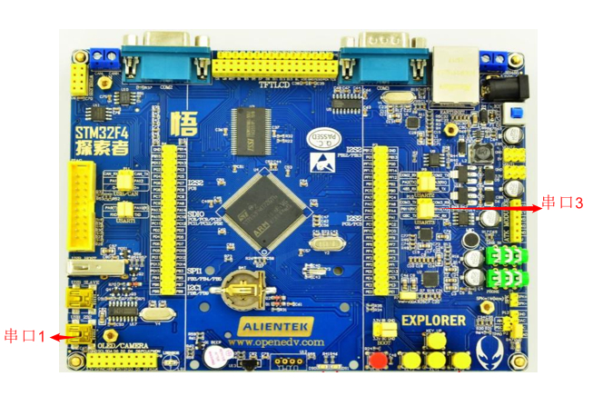

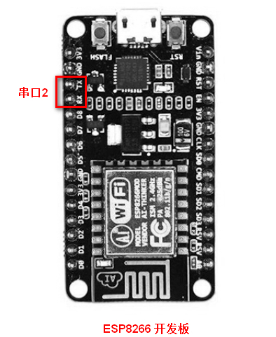

AT 组件中 AT Client 主要完成 AT 命令的发送和响应数据的接收与解析。这里我们使用正点原子 STM32F4 探索者开发板串口 3 作为 AT Client 连接 ESP8266 开发板的串口 2，ESP8266 开发板的串口 2 作为 AT Server，完成 AT Client 数据收发和解析的功能，下面就具体给出配置和使用方式的介绍。

### AT Client 配置

开启 Env 工具，进入 `rt-thread\bsp\stm32\stm32f407-atk-explorer` 目录，在 Env 命令行输入 menuconfig 进入配置界面配置工程。

- 配置串口支持：配置开启 UART3 选项；

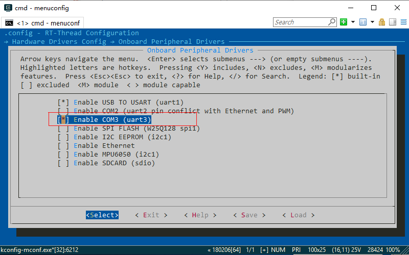

- 开启 AT Client 功能：RT-Thread Components ---> Network ---> AT commands --> 开启 AT DEBUG，开启 AT Client 支持，目前 AT Client 支持多连接功能，后面需要手动初始化 AT Client。

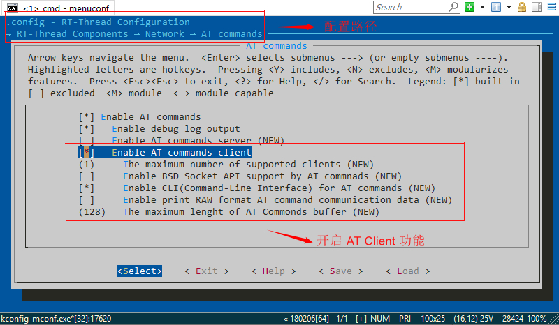

AT Client 配置选项介绍如下：

- Enable debug log output：配置开启调试日志；
- Enable AT commands client：配置开启 AT 客户端；
- The muxinum number of supported clients: 配置最大同时支持的客户端数量，该例程使用单客户端连接，配置为 1 即可。
- Enable BSD Socket API support by AT commands: 配置开启 BSD Socket API 支持，下面 AT Client 例程没有使用可暂时不开启。
- Enable CLI(Command-Line Interface) for AT commands: 配置开启 AT 命令行交互模式。
- Enable print RAW format AT command communication data： 配置开启收发数据实时打印功能。
- The maxinum length of AT Commonds：配置发送 AT 命令的最大数据长度

若RT-Thread版本小于等于4.0.3，并且使用 RT-Studio IDE 或者 GCC 工具链编译时，需要开启 libc 。

配置完成，保存并退出配置选项，输入命令 scons --target=mdk5 生成 MDK 工程；

### AT Client 添加示例

下载 [AT Client 示例代码](https://github.com/RT-Thread-packages/at_device/blob/master/samples/at_sample_client.c)，添加到打开的 MDK 工程中，如下图所示：

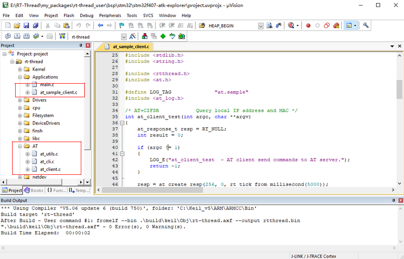

示例添加完成，就可以编译、下载程序到开发板，之后打开 PC 上串口工具，这里使用 xshell 工具，选择正确的串口（配置串口参数为 115200-8-1-N、无流控），然后按下复位后就可以在串口 1 连接的终端上看到 RT-Thread 系统启动日志。

系统初始化成功之后，在 shell 中执行 `at_client_init uart3 ` 命令，这里的 `uart3` 为开发板中作为 AT client 的设备名。然后可以看到 AT Client 的初始化日志，说明 AT Client 功能配置启动成功，如下图所示：

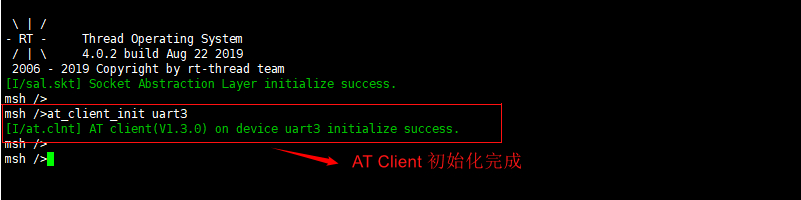

### AT Client 运行示例

### AT Client 模式

该模式下正点原子 STM32F4 探索者开发板串口 3 作为 AT Client， ESP8266 开发板作为 AT Server，进行数据交互模式，在本地 shell 中输入 `at_client_test` 命令，该 shell 命令用于发送 AT 命令到服务器，并且接收和解析服务器响应数据，如下图所示过程：

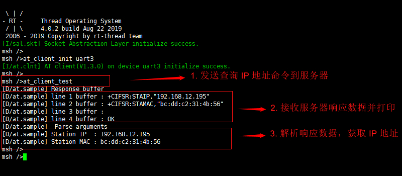

### AT Client CLI 模式

AT Client CLI 功能可以转发本地 shell 输入的数据到设备连接的 AT Server 串口设备上，并在本地 shell 上实时显示 AT Client 串口接收到的数据。在本地 shell 中执行 `at client` 命令进入 AT Client CLI 模式即可进行数据的收发。通过 AT Client CLI 模式，用户可以很方便的完成与 AT Server 的连接与调试，极大的提高开发效率。

下图演示了 AT Client CLI 功能的使用和退出：

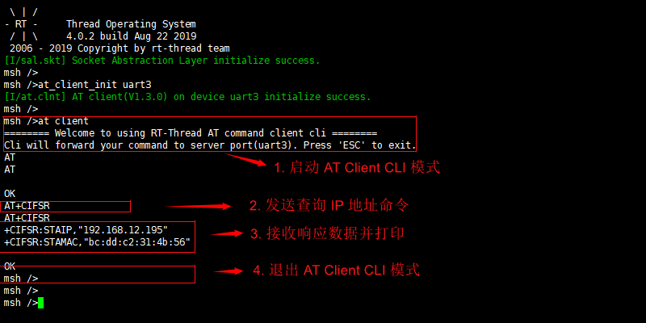

### AT Client 示例详解

本文使用的 AT Client 示例代码演示了 AT Client 的整个使用流程，示例代码完成 STM32F4 设备 AT 命令的发送并接收和解析 ESP8266 设备的响应数据。代码的使用和平台有关，开发者可以根据自己使用的平台修改示例代码并运行，主要修改命令的名称和解析的方式。下面通过示例代码介绍一下 AT Client 的具体使用流程：

```c
#include <stdlib.h>
#include <string.h>
#include <rtthread.h>
#include <at.h>

/* AT+CIFSR            Query local IP address and MAC */
int at_client_test(int argc, char**argv)
{
    at_response_t resp = RT_NULL;
    int result = 0;

    if (argc != 1)
    {
        LOG_E("at_client_test  - AT client send commands to AT server.");
        return -1;
    }

    /* 创建响应结构体，设置最大支持响应数据长度为 256 字节
    （最大响应长度用户根据实际需求自定义），响应数据行数无限制，超时时间为 5 秒 */
    resp = at_create_resp(256, 0, rt_tick_from_millisecond(5000));
    if (resp == RT_NULL)
    {
        LOG_E("No memory for response structure!");
        return -2;
    }

    /* 关闭回显功能 */
    at_exec_cmd(resp, "ATE0");

    /* AT  Client 发送查询 IP 地址命令并接收 AT Server 响应 */
    /* 响应数据及信息存放在 resp 结构体中 */
    result = at_exec_cmd(resp, "AT+CIFSR");
    if (result != RT_EOK)
    {
        LOG_E("AT client send commands failed or return response error!");
        goto __exit;
    }

    /* 按行数循环打印接收到的响应数据 */
    {
        const char *line_buffer = RT_NULL;

        LOG_D("Response buffer");
        for(rt_size_t line_num = 1; line_num <= resp->line_counts; line_num++)
        {
            if((line_buffer = at_resp_get_line(resp, line_num)) != RT_NULL)
            {
                LOG_D("line %d buffer : %s", line_num, line_buffer);
            }
            else
            {
                LOG_E("Parse line buffer error!");
            }
        }
    }
    /* 按自定义表达式（sscanf 解析方式）解析数据，得到对应数据 */
    {
        char resp_arg[AT_CMD_MAX_LEN] = { 0 };
        /* 自定义数据解析表达式 ，用于解析两双引号之间字符串信息 */
        const char * resp_expr = "%*[^\"]\"%[^\"]\"";

        LOG_D("Parse arguments");
        /* 解析响应数据中第一行数据，得到对应 IP 地址 */
        if (at_resp_parse_line_args(resp, 1, resp_expr, resp_arg) == 1)
        {
            LOG_D("Station IP  : %s", resp_arg);
            memset(resp_arg, 0x00, AT_CMD_MAX_LEN);
        }
        else
        {
            LOG_E("Parse error, current line buff : %s", at_resp_get_line(resp, 4));
        }

        /* 解析响应数据中第二行数据，得到对应 MAC 地址 */
        if (at_resp_parse_line_args(resp, 2, resp_expr, resp_arg) == 1)
        {
            LOG_D("Station MAC : %s", resp_arg);
        }
        else
        {
            LOG_E("Parse error, current line buff : %s", at_resp_get_line(resp, 5));
            goto __exit;
        }
    }
__exit:
    if(resp)
    {
        /* 删除 resp 结构体 */
        at_delete_resp(resp);
    }

    return result;
}
/* 设置当前 AT 客户端最大支持的一次接收数据的长度 */
#define AT_CLIENT_RECV_BUFF_LEN         512
int at_client_test_init(int argc, char**argv)
{
    if (argc != 2)
    {
        rt_kprintf("at_client_init <dev_name>   -- AT client initialize.\n");
        return -RT_ERROR;
    }

    at_client_init(argv[1], AT_CLIENT_RECV_BUFF_LEN);

    return RT_EOK;
}
#ifdef FINSH_USING_MSH
#include <finsh.h>
/* 添加 AT Client 测试命令到 shell  */
MSH_CMD_EXPORT(at_client_test, AT client send cmd and get response);
/* 添加 AT Client 初始化命令到 shell  */
MSH_CMD_EXPORT_ALIAS(at_client_test_init, at_client_init, initialize AT client);
#endif
```
- 整个示例为单客户端示例，可以直接使用单客户端模式 API。

- AT Client 使用流程大致如下：at_create_resp() 创建响应结构体 ---> at_exec_cmd() 发送命令并接收响应 ---> at_resp_get_line()/at_resp_parse_line_args()  打印或解析响应数据 ---> at_delete_resp() 删除响应结构体。

 - at_exec_cmd() 函数完成对传入 AT 命令的发送和响应数据的接收，响应数据以按行的形式存放与结构体中，便于数据按行打印或及解析。

 - 打印或解析数据时对于不同的命令的响应数据有不同的数据解析方式，需要自定义数据解析的表达式，这要求开发者提前知道发送命令的具体响应结构，可以通过查看设备 AT 命令手册了解。

## AT Socket 功能

为了方便开发者使用 AT 组件进行网络相关操作，降低 RT-Thread 系统对单独协议栈网络连接的依赖，RT-Thread 系统在 AT 组件和 SAL 组件的基础上推出了 AT Socket 功能。

**AT Socket 功能是建立在 AT Client 功能基础上，主要作用是完成 AT 设备连接网络并进行数据通讯，对应用层提供标准 BSD Socket API 接口，方便应用层代码移植和使用。**

 AT Socket 功能使设备无需实现其他网络连接方式，直接使用串口完成设备联网功能，简化了设备开发的软硬件设计，方便开发者开发。此外，不同于传统的软件网络协议栈，AT Socket 网络功能的运行主要是在串口连接的 AT Server 设备上完成，根据不同的 AT Server 设备，可同时支持 5-6 个 socket，这样极大了降低了 AT Client 设备上 MCU 资源占用，提高 MCU 工作效率，确保数据通讯的质量和硬件的资源的合理分配。

AT Socket 功能目前占用最少资源体积约为**20K ROM 、 3K RAM**（支持 5 个 Socket）。

AT Socket 功能对于不同的 AT 设备需要完成移植适配过程，目前已经完成多种设备的适配，包括：ESP8266、 M26 、MC20、EC20、SIM800、SIM76XX、RW007、MW31 等，各种适配的方式通过 [AT Device 软件包](https://github.com/RT-Thread-packages/at_device) 给出，所以 AT Socket 功能的实现基于 AT Device 软件包。下面主要通过 ESP8266 设备，AT Socket 功能使用和 AT Device 软件包配置进行介绍。

### AT Socket 配置

AT Socket 功能的使用依赖于如下几个组件：

- **AT 组件**：AT Socket 功能基于 AT Client 功能的实现；
- **SAL 组件**：SAL 组件主要是 AT Socket 接口的抽象，实现标准 BSD Socket API；
- **netdev 组件**：用于抽象和管理 AT 设备生成的网卡设备相关信息，提供 ping、ifconfig、netstat 等网络命令；
- **AT Device 软件包**：针对不同设备的 AT Socket 移植和示例文件，以软件包的形式给出；

下面主要介绍 Env 中配置 AT Socket 功能的整个流程：

1. 开启 Env 工具，进入`rt-thread\bsp\stm32\stm32f407-atk-explorer` 目录，在 Env 命令行输入 menuconfig 进入配置界面配置工程。

2. 开启 AT Device 软件包，示例中使用 `laster` 最新版本，需要配置使用的 AT 模块型号（ESP8266）和 AT Client 设备名称（UART3）：

- `RT-Thread online packages ---> IoT - internet of things ---> AT Device`配置开启 AT DEVICE 软件包支持；
- 配置使用的设备为 ESP8266 设备；
- 配置 AT Client 设备名称和最大支持的接收数据长度；
- 配置 wifi ssid 和 wifi password 用于设备联网；
- 配置使用 `laster` 版本软件包；

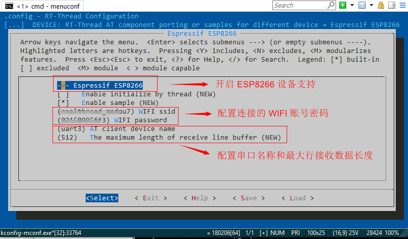

3. AT Device 软件包开启，并且选择指定 AT 设备之后，会默认选上 AT 组件中 AT Client 功能已经 AT Socket 功能支持，如下图所示：

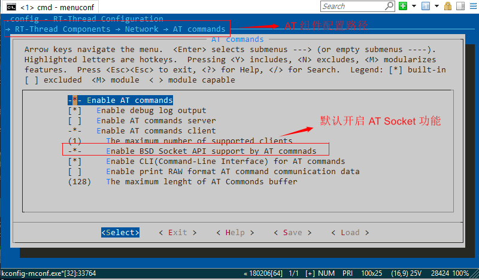

**AT Device 软件包中每种 AT 设备配置选项，都是 AT Socket 功能针对该设备的实现方式。**

4. 之后需要开启 SAL 组件支持，用于抽象统一标准网络接口，`RT-Thread Components ---> Network ---> Socket abstraction laye ---> Support AT Commands stack`，开启 SAL 组件功能支持，然后开启 `SAL_USING_POSIX` 支持，支持使用 read/write、poll/select 等文件系统接口函数。

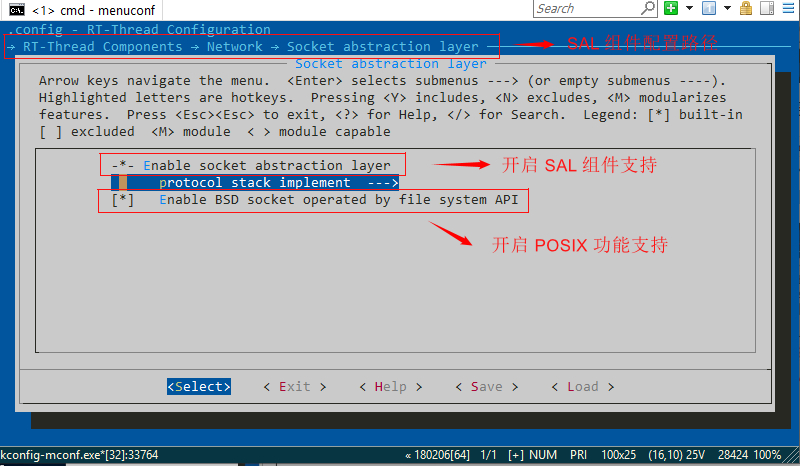

5. 配置完成，保存并退出配置选项，输入命令 scons --target=mdk5 生成 keil 工程。

6. 打开 MDK 工程，编译、下载代码到开发板中。

7. 打开 PC 上串口工具 xshell，配置打开串口（配置串口参数为 115200-8-1-N、无流控），然后按下复位后就可以在串口 1 连接的终端上看到 RT-Thread 系统启动日志，并可以看到 AT Client 的启动日志、SAL 的启动日志且设备自动连接网络成功，说明 AT Socket 功能初始化成功，如下图所示。

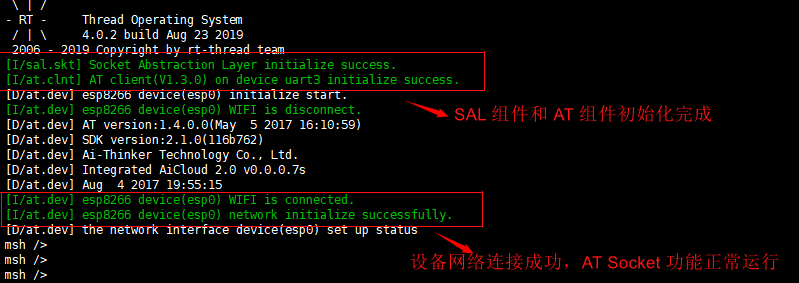

### AT Socket 使用

#### 网络连接测试

AT Socket 功能提供 `ping` 或者 `ifconfig`命令用于测试设备网络连接环境，，`ping` 命令原理是通过 AT 命令发送请求到服务器，服务器响应数据，客户端解析 ping 数据并显示。`ifocnfig` 命令可以查看当前设备网络状态和 AT 设备生成的网卡基本信息。如下图所示，设备网络连接成功之后，执行网络测试命令：

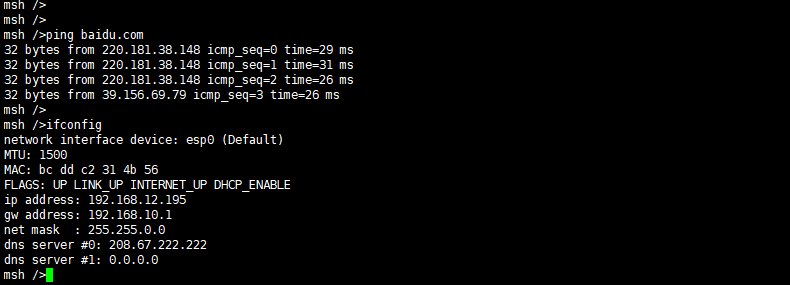

#### MQTT 组件示例测试

AT Socket 功能完成设备通过串口 AT 命令进行网络数据通讯，设备可以通过 AT Socket 功能启动 MQTT 协议并运行 MQTT 示例代码，具体配置步骤和示例使用方式如下：

- AT Device 软件包开启的基础上，配置下载 MQTT 组件包及示例代码，具体配置方式：RT-Thread online packages ---> IOT - internet of things ---> 开启 paho MQTT 组件包，配置开启 MQTT 示例代码。

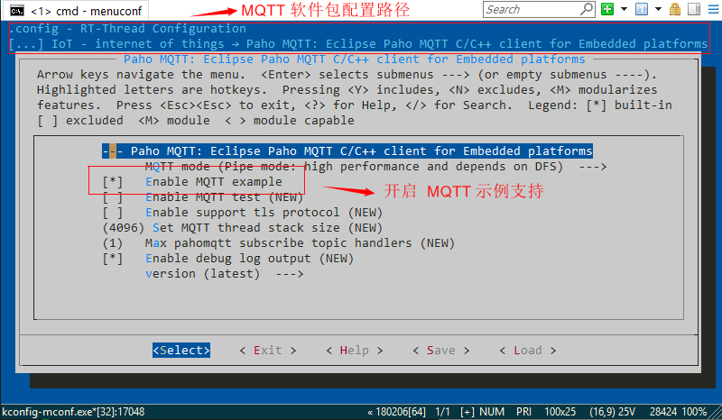

- 配置完成，保存并退出配置选项，scons 重新生成工程，编译下载代码到开发板中。

- 打开串口工具，系统启动成功，输入 `mqtt_start` 命令启动 MQTT 协议，启动完成之后输入 `mqtt_publish mqtt_test_data` 命令，用于向固定的 MQTT Topic 发送数据，同时 MQTT 服务器会立刻向该 Topic 发送同样数据，MQTT 示例测试完成，如下图所示：

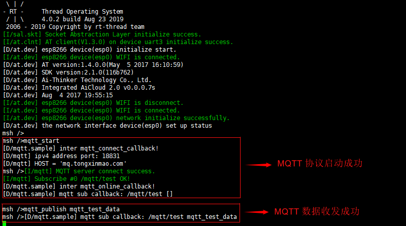

上述展示了正点原子 STM32F4 设备在未连接网络的情况下使用 AT Socket 功能运行 MQTT 网络示例，实现了 AT Socket 网络数据收发的功能，目前 AT Socket 功能只支持设备作为网络客户端连接服务器，这也符合嵌入式设备多用于客户端设备的特性。AT Socket 目前已经支持多种网络相关组软件包和功能，如下所示：

- tcpclient/udpclient 功能
- MQTT 软件包
- webclient 软件包
- mbedtls 软件包
- onenet 软件包
- ali-linkkit 软件包
- NTP 时间查询功能
- iperf 网络测试功能
- ping/ifconfig/netstat 网络测试功能

## 参考资料

* [《AT 组件编程指南》](../../../programming-manual/at/at.md)

* [《Env 用户手册》](../../../programming-manual/env/env.md)

## 常见问题

### Q: esp8266 设备连上网络后过一段时间 wifi 自动断开重连怎么办？

**A:** 该错误一般为 esp8266 设备供电问题，可以使用万用表查看设备当前电压情况，如果出现供电不足问题，可以为 esp8266 vin 接口添加额外供电。

### Q: esp8266 设备一直显示连接超时，命令发送失败怎么办？

**A:** 检查 esp8266 设备串口接线，反接 RX/TX 接线，检查设备供电，进 AT Client CLI 模式确定命令发送是否正常。

更多 AT 组件或者 AT Device 软件包相关问题请查看 [ AT 相关问题汇总贴](https://www.rt-thread.org/qa/thread-11919-1-1.html)。
