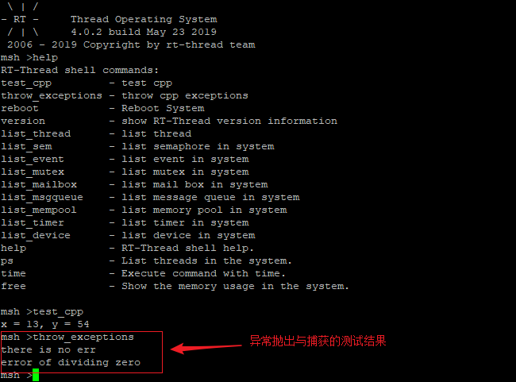

# 在 STM32 上使用 C++ 指南

本文描述了如何使用在搭载了 `RT-Thread` 系统的 `STM32` 平台上使用 `C++`，包括 `C++` 的配置和应用等。并给出了在意法半导体 `STM32F411 nucleo` 开发板上验证的代码示例。

## 硬件平台简介

本文基于意法半导体 `STM32F411 nucleo` 开发板，给出了 `C++` 的具体应用示例代码，由于 `RT-Thread` 上层应用 `API` 的通用性，因此这些代码不局限于具体的硬件平台，用户可以轻松将它移植到其它平台上。

`STM32F411 nucleo` 是意法半导体推出的一款基于 `ARM Cortex-M4` 内核的开发板，最高主频为 `100Mhz`，该开发板具有丰富的板载资源，可以充分发挥 `STM32F411RE` 的芯片性能。


## 如何在 `STM32` 上使用 `C++`

准备工作：

1. 下载 [RT-Thread 源码](https://github.com/RT-Thread/rt-thread)

2. 下载 [ENV 工具](https://www.rt-thread.org/page/download.html)


3. 进入 `rt-thread\bsp\stm32f411-st-nucleo` 目录，检查 BSP `rtconfig.py` 文件和 `SConstruct` 文件是否支持 `C++` 配置，如下图所示

检查 `rtconfig.py` 文件中对 `C++` 的支持


检查 `SConstruct` 文件中对 `C++` 的支持


打开 `C++` 支持:

1. 打开 `Env` 工具，在 `Env` 命令行中输入 `menuconfig`，进入配置界面，使用 `menuconfig` 工具（学习如何使用）配置工程。在 `menuconfig` 配置界面依次选择 `RT-Thread Components ---> C++ features ---> Support C++ features`，如图所示：


编译工程:
`scons --target=mdk5`
1. 生成 `mdk5` 工程，将附录章节的 `main.cpp` 文件替换掉 `BSP` 中的 `main.c` 文件并重新加入到工程中，如图所示：


2.  编译，下载程序，在终端输入 `help` 命令可以看到 `test_cpp` 已经添加成功了。


3. 运行 `C++` 程序：

 在终端输入 `test_cpp` 运行结果如下图所示。


## C++ 全局对象构造函数的调用

`RT-Thread` 中对全局对象构造函数的实现中，以 `GNUC` 为例，在 `rt-thread\components\cplusplus` 目录下的 `crt_init.c` 文件中对 `C++` 进行了系统初始化，
在特定的 `BSP` 目录下，连接脚本文件 `link.lds` 为 `C++` 全局构造函数的代码分配了段，使 `C++` 全局对象构造函数链接后能够存放在指定的段中。如下图所示：

 

1. `crt_init.c` 文件完成了 `C++` 系统的初始化工作

2. `C++` 系统初始化部分:

        RT_WEAK int cplusplus_system_init(void)
        {
            typedef void(*pfunc)();
            extern pfunc __ctors_start__[];
            extern pfunc __ctors_end__[];
            pfunc *p;

            for (p = __ctors_start__; p < __ctors_end__; p++)
                (*p)();

            return 0;
        }
        INIT_COMPONENT_EXPORT(cplusplus_system_init);

在 `cplusplus_system_init` 函数中，将全局对象的构造函数依次链接到了链接脚本文件中为其分配的段中，并且调用了 `RT-Thread` 组件自动初始化的宏 `INIT_COMPONENT_EXPORT`，所以在链接的时候，`C++` 全局对象构造函数所产生的目标文件就被链接到了 `__ctors_start__` 和 `__ctors_end__`组成的段中。

3. 链接脚本中为 `C++` 全局构造函数分配的段部分:


        PROVIDE(__ctors_start__ = .);
        KEEP (*(SORT(.init_array.*)))
        KEEP (*(.init_array))
        PROVIDE(__ctors_end__ = .);


`__ctors_start__` 分配了 `C++` 全局构造函数段的起始地址， `__ctors_end__` 分配了 `C++` 全局构造函数段的结束地址，所以全局构造函数在系统初始化的时候，就会被链接到这里分配的段地址中。


## RT-Thread C++ 异常说明

同样，在链接脚本文件 `link.lds` 中，也为 `C++` 异常分配了段地址：

        __exidx_start = .;
        ARM.exidx :
        {
            *(.ARM.exidx* .gnu.linkonce.armexidx.*)
            _sidata = .;
        } > CODE
        __exidx_end = .;


`__exidx_start` 分配了 `C++` 异常的起始地址, `__exidx_end` 分配了 `C++` 异常的结束地址,当异常产生的时候,就会被分配到指定的段地址中.

这里以一个 `C++` 除零异常的抛出和捕获为例：


        #include<math.h>

        #define MIN_VALUE                 (1e-4)
        #define IS_DOUBLE_ZERO(d)         (abs(d) < MIN_VALUE)

        double div_func(double x, double y)
        {
            if (IS_DOUBLE_ZERO(y))
            {
                throw y;                                           /* throw exception */
            }

            return x / y;
        }

        void throw_exceptions(void *args)
        {
            try
            {
                div_func(6, 3);
                rt_kprintf("there is no err\n");
                div_func(4, 0);                                   /* create exception*/
                rt_kprintf("you can run here?\n");
            }
            catch(double)                                         /* catch exception */
            {
                rt_kprintf("error of dividing zero\n");
            }
        }

        MSH_CMD_EXPORT(throw_exceptions, throw cpp exceptions);


当除零异常发生的时候 `div_func`  函数会抛出一个异常，在 `throw_exceptions` 函数中会去捕获这个异常。

 下载代码，并在终端输入 `throw_exceptions` 运行结果如下图所示。

 


到这一步为止，如何在搭载了 `RT-Thread` 系统的 `STM32` 平台上如何使用 `C++` 的介绍就结束了。

## 附录

`main.cpp` 源码

```c
/*
 * Copyright (c) 2006-2018, RT-Thread Development Team
 *
 * SPDX-License-Identifier: Apache-2.0
 *
 * Change Logs:
 * Date           Author       Notes
 * 2019-05-23     tyustli   first version
 */

#include <rtthread.h>

int main(void)
{
    int count = 1;
    while (count++)
    {
        rt_thread_mdelay(500);
        rt_kprintf("hello rtthread\r\n");
    }

    return RT_EOK;
}
using namespace rtthread;

class tran
{
public:
    void getnumber(int a, int b)
    {
        x = a;
        y = b;
    }
    void out(tran & s)
    {
        rt_kprintf("x = %d, y = %d\n", x, y);
    }
private:
    int x, y;
};

int test_cpp(void)
{
    tran s;

    s.getnumber(13, 54);
    s.out(s);

    return 0;
}

MSH_CMD_EXPORT(test_cpp, test cpp);

#include <math.h>
#include <stdlib.h>

#define MIN_VALUE                 (1e-4)
#define IS_DOUBLE_ZERO(d)         (abs(d) < MIN_VALUE)

double div_func(double x, double y)
{
    if (IS_DOUBLE_ZERO(y))
    {
        throw y;                                           /* throw exception */
    }

    return x / y;
}

void throw_exceptions(void *args)
{
    try
    {
        div_func(6, 3);
        rt_kprintf("there is no err\n");
        div_func(4, 0);                                   /* create exception*/
        rt_kprintf("you can run here\n");
    }
    catch(double)                                         /* catch exception */
    {
        rt_kprintf("error of dividing zero\n");
    }
}

MSH_CMD_EXPORT(throw_exceptions, throw cpp exceptions);

```

## 参考资料
* [ENV 用户手册](https://www.rt-thread.org/document/site/programming-manual/env/env/)

* [STM32F411-ST-NUCLEO BSP 源码](https://github.com/RT-Thread/rt-thread/tree/master/bsp/stm32/stm32f411-st-nucleo)

