# 在 STM32F429 上应用文件系统

本文介绍了 RT-Thread 文件系统的基本知识和使用方法，帮助开发者更好地使用 RT-Thread 文件系统。并给出了在正点原子 `STM32F429-apollo` 开发板上验证的代码示例。

## 简介

第一次接触 RT-Thread 文件系统的开发者可能觉得 RT-Thread 文件系统过于复杂，不知道该从何入手。想要在项目中使用文件系统，却不知道该怎么做。本文将介绍 RT-Thread 文件系统的移植及文件系统的使用方法。

本文准备资料如下：

* [RT-Thread 源码](https://www.rt-thread.org/page/download.html)

* [Env 工具](https://www.rt-thread.org/page/download.html)

## 文件系统的移植

本次演示使用正点原子开发板 `STM32F429-Apollo` ，选择的文件系统类型是  `elm FatFS`  。由于 RT-Thread 自带了这个文件系统，所以移植工作较为简单，只需要通过 Env 工具对系统进行合适的配置既可。其他 RT-Thread 支持的文件系统，移植过程也是类似的，只需要对系统进行合适的配置即可使用。

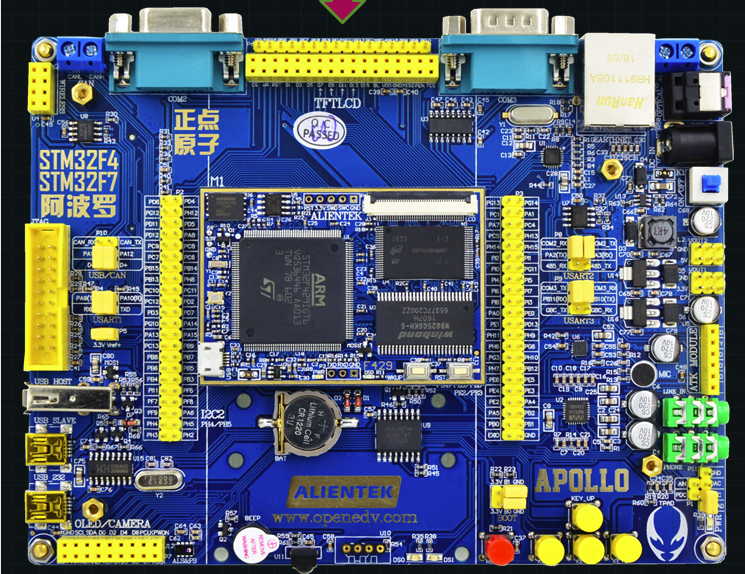

文件系统的移植主要包括下面几个方面：

- 开启 / 配置 DFS 框架
- 开启 / 配置 指定的文件系统
- 确保开发板上的存储设备驱动正常工作

通过 Env 工具可以方便地开启文件系统，将所需的文件系统类型添加到工程中。

对存储设备进行功能测试，可以确保存储设备驱动是正常工作的。驱动程序的稳定工作是文件系统正常使用的基础。

### 配置文件系统

使用 Env 工具进入 `rt-thread\bsp\stm32f429-apollo` 目录，在命令行中输入 `menuconfig` 命令进入配置界面。

在 `menuconfig` 配置界面依次选择 `RT-Thread Components → Device virtual file system`，如下图所示：

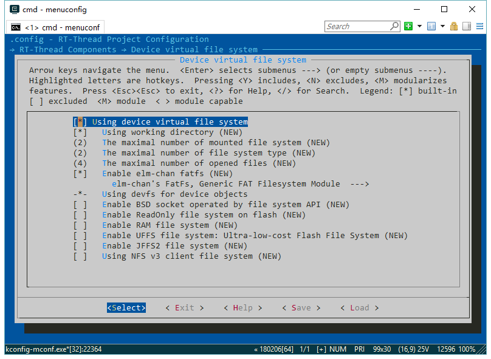

进入到 DFS  的配置界面，开启下图所示的选项，就可以将 `FatFS` 添加到系统中。如图所示：

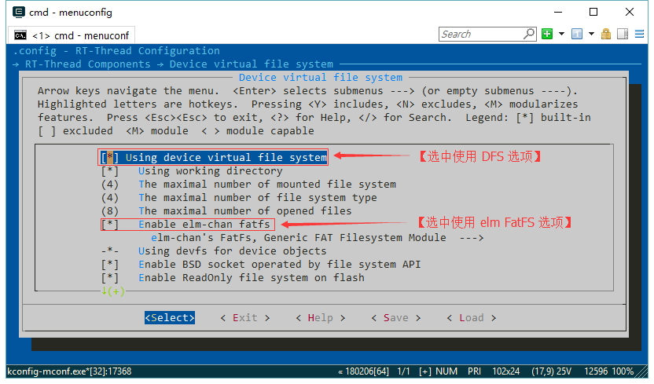

这里需要注意的是还需要进入到 `elm-chan's FatFs, Generic FAT Filesystem Module` 选项中修改关于长文件名支持的选项，否则在后面使用文件系统的过程中，创建的文件或者文件夹的名称不能超过 8 个字符。修改方式如下图所示：

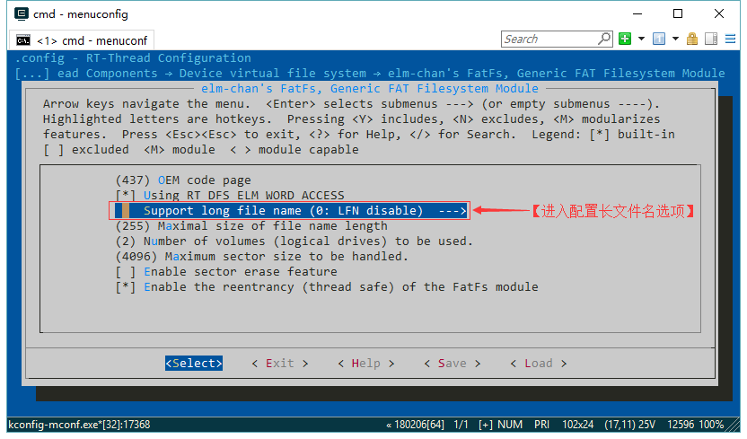

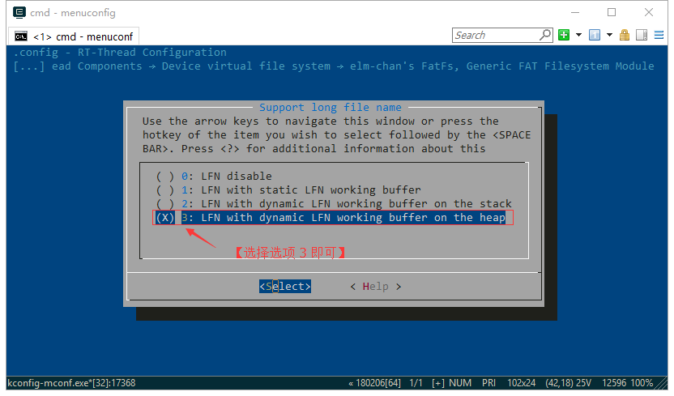

设置文件系统扇区大小，表示可处理的最大字节数，这里设置为 4096 字节。设置的值需要根据存储器件手册确定，不能小于存储器件的最小可擦除扇区。

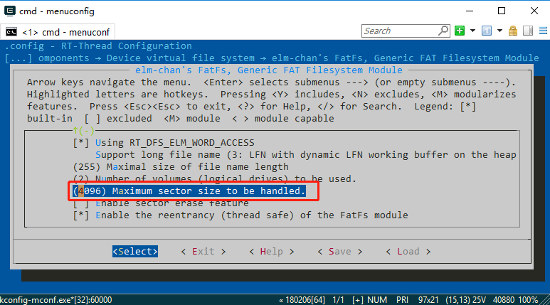

因为要使用一些 C 库函数，所以需要打开 `libc` 功能：

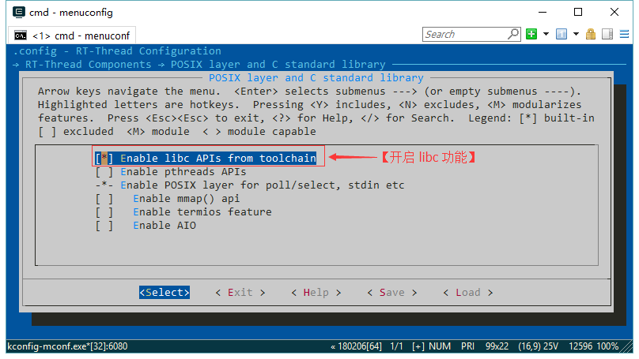

保存选项后即可退出，此时 `elm FatFS` 已经添加到项目中 。

### 存储设备初始化

#### 开启 SPI 设备驱动

DFS 框架的文件系统实现层需要存储设备驱动层提供驱动接口用于对接，本次使用的存储设备为 `SPI Flash`。

重新打开 menuconfig 配置界面，在 `RT-Thread Components → Device Drivers` 界面中选中 `Using SPI Bus/Device device drivers` 以及 `Using Serial Flash Universal Driver` 选项，如下图所示：

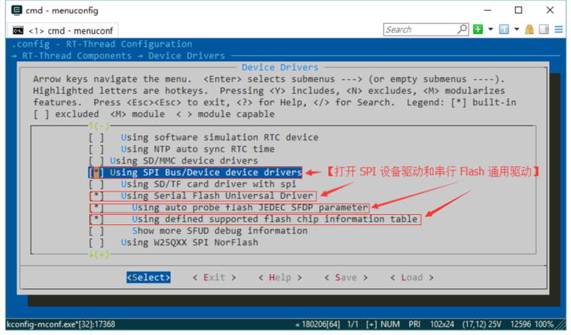

为了方便地使用 shell 命令，我们在 `RT-Thread Components → Command shell` 选项中开启 `Using module shell` 选项，如下图所示：

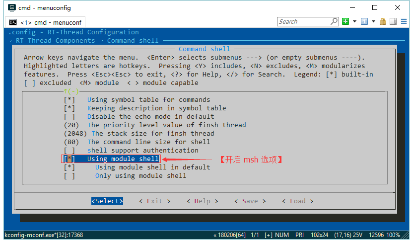

保存选项并退出，在 Env 中输入命令 `scons --target=mdk5 -s` 生成 mdk5 工程，编译并下载程序。

#### 检查存储设备驱动

在 stm32f429-apollo 开发板上 ` SPI Flash`  挂在了 SPI5 总线上，对应的 `SPI Device` 的设备名为 `spi50`。在终端输入 `list_device` 命令可以看到名为 `spi50` 的设备类型为 `SPI Device`，就说明 SPI 设备添加成功。如果没有出现相应的设备，则需要检查驱动程序，查找错误。

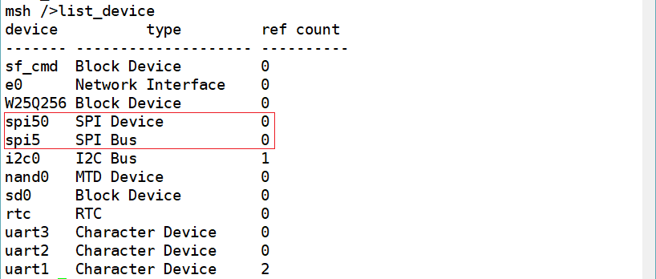

为了确保该驱动工作正常，可以使用 `sf` 命令对该设备做 `benchmark` 测试。该功能由 `sfud` 组件提供，可以通过检查存储设备的读、写和擦除功能来判断存储设备的驱动程序是否正常。 如果像下图一样提示成功，所示则认为该驱动工作正常。如果无法通过测试，则需要检查驱动程序，使用逻辑分析仪对存储设备的接口波形进行分析。测试过程如下图：

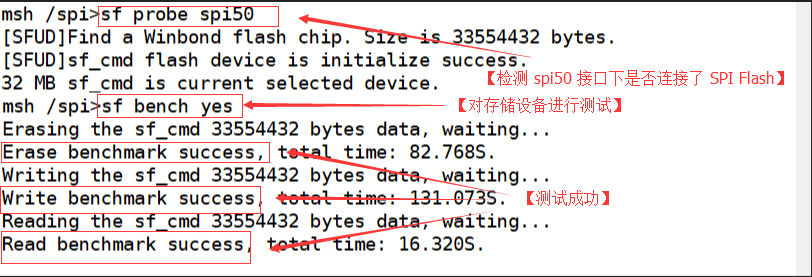

#### 创建存储设备

由于只有块设备类型的设备才能和文件系统对接，所以需要根据 `SPI Device` 找到 `SPI Flash` 设备，并创建与其对应的 `Block Device`。

这里需要使用到万能 SPI Flash 驱动库：[SFUD](https://github.com/armink/SFUD) ，RT-Thread 已经集成了该组件，在上面的配置过程中我们已经开启这个功能。此时只需要使用 SFUD 提供的 `rt_sfud_flash_probe` 函数即可。该函数将执行如下操作：

  - 根据名为 `spi50` 的 `SPI Device` 设备找到对应的 `Flash` 存储设备。

  - 初始化 `Flash` 设备。

  - 在 Flash 存储设备上创建名为 `W25Q256` 的  `Block Device`。

- 如果开启了组件自动初始化功能，该函数会被自动执行，否则需要手动调用运行。

```c
static int rt_hw_spi_flash_with_sfud_init(void)
{
    if (RT_NULL == rt_sfud_flash_probe("W25Q256", "spi50"))
    {
        return RT_ERROR;
    };

    return RT_EOK;
}
INIT_COMPONENT_EXPORT(rt_hw_spi_flash_with_sfud_init)
```

在终端输入 `list_device` 命令如果看到名为 `W25Q256` 的设备类型为 `Block Device`，这说明块设备已经创建成功，如果失败则需要对 `spi50` 设备进行检查。如下图所示：

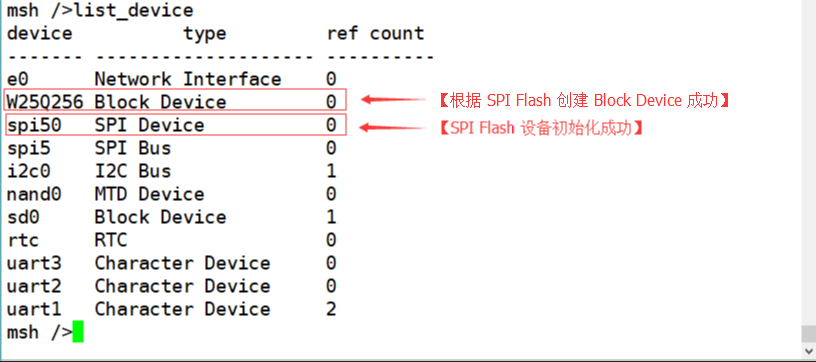

获得可以用于挂载的块类型设备，那么移植的工作就算完成了。

## 文件系统的使用

### 文件系统初始化

RT-Thread 文件系统初始化过程一般按以下流程来进行：

1. 初始化 DFS 框架
2. 初始化具体文件系统
3. 初始化存储设备

下面我们按照这样的顺序来逐步讲解文件系统的初始化过程：

#### DFS 框架的初始化

DFS 框架的初始化主要是对内部数据结构以及资源的初始化。这一过程包括初始化文件系统必须的数据表，以及互斥锁。该功能由如下函数完成。如果开启了组件自动初始化功能，该函数会被自动执行，否则需要手动调用运行。

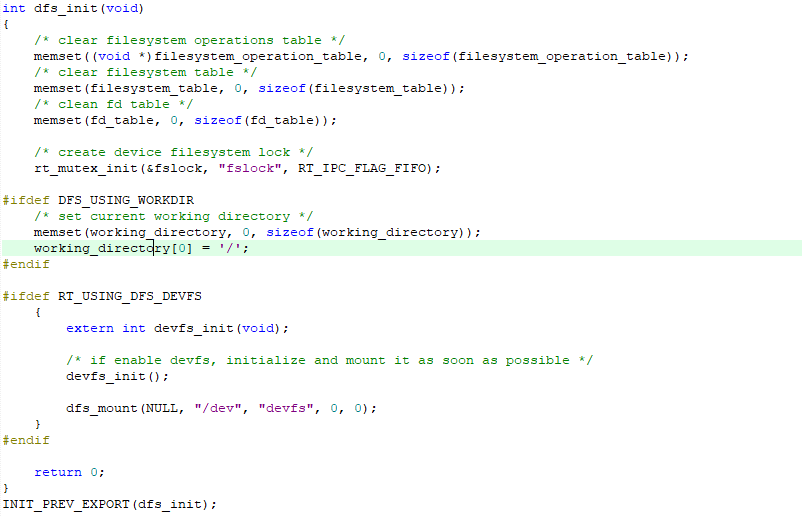

#### 中间层文件系统的初始化

这一步的初始化主要是将 `elm FatFS` 的操作函数注册到 DFS 框架中。该功能由如下函数完成。如果开启了组件自动初始化功能，该函数会被自动执行，否则需要手动调用运行。

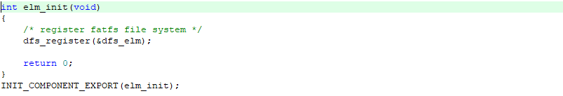

#### 存储设备的初始化

存储设备的初始化可以参考创建存储设备小节。

### 创建文件系统

第一次使用 `SPI Flash` 作为文件系统地存储设备时，如果我们直接重启开发板来挂载文件系统，就会看到 `spi flash mount to /spi failed!` 的提示。这是因为此时在 SPI Flash 中还没有创建相应类型的文件系统，这就用到了创建文件系统 shell 命令：`mkfs`。

`mkfs` 命令的功能是在指定的存储设备上创建指定类型的文件系统。使用格式为：`mkfs [-t type] device` 。第一次挂载文件系统前需要使用 `mkfs` 命令在存储设备上创建相应的文件系统，否则就会挂载失败。如果要在 `W25Q256` 设备上创建 `elm` 类型的文件系统，就可以使用 `mkfs -t elm W25Q256` 命令，使用方法如下图：

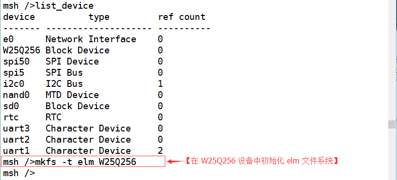

文件系统创建完成后需要重启设备。

### 文件系统的挂载

文件系统的挂载指的是将文件系统和具体的存储设备关联起来，并挂载到某个挂载点，这个挂载点即为这个文件系统的根目录。在下面的示例中，我们将 `elm FatFS` 文件系统和名为 `W25Q256` 的存储设备关联起来，并且挂载到 `/spi` 文件夹中。（这里可以挂载到 `/spi` 文件夹的原因是 `stm32f429-apollo BSP` 的文件系统根目录已经挂载了 `RomFS`，并且已经创建了 `/spi` 文件夹。如果没有特殊情况，文件系统可以直接挂载到根目录 `/` 上。）

挂载文件系统的操作由 `dfs_mount()` 函数完成，`dfs_mount()`  函数的参数分别为：块设备名、文件系统挂载点路径、挂载文件系统类型、读写标志位以及文件系统的私有数据，使用方法如下图所示：

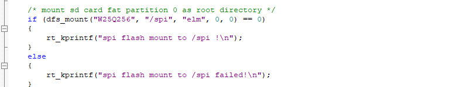

经过了上面的创建文件系统操作，我们重启开发板（会自动重新执行挂载函数），就可以成功地挂载文件系统了。可以看到提示 `spi flash mount to /spi !` 。这时再次使用 `list_device` 命令可以看到 `W25Q256` 设备已经被挂载成功。如下图所示：

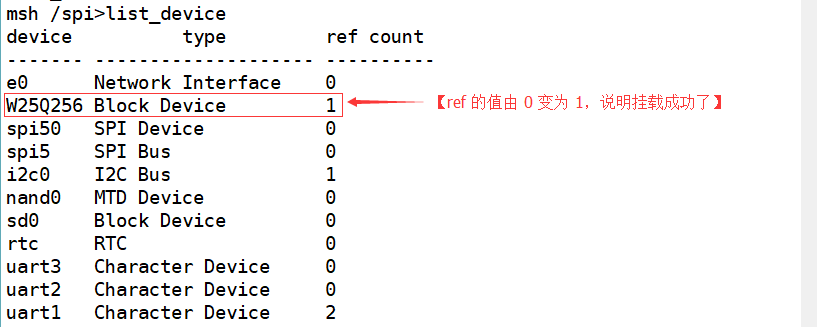

到这一步为止，文件系统已经初始化完成，接下来可以对文件和目录进行操作了。

### FinSH 命令

在这一小节介绍关于文件和目录操作常用的 shell 命令：

使用 `ls` 命令显示文件和目录的信息：

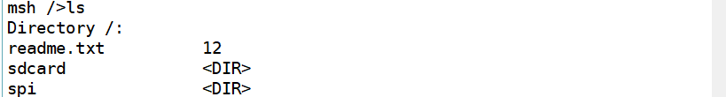

使用 `cd` 命令切换到指定工作目录：


使用 `cp` 命令 copy 文件:

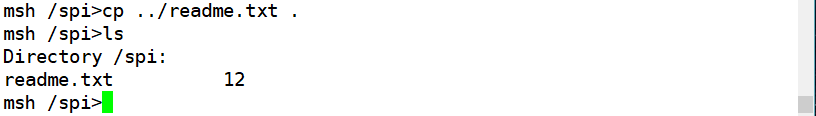

使用 `rm` 命令删除文件或目录:

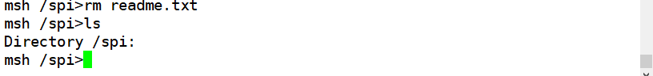

使用 `mv` 命令将文件移动位置或者改名:

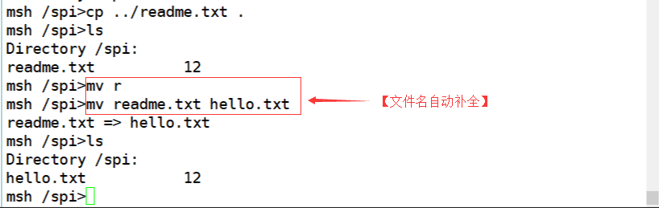

使用 `echo` 命令将指定内容写入文件:

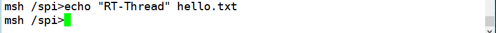

使用 `cat` 命令展示文件的内容:

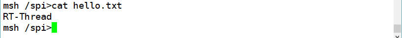

使用 `pwd` 命令打印出当前目录地址:


使用 `mkdir` 命令创建文件夹:


### 文件操作示例

本节以创建文件夹操作为例，介绍如何使用 RT-Thread 文件系统 Sample 来对文件系统进行操作。

- 在 `menuconfig` 配置界面依次选择 `RT-Thread online packages → miscellaneous packages → filesystem sample options`，选中  `[filesystem] mkdir` 选项，如下图所示：

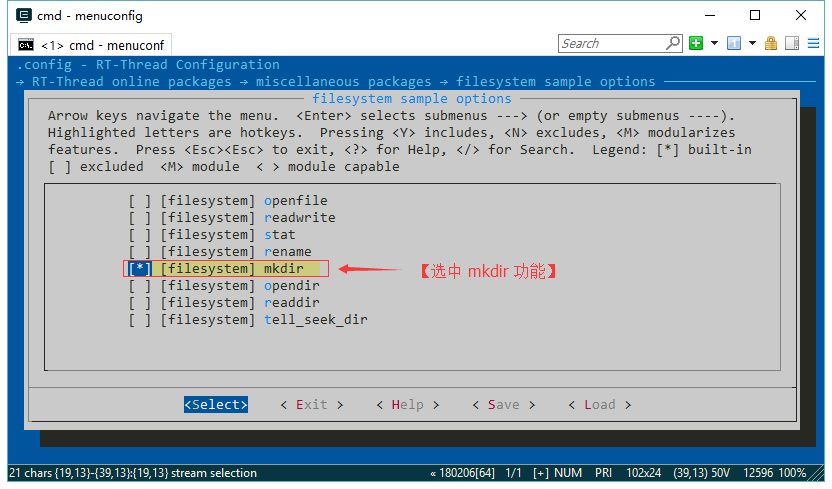

- 保存并退出后，使用 `pkgs --update` 命令更新软件包，然后使用 `scons --target=mdk5 -s` 命令重新生成工程。可以看到该 Sample 已经添加到工程中：

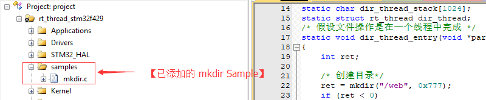

- 这里需要注意的是由于我们文件系统的根目录挂载了 `RomFS`，不可修改，所以我们不能直接在根目录创建文件夹。因此，我们需要对程序进行简单的修改，如下图所示：

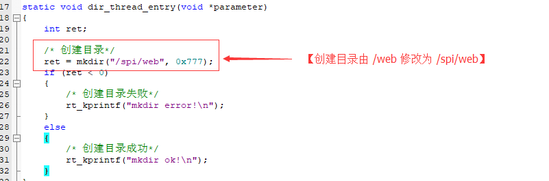

- 重新编译后下载运行，在 msh 中可以使用 `mkdir_sample_init` 命令来创建 web 文件夹，效果如下图所示：


- 此时切换到 `/spi` 文件夹中可以看到 web 文件夹已经被创建。

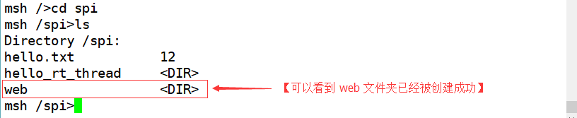

- 文件系统提供的 Sample 还有 `openfile`、`readwrite`、`stat`、`rename`、`opendir`、`readdir` 、`tell_seek_dir`，大家可以用上面的方法来使用这些功能。

## 参考资料

* [《虚拟文件系统》](../../../programming-manual/filesystem/filesystem.md)

* [《Env 用户手册》](../../../programming-manual/env/env.md)
