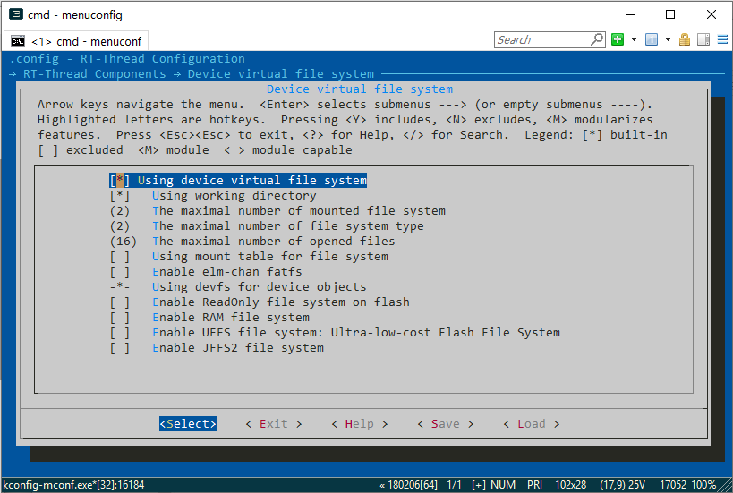

# 在 STM32L4 上应用 littlefs 文件系统

本文介绍了 littlefs 文件系统的基本知识和使用方法，帮助开发者更好地使用 littlefs 文件系统。并给出了基于 FAL 移植的代码示例。

## littlefs 简介

littlefs 是 ARM 官方推出的，专为嵌入式系统设计的文件系统，相比传统的文件系统，littlefs 具有以下优点：

- 自带擦写均衡
- 支持掉电保护
- 占用的 RAM/ROM 少

littlefs 自带的擦写均衡和掉电保护使开发者可以放心的将文件系统挂载到 nor flash 上。

## 名词解释

在 RT-Thread 上使用 littlefs，会依赖一些软件包或者系统组件，下面会对这些需要用到的名词做出解释：

1. DFS 框架

    [DFS 框架](https://www.rt-thread.org/document/site/programming-manual/filesystem/filesystem/) 是 RT-Thread 提供的虚拟文件系统组件，全称为 Device File System，即设备虚拟文件系统。DFS 框架为应用程序提供统一的 POSIX 文件和目录操作接口，如 read、write、poll/select 等。DFS 框架支持多种类型的文件系统，如 FatFS、RomFS、DevFS 等，并提供普通文件、设备文件、网络文件描述符的管理。

1. MTD 设备

    MTD 设备，全称为 Memory Technology Device，使用 MTD 设备为 NOR FLASH 和 NAND FLASH 提供统一接口，将文件系统与底层 FLASH 存储器进行了隔离。

1. fal 组件

    [fal](https://github.com/RT-Thread-packages/fal) 全称为 Flash Abstraction Layer，即 Flash 抽象层，是对 Flash 及基于 Flash 的分区进行管理、操作的抽象层，对上层统一了 Flash 及 分区操作的 API。并提供了将分区创建成 MTD 设备的 API。

1. SFUD 组件

    [SFUD](https://github.com/armink/SFUD) 是一款开源的串行 SPI Flash 通用驱动库。现有市面的大部分串行 Flash，用户只需要提供 SPI 或 QSPI 的读写接口，SFUD 就可以识别并驱动。同时 RT-Thread 提供了 FAL 针对 SFUD 的驱动移植，可以使两个组件无缝连接。

## 层级关系

littlefs 在 RT-Thread 上运行的层级关系图如下所示：


开发者使用的是 DFS 框架提供的统一的 POSIX API,DFS 框架会调用 littlefs 的 API，littlefs 会使用 MTD 设备的读写接口，开发者可以使用 RT-Thread 提供的 fal 组件和 SFUD 组件来完成对 FLASH 的读写任务，也可以自己实现 MTD 设备的驱动程序，使 littlefs 可以挂载到更多的存储介质上。

## littlefs 的移植

社区热心开发者 [geniusgogo](https://github.com/geniusgogo) 为 RT-Thread 移植了 [littlefs](http://packages.rt-thread.org/itemDetail.html?package=littlefs) 的软件包，开发者只需要提供一个 MTD 设备即可使用 littlefs。开发者可以自己实现一个 MTD 设备，也可以利用 RT-Thread 提供的 fal 组件，非常方便的创建出一个 MTD 设备。相比于直接使用 flash 底层函数来自己构造一个 MTD 设备，使用 fal 创建 MTD 设备有以下三个优点：

- 创建 MTD 设备方便
- 驱动的可移植性和可重用性强
- fal 的分区功能可以让 littlefs 只使用指定区域的 flash

fal 的详细介绍可以点击 [此处](https://github.com/RT-Thread-packages/fal) 查看。

本次演示使用 stm32l475-atk-pandora，由于 RT-Thread 有 littlefs 软件包，所以移植工作较为简单。littlefs 的移植主要包括下面几个方面：

- 开启 / 配置 DFS 框架
  - 为应用程序提供统一的 POSIX 文件和目录操作接口
- 使能 littlefs 软件包
- 使能 MTD 设备
  - 默认不开启
- 使能 fal
  - 用来创建 MTD 设备
- 使能外置 flash
  - 会自动启用 SFUD
  - 文件系统的物理载体
- 创建 MTD 设备
- 确保开发板上的存储设备驱动正常工作

### 使能DFS框架

在 BSP 目录 `rt-thread\bsp\stm32\stm32l475-atk-pandora` 下打开 env，输入 menuconfig，在 ` RT-Thread Components → Device virtual file system` 中打开 DFS 框架。



### 配置 littlefs
在 `RT-Thread online packages → system packages → Littlefs: A high-integrity embedded file system` 中打开 littlefs。


### 使能 MTD 设备

在 `RT-Thread Components → Device Drivers` 中使能 MTD 设备。


### 配置 fal

在 `RT-Thread online packages → system packages → fal: Flash Abstraction Layer implement` 中打开 fal。使能 `FAL uses SFUD drivers`，并修改 `FLASH device name` 为 `W25Q128`（SFUD 初始化 FLASH 后创建的设备名）。


### 使能外置 FLASH

在 `Hardware Drivers Config → Onboard Peripheral Drivers` 中使能外置 flash。


### 更新软件包并生成工程

设置完成后，退出配置界面，在 env 中输入 pkgs --update，env 会自动把需要用到的软件包下载下来。然后在 env 中输入 scons --target=mdk5，等待自动生成 mdk5 的工程。

### 检查分区表

打开工程中的 fal_cfg.h，检查宏 `SPI_FLASH_PARTITION` 是否如下所示：

```c
#define SPI_FLASH_PARTITION     {FAL_PART_MAGIC_WROD, "filesystem", "W25Q128", 9 * 1024 * 1024, 16 * 1024 * 1024, 0},
```

默认的 filesystem 分区起始地址是 FLASH 零地址往后偏移 9MB，这是为了兼容 RT-Thread 提供的针对潘多拉开发板的一系列例程。如果开发者需要更大的分区，可以参考 fal 软件包的介绍自行修改，这里不再赘述。

### 创建 MTD 设备并挂载文件系统

fal 组件并没有加入自动初始化的代码，所以我们需要在 main 函数中初始化 fal，并使用 fal 提供的 API 来创建一个 MTD 设备。创建 MTD 设备后，就可以将 littlefs 挂载到刚刚生成的 MTD 设备上了。

在 main.c 文件中添加的代码如下所示:

```c
...
/* 添加 fal 头文件 */
#include <fal.h>
/* 添加文件系统头文件 */
#include <dfs_fs.h>

/* 添加 DEBUG 头文件 */
#define DBG_SECTION_NAME               "main"
#define DBG_LEVEL                      DBG_INFO
#include <rtdbg.h>
/* 定义要使用的分区名字 */
#define FS_PARTITION_NAME              "filesystem"

int main(void)
{
    ...
    struct rt_device *mtd_dev = RT_NULL;

    ...
    /* 初始化 fal */
    fal_init();
    /* 生成 mtd 设备 */
    mtd_dev = fal_mtd_nor_device_create(FS_PARTITION_NAME);
    if (!mtd_dev)
    {
        LOG_E("Can't create a mtd device on '%s' partition.", FS_PARTITION_NAME);
    }
    else
    {
        /* 挂载 littlefs */
        if (dfs_mount(FS_PARTITION_NAME, "/", "lfs", 0, 0) == 0)
        {
            LOG_I("Filesystem initialized!");
        }
        else
        {
            /* 格式化文件系统 */
            dfs_mkfs("lfs", FS_PARTITION_NAME);
            /* 挂载 littlefs */
            if (dfs_mount("filesystem", "/", "lfs", 0, 0) == 0)
            {
                LOG_I("Filesystem initialized!");
            }
            else
            {
                LOG_E("Failed to initialize filesystem!");
            }
        }
    }

    while (1)
    {
        ...
    }

    return RT_EOK;
}

```

### 验证 fal 分区和 MTD 设备

移植工作已经完成，我们需要将代码下载到开发板，检查 fal 分区是否正常，MTD 设备是否创建成功，文件系统有没有挂载成功。将工程编译下载，查看系统启动时是否打印了 fal 分区、 MTD 设备创建成功和文件系统初始化成功的提示信息。

分区表的打印和 MTD 设备创建成功的提示信息如下所示：

```c
 \ | /
- RT -     Thread Operating System
 / | \     4.0.1 build Mar 26 2019
 2006 - 2019 Copyright by rt-thread team
[D/drv.qspi] qspi init succsee!
[SFUD] Find a Winbond flash chip. Size is 16777216 bytes.
[SFUD] W25Q128 flash device is initialize success.
[D/drv.qspi] qspi init succsee!
[D/FAL] (fal_flash_init:61) Flash device |                  W25Q128 | addr: 0x00000000 | len: 0x01000000 | blk_size: 0x00001000 |initialized finish.
[I/FAL] ==================== FAL partition table ====================
[I/FAL] | name       | flash_dev |   offset   |    length  |
[I/FAL] -------------------------------------------------------------
[I/FAL] | filesystem | W25Q128   | 0x00900000 | 0x01000000 |
[I/FAL] =============================================================
[I/FAL] RT-Thread Flash Abstraction Layer (V0.4.0) initialize success.
[I/FAL] The FAL MTD NOR device (filesystem) created successfully
[I/main] Filesystem initialized!
```

## 文件系统的使用

RT-thread 支持的文件系统很多，但是所有的文件系统都对接到 DFS 框架。对于上层应用，DFS 框架提供了统一的 POSIX 文件和目录操作接口。开发者更换文件系统后，可以将原来的代码无缝的移植到新的文件系统上而不需要修改代码。有关文件系统的示例代码可以点击 [此处](https://www.rt-thread.org/document/site/programming-manual/filesystem/filesystem/#dfs_4) 查看。

## FinSH 命令

启用 DFS 框架后，RT-Thread 的 FinSH 控制台就会新添加一些命令，我们可以利用这些命令快速的来验证文件系统是否正常工作。

使用 `ls` 命令查看当前目录信息，运行结果如下所示：

```msh
msh />ls                          # 使用 ls 命令查看文件系统目录信息
Directory /:                      # 可以看到已经存在根目录 /
```

使用 `echo` 命令将输入的字符串输出到指定输出位置，运行结果如下所示：

```msh
msh />echo "hello RT-Thread!!!" hello.txt      # 将字符串出输出到 hello.txt 文件
msh />ls
Directory /:
hello.txt           18
msh />
```

使用 `cat` 命令查看文件内容，运行结果如下所示：

```msh
msh />cat hello.txt                     # 查看 hello.txt 文件的内容并输出
hello RT-Thread!!!
```

## 参考资料

* [《虚拟文件系统》](../../../programming-manual/filesystem/filesystem.md)

* [《Env 用户手册》](../../../programming-manual/env/env.md)

* [《在 STM32F429 上应用文件系统》](./an0012-dfs.md)
