# 使用 QEMU 运行动态模块组件 #

本文描述了在 Windows 平台使用 QEMU 运行 RT-Thread 动态模块及动态库。

## 简介

RT-Thread 动态模块组件 `dlmodule` 提供了动态加载程序模块的机制。dlmodule 组件更多的是一个 ELF 格式加载器，把单独编译的一个 elf 文件的代码段，数据段加载到内存中，并对其中的符号进行解析，绑定到内核导出的 API 地址上。动态模块 elf 文件主要放置于 RT-Thread 下的文件系统上。

RT-Thread 的动态模块组件目前支持两种格式：

* `.mo` 则是编译出来时以 `.mo` 做为后缀名的可执行动态模块。它可以被加载，并且系统中会自动创建一个主线程执行这个动态模块中的 `main` 函数；同时这个 `main(int argc, char** argv)` 函数也可以接受命令行上的参数。
* `.so` 则是编译出来时以 `.so` 做为后缀名的动态库。它可以被加载，并驻留在内存中，并提供一些函数集由其他程序（内核里的代码或动态模块）来使用。

本文准备资料如下：

* [RT-Thread 源码](https://www.rt-thread.org/page/download.html)

* [Env 工具](https://www.rt-thread.org/page/download.html)

* [rtthread-apps](https://github.com/RT-Thread/rtthread-apps)

> [!NOTE]
> 注：动态模块组件部分源代码编译当前只支持 GNU GCC 工具链编译，暂不支持 MDK 或者 IAR。

## 使能动态模块组件

###  配置工程

在 Env 控制台切换到 qemu-vexpress-a9  BSP 根目录，然后输入 `menuconfig` 命令打开配置菜单。

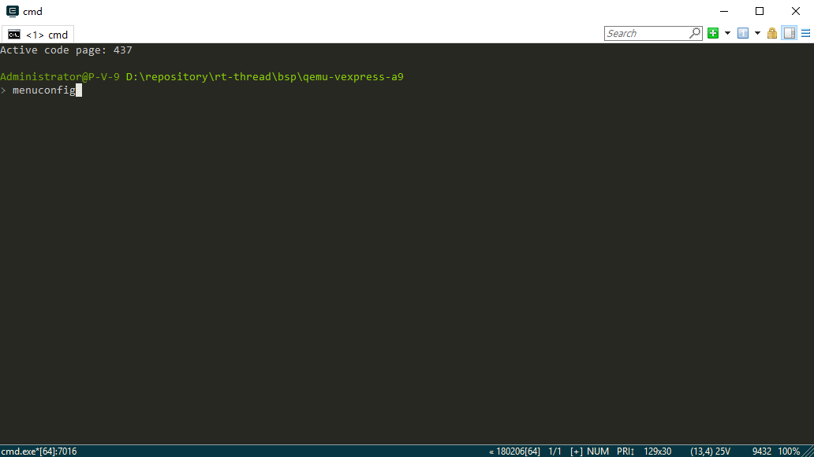

进入“ RT-Thread Components → POSIX layer and C standard library”菜单，按下图箭头所示打开 libc 和动态模块的配置选项。

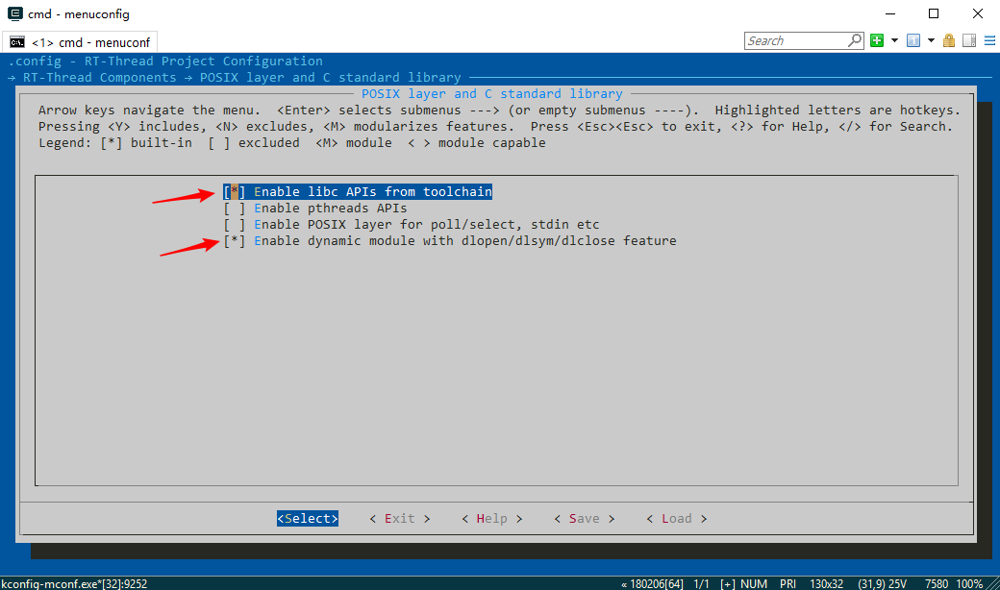

进入“RT-Thread Components → Device virtual file system”菜单打开文件系统的配置选项。退出 menuconfig 并保存配置。

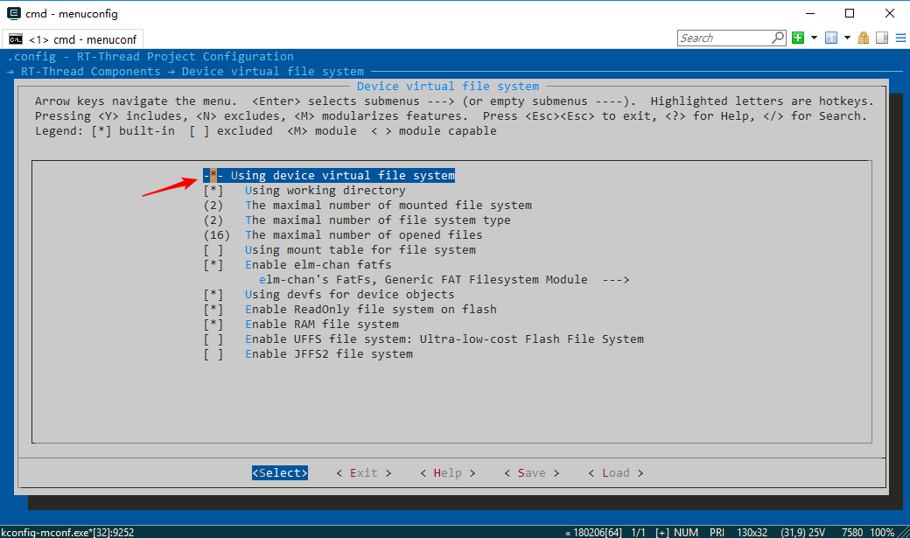

### 编译工程

使用 `scons` 命令编译工程。

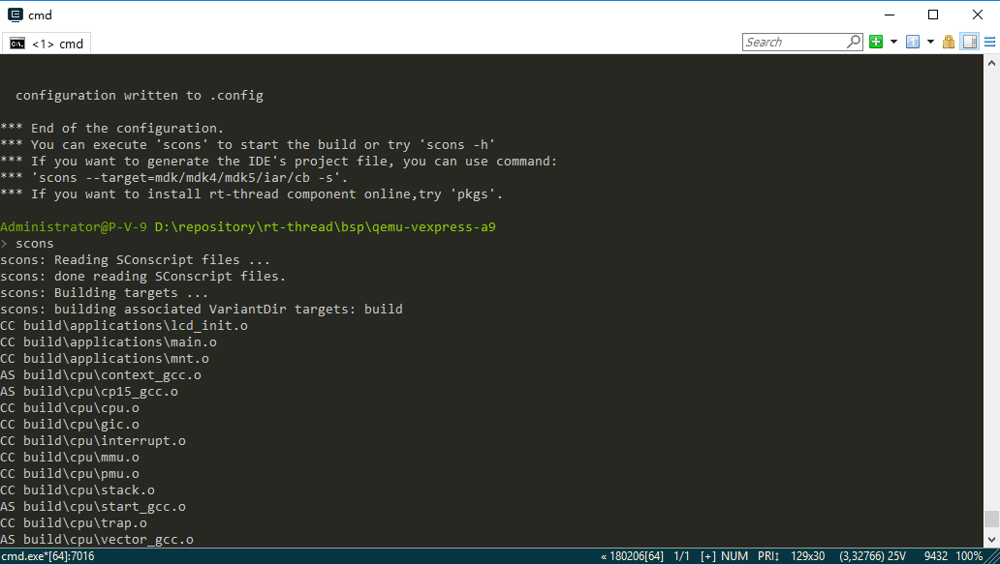

### 运行动态模块命令

编译完成后使用 `qemu.bat` 命令运行工程。按 Tab 键查看所有命令可以看到动态模块的两个命令 `list_module` 和 `list_symbols`，表明动态模块组件配置成功。

* `list_module` 命令可以查看当前正在运行的动态模块。
* `list_symbols` 命令可以查看动态模块可以使用的函数及其对应的内存地址。加载动态模块的时候会对其中的符号进行解析，并绑定到对应的函数地址上。

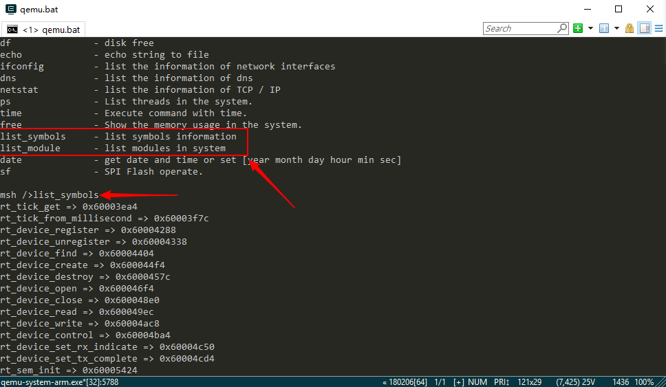

### 生成动态模块编译依赖环境

关闭运行的程序，在 Env 控制台使用 `scons --target=ua -s` 命令生成编译动态模块时需要包括的内核头文件搜索路径及全局宏定义。

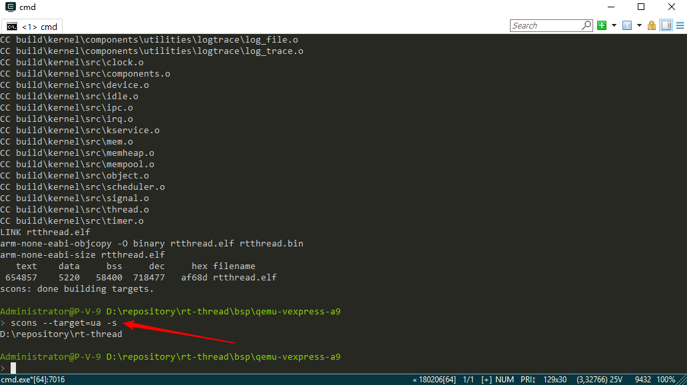

## 运行动态模块

### 运行最简单的动态模块

#### 创建动态模块

##### 获取示例

 下载 RT-Thread 动态模块工具库 [rtthread-apps](https://github.com/RT-Thread/rtthread-apps)，rtthread-apps 的 tools 目录放置了编译动态模块需要使用到的 Python 和 SConscript 脚本。hello 目录下的 main.c 是一个简单的动态模块使用示例，源代码如下所示。

```
#include <stdio.h>

int main(int argc, char *argv[])
{
    printf("Hello, world\n");

    return 0;
}
```

这段代码实现了一个最简单的 main 函数，打印字符串“Hello world”。

##### 设置环境变量

在 Env 控制台切换到 rtthread-apps 根目录（目录所在全路径不包含空格和中文字符），然后通过下面 2 条命令设置环境变量。

* `set RTT_ROOT=d:\repository\rt-thread`，设置 RTT_ROOT 为 RT-Thread 源代码根目录。
* `set BSP_ROOT=d:\repository\rt-thread\bsp\qemu-vexpress-a9`，设置 BSP_ROOT 为 qemu-vexpress-a9  BSP 根目录。

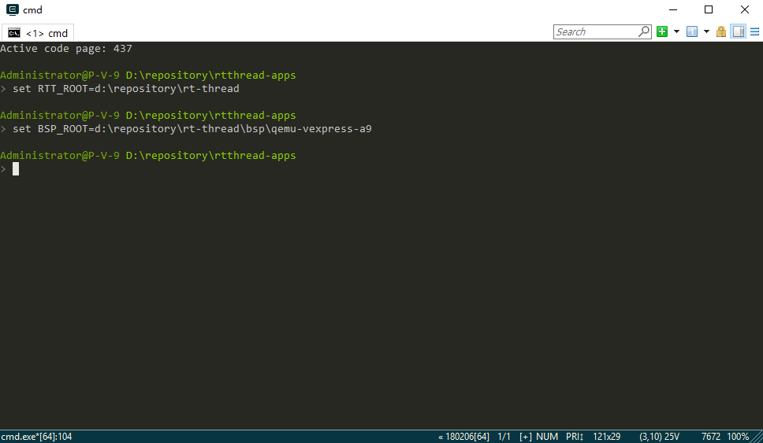

##### 编译动态模块

使用 `scons --app=hello` 命令编译动态模块。

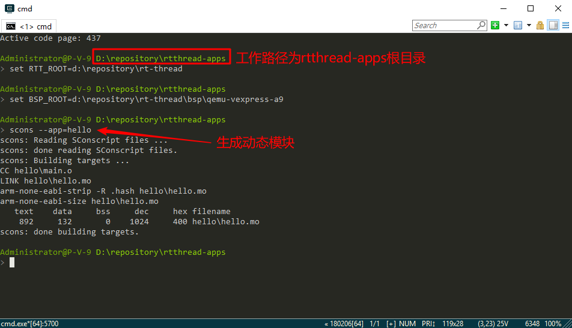

在 rtthread-apps/hello 目录下会生成动态模块文件 hello.mo。

#### 将动态模块放入文件系统

编译好的动态模块 hello.mo 需要放到文件系统下。qemu-vexpress-a9  BSP 会使用一个虚拟的 sd 卡设备 sd.bin，我们需要把动态模块放到这个虚拟的 sd 卡里面。对于物理设备来说，直接将动态模块添加到文件系统管理的存储设备中就可以。这里需要使用到 Env 工具里面的一个小工具 fatdisk，它位于 Env 的 tools 目录下，里面也提供了一份 fatdisk 的使用说明。这里使用 fatdisk 用于把 PC 上本地的一个目录转换成 sd.bin 映像文件，这个映像文件是做为一个 fat 文件系统而存在。

##### 新建目录

在 fatdisk 目录下新建一个 sd 目录，并复制刚刚编译的动态模块 hello.mo 文件到 sd 目录。


##### 修改配置文件

按照下面的配置修改 fatdisk 目录下的配置文件 fatdisk.xml。

* 映像文件空间大小 disk_size 配置为了 5120Kbytes（大小可根据需要配置）。
* 映像文件的扇区大小 sector_size 需要配置为 512 KBytes。
* 要转换目录名 root_dir 配置为 sd，表示当前目录下的 sd 目录。
* 指定生成的映像文件名称 output 配置为 sd.bin。
* strip 需要配置为 0。

```
<?xml version="1.0" encoding="UTF-8"?>
<fatdisk>
   <disk_size>5120</disk_size>
   <sector_size>512</sector_size>
   <root_dir>sd</root_dir>
   <output>sd.bin</output>
   <strip>0</strip>
</fatdisk>
```

##### 生成映像文件

在 Env 控制台切换到 fatdisk 根目录，运行 `fatdisk` 命令则会按照配置文件 fatdisk.xml 中的配置，把里面指定的目录转换成 flash 映像文件。

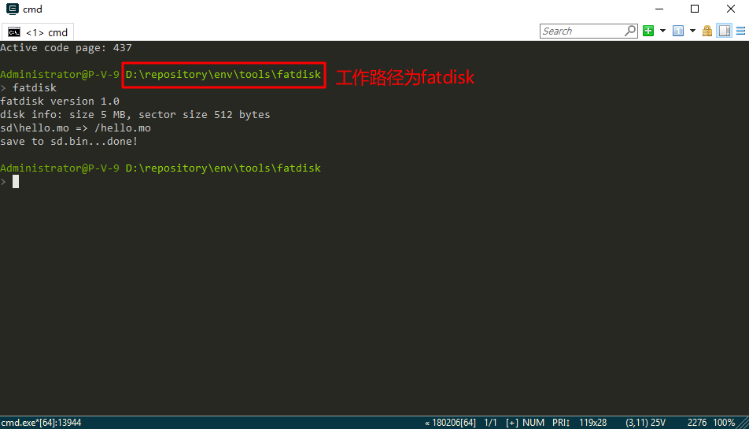

运行成功则会在 fatdisk 目录生成一个 sd.bin 文件，大小为 5MB。

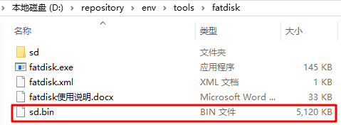

生成的映像文件 sd.bin 需要复制到 qemu-vexpress-a9  BSP 目录。

#### 运行动态模块

在 Env 控制台切换到 qemu-vexpress-a9  BSP 根目录输入 `qemu.bat` 命令运行工程。

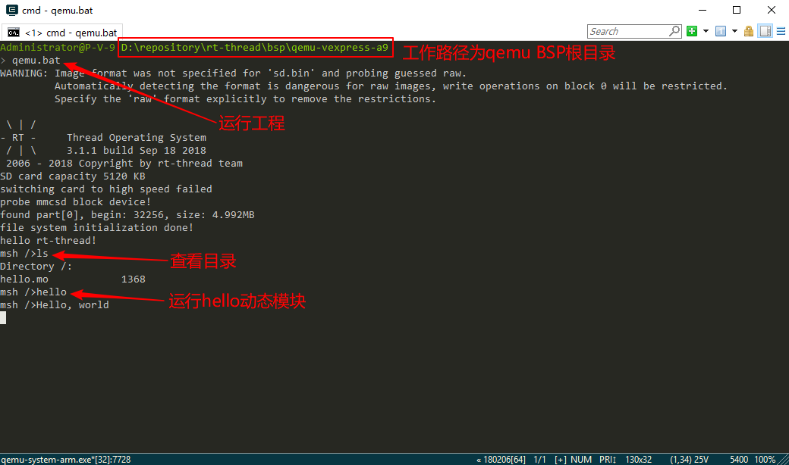

* 系统运行起来后会看到文件系统初始化成功信息 “file system initialization done!”。
* 使用 `ls` 命令可以看到根目录下的动态模块文件 `hello.mo`。
* 输入 `hello` 命令运行动态模块 hello.mo。可以看到动态模块main函数打印的字符串“Hello,world”

使用动态模块组件运行动态模块的主要原理如下图所示：

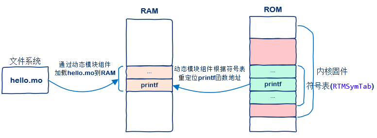

### 动态模块的初始化和清理函数

动态模块组件提供了2个扩展的函数供用户使用，分别是`module_init()`和`module_cleanup()`。

* `module_init()`函数会在动态模块运行前被执行，用户可以根据需要做一些初始化工作。
* `module_cleanup()`函数会在动态模块运行结束后在 idle 线程里回调一次，执行用户设置的清理工作。

RT-Thread 系统会自动创建一个线程执行动态模块中的 main 函数，同时这个 `main(int argc, char* argv[])` 函数也可以接受命令行上的参数。这个线程默认的优先级等同空闲线程的优先级，线程堆栈默认为2048字节。用户可以在`module_init()`函数里修改这个线程的优先级和堆栈。

#### 示例代码

基于前面简单的动态模块示例代码 main.c 增加`module_init()`和`module_cleanup()`函数的使用，示例代码如下所示。

```
#include <stdio.h>
#include <dlmodule.h>

/* 动态模块的初始化函数 */
void module_init(struct rt_dlmodule *module)
{
    module->priority = 8;
    module->stack_size = 4096;

    printf("this is module %s initial function!\n",module->parent.name);
}

/* 动态模块的清理函数 */
void module_cleanup(struct rt_dlmodule *module)
{
    printf("this is module %s cleanup function!\n",module->parent.name);
}

int main(int argc, char *argv[])
{
    int i;

    printf("hello world from RTT::dynamic module!\n");

    /* 打印命令行参数 */
    for(i = 0;i < argc;i ++)
    {
        printf("argv[%d]:%s\n",i,argv[i]);
    }

    return 0;
}
```

示例代码主要实现了如下功能：

* 在动态模块的初始化函数里可以设置这个线程的优先级和堆栈。
* 清理函数简单的打印信息。
* main 函数解析命令行参数并打印出来。

请参考前面小节将此示例代码生成的动态模块文件放到文件系统里，并将生成的映像文件 sd.bin 复制到 qemu-vexpress-a9  BSP 目录。

#### 运行结果

在 Env 控制台切换到 qemu-vexpress-a9  BSP 根目录输入 `qemu.bat` 命令运行工程。

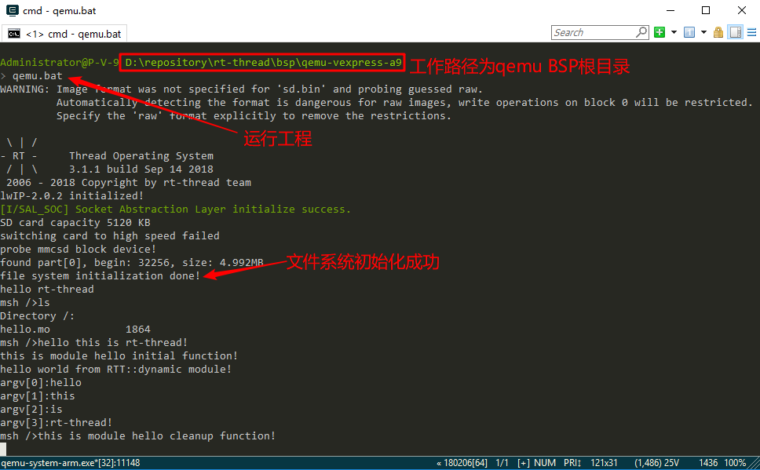

* 系统运行起来后会看到文件系统初始化成功信息 “file system initialization done!”。
* 使用 `ls` 命令可以看到根目录下的动态模块文件 `hello.mo`。
* 输入 `hello this is rt-thread!` 命令运行动态模块 hello.mo。hello 后面的字符串为参数。
* 执行到动态模块初始化函数 `module_init` 时会打印字符串 "this is module hello initial function!"。
* 执行动态模块的 main 函数时会打印字符串 “hello world from RTT::dynamic module!”，命令行参数也依次打印了出来。
* 动态模块运行结束后又执行清理函数 `module_cleanup`，打印字符串 "this is module hello cleanup function!"。

## 运行动态库

### 创建动态库

#### 获取示例

 下载 RT-Thread 动态模块工具库 [rtthread-apps](https://github.com/RT-Thread/rtthread-apps)，rtthread-apps 的 lib 目录下有一个简单的动态库示例的 lib.c，源代码如下所示，它实现了 2 个简单的函数供使用。

```
#include <stdio.h>

int lib_func(void)
{
    printf("hello world from RTT::dynamic library!\n");

    return 0;
}

int add_func(int a, int b)
{
    return (a + b);
}
```

#### 编译动态库

编译动态库之前需要先设置环境变量。然后使用 `scons --lib=lib` 命令编译动态库。

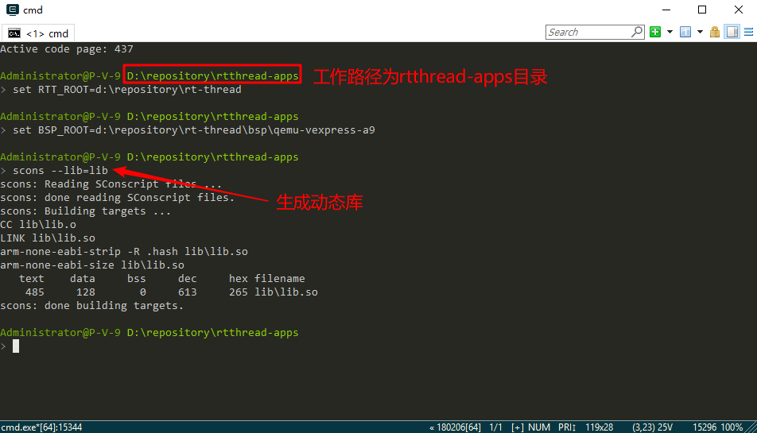

在 rtthread-apps/lib 目录下会生成动态库文件 lib.so。

请参考前面小节将动态库文件 lib.so 放到文件系统里，并将生成的映像文件 sd.bin 复制到 qemu-vexpress-a9  BSP 目录。

### 运行动态库

#### 添加示例代码

将以下示例代码添加到 qemu-vexpress-a9 BSP applications 目录下的 main.c 里。

```
#include <stdio.h>
#include <dlfcn.h>
#include <rtthread.h>

/* 动态库文件路径 */
#define APP_PATH    "/lib.so"

/* 函数指针类型 */
typedef int (*add_func_t)(int, int);
typedef void (*lib_func_t)(void);

int dlmodule_sample(void)
{
    void* handle;
    lib_func_t lib_function;
    add_func_t add_function;
    /* 以RTLD_LAZY模式打开动态库文件，并获取动态库操作句柄 */
    handle = dlopen(APP_PATH,RTLD_LAZY);

    if(!handle)
    {
        printf("dlopen %s failed!\n",APP_PATH);
        return -1;
    }

    /* 根据动态库操作句柄handle，返回动态库函数lib_func()对应的地址 */
    lib_function = (lib_func_t)dlsym(handle,"lib_func");
    if(!lib_function)
    {
        printf("dlsym %p failed!\n",handle);
        return -1;
    }
    /* 运行动态库函数 */
    lib_function();
    /* 根据动态库操作句柄handle，返回动态库函数add_func()对应的地址 */
    add_function = (add_func_t)dlsym(handle,"add_func");
    if(!add_function)
    {
        printf("dlsym %p failed!\n",handle);
        return -1;
    }
    /* 运行动态库函数计算 3+4 并打印结果 */
    printf("add_function result is:%d\n",add_function(3,4));
    /* 运行完毕根据操作句柄handle关闭动态库 */
    dlclose(handle);

    return 0;
}

MSH_CMD_EXPORT(dlmodule_sample, dlmodule sample);

int main(void)
{
    printf("hello rt-thread!\n");

    return 0;
}
```

RT-Thread 动态模块组件也支持 POSIX 标准的 libdl API，此示例代码调用 libdl API 运行动态库。示例代码首先根据动态库的路径打开动态库文件 lib.so，然后获取动态库的 lib_func() 函数的地址并运行此函数。之后获取动态库的 add_func() 函数的地址，并传入参数 3 和 4 运行函数计算结果。最后关闭动态库。

#### 运行动态库

在 Env 控制台切换到 qemu-vexpress-a9  BSP 根目录，输入 `scons` 命令重新编译工程。编译完成后输入 `qemu.bat` 命令运行工程。按 Tab 键可以看到新增的示例代码命令 `dlmodule_Sample`。

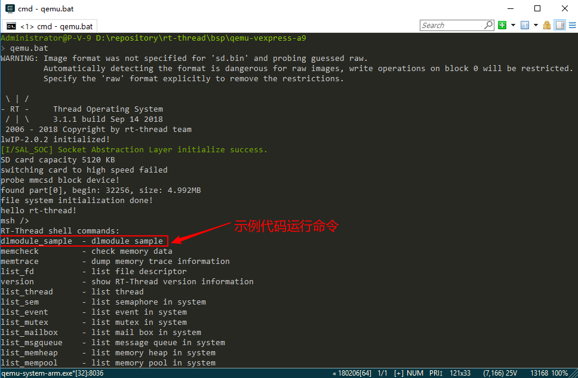

使用 `ls` 命令可以看到根目录下的动态库文件 lib.so，输入 `dlmodule_sample` 命令就可以运行动态库示例代码。

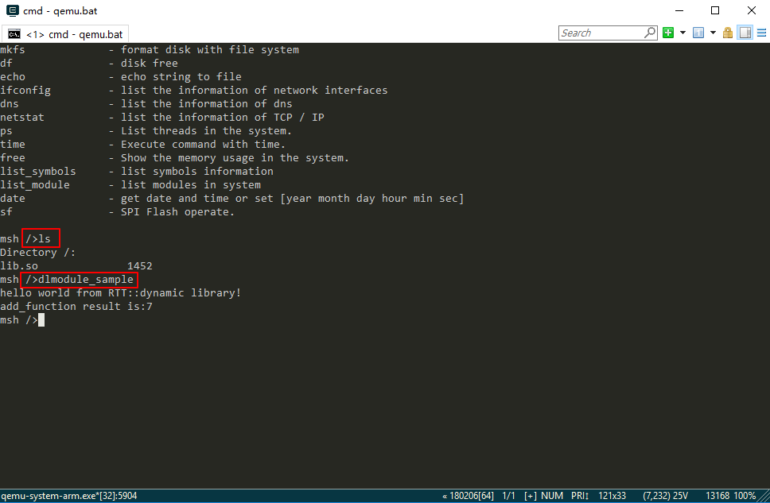

* 第一行运行了 lib_func() 函数打印了字符串 “hello world from RTT::dynamic library!”
* 第二行运行了 add_func() 函数计算了 3+4 并打印了相加结果 7。

## 参考资料

* [《动态模块》](../../../programming-manual/dlmodule/dlmodule.md)

* [《Env 用户手册》](../../../programming-manual/env/env.md)

