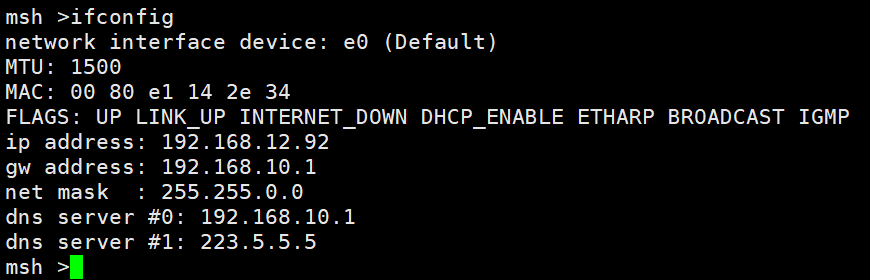

# 网络协议栈驱动移植笔记 #

本文描述了如何在 RT-Thread 中，如何根据具体的硬件配置网络驱动，并灵活运用调试手段解决问题。

## 简介

在 RT-Thread 所支持的 BSP 中，大部分都有支持以太网驱动。但具体到用户的硬件中，可能会和默认的代码有所差异。本文选择相对以太网驱动比较完善的 stm32 BSP，介绍了驱动的主要实现方式，以及针对不同硬件的修改方法。

本文准备资料如下：

* [RT-Thread 源码](https://www.rt-thread.org/page/download.html)

* [Env 工具](https://www.rt-thread.org/page/download.html)

## 以太网相关概念简介

### 常见的以太网芯片种类

以太网芯片有很多种，大致可以分成 3 种：

- 以太网芯片只有 PHY（物理接口收发器 ），需要单片机带 MAC（以太网媒体接入控制器 ），通过 MII 或者 RMII 接口和单片机通讯。例如 LAN8720。
- 以太网芯片带 MAC 和 PHY，通过 SPI 接口和单片机通讯。例如 ENC28J60。
- 以太网芯片带 MAC 和 PHY，通过 SPI 接口和单片机通讯，同时内置硬件协议栈，适合低速单片机。例如 W5500。

### 常见名词解释

[MAC](https://baike.baidu.com/item/MAC/329671)：媒体介入控制层，属于 OSI 模型中数据链路层下层子层 。

[PHY](https://baike.baidu.com/item/PHY)：PHY 指物理层，OSI 的最底层。 一般指与外部信号接口的芯片。

[MII](https://baike.baidu.com/item/MII/16017003)：MII (Media Independent Interface），介质无关接口，也被称为媒体独立接口，它是 IEEE-802.3 定义的以太网行业标准，支持 10Mbit/s 和 100Mbit/s 数据传输模式 。

[RMII](https://baike.baidu.com/item/RMII/8989175)：RMII (Reduced Media Independent Interface) ，简化媒体独立接口，是 IEEE 802.3u 标准中除 MII 接口之外的另一种实现，支持 10Mbit/s 和 100Mbit/s 数据传输模式 。相比 MII，精简了引脚数量。

[lwIP](https://baike.baidu.com/item/lwip)：lwIP 是瑞典计算机科学院 (SICS) 的 Adam Dunkels 开发的一个小型开源的 [TCP/IP](https://baike.baidu.com/item/TCP%2FIP) 协议栈。实现的重点是在保持 TCP 协议主要功能的基础上减少对 RAM 的占用。

pbuf：lwIP 中用来管理数据包的结构体。

## 驱动架构图


RT-Thread 的 lwIP 移植在原版的基础上，添加了网络设备层以替换原来的驱动层。和原来的驱动层不同的是，对于以太网数据的收发采用了独立的双线程结构，erx 线程和 etx 线程在正常情况下，两者的优先级设置成相同，用户可以根据自身实际要求进行微调以侧重接收或发送。

### 数据接收流程


当以太网硬件设备收到网络报文产生中断时，接收到的数据会被存放到接收缓冲区，然后以太网中断程序会发送邮件来唤醒 erx 线程，erx 线程会按照接收到的数据长度来申请 pbuf，并将数据放入 pbuf 的 payload 中，然后将 pbuf 通过邮件发送给 去处理。

### 数据发送流程


当有数据需要发送时，LwIP 会将数据通过邮件发送给 etx 线程，然后永久等待在 tx_ack 信号量上。etx 线程接收到邮件后，通过调用驱动中的 rt_stm32_eth_tx() 函数发送数据，发送完成之后再发送一次 tx_ack 信号量唤醒 LwIP 。

> [!NOTE]
> 注：在一定条件下也可以把 RT-Thread 中加入的 etx/erx 任务移除掉，当移除掉 RX_THREAD 时，需要由其他线程或中断把接收到的 pbuf 数据包提交给 lwIP 主任务，这里不做详细介绍。

## 网络设备介绍

RT-Thread 网络设备继承了标准设备，是由 eth_device 结构体定义的，这里贴出 eth_device 结构体代码提供参考

```
struct eth_device
{
    /* 标准设备 */
    struct rt_device parent;

    /* lwIP 网络接口 */
    struct netif *netif;
    /* 发送应答信号量 */
    struct rt_semaphore tx_ack;

    /* 网络状态标志 */
    rt_uint16_t flags;
    rt_uint8_t  link_changed;
    rt_uint8_t  link_status;

    /* 数据包收发接口 */
    struct pbuf* (*eth_rx)(rt_device_t dev);
    rt_err_t (*eth_tx)(rt_device_t dev, struct pbuf* p);
};
```

本文以太网驱动比较完善 stm32f407 为例进行讲解，除 ST 固件库以外，需要实现以下驱动：

### 标准设备接口

标准设备接口需要提供给 eth_device 结构体中的 parent 元素：

```c
static rt_err_t rt_stm32_eth_init(rt_device_t dev);
static rt_err_t rt_stm32_eth_open(rt_device_t dev, rt_uint16_t oflag);
static rt_err_t rt_stm32_eth_close(rt_device_t dev);
static rt_size_t rt_stm32_eth_read(rt_device_t dev, rt_off_t pos, void* buffer, rt_size_t size);
static rt_size_t rt_stm32_eth_write (rt_device_t dev, rt_off_t pos, const void* buffer, rt_size_t size);
static rt_err_t rt_stm32_eth_control(rt_device_t dev, int cmd, void *args);
```

` rt_stm32_eth_init` 用于初始化 DMA 和 MAC 控制器。

`rt_stm32_eth_open` 用于上层应用打开网络设备，目前未使用到，直接返回 RT_EOK。

`rt_stm32_eth_close` 用于上层应用关闭网络设备，目前未使用到，直接返回 RT_EOK。

`rt_stm32_eth_read` 用于上层应用向底层设备进行直接读写的情况，对于网络设备，每个报文都有固定的格式，所以这个接口目前并未使用，直接返回 0 值。

`rt_stm32_eth_write` 用于上层应用向底层设备进行直接读写的情况，对于网络设备，每个报文都有固定的格式，所以这个接口目前并未使用，直接返回 0 值。

`rt_stm32_eth_control` 用于控制以太网接口设备，目前用于获取以太网接口的 mac 地址。如果需要，也可以通过增加控制字的方式来扩展其他控制功能。

### 数据包收发接口

对应了 eth_device 结构体中的 `eth_rx` 及 `eth_tx` 元素，实现数据包收发功能，如下所示：

```c
rt_err_t rt_stm32_eth_tx(rt_device_t dev, struct pbuf* p);
struct pbuf *rt_stm32_eth_rx(rt_device_t dev);
```

`rt_stm32_eth_tx` 函数被 etx 线程调用，实现了数据发送的功能。这里贴出部分代码片段提供参考:

```c
rt_err_t rt_stm32_eth_tx(rt_device_t dev, struct pbuf *p)
{
    ...

    /* 从 pbuf 复制数据到驱动中的缓冲区 */
    for (q = p; q != NULL; q = q->next)
    {
        /* 获取当前 LWIP 缓冲区中的字节 */
        byteslefttocopy = q->len;
        payloadoffset = 0;

        /* 检查要复制的数据长度是否大于 Tx 缓冲区大小 */
        while ((byteslefttocopy + bufferoffset) > ETH_TX_BUF_SIZE)
        {
            /* 将数据复制到 Tx 缓冲区 */
            memcpy((uint8_t *)((uint8_t *)buffer + bufferoffset), (uint8_t *)((uint8_t *)q->payload + payloadoffset), (ETH_TX_BUF_SIZE - bufferoffset));

            /* 指向下一个描述符 */
            DmaTxDesc = (ETH_DMADescTypeDef *)(DmaTxDesc->Buffer2NextDescAddr);

            buffer = (uint8_t *)(DmaTxDesc->Buffer1Addr);

            byteslefttocopy = byteslefttocopy - (ETH_TX_BUF_SIZE - bufferoffset);
            payloadoffset = payloadoffset + (ETH_TX_BUF_SIZE - bufferoffset);
            framelength = framelength + (ETH_TX_BUF_SIZE - bufferoffset);
            bufferoffset = 0;
        }

        /* 复制剩余的字节 */
        memcpy((uint8_t *)((uint8_t *)buffer + bufferoffset), (uint8_t *)((uint8_t *)q->payload + payloadoffset), byteslefttocopy);
        bufferoffset = bufferoffset + byteslefttocopy;
        framelength = framelength + byteslefttocopy;
    }

    LOG_D("transmit frame lenth :%d", framelength);

    /* 等待锁 */
    while (EthHandle.Lock == HAL_LOCKED);

    /* 发送数据帧 */
    state = HAL_ETH_TransmitFrame(&EthHandle, framelength);
    if (state != HAL_OK)
    {
        LOG_E("eth transmit frame faild: %d", state);
    }

    ret = ERR_OK;

    ...

    return ret;
}
```

`rt_stm32_eth_rx` 函数被 erx 线程调用，实现了接收数据的功能，这里贴出部分代码片段提供参考：

```c
struct pbuf *rt_stm32_eth_rx(rt_device_t dev)
{
    ....

    /* 接收数据帧 */
    state = HAL_ETH_GetReceivedFrame_IT(&EthHandle);
    if (state != HAL_OK)
    {
        LOG_D("receive frame faild");
        return NULL;
    }

    /* 获取数据长度 */
    len = EthHandle.RxFrameInfos.length;
    buffer = (uint8_t *)EthHandle.RxFrameInfos.buffer;

    LOG_D("receive frame len : %d", len);

    if (len> 0)
    {
        /* 分配 pbuf  */
        p = pbuf_alloc(PBUF_RAW, len, PBUF_POOL);
    }

    if (p != NULL)
    {
        dmarxdesc = EthHandle.RxFrameInfos.FSRxDesc;
        bufferoffset = 0;
        for (q = p; q != NULL; q = q->next)
        {
            byteslefttocopy = q->len;
            payloadoffset = 0;

            /* 检查当前 pbuf 中要复制的字节长度是否大于 rx 缓冲区大小 */
            while ((byteslefttocopy + bufferoffset) > ETH_RX_BUF_SIZE)
            {
                /* 将数据复制到 pbuf */
                memcpy((uint8_t *)((uint8_t *)q->payload + payloadoffset), (uint8_t *)((uint8_t *)buffer + bufferoffset), (ETH_RX_BUF_SIZE - bufferoffset));

                /* 指向下一个描述符 */
                dmarxdesc = (ETH_DMADescTypeDef *)(dmarxdesc->Buffer2NextDescAddr);
                buffer = (uint8_t *)(dmarxdesc->Buffer1Addr);

                byteslefttocopy = byteslefttocopy - (ETH_RX_BUF_SIZE - bufferoffset);
                payloadoffset = payloadoffset + (ETH_RX_BUF_SIZE - bufferoffset);
                bufferoffset = 0;
            }
            /* 复制剩余数据 */
            memcpy((uint8_t *)((uint8_t *)q->payload + payloadoffset), (uint8_t *)((uint8_t *)buffer + bufferoffset), byteslefttocopy);
            bufferoffset = bufferoffset + byteslefttocopy;
        }
    }

    ...

    return p;
}
```

### 驱动初始化

```c
void rt_hw_stm32_eth_init(void);
```

`rt_hw_stm32_eth_init` 用于注册以太网设备，以太网硬件，配置 MAC 地址等。

## 使能 lwIP 与 net dev

首先使能以太网外设：


启用 lwIP 与 net device：


- 输入命令 scons --target=mdk5 -s 生成 mdk5 工程。
- 打开工程，打开 drv_eth.c 文件。

## 驱动移植

STM32F407 芯片自带以太网模块，该模块包括带专用 DMA 控制器的 MAC 802.3（介质访问控制）控制器，支持介质独立接口 (MII) 和简化介质独立接口 (RMII)，并自带了一个用于外部 PHY 通信的 SMI 接口，通过一组配置寄存器，用户可以为 MAC 控制器和 DMA 控制器选择所需模式和功能。

因为同系列 stm32 的 MAC 控制器初始化基本一样，所以同系列的驱动 MAC 部分的代码不需要做修改，要修改的只是 PHY 的部分，这里以 LAN8720 为例讲解。

### 开启日志

在调试驱动时，建议先打开 drv_eth.c 中的日志功能。

```c
/* debug 设置 */
#define ETH_DEBUG
#define ETH_RX_DUMP
#define ETH_TX_DUMP
```

### 更新 PHY 复位引脚

查看原理图，RESET 引脚为 PD3，修改复位管脚为 PD3。


```c
static rt_err_t rt_stm32_eth_init(rt_device_t dev)
{
    ...
    phy_reset();
    ....
}
```


在 `rt_hw_stm32_eth_init` 函数中，使用 phy_reset() 对 PHY 芯片进行了复位。如果不修改为正确的引脚，除了 PHY 可能没有被正确复位外，还可能造成引脚冲突而损坏板子。

> 注：phy_reset.c 是移植文件，一般会位于 board/ports 文件夹下。如果 BSP 中没有，则需要自己实现。

### 确认 MII/RMII 模式

根据原理图，确认外接的 PHY 是使用 MII 还是 RMII 模式。


修改 drv_eth.c 中的模式设置：

- RMII 模式: ETH_MEDIA_INTERFACE_RMII
- MII 模式: ETH_MEDIA_INTERFACE_MII

```c
static rt_err_t rt_stm32_eth_init(rt_device_t dev)
{
    ...
    EthHandle.Init.MediaInterface = ETH_MEDIA_INTERFACE_RMII;
    ...
}
```

### 引脚初始化

下面列出正点原子探索者用于连接外部 PHY 的引脚, 用户需要按照自己的原理图对相应的管脚进行初始化。STM32 可以直接在 CubeMX 中进行引脚配置，然后生成代码。以下是生成的初始化代码，该函数最终被 rt_stm32_eth_init() 所调用。

```c
/* stm32f4xx_hal_msp.c  */

void HAL_ETH_MspInit(ETH_HandleTypeDef* heth)
{

  GPIO_InitTypeDef GPIO_InitStruct = {0};
  if(heth->Instance==ETH)
  {
  /* USER CODE BEGIN ETH_MspInit 0 */

  /* USER CODE END ETH_MspInit 0 */
    /* Peripheral clock enable */
    __HAL_RCC_ETH_CLK_ENABLE();

    __HAL_RCC_GPIOC_CLK_ENABLE();
    __HAL_RCC_GPIOA_CLK_ENABLE();
    __HAL_RCC_GPIOG_CLK_ENABLE();
    /**ETH GPIO Configuration
    PC1     ------> ETH_MDC
    PA1     ------> ETH_REF_CLK
    PA2     ------> ETH_MDIO
    PA7     ------> ETH_CRS_DV
    PC4     ------> ETH_RXD0
    PC5     ------> ETH_RXD1
    PG11     ------> ETH_TX_EN
    PG13     ------> ETH_TXD0
    PG14     ------> ETH_TXD1
    */
    GPIO_InitStruct.Pin = GPIO_PIN_1|GPIO_PIN_4|GPIO_PIN_5;
    GPIO_InitStruct.Mode = GPIO_MODE_AF_PP;
    GPIO_InitStruct.Pull = GPIO_NOPULL;
    GPIO_InitStruct.Speed = GPIO_SPEED_FREQ_VERY_HIGH;
    GPIO_InitStruct.Alternate = GPIO_AF11_ETH;
    HAL_GPIO_Init(GPIOC, &GPIO_InitStruct);

    GPIO_InitStruct.Pin = GPIO_PIN_1|GPIO_PIN_2|GPIO_PIN_7;
    GPIO_InitStruct.Mode = GPIO_MODE_AF_PP;
    GPIO_InitStruct.Pull = GPIO_NOPULL;
    GPIO_InitStruct.Speed = GPIO_SPEED_FREQ_VERY_HIGH;
    GPIO_InitStruct.Alternate = GPIO_AF11_ETH;
    HAL_GPIO_Init(GPIOA, &GPIO_InitStruct);

    GPIO_InitStruct.Pin = GPIO_PIN_11|GPIO_PIN_13|GPIO_PIN_14;
    GPIO_InitStruct.Mode = GPIO_MODE_AF_PP;
    GPIO_InitStruct.Pull = GPIO_NOPULL;
    GPIO_InitStruct.Speed = GPIO_SPEED_FREQ_VERY_HIGH;
    GPIO_InitStruct.Alternate = GPIO_AF11_ETH;
    HAL_GPIO_Init(GPIOG, &GPIO_InitStruct);

  /* USER CODE BEGIN ETH_MspInit 1 */

  /* USER CODE END ETH_MspInit 1 */
  }

}
```
### 更新 PHY 管理程序

PHY 是 IEEE802.3 中定义的一个标准模块。PHY 寄存器的地址空间为 5 位，因此寄存器范围是 0 到 31 ，最多有 32 个寄存器。IEEE802.3 定义了地址为 0-15 这 16 个基础寄存器的功能，因此只需要修改少量寄存器的定义即可完成移植。

驱动默认使用 LAN8720，如果使用的是其它型号的 PHY，应该修改 rtconfig.h 中的宏定义（在 drv_eth.h 中有多个 PHY 的宏定义），使程序能正确设置自动协商并读取 PHY 的连接状态和速率。

```c
/* drv_eth.h */

#ifdef PHY_USING_LAN8720A
#define PHY_INTERRUPT_FLAG_REG      0x1DU
#define PHY_INTERRUPT_MSAK_REG      0x1EU
...
#endif /* PHY_USING_LAN8720A */

#ifdef PHY_USING_DM9161CEP
#define PHY_Status_REG              0x11U
#define PHY_10M_MASK                ((1<<12) || (1<<13))
#define PHY_100M_MASK               ((1<<14) || (1<<15))
...
#endif /* PHY_USING_DM9161CEP */
```

RT-Thread 的驱动实现中，做了 PHY 地址搜索的功能，可以正确搜索出 PHY 的地址，所以不必定义 PHY 地址。

这里贴出 drv_eth.c 文件中 `phy_monitor_thread_entry` 函数中的地址搜索函数供用户参考：

```c
static void phy_monitor_thread_entry(void *parameter)
{
    uint8_t phy_addr = 0xFF;
    uint8_t detected_count = 0;

    while(phy_addr == 0xFF)
    {
        /* 搜索 PHY */
        rt_uint32_t i, temp;
        for (i = 0; i <= 0x1F; i++)
        {
            EthHandle.Init.PhyAddress = i;
            HAL_ETH_ReadPHYRegister(&EthHandle, PHY_ID1_REG, (uint32_t *)&temp);

            if (temp != 0xFFFF && temp != 0x00)
            {
                phy_addr = i;
                break;
            }
        }

        detected_count++;
        rt_thread_mdelay(1000);

        if (detected_count> 10)
        {
            LOG_E("No PHY device was detected, please check hardware!");
        }
    }

    LOG_D("Found a phy, address:0x%02X", phy_addr);
    ...
}
```

如果提示 `No PHY device was detected, please check hardware!`  或者 `link_down` 则应该检查 IO 配置和硬件。

> 提示：现在主流的 PHY 一般在复位后都默认工作在自动协商模式下，且现在的交换机和网线，一般都可以支持支持 100M 全双工。所以在末正确适配 PHY 以前，也可以临时修改 PHY 的工作模式为 100M 全双工供测试用（修改基础控制寄存器中相应的控制位）。

### 中断回调函数

接收回调函数：中断函数在接收到数据时，会调用回调函数发邮件来通知 “erx” 线程来读取数据。

```c
void HAL_ETH_RxCpltCallback(ETH_HandleTypeDef *heth)
{
    rt_err_t result;
    /* 发送邮件通知 erx 线程 */
    result = eth_device_ready(&(stm32_eth_device.parent));
    if (result != RT_EOK)
        LOG_I("RxCpltCallback err = %d", result);
}
```

### ETH 设备初始化

RT-Thread 实时操作系统提供了一套设备管理框架 ，应用程序通过 RT-Thread 的设备操作接口实现通用的设备驱动。 我们这里对 ETH 设备，实现 `Network Interface` 类型的设备驱动，然后注册到 RT-Thread。

drv_eth.c 中的 `rt_hw_stm32_eth_init` 是 ETH 设备初始化入口，负责 stm32_eth_device 结构体的初始化，并将其注册到 RT-Thread。

```c
    /* 设置工作速度和模式 */
    stm32_eth_device.ETH_Speed = ETH_Speed_100M;
    stm32_eth_device.ETH_Mode  = ETH_Mode_FullDuplex;

    /* 利用 STM32 全球唯一 ID 设置 MAC 地址 */
    stm32_eth_device.dev_addr[0] = 0x00;
    stm32_eth_device.dev_addr[1] = 0x80;
    stm32_eth_device.dev_addr[2] = 0xE1;
    stm32_eth_device.dev_addr[3] = *(rt_uint8_t*)(0x1FFF7A10+4);
    stm32_eth_device.dev_addr[4] = *(rt_uint8_t*)(0x1FFF7A10+2);
    stm32_eth_device.dev_addr[5] = *(rt_uint8_t*)(0x1FFF7A10+0);

    /* 设置标准驱动接口 */
    stm32_eth_device.parent.parent.init       = rt_stm32_eth_init;
    stm32_eth_device.parent.parent.open       = rt_stm32_eth_open;
    stm32_eth_device.parent.parent.close      = rt_stm32_eth_close;
    stm32_eth_device.parent.parent.read       = rt_stm32_eth_read;
    stm32_eth_device.parent.parent.write      = rt_stm32_eth_write;
    stm32_eth_device.parent.parent.control    = rt_stm32_eth_control;
    stm32_eth_device.parent.parent.user_data  = RT_NULL;

    /* 设置网络驱动接收和发送接口 */
    stm32_eth_device.parent.eth_rx     = rt_stm32_eth_rx;
    stm32_eth_device.parent.eth_tx     = rt_stm32_eth_tx;

    /* 注册网络设备 */
    state = eth_device_init(&(stm32_eth_device.parent), "e0");
```

#### 设置标准驱动接口

##### rt_stm32_eth_init()

`rt_stm32_eth_init` 是初始化以太网外设的，应按照实际需求初始化。

这里只贴出 MAC 配置和 DMA 配置的代码：

```c
/* EMAC initialization function */
static rt_err_t rt_stm32_eth_init(rt_device_t dev)
{
    __HAL_RCC_ETH_CLK_ENABLE();

    /* 复位 PHY 芯片 */
    phy_reset();

    /* ETHERNET 配置 */
    EthHandle.Instance = ETH;
    EthHandle.Init.MACAddr = (rt_uint8_t *)&stm32_eth_device.dev_addr[0];
    EthHandle.Init.AutoNegotiation = ETH_AUTONEGOTIATION_DISABLE;
    EthHandle.Init.Speed = ETH_SPEED_100M;
    EthHandle.Init.DuplexMode = ETH_MODE_FULLDUPLEX;
    EthHandle.Init.MediaInterface = ETH_MEDIA_INTERFACE_RMII;
    EthHandle.Init.RxMode = ETH_RXINTERRUPT_MODE;
#ifdef RT_LWIP_USING_HW_CHECKSUM
    EthHandle.Init.ChecksumMode = ETH_CHECKSUM_BY_HARDWARE;
#else
    EthHandle.Init.ChecksumMode = ETH_CHECKSUM_BY_SOFTWARE;
#endif

    HAL_ETH_DeInit(&EthHandle);

    /* configure ethernet peripheral (GPIOs, clocks, MAC, DMA) */
    if (HAL_ETH_Init(&EthHandle) != HAL_OK)
    {
        LOG_E("eth hardware init failed");
        return -RT_ERROR;
    }
    else
    {
        LOG_D("eth hardware init success");
    }

    /* Initialize Tx Descriptors list: Chain Mode */
    HAL_ETH_DMATxDescListInit(&EthHandle, DMATxDscrTab, Tx_Buff, ETH_TXBUFNB);

    /* Initialize Rx Descriptors list: Chain Mode  */
    HAL_ETH_DMARxDescListInit(&EthHandle, DMARxDscrTab, Rx_Buff, ETH_RXBUFNB);

    /* ETH interrupt Init */
    HAL_NVIC_SetPriority(ETH_IRQn, 0x07, 0);
    HAL_NVIC_EnableIRQ(ETH_IRQn);

    /* Enable MAC and DMA transmission and reception */
    if (HAL_ETH_Start(&EthHandle) == HAL_OK)
    {
        LOG_D("emac hardware start");
    }
    else
    {
        LOG_E("emac hardware start faild");
        return -RT_ERROR;
    }

    return RT_EOK;
}
```

##### rt_stm32_eth_control()

`rt_stm32_eth_control` 函数需要实现获取 MAC 地址的功能

```c
static rt_err_t rt_stm32_eth_control(rt_device_t dev, int cmd, void *args)
{
    switch (cmd)
    {
    case NIOCTL_GADDR:
        /* 获取 MAC 地址 */
        if (args) rt_memcpy(args, stm32_eth_device.dev_addr, 6);
        else return -RT_ERROR;
        break;

    default :
        break;
    }

    return RT_EOK;
}
```

别的设置标准驱动接口可以不实现，先写个空函数即可。

#### 数据包收发接口

##### rt_stm32_eth_rx()

`rt_stm32_eth_rx` 会去读取接收缓冲区中的数据，并放入 pbuf（lwIP 中利用结构体 pbuf 来管理数据包 ）中，并返回 pbuf 指针。

“erx” 接收线程会阻塞在获取 `eth_rx_thread_mb` 邮箱上，当它接收到邮件时，会调用 `rt_stm32_eth_rx` 去接收数据。

##### rt_stm32_eth_tx()

`rt_stm32_eth_tx` 会将要发送的数据放入发送缓冲区，等待 DMA 来发送数据。

“etx” 发送线程会阻塞在获取 `eth_tx_thread_mb` 邮箱上, 当它接收到邮件时，会调用 `rt_stm32_eth_tx` 来发送数据。

## EMAC 驱动调试

### 实验环境搭建

工程默认启用了 DHCP 功能，需要有 DHCP 服务器来分配 IP 地址，常见的连接拓展如图：


如果没有方便的实际环境，也可以先通过 ENV 配置固定 IP，然后用网线直接连接到调试用的电脑。


电脑和开发板需要设置同网段的 IP 地址。

### 确认 PHY 连接状态

当支持网络的固件在开发板上面运行起来后，应该首先检查 RJ45 指示灯的状态。

正常应该是有灯常亮，且有数据收发时会出现闪烁。

如果发现灯没有亮，请先确认开发板硬件是否完好；然后检查供电是否充足，网线是否接好。

然后程序上配合硬件确认是否有正确复位 PHY，直到正常闪烁为止。

### 确认 IP 地址

在 shell 命令行执行 `ifconfig` 命令即可查看网卡的 IP 地址。

如果启用了 DHCP 功能，且此时显示已经获取到了 IP 地址，说明驱动的收发功能都已经正常。

如果是静态 IP 或是没有获取到 IP，请留意网卡 FLAG 中的 UP 和 LINK_UP 标志。
如果显示有 LINK_DOWN，请确认 PHY 的管理程序有正确识别到 PHY 的速率和双工状态。
并正确通过 `eth_device_linkchange` 通知到 lwIP。

如果启用了 DHCP 功能，且已经显示 LINK_UP。但没能正确获取到 IP。
说明开发板与 DHCP 服务器通信不畅，需要进一步调试。



可以通过拔插网线观察 LINK 状态来判断是否正确读取了 PHY 寄存器的值。

### 打印数据包

通过打开驱动中的 ETH_RX_DUMP 和 ETH_TX_DUMP 功能。
可以把收发的数据包打印出来。


当 RJ45 指示灯正常闪烁时，说明有数据包在收发。
因为网络中经常会有广播数据包，如果此时有数据包进来，会有 RX_DUMP 的打印。
如果一直没有打印，则重点检查两点：

* MII/RMII 的 RX 线路有问题，包括硬件问题或 IO 映射错误。

* EMAC 和 PHY 的速率和双工模式不配置，如 EMAC 工作在 10M，而 PHY 连接为 100M。

需要确认有正确获取 PHY 的速率和双工模式，同时可以与网线另外一端对比。
如电脑上在显示 10M，而板子上面没有更新 PHY 管理程序，默认为 100M。

如果有必要，也可以打印 PHY 的 LOOPBACK 功能。以确认 MII/RMII 总线是完好的。

### ping 测试

可以通过电脑 ping 板子或者板子 ping 电脑（需要开启 [netutils](https://github.com/RT-Thread-packages/netutils) 组件包中的 ping 功能）来测试驱动是否移植成功。


> [!NOTE]
> 注：- 部分 PHY 芯片需要按照手册进行额外的初始化。
    - 板子和电脑要在一个网段内。
    - 如果电脑同时连着网线和 wifi，会出现 ping 不通板子的现象。
    - 查看防火墙是否禁用了 ping 功能。
    - 有些企业网络会禁止 ping 功能，建议更换网络环境。
    - MAC 地址不规范，板子无法 ping 通外部网络。
    - 如果 erx 栈大小设置的太小，会造成 erx 线程栈溢出 。

### wireshark 抓包

如果板子有 RX DUMP，但依然无法通信时，可以在电脑上面使用 [wireshark](https://www.wireshark.org/) 抓包。

电脑 ping 开发板，开发板收到目标地址为自己的 IP 地址的请求包 (request)，然后，板子会给电脑做出回应，发送一个目标地址为电脑 IP 地址的回应包 (reply)。

根据是否有回应 (reply)，可以分两种情况检查

- 板子是否收到了请求包 (request)。
- 板子是否有发送回应 (reply)。

如果有回应，但是 ping 不成功，可以检查数据包内容是否符合规范。

#### 按 MAC 地址过滤

当板子有发出广播包，在电脑上面可以收到。（如 DHCP Discoverer）

在使用 wireshark 抓包过程中，主要是灵活使用各种过滤器，过滤出我们所关心的数据包。

当开发板还没有拿到 IP 地址时，可以使用开发板的 MAC 地址作为过滤器条件。


当开发板成功 link_up 时，会主动发出 DHCP 请求包，源地址就是开发板自己的 MAC 地址。

#### 按 IP 地址过滤


或配置开发板为静态 IP，然后 PC 上面执行 ping 命令，ping 开发板的 IP 地址。

这里把开发板的 IP 地址作为过滤条件，正常情况下，PC 会先发出请求包 (request)。

## 参考资料

* [《Env 用户手册》](../../../programming-manual/env/env.md)
