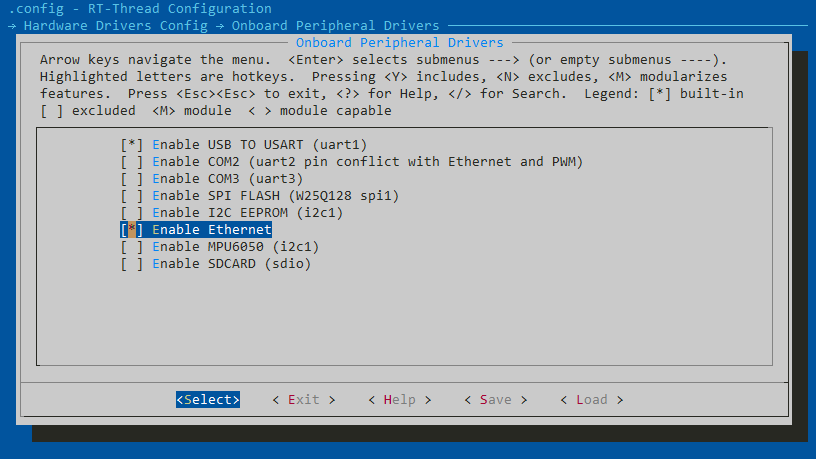

# 在 STM32F407 上应用网络功能

本文描述了如何在 RT-Thread 中利用标准 BSD Socket API 来开发网络应用。并给出了在正点原子 STM32F4 探索者开发板上运行 NTP（通过网络获取时间）和 MQTT（通过 MQTT 收发数据） 的代码示例。

## 简介

越来越多的单片机需要接入以太网来收发数据，市面上也有非常多的接入方案，可以用单片机加自带硬件协议栈的 PHY 芯片来接入网络，也可以单片机跑软件协议栈加 PHY 芯片来接入网络，不同的接入方案需要调用不同的 API，降低了上层应用的可移植性。

为了方便用户开发网络应用，RT-Thread 中引入了网络框架。并提供标准 BSD Socket API 用于开发网络应用，同时，RT-Thread 还提供了数量丰富的网络组件包，方便用户快速开发自己的应用。

本文准备资料如下：

* [RT-Thread 源码](https://www.rt-thread.org/page/download.html)

* [Env 工具](https://www.rt-thread.org/page/download.html)

* 一块能上网的开发板, 这里以正点原子 STM32F4 探索者开发板为例

* 移植好网络底层驱动，驱动移植可以参考 [网络协议栈驱动移植笔记](an0010-lwip-driver-porting.md)

* 网络调试工具

## 主要调试命令

这里介绍下 RT-Thread 提供的三个网络信息查看命令，在 shell 中输入命令即可很方便的查看网络连接状况，方便用户进行调试。

**ifconfig**

`ifconfig` 可以打印出板子现在的网络连接状态，IP 地址，网关地址，dns 等信息。


**netstate**

`netstate` 可以打印出板子所有的 TCP / IP 连接信息


**dns**

`dns` 命令可以打印出现在使用的 dns 服务器地址。

`dns <netdev_name> [dns_num] <dns_server>` 命令可以手动设置 dns 服务器地址。


## 硬件连接准备

工程默认启用了 DHCP 功能，需要有 DHCP 服务器来分配 IP 地址，常见的连接拓展如图：


注：如果没有方便的实际环境，也可以先通过 ENV 配置固定 IP，然后用网线直接连接到调试用的电脑。电脑和开发板需要设置同网段的 IP 地址。配置静态 IP 如下：

```
 -> RT-Thread Components
   -> Network
     -> light weight TCP/IP stack
        -> Enable lwIP stack
           -> Static IPv4 Address
```


## ENV 配置

RT-Thread 可以很方便的通过 ENV 来配置和生成工程

1. 打开板载外设 ethernet，选中之后， LWIP 也将自动被开启：




2. 打开 SAL 层，并打开 BSD socket:


此时 net device 也将自动被打开：


文件系统也将自动被打开（fd 的管理在文件系统中，所以需要文件系统）：


4. 基础应用：tcp client，udp client。在软件包中开启基础示例代码 tcp client 与 udp client。

```
 -> RT-Thread online packages
     -> miscellaneous packages
        -> samples: kernel and components samples
           -> a network_samples package for rt-thread
```


5. 高级应用 1：MQTT。在软件包中开启高级应用软件包：

```
 -> RT-Thread online packages
    -> IoT - internet of things
      -> Paho MQTT: Eclipse Paho MQTT C/C++ client for Embedded platforms
```

选中 MQTT 示例代码：


6. 高级应用 2：NTP。在软件包中开启高级应用软件包：

```
-> RT-Thread online packages
     -> IoT - internet of things
        -> netutils: Networking utilities for RT-Thread
```


7. 按 ESC 退出配置界面。

8. 在 Env 命令行中输入 pkgs --update 下载软件包。

9. 在 Env 命令行中输入 scons --target=mdk5 -s 生成 mdk5 工程。

10. 打开工程，编译，下载代码。

## 网络测试

将 Env 生成的工程编译后下载到板子上，可以看到网口的两盏灯会亮起，一盏会闪烁，说明 PHY 已经正常初始化了。

在 shell 中输入 ifconfig 可以打印板子的网络状态，正常获取到 ip 即表示网络驱动正常，准备工作完成。


## 基础应用示例

在实际应用中，单片机一般作为客户端去和服务器进行数据交换，在这里，以 tcp client 和 udp client 为例进行讲解。

### tcpclient 示例

这个例程展示了如何创建一个 TCP 客户端，跟远端服务器进行通信。 在 shell 中输入 tcpclient URL PORT 来连接服务器，程序接收并显示从服务端发送过来的信息，接收到开头是'q' 或'Q' 的信息则退出程序。

源码解析如下所示：

```c
void tcpclient(int argc, char **argv)
{
    int ret;
    char *recv_data;
    struct hostent *host;
    int sock, bytes_received;
    struct sockaddr_in server_addr;
    const char *url;
    int port;

    /* 接收到的参数小于 3 个 */
    if (argc < 3)
    {
        rt_kprintf("Usage: tcpclient URL PORT\n");
        rt_kprintf("Like: tcpclient 192.168.12.44 5000\n");
        return ;
    }

    url = argv[1];
    port = strtoul(argv[2], 0, 10);

    /* 通过函数入口参数 url 获得 host 地址（如果是域名，会做域名解析） */
    host = gethostbyname(url);

    /* 分配用于存放接收数据的缓冲 */
    recv_data = rt_malloc(BUFSZ);
    if (recv_data == RT_NULL)
    {
        rt_kprintf("No memory\n");
        return;
    }

    /* 创建一个 socket，类型是 SOCKET_STREAM，TCP 类型 */
    if ((sock = socket(AF_INET, SOCK_STREAM, 0)) == -1)
    {
        /* 创建 socket 失败 */
        rt_kprintf("Socket error\n");

        /* 释放接收缓冲 */
        rt_free(recv_data);
        return;
    }

    /* 初始化预连接的服务端地址 */
    server_addr.sin_family = AF_INET;
    server_addr.sin_port = htons(port);
    server_addr.sin_addr = *((struct in_addr *)host->h_addr);
    rt_memset(&(server_addr.sin_zero), 0, sizeof(server_addr.sin_zero));

    /* 连接到服务端 */
    if (connect(sock, (struct sockaddr *)&server_addr, sizeof(struct sockaddr)) == -1)
    {
        /* 连接失败 */
        rt_kprintf("Connect fail!\n");
        closesocket(sock);

        /* 释放接收缓冲 */
        rt_free(recv_data);
        return;
    }

    while (1)
    {
        /* 从 sock 连接中接收最大 BUFSZ - 1 字节数据 */
        bytes_received = recv(sock, recv_data, BUFSZ - 1, 0);
        if (bytes_received < 0)
        {
            /* 接收失败，关闭这个连接 */
            closesocket(sock);
            rt_kprintf("\nreceived error,close the socket.\r\n");

            /* 释放接收缓冲 */
            rt_free(recv_data);
            break;
        }
        else if (bytes_received == 0)
        {
            /* 打印 recv 函数返回值为 0 的警告信息 */
            rt_kprintf("\nReceived warning,recv function return 0.\r\n");

            continue;
        }

        /* 有接收到数据，把末端清零 */
        recv_data[bytes_received] = '\0';

        if (strncmp(recv_data, "q", 1) == 0 || strncmp(recv_data, "Q", 1) == 0)
        {
            /* 如果是首字母是 q 或 Q，关闭这个连接 */
            closesocket(sock);
            rt_kprintf("\n got a'q'or'Q',close the socket.\r\n");

            /* 释放接收缓冲 */
            rt_free(recv_data);
            break;
        }
        else
        {
            /* 在控制终端显示收到的数据 */
            rt_kprintf("\nReceived data = %s", recv_data);
        }

        /* 发送数据到 sock 连接 */
        ret = send(sock, send_data, strlen(send_data), 0);
        if (ret < 0)
        {
            /* 接收失败，关闭这个连接 */
            closesocket(sock);
            rt_kprintf("\nsend error,close the socket.\r\n");

            rt_free(recv_data);
            break;
        }
        else if (ret == 0)
        {
            /* 打印 send 函数返回值为 0 的警告信息 */
            rt_kprintf("\n Send warning,send function return 0.\r\n");
        }
    }
    return;
}
```

用网络调试工具在电脑上搭建一个 TCP 服务器，记录下打开的端口


在 shell 中输入 tcpclient PC 的 IP 地址 刚才记录下的端口号

```
msh />tcpclient 192.168.12.45 5000
```

利用服务器发送 Hello RT-Thread! ，shell 中会显示收到的信息


服务器会收到 This is TCP Client from RT-Thread. 的消息


### udpclient 示例

这个例程展示了如何创建一个 UDP 客户端，给远端服务器发送数据。在 shell 中输入 udpclient URL PORT 来连接服务器。程序会给服务端发送信息（默认 10 条）。

源码解析如下所示：

```c
void udpclient(int argc, char **argv)
{
    int sock, port, count;
    struct hostent *host;
    struct sockaddr_in server_addr;
    const char *url;

    /* 接收到的参数小于 3 个 */
    if (argc < 3)
    {
        rt_kprintf("Usage: udpclient URL PORT [COUNT = 10]\n");
        rt_kprintf("Like: tcpclient 192.168.12.44 5000\n");
        return ;
    }

    url = argv[1];
    port = strtoul(argv[2], 0, 10);

    if (argc> 3)
        count = strtoul(argv[3], 0, 10);
    else
        count = 10;

    /* 通过函数入口参数 url 获得 host 地址（如果是域名，会做域名解析） */
    host = (struct hostent *) gethostbyname(url);

    /* 创建一个 socket，类型是 SOCK_DGRAM，UDP 类型 */
    if ((sock = socket(AF_INET, SOCK_DGRAM, 0)) == -1)
    {
        rt_kprintf("Socket error\n");
        return;
    }

    /* 初始化预连接的服务端地址 */
    server_addr.sin_family = AF_INET;
    server_addr.sin_port = htons(port);
    server_addr.sin_addr = *((struct in_addr *)host->h_addr);
    rt_memset(&(server_addr.sin_zero), 0, sizeof(server_addr.sin_zero));

    /* 总计发送 count 次数据 */
    while (count)
    {
        /* 发送数据到服务远端 */
        sendto(sock, send_data, strlen(send_data), 0,
               (struct sockaddr *)&server_addr, sizeof(struct sockaddr));

        /* 线程休眠一段时间 */
        rt_thread_delay(50);

        /* 计数值减一 */
        count --;
    }

    /* 关闭这个 socket */
    closesocket(sock);
}
```

用网络调试工具在电脑上搭建一个 UDP 服务器，记录下打开的端口


在 shell 中输入 udpclient PC 的 IP 地址 刚才记录下的端口号

```
udpclient 192.168.12.45 1001
```

服务器会收到 10 条 This is UDP Client from RT-Thread. 的消息


## 高级应用示例

为了方便网络应用开发，RT-Thread 提供了丰富的网络组件包，例如：[netutils 网络小工具集](https://github.com/RT-Thread-packages/netutils)，[webclient](https://github.com/RT-Thread-packages/webclient)，[cJSON](https://github.com/RT-Thread-packages/cJSON)，[paho-mqtt](https://github.com/RT-Thread-packages/paho-mqtt) 等等，用户可以根据需求直接在 Env 中使能即可使用各个组件包，省去了自己移植的过程，加速网络应用开发。


我们这里以 netutils 网络小工具集中的 [NTP](https://github.com/RT-Thread-packages/netutils/blob/master/ntp/README.md)（时间同步）小工具和 [paho-mqtt](https://github.com/RT-Thread-packages/paho-mqtt) 为例进行讲解

### NTP

NTP(Network Time Protocol) 是网络时间协议，它是用来同步网络中各个计算机时间的协议。

RT-Thread 实现了 NTP 客户端，可以通过网络获取本地时间，并同步板子的 RTC 时间。

ENV 的配置参考前面准备工作章节的 ENV 配置。

在 msh 中输入 `ntp_sync` 即可从默认的 NTP 服务器 (cn.ntp.org.cn) 获取本地时间，默认时区为东八时区

```
msh />ntp_sync
```

如果输入 `ntp_sync` 后提示超时或者连接失败，可以在 `ntp_sync` 后面输入 NTP 服务器地址，程序将从新的服务器获取时间。

```
msh />ntp_sync edu.ntp.org.cn
```


### MQTT

[Paho MQTT](http://www.eclipse.org/paho/downloads.php) 是 Eclipse 实现的 MQTT 协议的客户端，本软件包是在 Eclipse [paho-mqtt](https://github.com/eclipse/paho.mqtt.embedded-c) 源码包的基础上设计的一套 MQTT 客户端程序。

MQTT 使用发布 / 订阅消息模式，发送消息时要指定发给哪个主题名（Topic Name），接收消息前要订阅一个主题名，然后才能接收到发送给这个主题名的消息内容。

RT-Thread MQTT 客户端功能特点：

- 断线自动重连
- pipe 模型，非阻塞 API
- 事件回调机制
- TLS 加密传输

ENV 的配置参考前面准备工作章节的 ENV 配置

在 msh 中输入 `mqtt_start` 命令, 客户端会自动连接服务器，并订阅 `/mqtt/test` 主题

```
msh />mqtt_start
```

通过 `mqtt_publish` 命令 可以发送消息给所有订阅了 `/mqtt/test` 的客户端，我们利用 `mqtt_publish` 发送 RT-Thread!

```
msh />mqtt_publish  RT-Thread!
```

由于我们之前订阅了 `/mqtt/test` 主题，shell 很快会显示服务器发来的 RT-Thread! 消息。


## 参考资料

* [《Env 用户手册》](../../../../../../development-tools/env/env.md)
