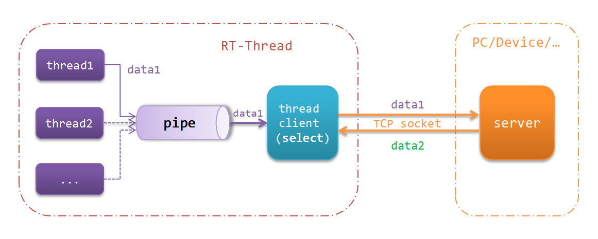
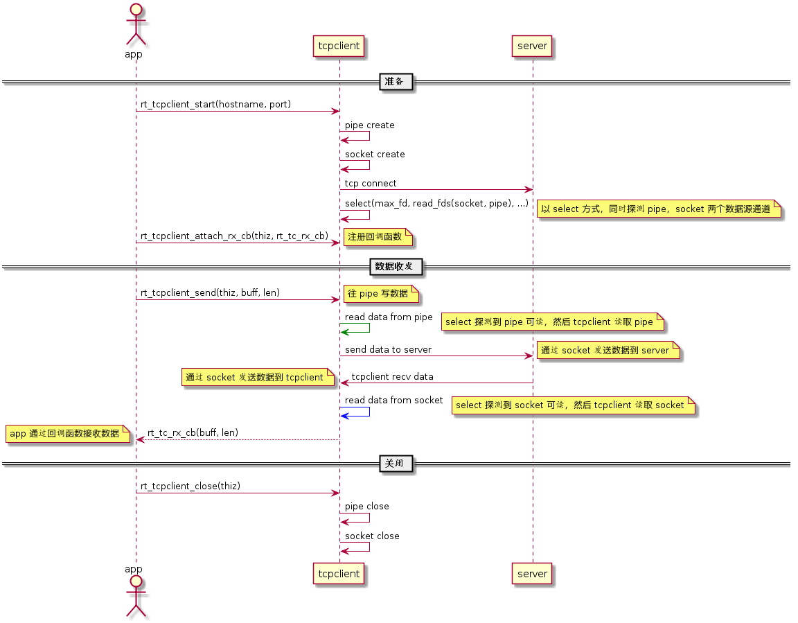
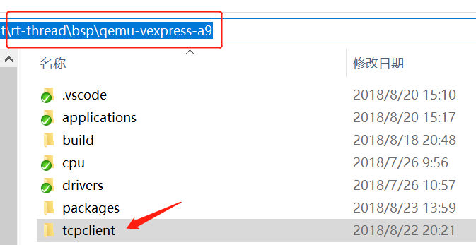
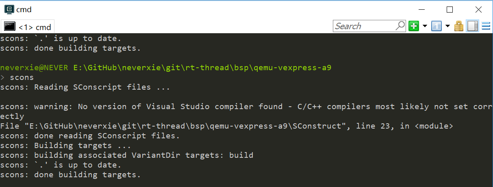
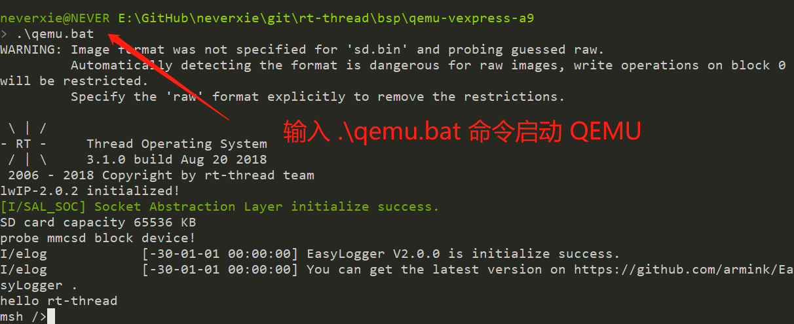
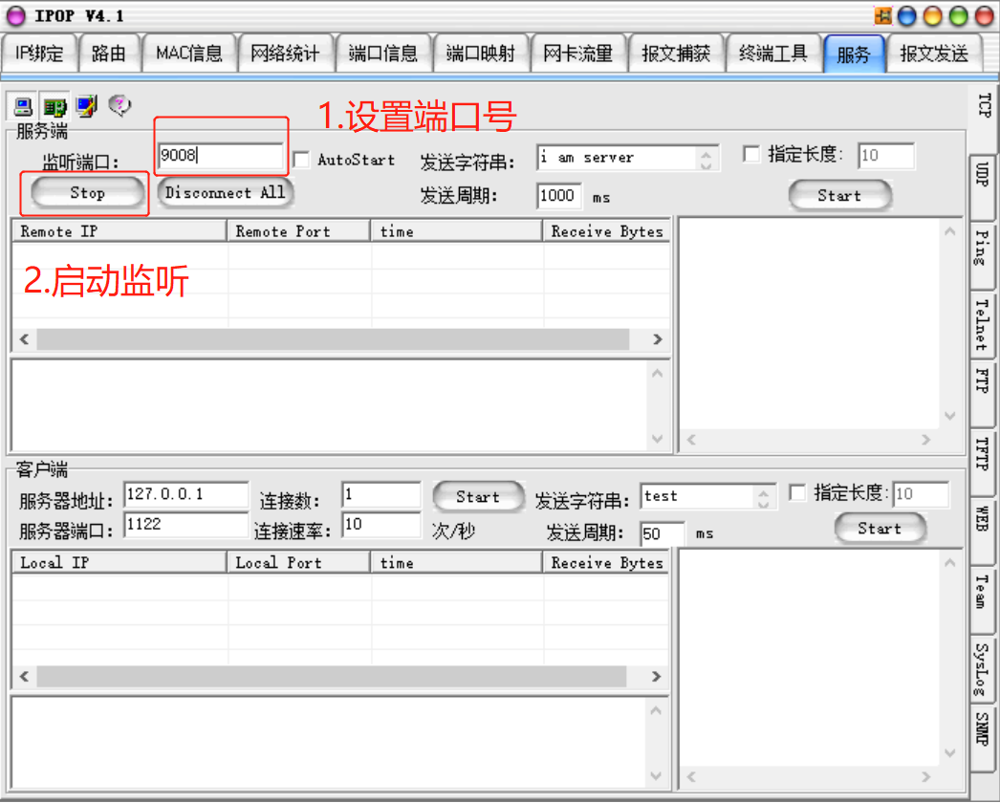
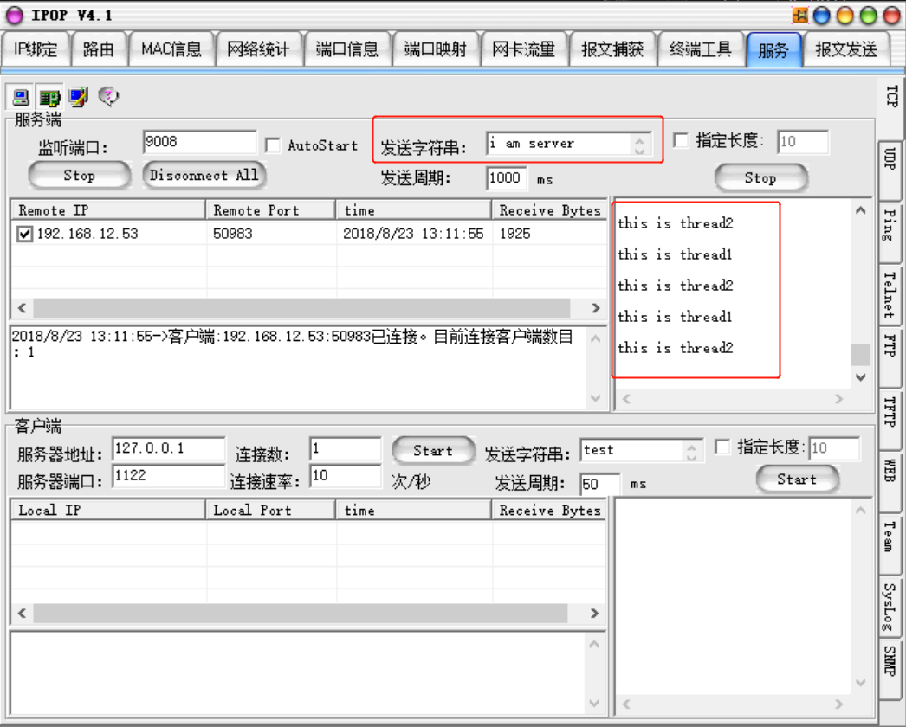

# 多线程非阻塞网络编程

本文描述了使用 QEMU 运行 RT-Thread 提供的基于多线程的非阻塞 socket 编程示例。

## 简介

随着物联网的发展，越来越多产品需要基于网络进行数据传输。在实际开发中，往往要求网络传输时不能阻塞当前线程，以致无法及时处理其他消息。在用户无法直接套用简单的 socket demo 时，RT-Thread 提供基于多线程的非阻塞 socket 编程示例，方便用户进行应用程序开发。

在 RT-Thread 使用 socket 网络编程时，当一个任务调用 socket的 recv()函数接收数据时，如果 socket 上并没有接收到数据，这个任务将阻塞在这个 recv() 函数里。这个时候，这个任务想要处理一些其他事情，例如进行一些数据采集，发送一些额外数据到网络上等，将变得不可能了。与此同时，其他线程也需要将数据上传同一个服务器，如果直接多个线程共同使用一个 socket 操作，这将会破坏底层 lwip 的消息事件模型。

本文准备资料如下：

* [RT-Thread 源码](https://www.rt-thread.org/page/download.html)

* [Env 工具](https://www.rt-thread.org/page/download.html)

* [README.md](https://github.com/neverxie/tcpclient)

* [tcpclient 源码](https://github.com/neverxie/tcpclient/blob/master/src/tcpclient.c)

* [example 源码](https://github.com/neverxie/tcpclient/blob/master/examples/tcpclient_example.c)

## socket 编程模型简介

socket 编程模型如下图所示：


客户端使用流程：

1. `socket()` 创建一个 socket，返回套接字的描述符，并为其分配系统资源。
2. `connect()` 向服务器发出连接请求。
3. `send()/recv()` 与服务器进行通信。
4. `closesocket()` 关闭 socket，回收资源。

服务器使用流程：

1. `socket()` 创建一个 socket，返回套接字的描述符，并为其分配系统资源。
2. `bind()` 将套接字绑定到一个本地地址和端口上。
3. `listen()` 将套接字设为监听模式并设置监听数量，准备接收客户端请求。
4. `accept()` 等待监听的客户端发起连接，并返回已接受连接的新套接字描述符。
5. `recv()/send()` 用新套接字与客户端进行通信。
6. `closesocket()` 关闭 socket，回收资源。

例如在上面网络客户端操作过程中，当进行 recv 操作时，如果对应的通道数据没有准备好，那系统就会让当前任务进入阻塞状态，当前任务不能再进行其他的操作。

## 非阻塞 socket 编程简介

在 RT-Thread 中，自 v3.0.0 以来更标准化，支持更多的 POSIX API。这其中就包括 poll / select 接口实现，并且可以进行 socket 和设备文件的联合 poll / select。select、poll的内部实现机制相似，由于本文选用 select 方式，故在此不对 poll 展开介绍。

下面结合框图进一步说明如何使用 select 和 pipe 来解决这类问题。



图中存在有三个线程：应用线程 `thread1`、`thread2` 和客户端线程 `thread client`，其中  `thread client` 完成 select 功能。

- 数据发送过程：
  - 应用线程通过 pipe 往 `thread client` 发送数据 data1，select 探测到 pipe 有数据可读，`thread client` 被唤醒，然后读取 pipe 中的数据并通过 TCP socket 发送到 server
- 数据接收过程：
  - server 通过 TCP socket 发送数据 data2 到 `thread client`，select 探测到 socket 有数据可读，`thread client` 被唤醒，`thread client` 可以获得接收到的数据

下面将详细介绍 select 和 pipe 的使用方法。

### select

`select()` 可以阻塞地同时探测一组支持非阻塞的 I / O 设备是否有事件发生（如可读，可写，出现异常等等），直至某一个设备触发了事件或者超过了指定的等待时间。此时我们可以把需要的数据源通道放到 select 的探测范围内，只要相应的数据源准备好 select 就会返回，这时就能无阻塞地读取到数据。

`select()` 主要用来处理 I / O 多路复用的情况，适用如下场合：

- 客户端处理多个描述符时（一般是交互式输入和网络套接口）
- 服务器既要处理监听套接口，又要处理已连接套接口
- 服务器既要处理 TCP，又要处理 UDP
- 服务器要处理多个服务或多个协议

select()函数原型及介绍如下所示：

```c
int select(int nfds, fd_set* readfds, fd_set* writefds, fd_set* errorfds, struct timeval* timeout);
```

| 参数     | 描述                                                    |
| -------- | ------------------------------------------------------- |
| nfds     | 集合中所有文件描述符的范围，即所有文件描述符的最大值加1 |
| readfds  | 需要监视读变化的文件描述符集合                          |
| writefds | 需要监视写变化的文件描述符集合                          |
| errorfds | 需要监视出现异常的文件描述符集合                        |
| timeout  | select 的超时时间                                       |
| **返回** | --                                                      |
| 正值     | 监视的文件集合出现可读写事件或异常事件                  |
| 0        | 等待超时，没有可读写或异常的事件                        |
| 负值     | select 出现错误                                         |

### pipe

pipe 是一个基于文件描述符的单向数据通道（管道），可用于线程间的通信。我们可以将 pipe 理解为水管，水通过水管从一端流向另一端，就像我们的数据从一个线程流向另一个线程，以此来达到线程间通信的目的。管道本质上也是一个文件，因此它支持文件描述符的形式操作，也就是说我们可以通过 open、read、write 等函数对管道进行操作。

在使用管道之前，需要先创建它，我们通过调用 rt_pipe_create 函数来创建管道：

```c
rt_pipe_t *rt_pipe_create(const char *name, int bufsz);
```

| 参数     | 描述                                                     |
| -------- | -------------------------------------------------------  |
| name     | 管道名                                                   |
| bufsz    | 管道大小                                                 |
| **返回** | --                                                       |
| 管道句柄 | 创建管道对象成功                                         |
| RT_NULL | 创建失败                                                  |

创建成功以后，就能通过这个管道名来对管道进行读写操作，下面截取了示例代码 `tcpclient.c` 的部分代码片段，如下：

```c
/* 只读方式打开管道 */
thiz->pipe_read_fd = open(dev_name, O_RDONLY, 0);

/* 只写方式打开管道 */
thiz->pipe_write_fd = open(dev_name, O_WRONLY, 0);

/* 对管道写入数据 */
write(thiz->pipe_write_fd, buff, len);

```
> 提示：在 msh />中，输入 `list_fd` 可查看当前打开的文件描述符，详情如下：

```c
msh />list_fd
fd type    ref magic  path

-- ------  --- ----- ------

 0 file      1 fdfd  /uart0
 1 socket    1 fdfd
 2 file      1 fdfd  /pipe0
 3 file      1 fdfd  /pipe0
msh />
```

下面将详细介绍代码的实现情况。

## tcpclient 示例

`tcpclient.c` 是上文提出的 select、pipe 方案的具体实现代码，该源码采用面向对象的思想实现，提供 TCP 连接、发送、关闭以及注册接收回调四个 API 提供用户使用。

下面的序列图为 `tcpclient.c`的运行流程：



各流程详细解释如下所示：

1. 调用 `rt_tcpclient_start()` 设置服务器 ip 地址 & 端口号，以及完成 pipe、socket 初始化和 TCP 连接、select 配置等工作。
2. 注册接收回调函数 `rt_tc_rx_cb()`。
3. 调用 `rt_tcpclient_send()` 通过 pipe 发送数据（*图中绿线表示 select 探测到 pipe 可读事件*）。
4. 图中绿线表示 select 探测到 pipe 可读事件， tcpclient 被唤醒并读取 pipe 的数据。
5. tcpclient 通过 socket 发送数据给 server。
6. server 通过 socket 发送数据给 tcpclient。
7. 图中蓝线表示 select 探测到 socket 可读事件，tcpclient 被唤醒并读取 socket 的数据。
8. app 通过 `rt_tc_rx_cb()` 获得 tcpclient 读取到的数据。
9. 通信完毕，app 调用 `rt_tcpclient_close()` 关闭 pipe、socket，并清理相关资源。

### 源码详解

下面代码的核心代码：

```c
static void select_handle(rt_tcpclient_t *thiz, char *pipe_buff, char *sock_buff)
{
    fd_set fds;

    rt_int32_t max_fd = 0, res = 0;
    max_fd = MAX_VAL(thiz->sock_fd, thiz->pipe_read_fd) + 1;

    /* 清空可读事件描述符列表 */
    FD_ZERO(&fds);

    while (1)
    {
        /* 将需要监听可读事件的描述符加入列表 */
        FD_SET(thiz->sock_fd, &fds);
        FD_SET(thiz->pipe_read_fd, &fds);

        /* 等待设定的网络描述符有事件发生 */
        res = select(max_fd, &fds, RT_NULL, RT_NULL, RT_NULL);

        /* select 返回错误及超时处理 */
        EXCEPTION_HANDLE(res, "select handle", "error", "timeout");

         /* 查看 sock 描述符上有没有发生可读事件 */
        if (FD_ISSET(thiz->sock_fd, &fds))
        {
            /* 从 sock 连接中接收最大BUFSZ - 1字节数据 */
            res = recv(thiz->sock_fd, sock_buff, BUFF_SIZE, 0);

            /* recv 返回异常 */
            EXCEPTION_HANDLE(res, "socket recv handle", "error", "TCP disconnected");

            /* 有接收到数据，把末端清零 */
            sock_buff[res] = '\0';

            /* 通过回调函数的方式，数据发给 thread1 */
            RX_CB_HANDLE(sock_buff, res);

            /* 如果接收的是exit，关闭这个连接 */
            EXIT_HANDLE(sock_buff);
        }

        /* 查看 pipe 描述符上有没有发生可读事件 */
        if (FD_ISSET(thiz->pipe_read_fd, &fds))
        {
            /* 从 pipe 连接中接收最大BUFSZ - 1字节数据 */
            res = read(thiz->pipe_read_fd, pipe_buff, BUFF_SIZE);

            /* recv 返回异常 */
            EXCEPTION_HANDLE(res, "pipe recv handle", "error", RT_NULL);

            /* 有接收到数据，把末端清零 */
            pipe_buff[res] = '\0';

            /* 读取 pipe 的数据，转发给 server */
            send(thiz->sock_fd, pipe_buff, res, 0);

            /* recv 返回异常 */
            EXCEPTION_HANDLE(res, "socket write handle", "error", "warning");

            /* 如果接收的是 exit，关闭这个连接 */
            EXIT_HANDLE(pipe_buff);
        }
    }

exit:
    /* 释放接收缓冲 */
    free(pipe_buff);
    free(sock_buff);
}
```

这段代码是 tcpclient 线程的核心部分，按照例程配置 select，根据 `FD_ISSET()` 宏检查描述符。

- 假如 socket 有数据可读，采用回调函数的方式把数据发送给应用线程。
- 假如 pipe 有数据可读，处理数据，通过 socket 发送到服务器。

### 准备工作

首先在 github 上拉取 `tcpclient.c` 的源码，然后将tcpclient 文件夹放在 `rt-thread\bsp\qemu-vexpress-a9`目录下，详情如下：



在 Env 里使用 `scons` 命令编译 QEMU 工程，详情如下：



在 Env 里使用 `.\qemu.bat` 命令启动，详情如下：



QEMU 成功启动，下面来介绍代码运行情况。

设置网络调试助手端口号，详情如下：



在 cmd 命令行输入 `ipconfig` 查看本机 ip 地址，详情如下：

```c
> ipconfig
...
IPv4 Address. . . . . . . . . . . : 192.168.12.53
...
```

example 代码中通过 `rt_tcpclient_start()` API 设置服务器 IP 地址和端口号，详情如下：

```c
rt_tcpclient_start("192.168.12.53", 9008);
```

> [!NOTE]
> 注：这里需要根据自己的环境设置 ip 地址和端口号!!!

在 `msh />` 里，输入 `rt_tc_test_init` 详情如下：

```c
msh />rt_tc_test_init
```

### 运行效果

在 example.c 里建立两个线程，一个是 thread1，另一个是 thread2，两个线程交替给服务端发送数据。服务端每秒钟往客户端发送数据。

  

网络助手发送 `i am server` ，thread1 接收并且打印出来，详情如下：
```
msh />D/tc_rx_cb        [-30-01-01 00:00:00 tcpc] (packages\tcpclient\examples\tcpclient_example.c:52)recv data: i am server
```

## 总结

- select() 也是阻塞模式，它的好处在于可以同时选择多个数据源通道：只要通道里数据有效时，就可以进行操作；在没有数据需要处理时，则操作线程会被挂起。
- 通过使用 pipe / select 的方式，让 tcpclient 网络任务实现了在等待网络数据的同时额外处理其他消息的目的。

## 参考资料

* [《Env 用户手册》](../../../programming-manual/env/env.md)

