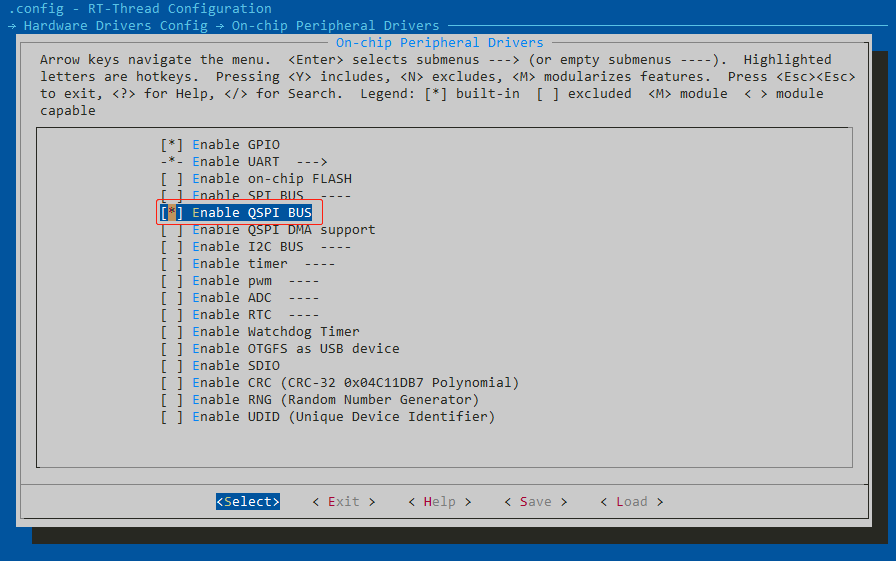
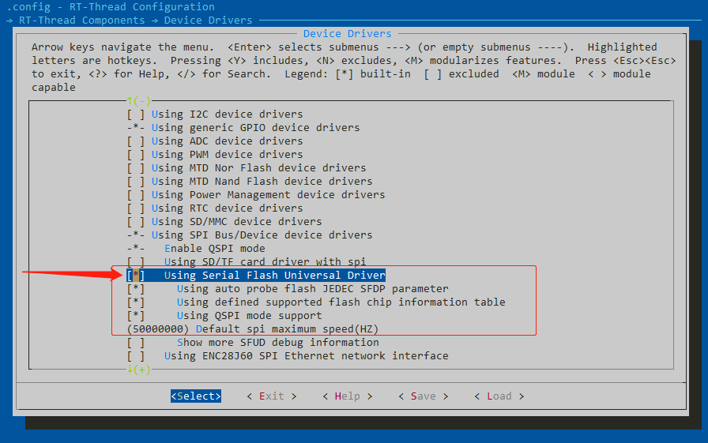
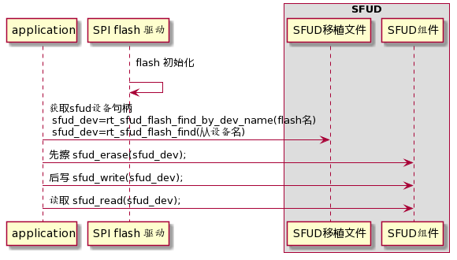

# 在潘多拉上使用 SFUD 操作 Flash

[SFUD](https://github.com/armink/SFUD) 是一款开源的串行 SPI Flash 通用驱动库。由于现有市面的串行 Flash 种类居多，各个 Flash 的规格及命令存在差异， SFUD 就是为了解决这些 Flash 的差异现状而设计，让我们的产品能够支持不同品牌及规格的 Flash，提高了涉及到 Flash 功能的软件的可重用性及可扩展性，同时也可以规避 Flash 缺货或停产给产品所带来的风险。

在使用 SFUD 时候需要进行移植，可以参考文件 [sfud/port/sfud_port.c](https://github.com/armink/SFUD/blob/master/sfud/port/sfud_port.c)。本篇文档将说明如何在潘多拉上使用 SFUD 操作 Flash（SFUD 部分已经移植完成），本文准备资料如下：

- [RT-Thread 源码](https://www.rt-thread.org/page/download.html)
- [Env 工具](https://www.rt-thread.org/page/download.html)
- 板载 spi flash 的开发板，以潘多拉为例

## Env 配置

使用 SFUD 操作 Flash，需要在 Env 中打开： QSPI 或 SPI 总线、SFUD 组件。

（1）在片上外设中，打开 QSPI/SPI 总线：根据实际情况选择 SPI/QSPI 总线，在本示例中使用的是 QSPI 总线。



（2）在组件中，选中 SFUD 组件，保存并生成工程。



## 使用流程

如下图是 SFUD 的使用流程图，首先需要移植 SFUD 组件、对 flash 进行初始化，然后再进行应用：根据名称获取 sfud_dev，对 sfud_dev 进行擦写读的操作。



（1）SFUD 移植：

- SFUD 组件移植：可以参考文件 [sfud/port/sfud_port.c](https://github.com/armink/SFUD/blob/master/sfud/port/sfud_port.c) 或 RT-Thread 已实现的 [spi_flash_sfud.c](https://github.com/RT-Thread/rt-thread/blob/master/components/drivers/spi/spi_flash_sfud.c)。
- Flash 设备支持：当目标 Flash 设备不支持 SFDP 功能时，需要在 sfud_flash_def.h 中定义 Flash 设备参数：

```c
//  | name | mf_id | type_id | capacity_id | capacity | write_mode | erase_gran | erase_gran_cmd |
#define SFUD_FLASH_CHIP_TABLE                                                                                       \
{                                                                                                                   \
    {"AT45DB161E", SFUD_MF_ID_ATMEL, 0x26, 0x00, 2L*1024L*1024L, SFUD_WM_BYTE|SFUD_WM_DUAL_BUFFER, 512, 0x81},      \
    {"W25Q40BV", SFUD_MF_ID_WINBOND, 0x40, 0x13, 512L*1024L, SFUD_WM_PAGE_256B, 4096, 0x20},                        \
    ....
    {"F25L004", SFUD_MF_ID_ESMT, 0x20, 0x13, 512L*1024L, SFUD_WM_BYTE|SFUD_WM_AAI, 4096, 0x20},                     \
    {"PCT25VF016B", SFUD_MF_ID_SST, 0x25, 0x41, 2L*1024L*1024L, SFUD_WM_BYTE|SFUD_WM_AAI, 4096, 0x20},              \
}
#endif /* SFUD_USING_FLASH_INFO_TABLE */
```

（2）SPI flash 驱动实现（[参考潘多拉 flash 驱动](https://github.com/RT-Thread/rt-thread/blob/master/bsp/stm32/stm32l475-atk-pandora/board/ports/drv_qspi_flash.c)）：在 SPI flash 驱动中完成了 flash 的初始化（可以导出到自动初始化），执行了 spi 从设备的挂载与探测，如下是本次示例中的 flash 初始化代码：

```c
/* QSPI Flash 驱动 */
static int rt_hw_qspi_flash_with_sfud_init(void)
{
    /* 往总线 qspi1 上挂载一个 qspi10 从设备 */
    stm32_qspi_bus_attach_device("qspi1", "qspi10", RT_NULL, 4, w25qxx_enter_qspi_mode, RT_NULL);

    /* 使用 SFUD 探测 qspi10 从设备，并将 qspi10 连接的 flash 初始化为块设备，名称 W25Q128 */
    if (RT_NULL == rt_sfud_flash_probe("W25Q128", "qspi10"))
    {
        return -RT_ERROR;
    }

    return RT_EOK;
}
/* 导出到自动初始化 */
INIT_COMPONENT_EXPORT(rt_hw_qspi_flash_with_sfud_init);
```

其中 qspi 模式需要实现进入 qspi 模式（如上面的 w25qxx_enter_qspi_mode），退出 qspi 模式为 RT_NULL 表示不再退出。stm32_qspi_bus_attach_device 原型如下：

```c
rt_err_t stm32_qspi_bus_attach_device(const char *bus_name,
                                      const char *device_name,
                                      rt_uint32_t pin,            // CS 引脚编号
                                      rt_uint8_t data_line_width, // QSPI 数据宽度：如 1/2/4
                                      void (*enter_qspi_mode)(),  // 进入 qspi 模式
                                      void (*exit_qspi_mode)());  // 退出 qspi 模式
```

注：如果是 SPI 模式，则 SPI flash 驱动如下所示：

```c
/* SPI Flash 驱动 */
static int rt_hw_spi_flash_init(void)
{
    /* 往总线 spi1 上挂载一个 spi10 从设备 */
    rt_hw_spi_device_attach("spi1", "spi10", GPIOB, GPIO_PIN_14);  // CS 脚：PB14

    /* 使用 SFUD 探测 spi10 从设备，并将 spi10 连接的 flash 初始化为块设备，名称 W25Q128 */
    if (RT_NULL == rt_sfud_flash_probe("W25Q128", "spi10"))
    {
        return -RT_ERROR;
    };

    return RT_EOK;
}
/* 导出到自动初始化 */
INIT_COMPONENT_EXPORT(rt_hw_spi_flash_init);
```

（3）sfud_dev 的获取有两种方法：通过 flash 名获取、通过从设备名获取，如下所示：

```c
// sfud_dev = rt_sfud_flash_find_by_dev_name("W25Q128");
sfud_flash_t rt_sfud_flash_find_by_dev_name(const char *flash_dev_name);

// sfud_dev = rt_sfud_flash_find("qspi10");
sfud_flash_t rt_sfud_flash_find(const char *spi_dev_name);
```

## 应用示例

使用 SFUD 组件，可通过命令行与编写应用两种方式对 flash 进行操作。

### sf 命令操作 Flash

使用 sf 查看 sf 命令的使用方法，并且对 qspi10 进行探测（sf probe 后再经过转换可以得到 sfud_dev）：

```c
 \ | /
- RT -     Thread Operating System
 / | \     4.0.3 build Apr 26 2020
 2006 - 2020 Copyright by rt-thread team
[D/drv.qspi] qspi init success!
[SFUD] Find a Winbond flash chip. Size is 16777216 bytes.
[SFUD] W25Q128 flash device is initialize success.
[D/drv.qspi] qspi init success!
msh >
msh >sf
Usage:
sf probe [spi_device]           - probe and init SPI flash by given 'spi_device'
sf read addr size               - read 'size' bytes starting at 'addr'
sf write addr data1 ... dataN   - write some bytes 'data' to flash starting at 'addr'
sf erase addr size              - erase 'size' bytes starting at 'addr'
sf status [<volatile> <status>] - read or write '1:volatile|0:non-volatile' 'status'
sf bench                        - full chip benchmark. DANGER: It will erase full chip!
msh >
msh >sf probe qspi10
[D/drv.qspi] qspi init success!
[SFUD] Find a Winbond flash chip. Size is 16777216 bytes.
[SFUD] sf_cmd flash device is initialize success.
[D/drv.qspi] qspi init success!
16 MB sf_cmd is current selected device.
msh >
```

sf 擦、写、读操作测试（通过 sf 命令对获取到的 sfud_dev 进行擦写读操作）：

```c
msh >sf erase 0 10
Erase the sf_cmd flash data success. Start from 0x00000000, size is 10.

msh >sf write 0 1 2 3
Write the sf_cmd flash data success. Start from 0x00000000, size is 3.
Write data: 1 2 3 .

msh >sf read 0 10
Read the sf_cmd flash data success. Start from 0x00000000, size is 10. The data is:
Offset (h) 00 01 02 03 04 05 06 07 08 09 0A 0B 0C 0D 0E 0F
[00000000] 01 02 03 FF FF FF FF FF FF FF                   ..........
```

### 编写应用操作 Flash

可以在应用中对 flash 进行读写擦操作，读写擦的操作均是基于 `sfud_dev` 设备，然后在对设备进行擦读写。如下是一个简单的示例：

```c
sfud_err result;
uint8_t *read_data;  // 读取到的数据
uint8_t *write_data; // 将要写入的数据
sfud_flash *sfud_dev = NULL;

sfud_dev = rt_sfud_flash_find("qspi10"); // 获取 sfud_dev
// 或者 sfud_dev = rt_sfud_flash_find_by_dev_name("W25Q128");

sfud_erase(sfud_dev, 0, 4096);           // 擦除从 0 开始的 4096 字节

write_data = rt_malloc(32);
rt_memset(write_data, 1, 32);
sfud_write(sfud_dev, 0, 32, write_data); // 将数据 32 字节的 write_data 从 0 开始写入 flash

read_data = rt_malloc(32);
sfud_read(sfud_dev, 0, 32, read_data);   // 读取从 0 开始的 32 字节，存入 read_data
```

这样 SFUD 操作 Flash 的应用就完成了。

## 注意事项

### 1. Flash 先擦后写

写入之前请先擦除，这是 flash 特性决定的，因为 flash 的编程原理就是只能将 1 写为 0，而不能将 0 写为 1。擦除动作就是相应的页 / 块的所有位变为 1（所有字节均为 0xFF），所以不擦除直接写入会有问题。

例如以下示例，对 qspi10 进行探测：

```c
 \ | /
- RT -     Thread Operating System
 / | \     4.0.3 build Apr 26 2020
 2006 - 2020 Copyright by rt-thread team
[D/drv.qspi] qspi init success!
[SFUD] Find a Winbond flash chip. Size is 16777216 bytes.
[SFUD] W25Q128 flash device is initialize success.
[D/drv.qspi] qspi init success!
msh >
msh >sf probe qspi10
[D/drv.qspi] qspi init success!
[SFUD] Find a Winbond flash chip. Size is 16777216 bytes.
[SFUD] sf_cmd flash device is initialize success.
[D/drv.qspi] qspi init success!
16 MB sf_cmd is current selected device.
msh >
```

（1）首先进行不擦先写的测试，可以发现读出来的数据并非写入的数据：

```c
msh >sf write 0 1 2 3
Write the sf_cmd flash data success. Start from 0x00000000, size is 3.
Write data: 1 2 3 .
msh >
msh >sf read 0 10
Read the sf_cmd flash data success. Start from 0x00000000, size is 10. The data is:
Offset (h) 00 01 02 03 04 05 06 07 08 09 0A 0B 0C 0D 0E 0F
[00000000] 00 00 00 00 23 00 00 00 00 00                   ....#.....
```

（2）然后进行先擦后写的测试，可以发现读出来的数据与写入数据一致：

```c
msh >sf erase 0 10
Erase the sf_cmd flash data success. Start from 0x00000000, size is 10.
msh >
msh >sf read 0 20
Read the sf_cmd flash data success. Start from 0x00000000, size is 20. The data is:
Offset (h) 00 01 02 03 04 05 06 07 08 09 0A 0B 0C 0D 0E 0F
[00000000] FF FF FF FF FF FF FF FF FF FF FF FF FF FF FF FF ................
[00000010] FF FF FF FF                                     ....
msh >
msh >sf read 4090 20
Read the sf_cmd flash data success. Start from 0x00000FFA, size is 20. The data is:
Offset (h) 00 01 02 03 04 05 06 07 08 09 0A 0B 0C 0D 0E 0F
[00000FFA] FF FF FF FF FF FF 2C 10 00 00 22 00 00 00 00 00 ......,...".....
[0000100A] 00 00 DD 3A                                     ...:

msh >sf write 0 1 2 3
Write the sf_cmd flash data success. Start from 0x00000000, size is 3.
Write data: 1 2 3 .
msh >
msh >sf read 0 10
Read the sf_cmd flash data success. Start from 0x00000000, size is 10. The data is:
Offset (h) 00 01 02 03 04 05 06 07 08 09 0A 0B 0C 0D 0E 0F
[00000000] 01 02 03 FF FF FF FF FF FF FF                   ..........
```

### 2. Flash 按页 / 块擦除

Flash 页大小一般是 4K、8K、16K 等，一个块也可能有 192、256、384、512 个页。Flash 按页擦除、按块擦除也是 flash 的特性之一。

在上面步骤（2）中使用了 sf erase 命令进行擦除。虽然 `sf erase 0 10 ` 命令的意思是从 0 地址开始擦除 10 个字节，但是该 flash 是按照 4K 字节进行擦除的，所以会擦出从 0 开始的 4K 字节。使用读取 `sf read 4090 20` 命令进行验证，读取从 4090 开始的 20 个字节时，发现从 4096 及之后均未进行擦除，也就是擦除了从 0 开始的 4K 字节。

`sf erase 2 10 ` 也是擦除从 0 开始的 4K 字节，而不是从 2 开始的 4K 字节。

```c
msh >sf erase 2 10
Erase the sf_cmd flash data success. Start from 0x00000002, size is 10.
msh >
msh >sf read 0 10
Read the sf_cmd flash data success. Start from 0x00000000, size is 10. The data is:
Offset (h) 00 01 02 03 04 05 06 07 08 09 0A 0B 0C 0D 0E 0F
[00000000] FF FF FF FF FF FF FF FF FF FF                   ..........

msh >sf read 4090 20
Read the sf_cmd flash data success. Start from 0x00000FFA, size is 20. The data is:
Offset (h) 00 01 02 03 04 05 06 07 08 09 0A 0B 0C 0D 0E 0F
[00000FFA] FF FF FF FF FF FF 2C 10 00 00 22 00 00 00 00 00 ......,...".....
[0000100A] 00 00 DD 3A
```

### 3. Flash 写粒度

在上面的示例中我们使用的是 spi nor flash，每次支持写入一个 bit 的数据。而不同的 flash 支持的写入粒度不尽相同，必须一次性写入写粒度的整数倍才可以写入成功。以下列举几种常见 Flash 写粒度：

- nor flash: 1 bit
- stm32f4: 8 bit
- stm32f1: 32 bit
- stm32l4: 64 bit

