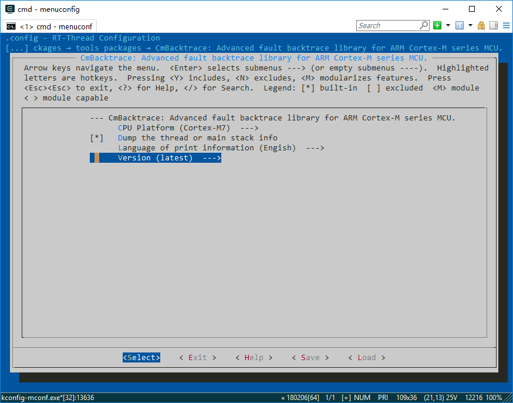
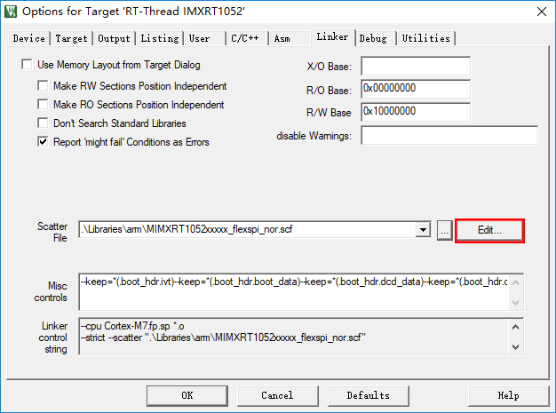
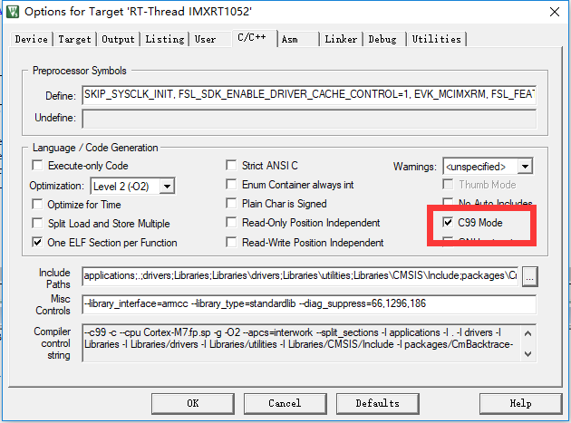
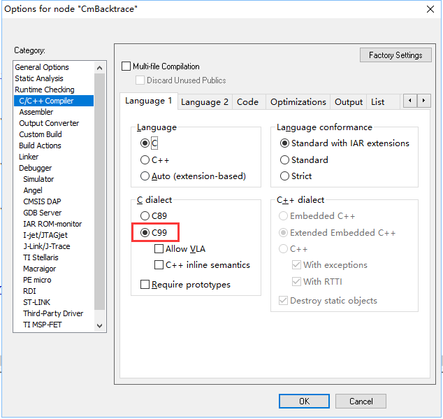
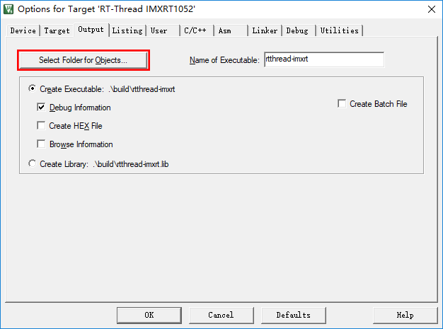
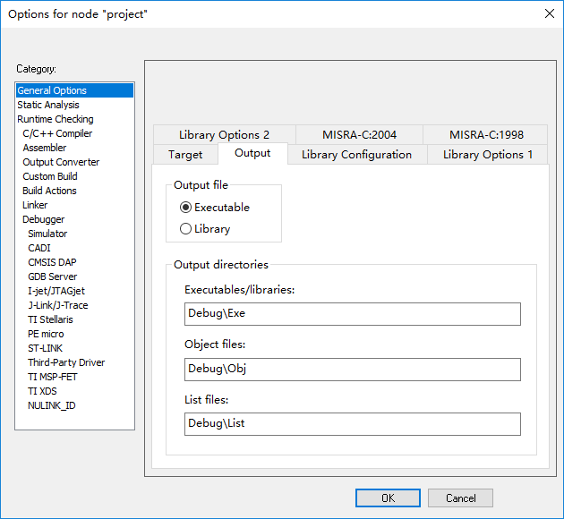

# CmBacktrace 应用

本文描述了在 RT-Thread 中使用 CmBacktrace。

## 简介

对于从 C51 、MSP430 等简单单片机转而使用更加复杂的 ARM 新人来说，时不时出现的 "hard fault" 死机会让新人瞬间懵掉。定位错误的方法也往往是连接上仿真器，一步步 F10/F11 单步，定位到具体的错误代码，再去猜测、排除、推敲错误原因，这种过程十分痛苦，且花费的时间很长。 当然，也有部分开发者通过故障寄存器信息来定位故障原因及故障代码地址，虽然这样能解决一小部分问题，但是重复的、繁琐的分析过程也会耽误很多时间。而且对于一些复杂问题，只依靠代码地址是无法解决的，必须得还原错误现场的函数调用逻辑关系。虽然连接仿真器可以查看到的函数调用栈，但故障状态下是无法显示的，所以还是得一步步 F10/F11 单步去定位错误代码的位置。另外，很多产品真机调试时必须断开仿真器，这又使定位错误代码雪上加霜。

为了能让开发者更快的知道造成 hard fault 的原因，更快的定位到错误代码的位置，本文将一步步介绍 CmBacktrace 的相关知识和使用方法，让开发者能不费吹灰之力就找出代码中的问题所在。

本文准备资料如下：

* [RT-Thread 源码](https://www.rt-thread.org/page/download.html)

* [Env 工具](https://www.rt-thread.org/page/download.html)

* 在 https://github.com/armink/CmBacktrace/tree/master/tools/addr2line 页面中下载 addr2line（需要按照自己的系统版本下载），然后将下载下来的 addr2line 拷贝至 `C:\Windows` 下 ，这样就可以使用 addr2line 了。

## CmBacktrace 简介

[CmBacktrace](https://github.com/armink/CmBacktrace) （Cortex Microcontroller Backtrace）是一款针对 ARM Cortex-M 系列 MCU 的错误代码自动追踪、定位，错误原因自动分析的开源库。

主要特性如下：

- 支持的错误包括：

    - 断言（assert）

    - 故障（Hard Fault, Memory Management Fault, Bus Fault, Usage Fault, Debug Fault）

- 故障原因 **自动诊断** ：可在故障发生时，自动分析出故障的原因，定位发生故障的代码位置，而无需再手动分析繁杂的故障寄存器；

- 输出错误现场的 **函数调用栈**（需配合 addr2line 工具进行精确定位），还原发生错误时的现场信息，定位问题代码位置、逻辑更加快捷、精准。也可以在正常状态下使用该库，获取当前的函数调用栈；

- 支持 裸机 及以下操作系统平台：

    - [RT-Thread](http://www.rt-thread.org)

    - UCOS

    - FreeRTOS（需修改源码）

- 根据错误现场状态，输出对应的 线程栈 或 C 主栈；

- 故障诊断信息支持多国语言（目前：简体中文、英文）；

- 适配 Cortex-M0/M3/M4/M7 MCU；

- 支持 IAR、MDK、GCC 编译器；

## 配置选项

### ENV 配置

RT-Thread 已经对 CmBacktrace 做了适配，直接在 ENV 使能 CmBacktrace 就可以使用了。

下面介绍如何在 ENV 中配置 CmBacktrace：

- 打开 ENV，进入相应的 BSP 目录
- 输入 menuconfig
- 进入 RT-Thread online packages -> tools packages
- 使能 CmBacktrace
- 进入 CmBacktrace 配置界面
- 选择自己的 CPU 平台
- 选择打印的语言
- 选择版本，推荐使用最新版



### 确认宏定义

CmBacktrace 的运行需要知道存放代码的 SECTION 的开始地址和结束地址以及栈的 SECTION  的开始地址和结束地址。用户只需要查看 cmb_def.h 文件里默认定义的 CMB_CSTACK_BLOCK_NAME 和 CMB_CODE_SECTION_NAME 这两个宏是否正确即可。如不正确，用户需要根据分散加载文件和启动文件来确定这两个宏的值并在 cmb_cfg.h 里重新定义这两个宏。

这里以 rt1052 的 mdk 工程为例进行讲解如何在工程里找到这两个宏的值。首先找 CMB_CSTACK_BLOCK_NAME 的值，我们打开工程里的启动文件，可以在文件的开头看到这样一段代码

```
                AREA    RESET, DATA, READONLY
                EXPORT  __Vectors
                EXPORT  __Vectors_End
                EXPORT  __Vectors_Size
                IMPORT  |Image$$ARM_LIB_STACK$$ZI$$Limit|

__Vectors       DCD     |Image$$ARM_LIB_STACK$$ZI$$Limit| ; Top of Stack
```

Image$$ARM_LIB_STACK$$ZI$$Limit 就是我们要找的内容了，因为代码里会自动拼接上最后的 $$Limit，所以  CMB_CSTACK_BLOCK_NAME 的值应该是 Image$$ARM_LIB_STACK$$ZI。

CMB_CODE_SECTION_NAME 的值在分散加载文件里寻找，分散加载文件可以点击 MDK 的 Options -> Linker 选项面板里的 Edit... 按纽打开



我们可以找到这样一段代码

```
    ER_IROM1 m_text_start m_text_size ; load address = execution address
    {
        * (RESET,+FIRST)
        * (InRoot$$Sections)
        .ANY (+RO)
    }
```

保存有 .ANY (+RO) 的 SECTION 名字就是我们要找的值，所以，CMB_CODE_SECTION_NAME 的值为 ER_IROM1。

### 开启 C99

CmBacktrace 的使用需要 C99 的支持，使用 MDK 的开发者可以在 Options -> C/C++ 面板中勾选 C99 Mode 选项。



使用 IAR 的开发者，可以在 Options -> C/C++ Compiler 中选择 C99。



使用 GCC 进行编译的用户，在编译配置中增加 `-std=c99` 即可 。

### 确定初始化参数

在使用 CmBacktrace 之前需要先调用下初始化函数，函数原型如下：

```
void cm_backtrace_init(const char *firmware_name, const char *hardware_ver, const char *software_ver)
```
CmBacktrace 的初始化函数需要 3 个参数，第一个参数是固件名字，第二个参数是硬件版本，第三个参数是软件版本。这三个参数会在发生 hard fault 时打印出来，firmware_name 需要填写生成的固件名称，错误填写会导致在使用 addr2line 时无法找到文件。hardware_ver 和 software_ver 建议填写真实的软硬件版本号，方便后期调试和维护。在 cmb_port.c 文件中，我们可以看到 RT-Thread 已经将 rt_cm_backtrace_init 函数进行了自动初始化，默认的三个参数分别是 `rtthread`,`1.0`,`1.0`，开发者需要按照实际情况进行更改。

## 运行示例代码

CmBacktrace 提供了一个测试函数，提供除零测试和执行非对齐访问的测试。当做完上面的准备工作后，开发者可以直接将工程编译，下载进板子里，进行测试，判断 CmBacktrace 是否正常工作。

CmBacktrace 导出到 finsh shell 中的测试函数命令为 `cmb_test`，输入 `cmb_test DIVBYZERO` 就是进行除零测试，输入 `cmb_test  UNALIGNED` 就是执行非对齐访问的测试。

我们看下运行完除零测试的结果:

```
msh />cmb_test DIVBYZERO
thread   pri  status      sp     stack size max used left tick  error
-------- ---  ------- ---------- ----------  ------  ---------- ---
tshell    20  ready   0x00000100 0x00001000    23%   0x00000009 000
phy       30  suspend 0x0000006c 0x00000200    30%   0x00000001 000
tcpip     10  suspend 0x000000b4 0x00000800    17%   0x00000014 000
etx       12  suspend 0x00000088 0x00000400    13%   0x00000010 000
erx       12  suspend 0x00000088 0x00000400    13%   0x00000010 000
mmcsd_de  22  suspend 0x00000090 0x00000400    49%   0x00000013 000
tidle     31  ready   0x00000054 0x00000100    32%   0x00000018 000
main      10  suspend 0x00000064 0x00000800    35%   0x00000012 000

Firmware name: rtthread-imxrt, hardware version: 1.0, software version: 1.0
Fault on thread tshell
===== Thread stack information =====
  addr: 80002ad0    data: 00000012
  addr: 80002ad4    data: 6002ae58
  addr: 80002ad8    data: 80001a40
  addr: 80002adc    data: 6000b575
  addr: 80002ae0    data: 80001a40
  addr: 80002ae4    data: 80001a49
  addr: 80002ae8    data: 00000000
  addr: 80002aec    data: 00000000
  addr: 80002af0    data: 00000000
  addr: 80002af4    data: 00000000
  addr: 80002af8    data: 00000000
  addr: 80002afc    data: 00000000
  addr: 80002b00    data: 00000000
  addr: 80002b04    data: 00000000
  addr: 80002b08    data: 20000c7c
  addr: 80002b0c    data: 00000012
  addr: 80002b10    data: 80001a40
  addr: 80002b14    data: 20000c7c
  addr: 80002b18    data: 00000001
  addr: 80002b1c    data: deadbeef
  addr: 80002b20    data: deadbeef
  addr: 80002b24    data: deadbeef
  addr: 80002b28    data: deadbeef
  addr: 80002b2c    data: 60019ffb
  addr: 80002b30    data: 00000001
  addr: 80002b34    data: 0000000d
  addr: 80002b38    data: 00000000
  addr: 80002b3c    data: 60015a7b
  addr: 80002b40    data: 23232323
====================================
=================== Registers information ====================
  R0 : 0000000a  R1 : 00000000  R2 : 0000004f  R3 : 80808000
  R12: 01010101  LR : 6000c5ad  PC : 6000c5c8  PSR: 41000000
==============================================================
Usage fault is caused by Indicates a divide by zero has taken place (can be set only if DIV_0_TRP is set)
Show more call stack info by run: addr2line -e rtthread-imxrt.axf -a -f 6000c5c8 6000c5a9 6002ae54 6000b571 60019ff7 60015a77

```

CmBacktrace 首先打印出了发生 hard fault 时的所有线程信息，接着打印了固件名字和软硬件版本号，再打印了错误是发生在 tshell 这个线程里面的（因为我们是在 tshell 这个线程里调用的除零测试函数），紧接着打印的是线程的栈信息和寄存器信息。最后两行信息是最重要的，倒数第二行介绍了发生故障的原因，是因为除零造成的。最后一行提示如果需要获取函数调用栈，需要在 addr2line 中运行 CmBacktrace 给出的参数。

在使用 addr2line 之前我们要先确认保存了工程对象文件的文件夹位置。使用 mdk 的开发者，可以在 Options -> Output 面板中查看，设置对象文件的保存路径。



使用 IAR 的开发者，可以在 Options -> General Options 面板的 Output 选项中查看和设置。



我们将 run：后面的所有内容都复制下来，然后进入保存了工程生成的对象文件的文件夹，打开 env，将刚刚复制的内容粘贴上去，按下回车，错误现场的函数调用栈就会输出出来，我们看下刚刚进行除零测试时的函数调用栈的信息

```
> addr2line -e rtthread-imxrt.axf -a -f 6000c5c8 6000c5a9 6002ae54 6000b571 60019ff7 60015a77
0x6000c5c8
cmb_test
D:\rt-thread\bsp\imxrt1052-evk/packages\CmBacktrace-v1.2.0\/cmb_port.c:87
0x6000c5a9
cmb_test
D:\rt-thread\bsp\imxrt1052-evk/packages\CmBacktrace-v1.2.0\/cmb_port.c:82
0x6002ae54
FSymTab$$Base
??:?
0x6000b571
msh_get_cmd
D:\rt-thread\bsp\imxrt1052-evk/..\..\components\finsh\/msh.c:312
0x60019ff7
msh_exec
D:\rt-thread\bsp\imxrt1052-evk/..\..\components\finsh\/msh.c:335
0x60015a77
finsh_thread_entry
D:\rt-thread\bsp\imxrt1052-evk/..\..\components\finsh\/shell.c:613
```

我们可以看到，CmBacktrace 不仅仅定位出了是 cmb_port.c 里第 87 行产生的问题，还打印出了函数调用逻辑关系，方便开发者进行 BUG 修复。

> [!NOTE]
> 注：* 使用前必须确认自己的 MCU 是 ARM Cortex-M0(+)/M3/M4/M7 架构，其他架构暂不支持。
    * 使用前要确定 CMB_CSTACK_BLOCK_NAME 和 CMB_CODE_SECTION_NAME 两个宏的宏定义，如果定义错误，CmBacktrace 会无法正确使用。
    * 初始化时要输入正确的固件名称，不然使用 addr2line 时会提示找不到文件
    * 当线程的栈被写穿时，CmBacktrace 无法正常使用。

## 参考资料

* [《Env 用户手册》](../../../programming-manual/env/env.md)
