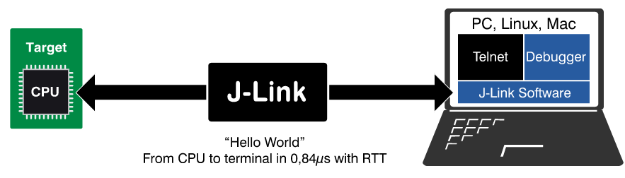
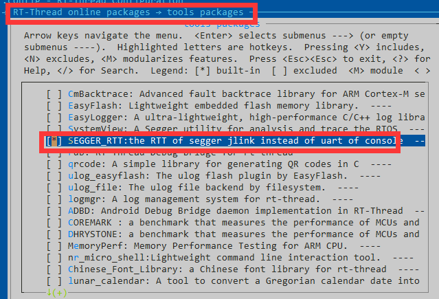
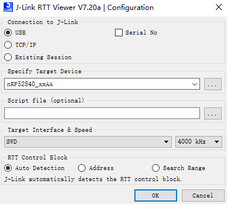
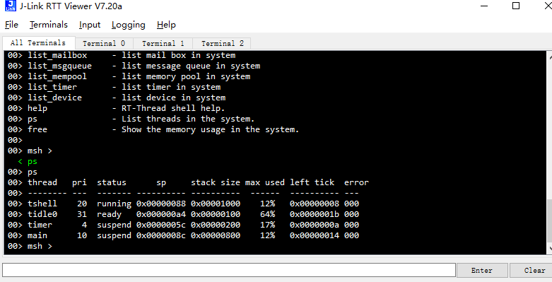

# SEGGER_RTT

## 本文目标人群

- 开发的时候经常采用 jlink 的硬件调试器进行调试（[ST-LINK]([https://www.segger.com/jlink-st-link.html](https://www.segger.com/jlink-st-link.html）)) 也可以刷成 JLINK）。
- 有时候想要在中断中打印一些信息的，但是 printf 在中断中不能打印。
- 在移植 RT-Thread 前期，UART 驱动没有完全 ready，想要用 rt_kprintf 进行打印的。
- 正在开发的 MCU 不希望 console 独占一个 UART。

## 简介

[SEGGER_RTT](https://github.com/supperthomas/RTTHREAD_SEGGER_TOOL.git) 软件包是一款基于 SEGGER 的 [J-Link RTT ](https://www.segger.com/products/debug-probes/j-link/technology/about-real-time-transfer/) 来开发，把 RT-Thread 的 console 口通过 `J-Link RTT` 进行传输，从而实现 console 口进行一个比较方便的交互，可以完全用来替代 UART 口。这里的 RTT 是 `Real Time Transfer` 的缩写。

SEGGER_RTT 的工作原理如下图所示：



J-LINK 可以通过查询变量的方法来查看特定变量的值，SEGGER_RTT 的工具也是利用这一原理。

SEGGER_RTT 软件包的特点总结如下：

- 可以在中断中打印
- 可以缓存开机的 log
- 可以接收 finsh 命令
- 多平台支持
- 不依赖操作系统，单机裸机都可以运行 SEGGER_printf
- 可以支持多种 terminal 端口使用，打印不同的 log
- 可以不用初始化就可以直接使用

## 如何使用

1. 在 menuconfig 中选中对应的软件包即可下载该软件包



2. 需要注意的是，选中软件包之后，drv_rtt.c 相当于多了一个类似于 UART 的串型 device 设备，名称为 `jlinkRtt`

如果想要替换为 console 口的话，需要找到如下两处代码进行修改:

- rt_hw_jlink_rtt_init 初始化必须在 `rt_console_set_device(RT_CONSOLE_DEVICE_NAME);` 之前调用
- menuconfig 中的 `RT-Thread Kernel → Kernel Device Object` 中的 console 也要设置为 `jlinkRtt`

```
#define RT_CONSOLE_DEVICE_NAME "jlinkRtt"
rt_hw_jlink_rtt_init();
rt_console_set_device(RT_CONSOLE_DEVICE_NAME);
```
3. 安装 [JLINK](https://www.segger.com/downloads/jlink/) 的一套工具，安装之后，打开 `J-Link RTT Viewer` 工具，进行如下设置选择对应的 device



这边需要注意的是最下面的选项，指的是代码中变量 &_SEGGER_RTT 的地址，有些芯片支持自动识别地址，有些芯片不支持自动识别地址。可以通过 debug 来查看该变量的地址，也可以根据你的 MCU 设置 RAM 的 search 范围，让 JLINK 轮询 RAM 中的地址， 例如 STM32 可以设置 RAM 地址搜索范围

```
0x20000000 0x1000
```

## 运行效果



## 注意事项

1. 你需要有 JLINK 连接。 在 STM32 或者 Nordic 开发板上测试都是可以用的。其他的 JLINK 应该也是通用的，这个省去了调试的 UART 串口的占用。可以用这个口打印 log 或者 console 调试。

2. 只要你的开发板可以用 JLINK 来调试查看变量，就可以用这个软件包。 RTT 本质上，就是一直轮询_SEGGER_RTT 这个全局变量。所以对架构不是特别敏感，只要你的板子 JLINK 可以 debug 即可。

3. 如果你手上有 STLINK， 可以选择刷成 JLINK  参考连接 [segger st-link](https://www.segger.com/products/debug-probes/j-link/models/other-j-links/st-link-on-board/) 当然刷成 JLINK 之后，你的 JLINK 也只能操作 STM32 授权的设备，其他厂商设备是不支持的。

## 总结

我觉得在开发可以用 JLINK 调试芯片的时候，前期可以通过 segger_rtt 进行 console 调试，是一件比较快速上手的事情，比如在制作新的 BSP 的时候，可以先采用 RTT 的方式进行 console 调试，同样这种 console 可以在中断中打印相应的 log，也是一件比较方便的事情。总之，我感觉需要用到的地方还是挺多的，所以推荐给大家使用。当然 SEGGER_RTT 的功能不仅限于此，其实还有很多功能还未完全开发，比如一些彩色打印和 terminal 复用，欢迎对软件包提意见和需求，如果有什么建议都可以在软件包的 issue 里面提。如果对 SEGGER_RTT 软件包感兴趣的，可以参考 [SEGGER_RTT 探索](https://supperthomas-wiki.readthedocs.io/en/latest/DEBUG/01_SEGGER_RTT/SEGGER_RTT.html#id1) 和 [SEGGER_RTT TOOL](https://github.com/supperthomas/RTTHREAD_SEGGER_TOOL)。

## 特别感谢

本软件包参考了软件包 [SystemView](https://github.com/RT-Thread-packages/SEGGER_SystemView)，以及一些 BLE 社区小伙伴的指导建议。


