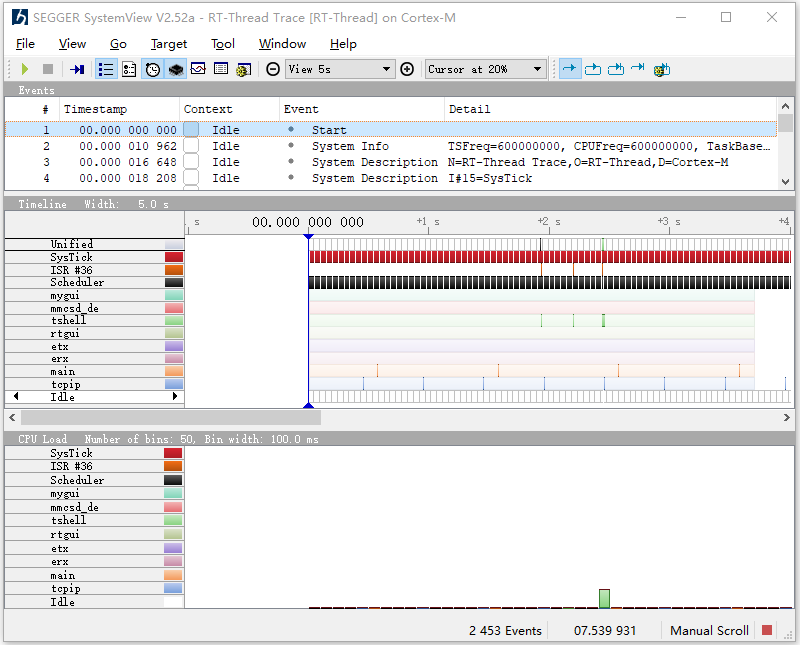
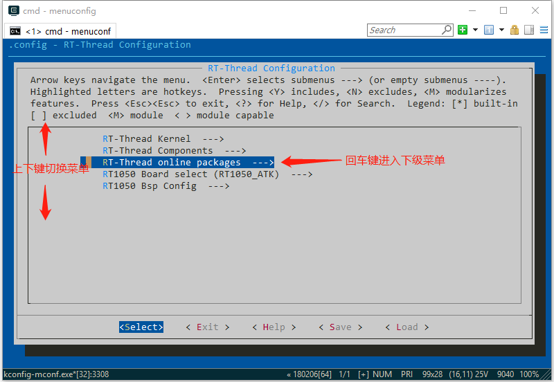
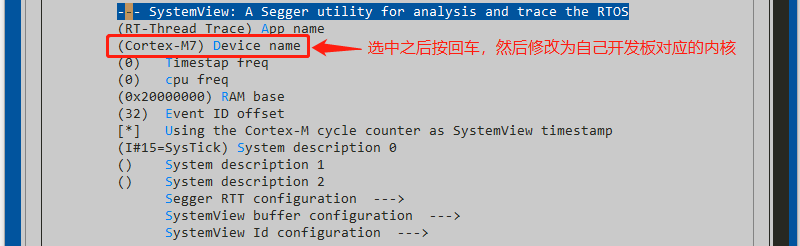
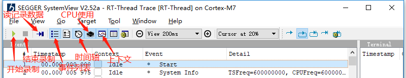
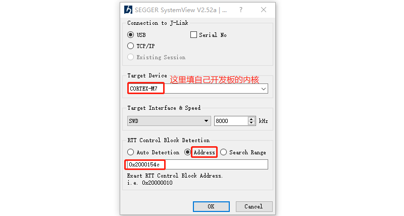
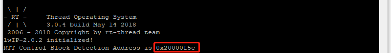
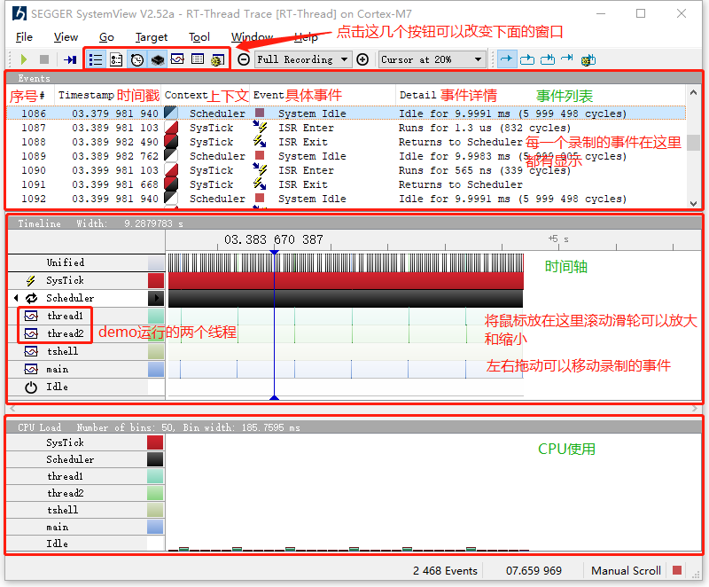
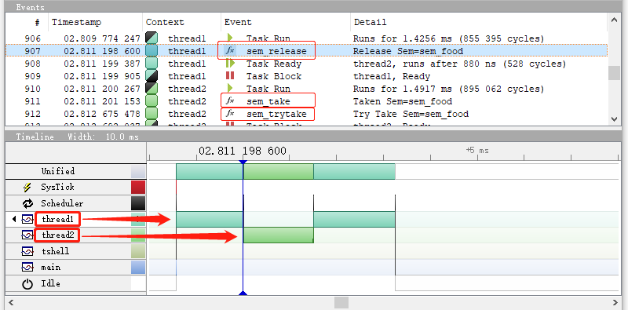

# SystemView 使用指南

> [!NOTE]
> 本文主要介绍 SystemView 可视化分析工具，以及如何在 RT-Thread 上使用它对系统进行调试分析。

## 简介

随着 MCU  的性能越来越强，嵌入式产品的功能越来越复杂，对于系统的调试和分析提出了新挑战，调试某个功能或问题通常需要花费大量精力，SystemView  是一款帮助用户进行系统调试和分析的强大工具，能够显著缩短开发和调试时间，提高开发效率。本文的目的在于帮助大家在 RT-Thread 上使用  SystemView 工具对系统进行调试和分析。

本文准备资料如下：

* [SystemView 软件包](https://github.com/RT-Thread-packages/SEGGER_SystemView)

* [Env 工具](https://www.rt-thread.org/page/download.html)

## SystemView 简介

SystemView 是一个可以在线调试嵌入式系统的工具，它可以分析有哪些中断、任务执行了，以及这些中断、任务执行的先后关系。还可以查看一些内核对象持有和释放的时间点，比如信号量、互斥量、事件、消息队列等。这在开发和处理具有多个线程和事件的复杂系统时尤其有效。

SystemView 由两个部分组成：

* PC端程序，收集并展示来自嵌入端传来的数据，也可以将这些数据保存到本地供以后分析。
* 嵌入式端程序，收集嵌入式系统的运行数据，并将它们通过 J-Link 的 RTT 模块传输给 PC 端

> [!NOTE]
> 因 SystemView 的数据传输利用了 J-Link 的 RTT 技术，所以只有用 J-Link 连接开发板的时候才能使用 SystemView



RT-Thread 提供的 [SystemView 软件包](https://github.com/RT-Thread-packages/SEGGER_SystemView) 是 SystemView 工具的嵌入式端程序实现，主要功能有：配置 SYSTEMVIEW 和 RTT 的具体参数，收集和格式化监视数据，将数据通过 J-Link 发送给 PC 端等。只需要利用 RT-Thread 推出的 [Env 工具](https://www.rt-thread.org/page/download.html) 使能 SystemView 软件包，并对其进行简单的配置，就能完成 SystemView 的嵌入式端程序的配置。

## 配置 SystemView 软件包

以正点原子 RT1052 开发板为例

步骤一：在 Env 工具中进入 menuconfig 图形化配置工具

打开 Env 工具，使用命令 `cd D:\rt-thread\bsp\imxrt1052-evk` 切换到 RT-Thread 源码 BSP 根目录下的 imxrt1052-evk 目录，然后输入命令 `menuconfig` 配置工程。

> [!NOTE]
> menuconfig 是一种图形化配置工具，RT-Thread 使用其对整个系统进行配置、裁剪。



步骤二：使能 SystemView 软件包。

利用上下键选中 RT-Thread online packages，按回车键进入下级菜单，然后在 tools packages 中打开 SystemView 。


步骤三：具体的配置。

按回车键进入下级菜单，进行具体的配置（输入 ？可以显示选项的具体信息）。

下面介绍两个常用的选项，其他的选项可以根据需要自己进行配置（参考最后一部分参数目录）：

（1） 将下图红框圈住的选项，更改为自己开发板对应的内核，如 I.MX-RT1052 对应 M7 内核



（2） 进入 SystemView buffer configuration 下级菜单，关闭事后分析模式


开启事后分析模式之后，**需要**在工程里调用函数 SEGGER_SYSVIEW_Start() 启动录制。系统事件会被不断的记录下来，并在缓冲区满时覆盖旧的事件。所以当读取缓冲区时，只能读取到最新的事件。

> [!NOTE]
> 当系统运行了很长时间并突然崩溃时，事后分析可能会很有用。在这种情况下，可以从目标中的缓冲区中读取最新的事件，SystemView 可以显示系统崩溃之前发生的情况。

关闭事后分析模式之后，就处于连续记录模式，可以在 PC 端控制录制的开始和结束，连续记录系统的运行。要分析下面的 demo 的运行，需要开启连续记录模式。

配置好选项之后，按 ESC 返回，退出并保存配置，这样 SystemView 软件包的使能和相关配置就完成了。

后面我们以一个具体的 demo 来讲解 SystemView 工具的使用

## 添加示例代码

在文件 main.c 中添加以下代码，然后在 main 函数中调用 demo 初始化函数 `demo_init();` 运行 demo。

```c
/*
* 程序清单：systemview 演示代码
*
* 这个例子中将创建一个动态信号量(初始值为0)及两个动态线程，在这个两个动态线程中
* 线程2将试图采用永远等待方式去持有信号量，持有成功之后发送运行标志。
* 线程1将先发送正在运行标志，然后释放一次信号量，因线程2的优先级较高，线程2持有到信号量将线程1抢断。
* 然后线程2发送运行标志之后，获取不到信号量，被挂起，线程1继续运行
*/

#define THREAD_PRIORITY         25
#define THREAD_STACK_SIZE       512
#define THREAD_TIMESLICE        5
/* 指向信号量的指针 */
rt_sem_t sem_food;
/* 线程1入口 */
void thread1_entry(void* parameter)
{
    while (1)
    {
        /* 线程1第一次运行 */
        rt_kprintf("thread1 is run!\n");
        /* 释放一次信号量 */
        rt_sem_release(sem_food);
        /* 线程1第二次运行 */
        rt_kprintf("thread1 run again!\n");
        /* 线程1延时1秒 */
        rt_thread_delay(RT_TICK_PER_SECOND);
    }
}
/* 线程2入口 */
void thread2_entry(void* parameter)
{
    while (1)
    {
        /* 试图持有信号量，并永远等待直到持有到信号量 */
        rt_sem_take(sem_food, RT_WAITING_FOREVER);
        /* 线程2正在运行 */
        rt_kprintf("thread2 is run!\n");
    }
}
/* DEMO初始化函数 */
void demo_init(void)
{
    /* 指向线程控制块的指针 */
    rt_thread_t thread1_id, thread2_id;
    /* 创建一个信号量，初始值是0 */
    sem_food = rt_sem_create("sem_food", 0, RT_IPC_FLAG_PRIO);
    if (sem_food == RT_NULL)
    {
        rt_kprintf("sem created fail!\n");
        return ;
    }
    /* 创建线程1 */
    thread1_id = rt_thread_create("thread1",
                    thread1_entry, RT_NULL,/* 线程入口是thread1_entry, 参数RT_NULL */
                    THREAD_STACK_SIZE, THREAD_PRIORITY, THREAD_TIMESLICE);
    if (thread1_id != RT_NULL)
        rt_thread_startup(thread1_id);
    /* 创建线程2 */
    thread2_id = rt_thread_create("thread2",
                    thread2_entry, RT_NULL,/* 线程入口是thread2_entry, 参数RT_NULL */
                    THREAD_STACK_SIZE, THREAD_PRIORITY - 1, THREAD_TIMESLICE);
    if (thread2_id != RT_NULL)
        rt_thread_startup(thread2_id);
}
```

## SystemView 配置及使用

步骤一：下载 SystemView 分析工具 [下载链接](https://www.segger.com/products/development-tools/systemview/)

步骤二：为 RT-Thread 添加系统描述文件

首先找到开发板目录下的 packages 目录，然后在 packages 目录下找到 segger_debug-xxx 目录，在这个目录里面有一个 SystemView_Description 文件夹，RT-Thread 系统的描述文件就在里面，具体的目录结构如下所示：

`bsp\\你自己的开发板\\packages\\segger_debug-xxx\\SystemView_Description\\SYSVIEW_RT-Thread.txt`

将这个文件复制到 SystemView 工具安装目录下的 Description 目录下，这样 SystemView 就可以识别出 RT-Thread 系统了。

步骤三：配置设备信息，开始录制

双击打开 SystemView PC端程序，下面是主界面上一些常用按钮的功能介绍。



当处于连续记录模式时，点击开始录制按钮,会弹出一个配置设备信息的窗口。



图中 RTT 控制块的地址已经通过串口打印出来了，只要打开终端软件将打印出来的地址复制到上方即可。



点击 OK ，现在 SystemView 就开始实时录制系统信息了，下面是系统实时的运行情况。



步骤四：结束录制，分析系统

点击结束录制按钮，结束录制。将鼠标放置到时间轴窗口里，利用滚轮将事件放大到适合分析的大小



利用 SystemView 工具我们可以看出来，系统的运行确实如我们设想的那样，线程1先开始运行，然后在释放信号量之后被线程2抢断。然后线程2运行，之后因获取不到信号量被挂起，线程1继续运行。从上面的事件列表还可以看到每个线程获取或释放信号量的具体时间。

> [!NOTE]
> 如果开启了事后分析模式，就不能点击开始录制按钮了，而是要点击读记录数据的按钮，其他的的操作和实时分析模式一样。

看完这篇文档，相信你已经学会如何使用 RT-Thread 上 的 SystemView 分析工具了。

## menuconfig 配置选项

| **参数**                         | **描述**                                                         |
| ---------------------------- | ------------------------------------------------------------ |
| App name                     | 应用程序的名字                                               |
| Device name                  | 设备所用内核                                                 |
| Timestap freq                | 时间戳频率 （0 表示使用系统默认频率）                        |
| cpu freq                     | cpu频率（0 表示使用系统默认频率）                            |
| RAM base                     | RAM基地址    默认值：0x2000 0000                             |
| Event ID offset              | 事件ID的偏移 默认值：32                                      |
| Using the Cortex-M cycle ... | 使用系统频率作为时间戳                                       |
| System description 0-2       | 系统描述符  "I#num=name, ..." num 是中断标号, name 是中断名称 |

| **参数**                                      | **描述**                                               |
| ----------------------------------------- | -------------------------------------------------- |
| Max num of up buffer                      | RTT输出缓冲区的最大数目  默认值:2                  |
| Max num of dowm buffer                    | RTT输入缓冲区的最大数目  默认值:2                  |
| buffer size up                            | 用于RTT终端输出通道的字节数   默认值:1024 字节     |
| buffer size down                          | 用于RTT终端输入通道的字节数   默认值:16 字节       |
| Segger RTT printf buffer size             | 通过RTT printf发送字符块时的缓冲区大小  默认值：64 |
| Mode for pre-initialized terminal channel | 预初始RTT终端通道模式  默认值: NO_BLOCK_SKIP       |
| Max Interrupt priority                    | 中断优先级的最大值                                 |
| Use RTT ASM                               | 使用汇编版本的RTT                                  |
| memcpy use byte-loop                      | 使用一个简单的byte-loop代替memcpy                  |

| **参数**                             | **描述**                                                 |
| -------------------------------- | ---------------------------------------------------- |
| RTT buffer size                  | SystemView用于记录缓冲区的字节数                     |
| RTT channel                      | RTT通道是用于SystemView事件记录和通信，0表示自动选择 |
| Use static buffer                | 使用静态缓冲区 ，能够节省空间                        |
| Enable post mortem analysis mode | 使能事后分析模式                                     |

| **参数**     | **描述**                                                    |
| -------- | ------------------------------------------------------- |
| ID Base  | 从SystemView包中记录的ID中减去的值  默认值：0x1000 0000 |
| ID Shift | 在SystemView包中记录的ID偏移的位数  默认值：2           |

## 参考资料

* [《Env 用户手册》](../../../programming-manual/env/env.md)
