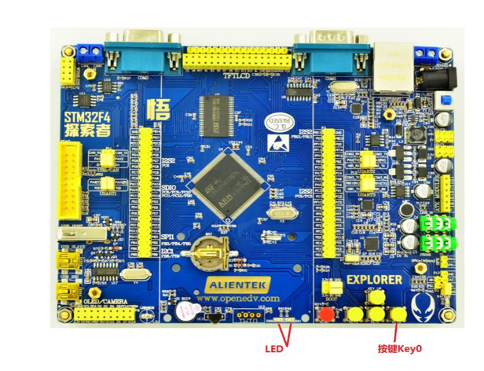
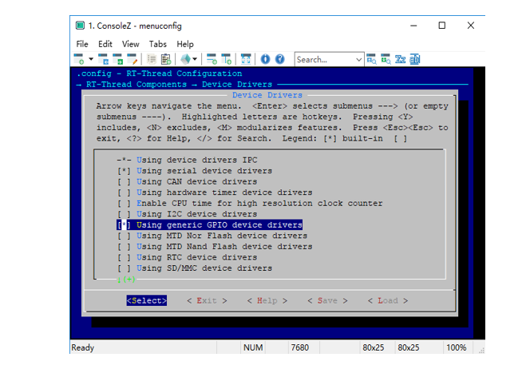
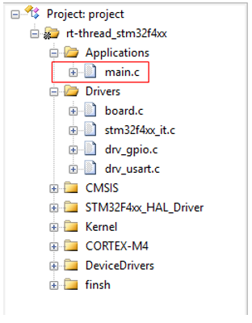
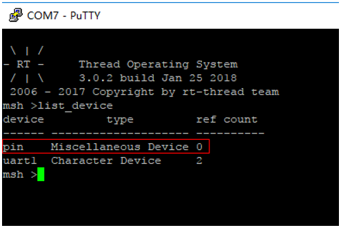
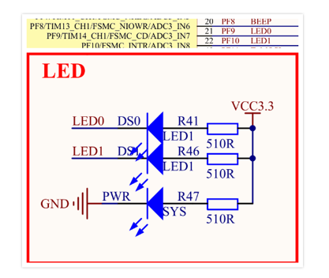
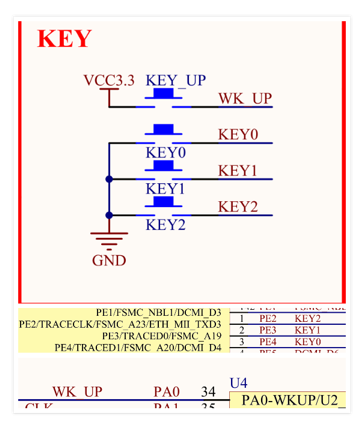

# PIN 设备应用笔记 #

本文描述了如何使用 RT-Thread 的PIN 设备驱动，包括驱动的配置、相关 API 的应用。并给出了在正点原子 STM32F4 探索者开发板上验证的代码示例。

## 本文的目的和结构 ##

### 本文的目的和背景 ###

为了给用户提供操作 GPIO 的通用 API，方便应用程序开发，RT-Thread 提供了类似 Arduino 风格的 API 用于操作 GPIO，如设置 GPIO 模式和输出电平、读取 GPIO 输入电平、配置 GPIO 外部中断。本文说明了如何使用 RT-Thread 提供的 PIN 设备接口。

### 本文的结构 ###

本文给出了在正点原子 STM32F4 探索者开发板上验证的代码示例。

## 硬件平台简介

本文基于正点原子 STM32F4 探索者开发板，给出了PIN 设备的具体应用示例代码，包含管脚输入、输出和外部中断的使用方法。由于 RT-Thread 上层应用 API 的通用性，因此这些代码不局限于具体的硬件平台，用户可以轻松将它移植到其它平台上。

正点原子 STM32F4 探索者开发板使用的 MCU 是 STM32F407ZGT6，板载 2 颗 LED 和 4 个独立按键。LED 分别连接到 MCU 的 GPIOF9、GPIOF10，KEY0 按键连接到 GPIOE4，KEY1 按键连接到 GPIOE3，KEY2 按键连接到 GPIOE2，WK_UP 按键连接到 GPIOA0，2 颗 LED 均为低电平点亮，独立按键 KEY0、KEY1、KEY2 按下为低电平；WK_UP 按下为高电平。



## 准备和配置工程

1. 下载 [RT-Thread 源码](https://github.com/RT-Thread/rt-thread)

2. 下载 [示例代码](main.rar)

3. <https://github.com/RT-Thread-packages/peripheral-sample>

4. 进入 `rt-thread\bsp\stm32f4xx-HAL` 目录，在 Env 命令行中输入 menuconfig，进入配置界面，使用 menuconfig 工具（学习如何使用）配置工程。

(1) 在 menuconfig 配置界面依次选择 RT-Thread Components ---> Device Drivers ---> Using generic GPIO device drivers，如图所示：



(2) 输入命令
`scons --target=mdk5 -s`
生成 mdk5 工程。将示例代码附带的 main.c 替换掉 BSP 中的 main.c，如图所示：



(3) 编译，下载程序，在终端输入 list_device 命令可以看到 device 是 pin、类型是 Miscellaneous Device 就说明PIN 设备驱动添加成功了。



下面是 3 个PIN 设备驱动 API 应用示例，分别是：GPIO 输出、GPIO 输入、GPIO 外部中断，这些代码在正点原子 STM32F4 探索者开发板上验证通过。

## GPIO 输出配置

示例 1：配置 GPIO 为输出，点亮 LED。根据原理图，GPIOF9 连接到了板载红色 LED，丝印为 DS0；GPIOF10 连接到了板载绿色 LED，丝印为 DS1。GPIOF9 输出低电平则点亮 DS0，GPIOF9 输出高电平则 DS0 不亮；GPIOF10 输出低电平则点亮 DS1，GPIOF10 输出高电平则 DS1 不亮。



```c
#define LED0 21 //PF9--21，在 drv_gpio.c 文件 pin_index pins[] 中查到 PF9 编号为 21
#define LED1 22 //PF10--22，在 drv_gpio.c 文件 pin_index pins[] 中查到 PF10 编号为 22
 void led_thread_entry(void* parameter)
{
    // 设置管脚为输出模式
    rt_pin_mode(LED0, PIN_MODE_OUTPUT);
    // 设置管脚为输出模式
    rt_pin_mode(LED1, PIN_MODE_OUTPUT);
    while (1)
    {
        // 输出低电平，LED0 亮
        rt_pin_write(LED0, PIN_LOW);
        // 输出低电平，LED1 亮
        rt_pin_write(LED1, PIN_LOW);
        // 挂起 500ms
        rt_thread_delay(rt_tick_from_millisecond(500));

        // 输出高电平，LED0 灭
        rt_pin_write(LED0, PIN_HIGH);
        // 输出高电平，LED1 灭
        rt_pin_write(LED1, PIN_HIGH);
        // 挂起 500ms
        rt_thread_delay(rt_tick_from_millisecond(500));
    }
}
```

在线程入口函数 led_thread_entry 里首先调用 rt_pin_mode 设置管脚模式为输出模式，然后就进入 while(1) 循环，间隔 500ms 调用 rt_pin_write 来改变 GPIO 输出电平。
下面是创建线程的代码：

```c
    rt_thread_t tid;// 线程句柄
    /* 创建 led 线程 */
    tid = rt_thread_create("led",
                    led_thread_entry,
                    RT_NULL,
                    1024,
                    3,
                    10);
    /* 创建成功则启动线程 */
    if (tid != RT_NULL)
        rt_thread_startup(tid);
```

编译、下载程序，我们将看到 LED 间隔 500ms 闪烁的现象。

## GPIO 输入配置

示例 2：配置 GPIOE3、GPIOE2 为上拉输入，GPIOA0 为下拉输入，检测按键信号。根据原理图，GPIOE3 连接到按键 KEY1，按键被按下时 GPIOE3 应读取到低电平，按键没有被按下时 GPIOE3 应读取到高电平；GPIOE2 连接到按键 KEY2，按键被按下时 GPIOE2 应读取到低电平，按键没有被按下时 GPIOE2 应读取到高电平；GPIOA0 连接到按键 WK_UP，按键被按下时 GPIOA0 应读取到高电平，按键没有被按下时 GPIOA0 应读取到低电平。



```c
#define KEY1    2   //PE3--2，在 drv_gpio.c 文件 pin_index pins[] 中查到 PE3 编号为 2
#define KEY2    1   //PE2--1，在 drv_gpio.c 文件 pin_index pins[] 中查到 PE2 编号为 1
#define WK_UP   34  //PA0--34，在 drv_gpio.c 文件 pin_index pins[] 中查到 PA0 编号为 34
void key_thread_entry(void* parameter)
{
    //PE2、PE3 设置上拉输入
    rt_pin_mode(KEY1, PIN_MODE_INPUT_PULLUP);
    rt_pin_mode(KEY2, PIN_MODE_INPUT_PULLUP);
    //PA0 设置为下拉输入
    rt_pin_mode(WK_UP, PIN_MODE_INPUT_PULLDOWN);

    while (1)
    {
        // 检测到低电平，即按键 1 按下了
        if (rt_pin_read(KEY1) == PIN_LOW)
        {
            rt_kprintf("key1 pressed!\n");
        }
        // 检测到低电平，即按键 2 按下了
        if (rt_pin_read(KEY2) == PIN_LOW)
        {
            rt_kprintf("key2 pressed!\n");
        }
        // 检测到高电平，即按键 wp 按下了
        if (rt_pin_read(WK_UP) == PIN_HIGH)
        {
            rt_kprintf("WK_UP pressed!\n");
        }
        // 挂起 10ms
        rt_thread_delay(rt_tick_from_millisecond(10));
    }
}
```

在线程入口函数 key_thread_entry 里首先调用 rt_pin_mode 设置管脚 GPIOE3 为上拉输入模式。这样当用户按下按键 KEY1 时，GPIOE3 读取到的电平是低电平；按键未被按下时，GPIOE3 读取到的电平是高电平。然后进入 while(1) 循环，调用 rt_pin_read 读取管脚 GPIOE3 电平，如果读取到低电平则表示按键 KEY1 被按下，就在终端打印字符串 "key1 pressed!"。每隔 10ms 检测一次按键输入情况。
下面是创建线程的代码：

```c
   rt_thread_t tid;
  /* 创建 key 线程 */
    tid = rt_thread_create("key",
                    key_thread_entry,
                    RT_NULL,
                    1024,
                    2,
                    10);
    /* 创建成功则启动线程 */
    if (tid != RT_NULL)
        rt_thread_startup(tid);
```

编译、下载程序，我们按下开发板上的用户按键，终端将打印提示字符。

## GPIO 中断配置

示例 3：配置 GPIO 为外部中断模式、下降沿触发，检测按键信号。根据原理图，GPIOE4 连接到按键 KEY0，按键被按下时 MCU 应探测到电平下降沿。

```c
#define KEY0    3   //PE4--3，在 gpio.c 文件 pin_index pins[] 中查到 PE4 编号为 3
void hdr_callback(void *args)// 回调函数
{
    char *a = args;// 获取参数
    rt_kprintf("key0 down! %s\n",a);
}

void irq_thread_entry(void* parameter)
{
    // 上拉输入
    rt_pin_mode(KEY0, PIN_MODE_INPUT_PULLUP);
    // 绑定中断，下降沿模式，回调函数名为 hdr_callback
    rt_pin_attach_irq(KEY0, PIN_IRQ_MODE_FALLING, hdr_callback, (void*)"callback
args");
    // 使能中断
    rt_pin_irq_enable(KEY0, PIN_IRQ_ENABLE);

}
```

在线程入口函数 irq_thread_entry 里首先调用 rt_pin_attach_irq 设置管脚 GPIOE4 为下降沿中断模式，并绑定了中断回调函数，还传入了字符串 "callback args"。然后调用 rt_pin_irq_enable 使能中断，这样按键 KEY0 被按下时 MCU 会检测到电平下降沿，触发外部中断，在中断服务程序中会调用回调函数 hdr_callback，在回调函数中打印传入的参数和提示信息。
下面是创建线程的代码：

```c
    rt_thread_t tid;// 线程句柄
    /* 创建 irq 线程 */
    tid = rt_thread_create("exirq",
                    irq_thread_entry,
                    RT_NULL,
                    1024,
                    4,
                    10);
    /* 创建成功则启动线程 */
    if (tid != RT_NULL)
        rt_thread_startup(tid);
```

编译、下载程序，我们按下按键 KEY0，终端将打印提示字符。

## 参考资料

* 《PIN设备》


