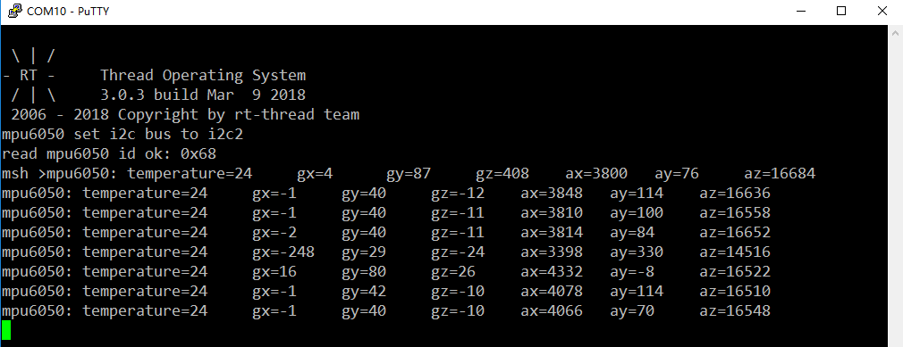

# I2C 设备应用笔记 #

本文以驱动 I2C 接口的 6 轴传感器 MPU6050 为例，说明了如何使用 I2C 设备驱动接口开发应用程序，并详细讲解了 RT-Thread I2C 设备驱动框架及相关函数。

## 本文的目的和结构 ##

### 本文的目的和背景 ###

I2C（或写作 i2c、IIC、iic）总线是由 Philips 公司开发的一种简单、双向二线制（时钟 SCL、数据 SDA）同步串行总线。它只需要两根线即可在连接于总线上的器件之间传送信息，是半导体芯片使用最为广泛的通信接口之一。RT-Thread 中引入了 I2C 设备驱动框架，I2C 设备驱动框架提供了基于 GPIO 模拟和硬件控制器的 2 种底层硬件接口。

### 本文的结构 ###

本文描述了使用 I2C 设备驱动接口编写 MPU6050 的驱动程序，并给出了在正点原子 STM32F4 探索者开发板上验证的代码示例。

## 运行 I2C 设备驱动示例代码 ##

### 示例代码软硬件平台 ###

1. [正点原子 STM32F4 探索者开发板](http://www.openedv.com/thread-13912-1-1.html)
2. GY-521 MPU-6050 模块
3. MDK5
4. [RT-Thread 源码](https://github.com/RT-Thread/rt-thread)
5. [示例代码](i2c-mpu6050.rar)
6. <https://github.com/RT-Thread-packages/peripheral-sample>

正点原子探索者 STM32F4 开发板的 MCU 是 STM32F407ZGT6，本示例使用 USB 串口（USART1）发送数据及供电，使用 SEGGER JLINK 连接 JTAG 调试。

本次实验用的 GY521 模块是一款 6 轴惯性传感器模块，板载 MPU6050。我们使用开发板的 PD6（SCL）、PD7（SDA）作为模拟 I2C 管脚，用杜邦线将 GY521 模块的 SCL 硬件连接到 PD6、SDA 连接到 PD7、GND 连接到开发板的 GND、VCC 连接到 3.3V。


本文基于正点原子 STM32F4 探索者开发板，给出了底层 I2C 驱动（GPIO 模拟方式）的添加方法和 I2C 设备的具体应用示例代码（以驱动 MPU6050 为例），包含寄存器读、写操作方法。由于 RT-Thread 上层应用 API 的通用性，因此这些代码不局限于具体的硬件平台，用户可以轻松将它移植到其它平台上。

### 启用 I2C 设备驱动 ###

1. 使用 [Env 工具](https://www.rt-thread.org/document/site/zh/5chapters/01-chapter_env_manual/) 命令行进入 `rt-thread\bsp\stm32f4xx-HAL` 目录，然后输入 `menuconfig` 命令进入配置界面。
2. 配置 shell 使用串口 1：选中 Using UART1，进入 RT-Thread Kernel ---> Kernel Device Object 菜单，修改 the device name for console 为 uart1。
3. 进入 RT-Thread Components ---> Device Drivers 菜单，选中 Using I2C device drivers，本示例使用 GPIO 模拟 I2C，因此还要开启 Use GPIO to simulate I2C。


4. 退出 menuconfig 配置界面并保存配置，在 Env 命令行输入 `scons --target=mdk5 -s` 命令生成 mdk5 工程，新工程名为 project。使用 MDK5 打开工程，修改 MCU 型号为 STM32F407ZGTx，修改调试选项为 J-LINK。


5. 编译工程后下载程序至开发板运行。在终端 PuTTY(打开对应端口，波特率配置为 115200) 输入 `list_device` 命令可以看到名为 i2c2 的设备，设备类型是 I2C Bus，说明 I2C 设备驱动添加成功了。如图所示：


### 运行示例代码 ###

将 I2C 示例代码里的 `main.c` 拷贝到 `\rt-thread\bsp\stm32f4xx-HAL\applications` 目录，替换原有的 `main.c`。
`drv_mpu6050.c、drv_mpu6050.h` 拷贝到 `\rt-thread\bsp\stm32f4xx-HAL\drivers` 目录，并将它们添加到工程中对应分组。如图所示：


本例使用 GPIO PD6 作为 SCL、GPIO PD7 作为 SDA，I2C 总线设置名字是 i2c2，读者可根据需要修改 `drv_i2c.c` 件中如下参数以适配自己的板卡，确保 `drv_mpu6050.c` 中定义的宏 MPU6050_I2C_BUS_NAME 与 `drv_i2c.c` 中的宏 I2C_BUS_NAME 相同。本示例需要将 `drv_i2c.c` 默认驱动端口 GPIOB 改为 GPIOD，如下图所示：


连接好 MPU6050 模块和开发板，编译工程并下载程序至开发板，复位 MCU，终端 PuTTY 会打印出读取到的 MPU6050 传感器数据，依次是温度，三轴加速度，三轴角速度：



## 示例代码详解 ##

按照前文的步骤，相信读者能很快的将 RT-ThreadI2C 设备驱动运行起来，那么如何使用 I2C 设备驱动接口开发应用程序呢？

RT-Thread I2C 设备驱动目前只支持主机模式，使用 RT-Thread I2C 设备驱动需要使用 menuconfig 工具开启宏 RT_USING_DEVICE 和 RT_USING_I2C，如果要使用 GPIO 模拟 I2C 还需开启宏 RT_USING_I2C_BITOPS。

使用 I2C 设备驱动的大致流程如下：

1. 用户可以在 msh shell 输入 `list_device` 命令查看已有的 I2C 总线设备，确定 I2C 总线设备名称。

2. 查找设备使用 `rt_i2c_bus_device_find()` 或者 `rt_device_find()`，传入 I2C 设备名称获取 i2c 总线设备句柄。

3. 使用 `rt_i2c_transfer()` 即可以发送数据也可以接收数据。

接下来本章将详细讲解 I2C 设备驱动接口的使用。

### 查找设备 ###

应用程序要使用已经由操作系统管理的 I2C 设备需要调用查找设备函数，找到 I2C 设备后才可以对该设备进行信息传送。可使用`rt_device_find()`查找 I2C 设备。

本文示例代码底层驱动 `drv_mpu6050.c`  中 `mpu6050_hw_init()` 查找设备源码如下：

```c
#define MPU6050_I2CBUS_NAME  "i2c2" /* I2C 设备名称, 必须和 drv_i2c.c 注册的 I2C 设备名称一致 */
static struct rt_i2c_bus_device *mpu6050_i2c_bus; /* I2C 设备句柄 */
... ...
... ...

int mpu6050_hw_init(void)
{
    rt_uint8_t res;

    mpu6050_i2c_bus = rt_device_find(MPU6050_I2CBUS_NAME); /* 查找 I2C 设备 */

    if (mpu6050_i2c_bus == RT_NULL)
    {
        MPUDEBUG("can't find mpu6050 %s device\r\n",MPU6050_I2CBUS_NAME);
        return -RT_ERROR;
    }

... ...
... ...
}

```

### 数据传输 ###

RT-Thread I2C 设备驱动的核心 API 是 `rt_i2c_transfer()`，它传递的消息是链式结构的。可以通过消息链，实现调用一次完成多次数据的收发，此函数既可以用于发送数据，也可以用于接收数据。

#### 发送数据 ####

`drv_mpu6050.c` 中的 `mpu6050_write_reg()` 函数是 MCU 向 mpu6050 寄存器写数据。此函数的实现共有 2 种，分别调用了 I2C 设备驱动接口 `rt_i2c_transfer()` 和 `rt_i2c_master_send()` 实现。

本文示例使用的 MPU6050 数据手册中提到 7 位从机地址是 110100X，X 由芯片的 AD0 管脚决定，GY521 模块的 AD0 连接到了 GND，因此 MPU6050 作为从机时地址是 1101000，16 进制形式是 0x68。写 MPU6050 某个寄存器，主机首先发送从机地址 MPU6050_ADDR、读写标志 R/W 为 RT_I2C_WR（0 为写，1 为读），然 后主机发送从机寄存器地址 reg 及数据 data。

1) 使用 rt_i2c_transfer() 发送数据

本文示例代码底层驱动 `drv_mpu6050.c` 发送数据源码如下：

```c
#define MPU6050_ADDR                0X68

// 写 mpu6050 单个寄存器
//reg: 寄存器地址
//data: 数据
// 返回值: 0, 正常 / -1, 错误代码
rt_err_t mpu6050_write_reg(rt_uint8_t reg, rt_uint8_t data)
{
    struct rt_i2c_msg msgs;
    rt_uint8_t buf[2] = {reg, data};

    msgs.addr  = MPU6050_ADDR;    /* 从机地址 */
    msgs.flags = RT_I2C_WR;       /* 写标志 */
    msgs.buf   = buf;             /* 发送数据指针 */
    msgs.len   = 2;

    if (rt_i2c_transfer(mpu6050_i2c_bus, &msgs, 1) == 1)
    {
        return RT_EOK;
    }
    else
    {
        return -RT_ERROR;
    }
}
```

以本文示例代码其中一次调用 `rt_i2c_transfer()` 发送数据为例，从机 MPU6050 地址 16 进制值为 0X68，寄存器地址 reg 16 进制值为 0X6B，发送的数据 data 16 进制值为 0X80。示例波形如下图所示，第一个发送的数据是 0XD0，第一个数据的高 7 位是从机地址，最低位是读写位为写（值为 0），所以第一个数据为：0X68 << 1|0 = 0XD0，然后依次发送寄存器地址 0X6B 和数据 0X80。


2) 使用 rt_i2c_master_send() 发送数据

本文示例代码底层驱动 `drv_mpu6050.c` 发送数据源码如下：

```c
#define MPU6050_ADDR                0X68

// 写 mpu6050 单个寄存器
//reg: 寄存器地址
//data: 数据
// 返回值: 0, 正常 / -1, 错误代码
rt_err_t mpu6050_write_reg(rt_uint8_t reg, rt_uint8_t data)
{
    rt_uint8_t buf[2];

    buf[0] = reg;
    buf[1] = data;

    if (rt_i2c_master_send(mpu6050_i2c_bus, MPU6050_ADDR, 0, buf ,2) == 2)
    {
        return RT_EOK;
    }
    else
    {
        return -RT_ERROR;
    }
}
```

#### 接收数据 ####

用户可以调用 I2C 设备驱动接口 `rt_i2c_master_recv()` 或者 `rt_i2c_transfer()` 接受数据。

本文示例代码 `drv_mpu6050.c` 中的 `mpu6050_read_reg()` 函数是 MCU 从 MPU6050 寄存器读取数据，此函数的实现同样有 2 种方式，分别调用了 I2C 设备驱动接口 `rt_i2c_transfer()` 和 `rt_i2c_master_recv()` 实现。

读 MPU6050 某个寄存器，主机首先发送从机地址 MPU6050_ADDR、读写标志 R/W 为 RT_I2C_WR（0 为写，1 为读）、从机寄存器地址 reg 之后才能开始读设备。然后发送从机地址 MPU6050_ADDR、读写标志 R/W 为 RT_I2C_RD（0 为写，1 为读）、保存读取数据指针。

1) 使用 rt_i2c_transfer() 接收数据

本文示例代码底层驱动 `drv_mpu6050.c` 接收数据源码如下：

```c
#define MPU6050_ADDR                0X68

// 读取寄存器数据
//reg: 要读取的寄存器地址
//len: 要读取的数据字节数
//buf: 读取到的数据存储区
// 返回值: 0, 正常 / -1, 错误代码
rt_err_t mpu6050_read_reg(rt_uint8_t reg, rt_uint8_t len, rt_uint8_t *buf)
{
    struct rt_i2c_msg msgs[2];

    msgs[0].addr  = MPU6050_ADDR;    /* 从机地址 */
    msgs[0].flags = RT_I2C_WR;       /* 写标志 */
    msgs[0].buf   = &reg;            /* 从机寄存器地址 */
    msgs[0].len   = 1;               /* 发送数据字节数 */

    msgs[1].addr  = MPU6050_ADDR;    /* 从机地址 */
    msgs[1].flags = RT_I2C_RD;       /* 读标志 */
    msgs[1].buf   = buf;             /* 读取数据指针 */
    msgs[1].len   = len;             /* 读取数据字节数 */

    if (rt_i2c_transfer(mpu6050_i2c_bus, msgs, 2) == 2)
    {
        return RT_EOK;
    }
    else
    {
        return -RT_ERROR;
    }
}
```

以本文示例代码其中一次调用 rt_i2c_transfer() 接收数据为例，从机 MPU6050 地址 16 进制值为 0X68，寄存器地址 reg 16 进制值为 0X75。示例波形如下图所示，第一个发送的数据是 0XD0，第一个数据的高 7 位是从机地址，最低位是读写位是写（值为 0），所以第一个数据值为：0X68 << 1|0 = 0XD0，然后发送寄存器地址 0X75。第二次发送的第一个数据为 0XD1，读写位是读（值为 1），值为：0X68 << 1 | 1 = 0XD1，然后收到读取到的数据 0X68。


2) 使用 rt_i2c_master_recv() 接收数据

本文示例代码底层驱动 `drv_mpu6050.c` 接收数据源码如下：

```c
#define MPU6050_ADDR                0X68

// 读取寄存器数据
//reg: 要读取的寄存器地址
//len: 要读取的数据字节数
//buf: 读取到的数据存储区
// 返回值: 0, 正常 / -1, 错误代码
rt_err_t mpu6050_read_reg(rt_uint8_t reg, rt_uint8_t len, rt_uint8_t *buf)
{
    if (rt_i2c_master_send(mpu6050_i2c_bus, MPU6050_ADDR, 0, &reg, 1) == 1)
    {
        if (rt_i2c_master_recv(mpu6050_i2c_bus, MPU6050_ADDR, 0, buf, len) == len)
        {
            return RT_EOK;
        }
        else
        {
            return -RT_ERROR;
        }
    }
    else
    {
        return -RT_ERROR;
    }

}
```

### I2C 设备驱动应用 ###

通常 I2C 接口芯片的只读寄存器分为 2 种情况，一种是单一功能寄存器，另一种是地址连续，功能相近的寄存器。例如 MPU6050 的寄存器 0X3B、0X3C、0X3D、0X3E、0X3F、0X40 依次存放的是三轴加速度 X、Y、Z 轴的高 8 位、低 8 位数据。

本文示例代码底层驱动 `drv_mpu6050.c` 使用 `mpu6050_read_reg()` 函数读取 MPU6050 的 3 轴加速度数据：

```c
#define MPU_ACCEL_XOUTH_REG     0X3B    // 加速度值, X 轴高 8 位寄存器

// 得到加速度值 (原始值)
//gx,gy,gz: 陀螺仪 x,y,z 轴的原始读数 (带符号)
// 返回值: 0, 成功 / -1, 错误代码
rt_err_t mpu6050_accelerometer_get(rt_int16_t *ax, rt_int16_t *ay, rt_int16_t *az)
{
    rt_uint8_t buf[6], ret;

    ret = mpu6050_read_reg(MPU_ACCEL_XOUTH_REG, 6, buf);
    if (ret == 0)
    {
        *ax = ((rt_uint16_t)buf[0] << 8) | buf[1];
        *ay = ((rt_uint16_t)buf[2] << 8) | buf[3];
        *az = ((rt_uint16_t)buf[4] << 8) | buf[5];

        return RT_EOK;
    }
    else
    {
        return -RT_ERROR;
    }
}
```

## 参考资料

* 《I2C 设备》
